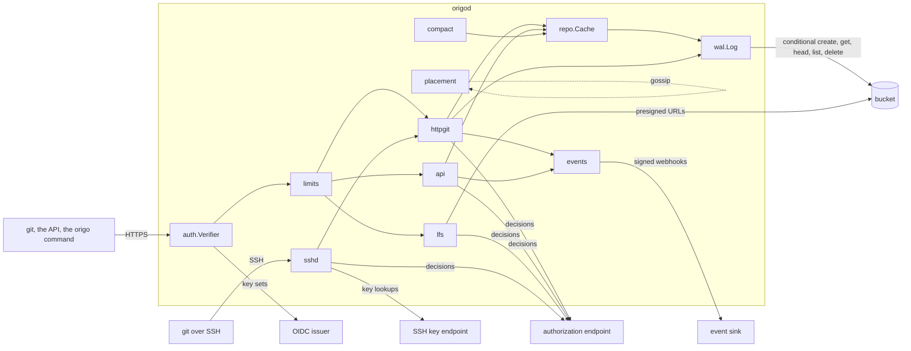
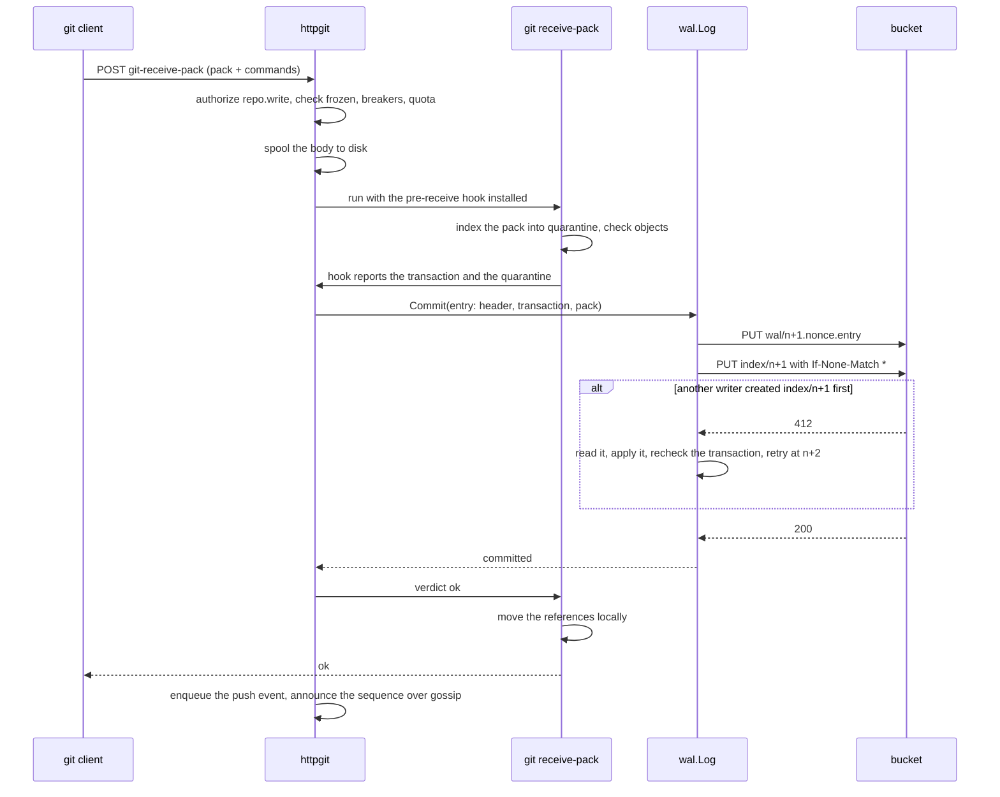

# Architecture

For whoever changes Origo. This page is the map: which package does
what, what Origo keeps in the bucket, and how a push, a read, a
compaction, an event, and a storage outage move through the code. The
reasoning behind each decision, and the alternatives it was chosen
over, is in the design records under [`specs/`](../../specs/README.md);
[`001-architecture`](../../specs/001-architecture.md) states the
invariants the rest are held to.

## The shape

Origo is one binary, `origod`, and one bucket. The bucket holds every
repository as a write-ahead log. A node holds a bare git repository per
repository it has served recently, as a cache it can throw away and
rebuild from the log at any time. Nodes share nothing but the bucket,
talk to each other only through signed UDP hints, and run no leader and
no consensus. The only coordination primitive is a conditional create,
`PUT` with `If-None-Match: *`, which the bucket linearizes.



## The code

| Path | What it holds |
|---|---|
| `cmd/origod` | the node: `serve` (the default), `check` (the pre-flight a pod runs before serving), and `migrate` (a client that drives a batch of imports). `node.go` builds every dependency from the configuration in one function, so the start-up order reads in one place |
| `cmd/origo` | the agent client's `main`, which only hands the environment to `internal/origocli` |
| `internal/config` | reads every `ORIGO_*` variable once at start-up and reports every problem at once. `document.go` is the source of [`configuration.md`](../configuration.md) |
| `internal/wal` | the write-ahead log: the `Store` interface over the bucket, the S3 adapter and an in-memory store, entries and index objects, the commit, the currency check, repository metadata and names, the per-repository sweep, and the two storage breakers |
| `internal/repo` | the local cache: one bare repository per id under `ORIGO_DATA_DIR/repos/`, materialized and brought current from the log, and the hermetic wrapper every git subprocess runs through |
| `internal/httpgit` | git's smart HTTP protocol over subprocesses, and the capture of a push into a log entry through a pre-receive hook |
| `internal/sshd` | the optional SSH listener: host keys, the key endpoint client, and the two git services handed to `internal/httpgit` |
| `internal/api` | the JSON API: the repository lifecycle, repository-bound tokens, the read routes, the server-side git operations, the administration routes, import and verify with their egress rules, and the weekly orphan sweep |
| `internal/lfs` | the Git LFS batch API, answered with presigned bucket URLs |
| `internal/auth` | token verification, the authorization client and its cache, the built-in owner policy, the guard that decides one request, the signer of repository-bound tokens, and anonymous-read eligibility |
| `internal/compact` | compaction on the repository's primary node, and the request objects other nodes leave for it |
| `internal/placement` | the live node set, rendezvous ranking, the signed gossip, and the cache evictor |
| `internal/events` | push and administration events: the event objects, the per-node journal, delivery with retries, the dead-letter prefix, and the repair sweep |
| `internal/limits` | the per-subject token buckets, the git subprocess semaphore, and the quota measurement |
| `internal/contract` | the contract version, every error code with its one user sentence and its statuses, and the envelope writer |
| `internal/metrics`, `internal/tracing` | the list of every metric, and the span names and attributes |
| `internal/origoclient`, `internal/origocli` | the agent client in two layers: the wire (routes, paging, refusals decoded) and the command line (flags, defaults, line writers, exit codes) |
| `internal/gittest` | fixture histories and packfiles built with the real git, for tests |
| `internal/version` | the build identity, set by `-ldflags` |
| `authorizer` | the published vocabulary of the authorization contract: the four actions and the resource kind, imported by whoever writes an endpoint in Go |
| `api` | the OpenAPI document, embedded and served at `/openapi.yaml` |
| `test/stubs` | the issuer, authorizer, SSH key store, event sink, git source, slow bucket proxy, and in-process contract stub the tests and the example stack run |
| `test/conformance`, `test/e2e` | the contract as executable tests against any base URL, and the end-to-end and cluster suites; see [`testing.md`](testing.md) |
| `tools` | the documentation generators, the spec index, the executable-docs runner, the release scripts, and the smoke test |
| `deploy` | the base manifests, the example overlays, the one-time bootstrap resources, and the production overlay of the installation Latere runs |

Two dependency rules are enforced by the gate. The build of
`./cmd/origod` reaches the standard library, `latere.ai/x/pkg`, the
OpenTelemetry SDK, and `golang.org/x/crypto/ssh` (inside `internal/sshd`
only), and no cloud SDK or Kubernetes client. The build of `./cmd/origo`
reaches only the standard library, `internal/contract`, and the
authorizer vocabulary. `.lateregate.yaml` lists every admitted module
with the reason.

## What the bucket holds

Everything is under the prefix `origo/`. Keys use 12-digit zero-padded
sequence numbers so a listing returns them in order.

```
origo/
  repos/<id>/
    meta                          owner, slug, creator, frozen, import and verify state
    index/000000000000            one immutable index object per committed entry
    index/000000000001
    index/latest                  a hint naming the newest sequence, never trusted alone
    wal/<seq>.<nonce>.entry       one entry: a header line, a reference transaction, the pack
    packs/<hash>.pack, .idx       packs written by compaction
    lfs/<oid>                     LFS object bytes, uploaded directly by the client
    lfs/verified/<oid>            the marker that makes an LFS object downloadable
  names/<owner>/<slug>            the name index, resolving a name to an id
  gc/<id>                         a compaction request left for the repository's primary
  events/<repo>/<seq>.json        a pending push event
  events/<repo>/a-<id>.json       a pending administration event
  events/<repo>/cursor            what has been delivered
  events/dead/...                 events the sink refused for 24 hours
  events/nodes/<node>/<day>.log   each node's journal, read by the repair sweep
  sweep/latest                    the weekly orphan sweep's report
  check/<uuid>                    the conditional-create probe `origod check` writes
```

An **index object** is the whole state of a repository after one
entry: every reference, the packs, the entries since the last
compaction with their pack sizes, the size, and the deletion time. A
node never needs to replay history to know the current state; it reads
one index object. Index objects are never deleted.

An **entry** is what a push, a compaction, or a deletion wrote: a
header (format version, kind, sequence, time, subject, pack size and
digest, push options), the reference transaction, and for a push the
client's own packfile, unchanged.

## A push



The ordering is the durability guarantee: the client's `ok` is written
only after the index object that names the entry exists in the bucket.
A node that dies at any point before that leaves an entry no index
names, which the sweep removes after `ORIGO_SWEEP_MIN_AGE`; a node that
dies after it leaves a repository every other node reads correctly.

A reference transaction is checked against the index it commits on. If
a reference moved, the commit fails with `non_fast_forward` and nothing
is written; if only an unrelated reference moved, the node applies the
newer index and commits at the next sequence. The hook talks to the
node over two FIFOs whose directory the node passes in `ORIGO_HOOK_DIR`,
so the hook is plain shell with nothing on `PATH`.

The server-side operations of the API (commits, merge, cherry-pick,
revert) build their objects in the local copy with git plumbing and
commit through the same `Commit`, with the operation's name recorded as
a push option.

## A read

Every request that reads a repository first brings the local copy
current:

1. Without a copy, the node **materializes** one: it reads the newest
   index object, fetches the packs it lists, applies each entry since
   the last compaction by indexing its pack, and sets the references
   to the index's map.
2. With a copy at sequence `n`, the **currency check** is one `HEAD` on
   `index/<n+1>`. A 404 means the copy is current, which is the common
   case and the cost of a read. A 200 means a newer index exists: the
   node reads the newest one, applies what it lacks under the
   repository's write lock, and serves.
3. A copy whose sequence the log no longer holds, or that fails
   verification, is removed and materialized again. A missing or
   corrupt object the log names is an integrity error: that repository
   answers `repository_unavailable` until an operator restores the
   object, and no other repository is affected.

Gossip shortens step 2 without deciding anything: when a node commits,
it announces the sequence to its peers, and a peer holding the
repository catches up before the next read asks. A lost datagram costs
one `HEAD` that answers 200.

## Placement and the cache

Every node keeps a live set: its own name plus every peer it heard a
valid, signed datagram from in the last 60 seconds. Heartbeats go out
every 10 seconds. A repository's preferred nodes are the live set
ranked by rendezvous hashing, the first 8 bytes of
`SHA-256(node + "\n" + id)`, so every node computes the same order with
no coordination. The first node is the repository's compaction primary;
the first `k`, where `k` is the authorization endpoint's `replicas`,
are returned in `Origo-Prefer` for a router that can pick a pod. Any
node serves any request.

The evictor keeps the cache under `ORIGO_CACHE_BYTES`: least recently
used copies go first, a copy used in the last 10 minutes is kept, and a
copy idle for 24 hours goes regardless of pressure.

## Compaction

A repository that takes many pushes accumulates many small entries.
Its primary compacts when the entries since the last compaction pass
64, their packs pass 256 MiB, or the index object passes 512 KiB. It
repacks geometrically in its local copy, uploads the resulting packs
under `packs/`, and commits a `compact` entry whose index lists them.
Every other node downloads those packs on its next catch-up instead of
repacking. A node that is not the primary never compacts; `POST .../gc`
on such a node writes `gc/<id>` and the primary's sweep, every 10
minutes, picks it up. Entries the compaction folded are deleted by the
per-repository sweep once they are older than `ORIGO_SWEEP_MIN_AGE`.

## Events

After a push commits, the node appends a line to its journal under
`events/nodes/<node>/` and writes the event object under
`events/<repo>/`, then delivers it: a signed `POST` to the sink,
retried on a fixed schedule for 24 hours, and moved under
`events/dead/` after that. The per-repository cursor records the
highest delivered push sequence and the administration events
delivered in the last day, so the repair sweep knows what is already
delivered. If a node dies between the commit and the event write, the
repair sweep on another node reads the dead node's journal once it has
been unheard for `ORIGO_REPAIR_UNHEARD`, rebuilds the missing events
from the index objects, and delivers them. Delivery is at least once,
and the event id is derived from the repository and the sequence, so
a rebuilt event carries the same id.

## When the bucket fails

Every bucket call runs under `ORIGO_STORAGE_TIMEOUT` and through one of
two circuit breakers, one for reads (`GET`, `HEAD`, `LIST`) and one for
writes (`PUT`, create, `DELETE`). Five consecutive failures open a
breaker for 30 seconds, after which one call is let through as a probe.
While the read breaker is open, a warm copy whose last successful check
is within `ORIGO_STALE_MAX` is served with `Origo-Stale`; a cold copy
is refused with `storage_unavailable`. While either breaker is open,
pushes and writes are refused before the client uploads anything. A
node with an open breaker stays ready, because it still serves what it
holds.

## Identity and permission

`auth.Verifier` checks every credential: an OIDC token against the
configured issuers' key sets, or a repository-bound token against the
node's own key. It refuses a token carrying `act`, and renders the
subject as `<issuer>|<sub>`. `auth.Guard` decides each request before
the repository is looked up, so a deny and a missing repository look
the same: a repository-bound token by its scope alone, anything else
by the authorization endpoint through a cached client, or by the
built-in owner policy when no endpoint is configured. Origo stores no
user, no role, and no key; the only identity it records is the creating
subject in a repository's `meta`, which the owner policy reads.

## Housekeeping

Two sweeps remove what nothing needs. Every `ORIGO_SWEEP_INTERVAL`,
each node sweeps each repository: entries no index names, entries
above the newest index, folded entries, and packs the newest index does
not list, each only once older than `ORIGO_SWEEP_MIN_AGE`, and a
deleted repository entirely once its seven day hold has passed. Once a
week, the live node whose name sorts first lists the whole prefix,
reports objects nothing names as `origo_orphan_objects`, and deletes
those older than seven days.
