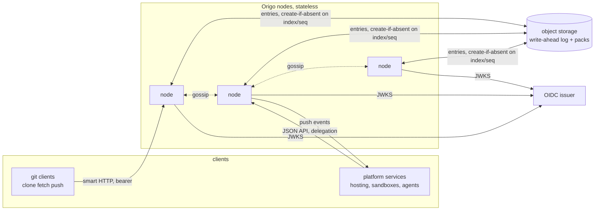
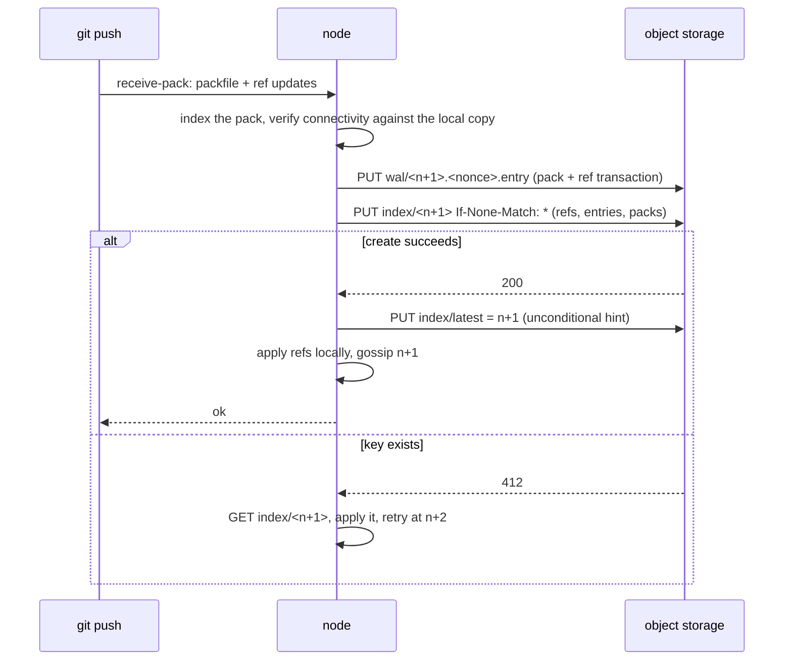

# Origo architecture

## Overview

Origo is a git server whose source of truth is a write-ahead log in object
storage rather than a repository on a disk. A node holds repositories on
local disk as a cache, serves git's own protocol from them, and treats the
log as the authority on every read and every write. That inversion is what
makes the rest cheap: nodes are interchangeable, replication is a download,
a repository nobody fetches costs nothing, and a push is durable before it
is acknowledged without a consensus cluster.

The intended operators are platforms that need a git remote per unit of
work: a hosting product with a repository per project, a sandbox service
with a repository per session, an agent runtime that commits on behalf of a
person. One Origo installation serves one trust domain; every consumer in
it speaks to Origo through the contract in spec 003. Latere runs one per
cluster at `git.latere.ai`; the hostname is the operator's.

## Current state

Phase 1 (specs 002, 003, 004) built one node that is correct: `cmd/origod`
serves clone, fetch, and push over smart HTTP from `internal/httpgit`, the
repository lifecycle from `internal/api`, the log from `internal/wal`, and
the local cache from `internal/repo`, against MinIO and DigitalOcean
Spaces. Object storage is reached through `latere.ai/x/pkg/s3`, which has
no `If-Match`; the probes are `latere.ai/x/pkg/health`, the error envelope
`latere.ai/x/pkg/httpjson`, the registry `latere.ai/x/pkg/metrics`. There
is no placement, no gossip beyond an open port, no compaction, and
authentication is one static bearer (spec 002, Outcome). The end-to-end
suite under `test/e2e` runs the flows below against a real MinIO and the
real git.

## Decision record

| Option | Shape | Why not |
|---|---|---|
| Replicated repositories with a consensus protocol | three copies per repository, every push a three-phase commit, a routing table naming where each repository lives | latency bound by the slowest replica, throughput falls as replicas are added, a corrupt quorum blocks pushes, and a million small repositories cost three copies each |
| Packfiles in object storage, references in a relational database | objects are blobs, refs are rows | two systems to keep consistent, a database in the push path, and git's own tooling cannot operate on the stored form |
| Write-ahead log in object storage, repositories as a cache | every push is a log entry; the log index is a sequence of immutable objects, each committed by create-if-absent; nodes materialize repositories from the log and repack on the primary | chosen: linearized pushes with no leader, consistent reads by one `HEAD`, stateless nodes, and idle repositories that hold no local copy |

The spike in
[docs/spikes/2026-09-06-conditional-writes.md](../docs/spikes/2026-09-06-conditional-writes.md)
is why the index is a sequence of immutable objects rather than one object
updated by compare-and-swap: `PUT If-Match` is honoured by MinIO and
refused by Spaces, while `PUT If-None-Match: *` behaves the same on both
and is documented by AWS.

## Design

### System context

### Components

| Component | Runs as | Owns |
|---|---|---|
| `origod` | Deployment, N replicas, one image, a local disk per pod | smart HTTP, the JSON API, LFS, the log client, placement, gossip, compaction, delegation, events |
| object storage | S3 API, one bucket, prefix `origo/` | the write-ahead log and compacted packs of every repository; the only durable state |
| OIDC issuer | external | identity of people and services; Origo stores no user |
| consumers | external | routing tables and ownership of repositories live in the consumer, keyed by repository id |

One binary, one mode. There is no leader election and no metadata
database: a node that dies leaves nothing to fail over.

### Storage model

A repository is identified by a lower-case UUID chosen by the consumer at
creation and never reused. Everything of one repository lives under
`origo/repos/<id>/`; the name that resolves to it lives beside the
repositories. Spec 004 fixes every format.

| Key | Content |
|---|---|
| `origo/repos/<id>/meta` | id, owner, slug, timestamps; created once with `If-None-Match: *` |
| `origo/names/<owner>/<slug>` | the id, so a name resolves to a repository; created once, so a taken name is refused by the store |
| `origo/repos/<id>/wal/<seq>.<nonce>.entry` | one push, compaction, or delete: a header, the reference transaction, and the packfile; immutable |
| `origo/repos/<id>/index/<seq>` | the state after entry `seq`: the whole reference map and the entries since the last compaction; immutable; created once with `If-None-Match: *`; `index/000000000000` is created with the repository |
| `origo/repos/<id>/index/latest` | `{"seq": n}` as a hint; written unconditionally, may lag, never leads correctness |
| `origo/repos/<id>/packs/<hash>.pack`, `.idx` | packs produced by compaction (spec 006), named by the index objects that follow it |
| `origo/repos/<id>/lfs/<oid>` | LFS objects (spec 010) |
| `origo/events/<repo>/<seq>.json` | a push event waiting for delivery (spec 008) |
| `origo/gc/<id>` | a compaction request written by a node that is not the repository's primary (spec 006) |
| `origo/sweep/latest` | the last orphan sweep's figures, written by the node that ran it (spec 019) |
| `origo/check/<uuid>` | the key `origod check` creates and deletes to prove conditional create (spec 018) |

Spec 019's orphan sweep enumerates exactly these prefixes and reports
anything else under `origo/`.

A node materializes `<id>` by reading the newest index object and applying
entries into a bare repository at `<ORIGO_DATA_DIR>/repos/<id>.git`. The
local repository is a cache: it is rebuilt from the log when missing or
corrupt and evicted when idle (spec 005).

### Write path

A push is acknowledged only after the create of the next index object
succeeds. Two nodes pushing to one repository race to create the same
`index/<n+1>`; one wins, the other applies the winner's entry and retries
with git's usual non-fast-forward semantics. There is no primary for
writes.

### Read path

Every read that must be consistent (advertising refs, serving a fetch, the
JSON API) starts with `HEAD index/<n+1>` for the sequence `n` the node
holds. A 404 is one round trip with no body and means the local copy is
current. A 200 means a newer index exists; the node fetches it, applies
the missing entries, and asks again until a 404. Gossip between nodes
(spec 005) makes the single 404 the common case; correctness never depends
on gossip arriving.

## Invariants

1. A push is durable in object storage before the client sees success.
2. Reference transactions of one repository are linearized by
   create-if-absent on the next index object: `index/<n+1>` is created at
   most once. There is no other lock.
3. A node holds no state a request cannot rebuild from the log. Deleting a
   node's disk loses nothing.
4. A read that starts with a currency check never returns a reference
   older than one acknowledged before the check began.
5. Compaction never changes the set of reachable objects or any reference;
   it only changes how they are stored, and it is itself a log entry.
6. Origo stores no user, no ownership, no routing. Authorization is a
   decision delegated to the consumer's authorizer (spec 007) with the
   caller's identity as input.
7. Everything Origo depends on is an S3 endpoint, an OIDC issuer, and a
   disk. No database, no custom resource, no cloud SDK: the module's
   direct dependencies are the standard library and `latere.ai/x/pkg`.

## Not in this spec

Multi-region replication, server-side merges and pull requests (spec 020
when a consumer needs them), hooks that run user code, SSH transport,
repository-level encryption keys. Mirroring from and to external hosts is
a consumer concern; a one-time import is spec 019.

## Spec map

| Specs | Give |
|---|---|
| 002, 003, 004 | one node that is correct: scaffold, contract, log |
| 005, 006, 007 | many nodes with identity: placement, compaction, authentication |
| 008, 009, 010 | what platforms need beyond git's protocol: events, the read API, LFS |
| 011, 012, 013, 015 | proof and hardening: telemetry, limits, the test stubs and the kind overlay, degraded storage |
| 016, 017, 018, 019, 021 | the open source bar: threat model, releases, installation, administration, the conformance suite |
| 014, 020 | adoption and later: migration of existing repositories, server-side operations |

## Acceptance criteria

- A node with an empty disk serves a clone of a repository that exists
  only in object storage, and `git rev-list --all` of the clone equals
  that of the pushed history (`test/e2e`, `TestE2EPushThenCloneFromAnEmptyDisk`;
  the `TestE2E` prefix is the one spec 013's job regex selects, and the
  builder renames the phase 1 tests under that spec).
- After one push of a base commit, two nodes accept concurrent pushes to
  two branches of one repository; both land, the newest index object lists both references, exactly the
  index objects `000000000000` to `000000000003` exist, and neither client
  sees a failure (`test/e2e`, `TestE2EConcurrentPushesToDifferentBranchesOnTwoNodes`).
- Killing a node between the entry write and the index create leaves no
  visible change, the client sees a failure, the orphan is swept, and a
  retry lands at the same sequence under a fresh nonce (`test/e2e`,
  `TestE2EKillMidPush`).
- The build list of `github.com/latere-ai/origo/...` reaches no package
  under `github.com/aws/`, `cloud.google.com/`, `github.com/Azure/`, or
  `k8s.io/` (proposed: the `depcheck` gate in `.lateregate.yaml` naming
  `./cmd/origod` with an allow list of `latere.ai/x/pkg` and the standard
  library; `tools/spike` is its own module and is not on the build list).
