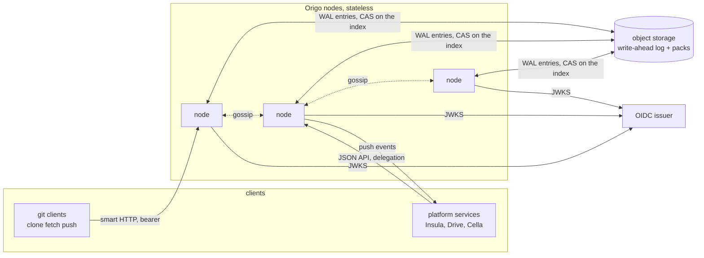
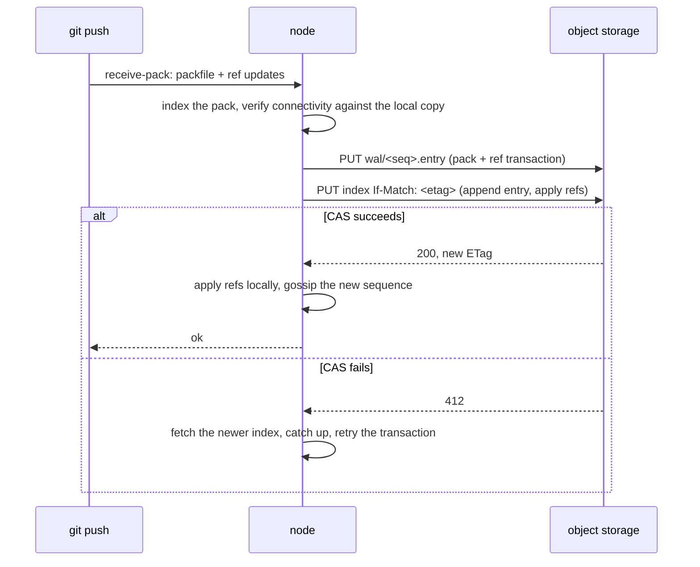

# Origo architecture

## Overview

Origo is a git server whose source of truth is a write-ahead log in object
storage rather than a repository on a disk. A node holds repositories on
local disk as a cache, serves git's own protocol from them, and treats the
log as the authority on every read and every write. That inversion is what
makes the rest cheap: nodes are interchangeable, replication is a download,
a repository nobody fetches costs nothing, and a push is durable before it
is acknowledged without a consensus cluster.

The intended operators are platforms that need a git remote per unit of
work: a hosting product with a repository per project, a sandbox service
with a repository per session, an agent runtime that commits on behalf of a
person. Latere runs one Origo per cluster and every one of its products
speaks to it through the contract in spec 003.

## Current state

Latere's data plane product hosts git today by running git subprocesses
over a per-pod cache and writing the `.git` directory back into its file
plane. That works for hundreds of repositories and one product. It is not
a storage design for a shared component, and it binds git hosting to a
product's own lifecycle. This repository starts from a design published by
Cursor's engineering team for hosting git at their scale, adapted to a
single-cluster, object-storage-first deployment.

## Decision record

| Option | Shape | Why not |
|---|---|---|
| Replicated repositories with a consensus protocol | three copies per repository, every push a three-phase commit, a routing table naming where each repository lives | latency bound by the slowest replica, throughput falls as replicas are added, a corrupt quorum blocks pushes, and a million small repositories cost three copies each |
| Packfiles in object storage, references in a relational database | objects are blobs, refs are rows | two systems to keep consistent, a database in the push path, and git's own tooling cannot operate on the stored form |
| Write-ahead log in object storage, repositories as a cache | every push is a log entry; the log index is updated by compare-and-swap; nodes materialize repositories from the log and repack on the primary | chosen: linearized pushes with no leader, consistent reads by one conditional request, stateless nodes, and idle repositories that hold no local copy |

## Design

### System context

### Components

| Component | Runs as | Owns |
|---|---|---|
| `origod` | Deployment, N replicas, one image, local NVMe or a fast ephemeral volume per pod | smart HTTP, JSON API, LFS, the WAL client, placement, gossip, compaction, delegation, events |
| object storage | S3 API, one bucket, prefix `origo/` | the write-ahead log and compacted packs of every repository; the only durable state |
| OIDC issuer | external | identity of people and services; Origo stores no user |
| consumers | external | routing tables and ownership of repositories live in the consumer, keyed by repository id |

One binary, one mode. There is no leader election and no metadata
database: a node that dies leaves nothing to fail over.

### Storage model

A repository is identified by a UUID chosen by the consumer at creation
and never reused. Under `origo/repos/<id>/`:

| Prefix | Content |
|---|---|
| `wal/<seq>.entry` | one push or one compaction: a packfile plus the reference transaction it carries (spec 004) |
| `index` | the WAL index: the ordered list of entries and the current refs; updated only by compare-and-swap on its ETag |
| `packs/<hash>.pack`, `.idx` | packs produced by compaction, referenced from the index |
| `lfs/<oid>` | LFS objects (spec 010) |

A node materializes `<id>` by reading the index and applying entries into a
bare repository at `/var/lib/origo/repos/<id>.git`. The local repository
is a cache: it is rebuilt from the log when missing and evicted when idle.

### Write path

A push is acknowledged only after the index write succeeds. Two nodes
pushing to one repository race on the ETag; one wins, the other applies the
winner's entries and retries with git's usual non-fast-forward semantics.
There is no primary for writes.

### Read path

Every read that must be consistent (advertising refs, serving a fetch, the
JSON API) starts with a conditional GET on the index using the ETag the
node holds. A 304 costs under 10 milliseconds and means the local copy is
current. A 200 carries the newer index; the node applies the missing
entries before serving. Gossip between nodes makes the 304 the common case;
correctness never depends on gossip arriving.

## Invariants

1. A push is durable in object storage before the client sees success.
2. Reference transactions of one repository are linearized by the index's
   compare-and-swap. There is no other lock.
3. A node holds no state a request cannot rebuild from the log. Deleting a
   node's disk loses nothing.
4. A read that starts with a fresh index never returns a reference older
   than one acknowledged before the read began.
5. Compaction never changes the set of reachable objects or any reference;
   it only changes how they are stored, and it is itself a log entry.
6. Origo stores no user, no ownership, no routing. Authorization is a
   decision delegated to the consumer's authorizer (spec 007) with the
   caller's identity as input.
7. Everything Origo depends on is an S3 endpoint, an OIDC issuer, and a
   disk. No database, no CRD, no cloud SDK.

## Not in v1

Multi-region replication, server-side merges and pull requests, hooks that
run user code, SSH transport, repository-level encryption keys. Mirroring
from and to external hosts is a consumer concern.

## Spec map

Specs 002 to 004 build one node that is correct. Specs 005 to 007 make it
many nodes with identity. Specs 008 to 010 add what platforms need beyond
git's protocol. Specs 011 to 013 harden and prove it. Spec 014 moves the
existing repositories in.

## Acceptance criteria

- A node with an empty disk serves a clone of a repository that exists only
  in object storage, and the clone's history equals the pushed history.
- Two nodes accept concurrent pushes to different branches of one
  repository; both land, the index has both, and neither client sees a
  spurious failure.
- Killing a node mid-push leaves either a fully acknowledged push or no
  change; a retry from the client converges.
- A grep of the module for cloud SDK imports and for Kubernetes API clients
  finds none.
