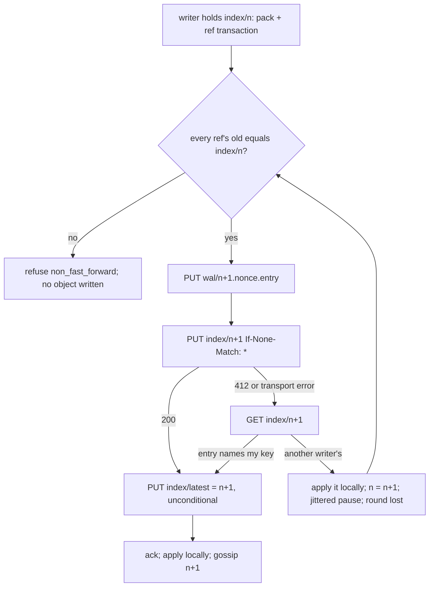

# Write-ahead log

## Overview

The log is the repository. Every push and every compaction is one entry
in object storage, and the index is a sequence of immutable objects, one
per committed entry, each holding the full reference map and what a
reader needs to serve the repository at that point. A node applies
entries into a local bare repository to serve git, and that local copy is
disposable. This spec fixes the entry format, the index objects, the
create-if-absent commit that linearizes writers, the currency check, and
how a node materializes and catches up.

## Current state

Built in phase 1 and in the tree. `internal/wal` holds the formats
(`format.go`), the `Store` interface with `MemStore` and the S3 adapter
over `latere.ai/x/pkg/s3` (`store.go`, `memstore.go`, `s3.go`), the
commit and the currency check (`log.go`), repository metadata and names
(`meta.go`), and the sweeper (`sweep.go`). `internal/repo` holds the
local cache (`cache.go`) and the git subprocess wrapper (`git.go`).
`internal/httpgit` captures a push into an entry through a pre-receive
hook (`hook.go`) and commits it before git's own update. `cmd/origod`
runs the sweeper loop. The hook in the tree writes the transaction
only: the `quarantine` line of the hook protocol below and the step that
reads the quarantined objects with `GIT_ALTERNATE_OBJECT_DIRECTORIES`
were built by spec 008, their only consumer, on 2026-09-08. The spike in
[docs/spikes/2026-09-06-conditional-writes.md](../docs/spikes/2026-09-06-conditional-writes.md)
is the evidence for the commit primitive: `PUT If-None-Match: *` is
honoured by MinIO and DigitalOcean Spaces and documented by AWS, `PUT
If-Match` is refused by Spaces, `CopyObject` conditions are ignored by
both, and versioning refuses no write. `pkg/s3` has no `If-Match` and its
fake answers 412 to one, so a compare-and-swap cannot enter the design
unnoticed. The Outcome lists what is verified and what is not.

Defects against the Design found by review, all four fixed on
2026-09-08; each fix carries the test the Outcome names:

- `repo.Cache.Apply` fetched the packs the index lists only when the
  copy was fresh or its sequence was below `compacted_through`, so a
  copy that lost a pack file, or one that followed a compaction whose
  `compacted_through` its sequence already passed, was served from an
  incomplete object store. It now fetches every listed pack missing
  under `objects/pack/` whatever the copy holds, as the Materialization
  section says; a pack on disk costs one `stat`.
- `repo.Cache.fetchPack` wrote a fetched pack as `<hash>.pack` and
  `<hash>.idx`, the log key's base name, which git never opens, so a
  fetched pack was on disk and invisible. It now writes
  `pack-<hash>.idx` then `pack-<hash>.pack` through `wal.PackFile`, the
  mapping of the Objects table in one function.
- Fixed by spec 009: the index object carried no `pushed_at`.
  `wal.Index` carries it, `Log.nextIndex` sets it as the Index object
  section below says, and `ParseIndex` accepts its absence, so `GET
  /v1/repos/{id}` (spec 009) and `stats` (spec 019) read one field
  instead of the newest entry's header.
- `size_bytes` accumulated `pack_bytes` on every kind, a `compact`
  entry included, so the figure never fell after a compaction and
  counted bytes the sweeper had deleted. `Entry` carries `PacksBytes`,
  and `Log.nextIndex` sets `size_bytes` to it on a `compact` entry and
  adds `pack_bytes` on every other kind, the definition of the Index
  object section; spec 012's quota and spec 019's `stats` read that
  figure, and spec 019's `TestClusterGcBoundsStorage` passes only with
  it.

Not a defect, for the reader: `origo_push_duration_seconds{phase}` of
spec 011's table is attributed to the receive path this spec built,
and phase 1 did not record it. The builder of spec 008, who changed
the receive path for the `forced` flag and the enqueue, records it;
spec 008's Current state and affects say so.

## Decision record

| Option | Shape | Why not |
|---|---|---|
| One mutable index, `PUT If-Match: <etag>` | compare-and-swap on the ETag | Spaces answers 412 to every `If-Match` `PUT`; the primitive is not portable |
| `CopyObject` with a destination condition | write the candidate to a scratch key, copy it over the index under `If-Match` | MinIO and Spaces accept the header and ignore it: the copy overwrites |
| Versioned bucket, order by version | unconditional `PUT`, `ListObjectVersions` names the first | refuses no write; a loser learns it lost after its push was acknowledged |
| Immutable index objects, `PUT If-None-Match: *` on the next one | chosen: one create per commit, exactly one creator succeeds | honoured on every store the spike ran; one primitive, no ETag bookkeeping |

## Design

### Objects

Under `origo/repos/<id>/`, with `<seq>` a zero-padded 12 digit decimal so
keys sort in sequence order under a listing, and the largest sequence
`999999999999`:

| Key | Content |
|---|---|
| `meta` | `{"id", "owner", "slug", "created_at", "updated_at"}`; created once by `If-None-Match: *`, rewritten on rename |
| `wal/<seq>.<nonce>.entry` | one push, compaction, or delete: header, reference transaction, pack; immutable; `<nonce>` 16 hex characters |
| `index/<seq>` | the state after entry `seq`; immutable; created once by `If-None-Match: *`; `index/000000000000` is created with the repository, names no entry, and holds `HEAD` on the default branch |
| `index/latest` | `{"seq": n}`, a hint written unconditionally after each commit; may lag or go backwards; never leads correctness |
| `packs/<hash>.pack`, `packs/<hash>.idx` | packs produced by compaction (spec 006) or an import (spec 019), `<hash>` 40 to 64 hex characters: git's own pack checksum, the one git puts in the file name. The mapping between the log and a local copy is fixed here and referenced by every spec that moves a pack: the log key `packs/<hash>.pack` is the file `objects/pack/pack-<hash>.pack` on disk, and `packs/<hash>.idx` is `pack-<hash>.idx`, the function `wal.PackFile`; a pack is uploaded under the hash of its file name and written back under the name git gave it, so a pack keeps one name everywhere |

The name `origo/names/<owner>/<slug>` holds the id and is created by
`If-None-Match: *`, so two repositories cannot take one name and a rename
claims the new name before it releases the old one.

### Entry

A writer that holds `index/<n>` writes its entry as
`wal/<n+1>.<nonce>.entry` with a nonce it draws from `crypto/rand`. Two
writers that both hold `index/<n>` write two different keys, so a loser
never overwrites the winner's entry; the index object names the key it
committed. Format, in order:

| Section | Content |
|---|---|
| header | JSON, one line, at most 4 KiB, unknown fields refused: `{"v": 1, "kind": "push"\|"compact"\|"delete", "seq", "at", "subject", "actor", "pack_bytes", "pack_sha256", "push_options"}`; `push_options` present only when the client sent any; `pack_sha256` empty when `pack_bytes` is 0 |
| refs | JSON, one line, at most 64 MiB: the reference transaction `[{"ref", "old", "new"}]`; `old` all zeros for a create, `new` all zeros for a delete; for `HEAD` the values are symbolic, `ref: refs/heads/main`; a reference appears at most once and `old` differs from `new` |
| pack | the packfile bytes exactly as received from the client (`push`) or produced by repack (`compact`); absent when `pack_bytes` is 0 |

The entry is uploaded with `Content-MD5` and its SHA-256 is computed
once; a pack is read once for the hash and once per upload attempt.

### Index object

`index/<n>` is the complete state after entry `n`, at most 64 MiB for the
parser and under 1 MiB by design (compaction, spec 006, folds entries
before the list grows past it):

```json
{"v": 1, "seq": 1043, "entry": "wal/000000001043.9f3c1a7be2d40c55.entry",
 "refs": {"refs/heads/main": "<sha>", "HEAD": "ref: refs/heads/main"},
 "entries": [{"seq": 1040, "key": "wal/000000001040.….entry", "kind": "push",
              "pack_bytes": 4096, "pack_sha256": "…"}, …],
 "packs": ["packs/<hash>.pack"], "compacted_through": 1039,
 "size_bytes": 123456789, "deleted_at": null,
 "pushed_at": "2026-09-06T10:00:00Z"}
```

`entries` lists every entry after `compacted_through` up to and
including `seq`, in order, with the object's own entry last; earlier
history is represented by `packs`. A row carries the entry's
`pack_bytes`, omitted when the entry has no pack and read as 0 on an
index object written before the field existed, so the byte threshold of
compaction (spec 006) sums the list instead of reading one entry header
per push. `size_bytes` is what the log holds
for the repository: the bytes of the `.pack` objects `packs` lists plus
the sum of `pack_bytes` over `entries`. A `compact` commit sets it to
the bytes of the packs it lists, which the writer of the entry knows
because it uploaded them (spec 006, step 4; spec 019's import) and
passes as `Entry.PacksBytes`; a `push` commit adds its own
`pack_bytes`; a `delete` commit and an empty `push` add 0. So the figure
falls at each compaction to what a fresh materialization downloads,
and spec 012's quota, spec 019's `stats`, and `GET /v1/repos/{id}`
(spec 003) all serve one number. `deleted_at` is set by a
`delete` entry and cleared by the next `push` entry (undelete).
`pushed_at` is the `at` of the newest `push` entry: a `push` commit
sets it to its own entry's `at`, every other commit copies it forward,
and `index/000000000000` holds null. An index object written before
the field existed has none; a reader treats a missing `pushed_at` as
null, because the object's own entry's `at` is in the entry's header
and reading it would be the second read this sentence rules out, and
no such object exists outside test buckets. Each
index object carries the whole reference map, so a reader needs exactly
one of them. The parser refuses an unknown field, a version other than
1, an entry list out of order or outside `(compacted_through, seq]`, a
missing own entry, an invalid reference name or value, and a pack key
outside `packs/<hex>.pack`.

### Commit by create-if-absent



Linearization comes from create-if-absent alone: `index/<n+1>` is
created at most once, so exactly one writer holding `index/<n>` commits
entry `n+1`, and every other writer at `n` sees 412 and moves to `n+1`.
There is no ETag to track and no lock. For every `n` the sequence of
index objects is a total order because

$$\text{created}(\text{index}/n{+}1) \Rightarrow \neg\,\text{created by another writer}(\text{index}/n{+}1),$$

and every writer's precondition for creating `index/<n+1>` is holding
`index/<n>`, so the chain has no gaps.

Exact values of `internal/wal.Log.Commit`:

| Value | Setting |
|---|---|
| transaction check | before any write and again after every lost round: `old` of every reference must equal the held index's value, all zeros for an absent reference; a mismatch is `ConflictError{Ref, Expected, Actual}`, counted on `origo_wal_commit_conflicts_total` |
| lost round | the writer reads `index/<n+1>` back after any failed create (412 or transport error); if `entry` names its own key it won; otherwise it applies the stored index through the caller's `catchUp`, counts `origo_wal_commit_retries_total`, and replays at `n+2` |
| pause between rounds | `retry.Policy{Base: 1ms, Max: 16ms, Jitter: 1}` from `latere.ai/x/pkg/retry`: doubled per consecutive loss, capped at 16 ms, fully jittered, so losers of one round do not replay in step |
| rounds | at most 4096 per commit, then `ErrContended`; every lost round is a sequence another writer committed, so a live repository never reaches it |
| after the win | `origo_wal_commits_total` increments and `index/latest` is written; a failed hint write is a warning, not an error |
| orphan | an entry written whose index create was lost (a refused commit, a node killed at the `commit.before-index` failpoint) is never named by an index object; the sweeper removes it |

### Currency check

A node that holds sequence `n` asks `HEAD index/<n+1>`
(`internal/wal.Log.HasIndex`, timed on `origo_wal_head_check_seconds`):

- 404: the local copy is current. One round trip, no body.
- 200: a newer index exists. The node reads `index/latest`; when the
  hint is above `n+1` and `HEAD` confirms the hinted object exists it
  jumps there, then walks `HEAD index/<m+1>` forward until a 404 and
  reads the newest object once. That object lists every entry the node
  lacks since `compacted_through`.

A node with no local copy reads `index/latest` first; when the hint is
missing, unparsable, or names a swept object, it lists `index/` and
takes the highest key. A repository with no index object at all is
`ErrNotFound`. Gossip (spec 005) carries the newest sequence between
nodes so the common case is one `HEAD` that answers 404; correctness
never depends on gossip arriving.

### Materialization

`internal/repo.Cache.Acquire(ctx, id, write)` runs the currency check on
every open and, when the copy is behind, upgrades a reader to the write
lock, applies, and downgrades. `Apply` does, in order:

1. If there is no local copy: `git init --bare` under
   `<ORIGO_DATA_DIR>/repos/<id>.git` with the configuration below.
2. `GET` every pack in `packs` whose file is missing under
   `objects/pack/`, whatever the copy holds and whether or not its
   sequence is below `compacted_through`, into `objects/pack/` as
   `pack-<hash>.idx` then `pack-<hash>.pack` by the mapping of the
   Objects table, each written atomically. A pack already on disk under
   that name is never fetched again, so the step costs one `stat` per
   listed pack on a current copy.
3. For each listed entry above the local sequence: `GET` the entry,
   check `seq` and `kind` against the index row, spool the pack, verify
   its length and `pack_sha256`, run `git index-pack --stdin --fix-thin
   --strict`, and apply the transaction with `git update-ref --stdin`
   (`git symbolic-ref` for `HEAD`); values are set, not compared.
4. Reconcile the whole reference map to the index with `git
   for-each-ref` and one `update-ref --stdin`, so the copy equals the
   index whatever it held before.
5. Write `<ORIGO_DATA_DIR>/repos/<id>.origo.json` as `{"seq": n}`.

Materialization is idempotent and resumable. A git error whose stderr
names corruption (`corrupt`, `bad object`, `missing object`, `bad pack`,
and the rest of the list in `internal/repo/git.go`), or a failed
`git fsck --connectivity-only` on the sampled check that runs on every
256th write open, evicts the copy (`origo_repo_rebuilt_total`) and the
next open rebuilds it from the log. The log is never repaired from a
local copy.

Git configuration of a materialized repository: `core.protectNTFS`,
`receive.fsckObjects`, `receive.advertiseAtomic`,
`receive.advertisePushOptions`, `uploadpack.allowFilter`,
`uploadpack.allowAnySHA1InWant` on; `receive.autogc` off and `gc.auto`
0, because compaction is a log entry. Every git subprocess runs with the
environment of spec 016, `GIT_DIR` set, `HOME` an empty directory under
`ORIGO_DATA_DIR`, and a 5 minute deadline.

### Serving git from the local copy

`upload-pack` runs against the local copy after the currency check.
`receive-pack` runs with a pre-receive hook Origo installs in every
repository (`internal/httpgit/hook.go`, shell builtins only). The
request body is spooled to `<ORIGO_DATA_DIR>/spool/` and parsed for the
commands, the capabilities, the push options, and the pack offset. The
hook and the node talk over two FIFOs in a per-request directory:

| Variable | Set by | Meaning |
|---|---|---|
| `ORIGO_HOOK_DIR` | the node, on `git receive-pack` only | the directory holding the `updates` FIFO (the hook writes one line `quarantine <GIT_QUARANTINE_PATH>`, then the transaction git resolved, then the line `end`, so the node can read the pushed objects before git migrates them) and the `verdict` FIFO (the node answers `ok` or `reject <code>: <message>`); the node holds both ends of each FIFO open from before git starts, so no open of the hook or the node waits for the other side |

Git quarantines and checks the objects, runs the hook, and the hook
blocks on the verdict while the node writes the entry and commits the
index object. After the commit and before it answers, the node runs
what needs the pushed objects (the `forced` flag of spec 008) with
`GIT_ALTERNATE_OBJECT_DIRECTORIES` set to the quarantine path the hook
reported. `ok` lets git move the references; `reject` becomes the
hook's stderr and git relays it in the sideband. The node then records
the new sequence without re-applying (`Cache.Advance`) and enqueues the
push event (spec 008). A push git
refuses before the hook (bad objects, a failed connectivity check, a
client that went away) never touches the log.

### Sweeper

`Log.Sweep` runs on every repository every `ORIGO_SWEEP_INTERVAL` and
deletes, once an object is older than `ORIGO_SWEEP_MIN_AGE`:

| Object | Deleted when |
|---|---|
| an entry with `seq` at or below `compacted_through` of the newest index | folded by compaction |
| an entry with `seq` above the newest index, or one the newest index does not name | an orphan |
| a pack under `packs/` the newest index does not list | superseded by a compaction (spec 006) or left by one that lost its round; the `.idx` goes with the `.pack` |
| an index object | never, whatever `compacted_through` says (spec 006, Truncation) |
| everything under the repository, and its name | the newest index carries `deleted_at` older than the 7 day hold; the age rule does not apply |

An index object is never deleted because the currency check is `HEAD
index/<n+1>` and a 404 means current: a warm node holding `index/<n>`
below a truncation point would read the 404 left by a deleted
`index/<n+1>` as proof its copy was current and serve stale references.
One small object per push, bounded by 1 MiB, is the cheaper side of
that trade. Spec 006 removed the rule from `internal/wal/sweep.go`
with the `Indexes` count of `SweepReport`, and owns the criterion.

A reader that holds a swept sequence is below `compacted_through` and
rebuilds from packs, which is step 2 of materialization.

### Deletion

`DELETE /v1/repos/{id}` commits a `delete` entry whose index object sets
`deleted_at`; the node that served the delete evicts its local copy at
once, every other node evicts on its next currency check, and every node
answers 404 from then on. The
sweeper purges the prefix after the hold unless a later index object
cleared `deleted_at` (`undelete` commits a `push` entry with an empty
transaction).

### Sizes

| Value | Limit |
|---|---|
| single push | one entry, at most 2 GiB, the largest single `PUT` every provider accepts; enforced by spec 012 |
| repository | 50 GiB by default, per the authorizer's `quota_bytes` (spec 007, 012) |
| index object | 1 MiB by design; compaction (spec 006) runs before it can grow past this; 64 MiB parser limit |
| entry write | acknowledged after object storage returns 200; `Content-MD5` set |
| commit | acknowledged after the create of `index/<n+1>` returns 200 |

## Not in this spec

Multi-part entries for a push above 2 GiB. Concurrent `index-pack`
workers and one reference apply per bulk materialization (spec 005,
materialization budget). Compaction itself (spec 006). Enforcement of
the size limits (spec 012).

## Acceptance criteria

- A push produces exactly one entry and one index object, and killing the
  node at `commit.before-index` leaves the client with a failure, no
  visible change on a fresh node, one orphan the sweeper removes within
  `ORIGO_SWEEP_MIN_AGE` plus one interval, and a retry that lands at the
  same sequence under a fresh nonce (`internal/wal`,
  `TestCommitWritesOneEntryAndOneIndex`, `TestCommitFailpointAndWriteFailures`;
  `test/e2e`, `TestE2EKillMidPush`).
- 16 writers holding the same `index/<n>` race for 20 rounds: exactly one
  index object per sequence, every writer's every push lands, and no two
  index objects share a sequence (`internal/wal`,
  `TestSixteenWritersTwentyRoundsOneWinnerPerSequence` on `MemStore`;
  `TestS3Suite` on MinIO under the `integration` tag).
- A create whose response is lost is settled by reading the object back:
  the writer that finds its own key continues as the winner (`internal/wal`,
  `TestCommitSurvivesALostResponse`).
- A holder of `index/<n>` whose `HEAD index/<n+1>` answers 404 serves
  `index/<n>`; after another node commits `n+1` the next check answers
  200 and the node serves `index/<n+1>` (`internal/wal`,
  `TestNewestFindsTheNewestIndex`; `internal/repo`,
  `TestMaterializeFromAnEmptyDiskThenCatchUp`, `TestReadersUpgradeAndWritersAdvance`).
- A node with an empty disk materializes a repository from packs and
  entries and `git fsck` passes on the result (`internal/repo`,
  `TestCompactionPacksAreFetched`; `test/e2e`, `TestE2EPushThenCloneFromAnEmptyDisk`).
- A local copy with a deliberately corrupted pack is evicted and rebuilt
  from the log and serves the same history (`internal/repo`,
  `TestCorruptCopyIsRebuiltFromTheLog`).
- `FuzzParseHeader`, `FuzzParseTransaction`, and `FuzzParseIndex` in
  `internal/wal` and `FuzzReadPkt` and `FuzzParseReceive` in
  `internal/httpgit` find no panic: each runs as a seed-corpus test in
  the suite on every push and for 40 seconds under `make fuzz` (spec
  013) on the weekly schedule.
- 100 concurrent pushes to distinct branches from 8 clients all land and
  the newest index lists 100 entries in sequence order (proposed:
  `test/e2e`, `TestE2EHundredConcurrentPushesFromEightClients`, a test
  of the one-node run; deferred to spec 013, which owns the job that
  runs the tier).
- A repository of 10 000 entries and 3 packs materializes onto an empty
  disk and `git fsck` passes; the entries are written by the harness
  through `Log.Commit`, not by `git push`, and the packs by a compaction
  (spec 006) (proposed: `test/e2e`,
  `TestSlowMaterializeTenThousandEntries`, in the `e2e-slow` job of spec
  013 under that job's 30 minute budget; deferred to spec 006, which
  owns the packs, and spec 013, which owns the job).
- The create race, `HEAD` 404, and `GET` 304 rows of the probe pass on
  DigitalOcean Spaces with the current build (`tools/spike/condwrite`,
  recorded in the spike): a release checklist item of spec 017, run by
  a maintainer before a tag, not a CI test; deferred to spec 017, which
  owns the checklist; the conformance run against Spaces is spec 021.

The three deferred criteria each name the spec that owns them, and this
spec stays at `testing` until those land; the dispatch rule of
`specs/README.md` (every dependency at `testing` or later) is what lets
the specs that build on this one start meanwhile.

## Outcome

Phase 1 shipped the log on 2026-09-06 as the Current state describes.
The first seven criteria have passing tests in the tree; the tests the
eighth and ninth name are not, which is why the spec stays at testing,
and the tenth is a release checklist item of spec 017. Spec 013 renames the end-to-end tests with the
`TestE2E` prefix its job regex selects; the names above are the renamed
ones.

The four defects the Current state records are fixed, each with a test
that fails without the fix. Three were fixed on 2026-09-08 by this
spec, one commit each:

- `size_bytes`: `Entry.PacksBytes` is new, a `compact` commit sets
  `size_bytes` to it, every other kind adds `pack_bytes`.
  `TestCommitWritesOneEntryAndOneIndex` asserts the sum over three
  pushes, that a `delete` and an empty `push` add 0, that a compaction
  falls to `PacksBytes`, that the next push adds its own `pack_bytes`
  to that, and that a negative `PacksBytes` is refused before any
  object is created. `internal/api` is the one reader of the field and
  serves the defined figure without a change.
- The pack file name: `fetchPack` writes `pack-<hash>.idx` then
  `pack-<hash>.pack` through `wal.PackFile`, the mapping of the Objects
  table in one function for spec 006's upload and spec 019's import
  (`TestPackFileMapsTheLogKeyToTheFileGitReads`).
  `TestCompactionPacksAreFetched` asserts the exact names, that the log
  key's base name is not written, that `git verify-pack` reads the
  file, and that a copy built from the compaction pack alone passes
  `git fsck` with one pack on disk; it accepted either name before.
- The pack fetch condition: `Apply` fetches every listed pack missing
  under `objects/pack/` whatever the copy holds. The new
  `TestPacksAreFetchedForACurrentCopy` builds a copy from the
  compaction pack alone, removes the pack file, commits a push with no
  pack, and asserts the next apply restores the file with two `GET`s,
  `git fsck` passes, and a further apply pays no `GET` for a pack on
  disk. Without the fix git refuses the reference write for a
  nonexistent object.

The fourth, `pushed_at`, is fixed by spec 009, below.

Measurements, one node on an Apple silicon laptop against MinIO in a
podman virtual machine (`test/e2e`, `TestMeasure` with
`ORIGO_E2E_MEASURE=1`), a floor for the client path rather than a
production figure:

| Measurement | Value |
|---|---|
| Pushes sustained for 60 s, 4 clients, 1 KiB commits, one node | 9.7 pushes/s (582 in 60 s) |
| Push latency seen by the client | p50 335 ms, p99 849 ms, including the git client process and the pack upload |
| `HEAD` currency check, 404 (current) | p50 0.36 ms, p99 2.28 ms (500 samples) |
| `HEAD` currency check, 200 (a newer index exists) | p50 0.42 ms, p99 3.93 ms (500 samples) |
| Materialize 1 000 entries onto an empty disk (first `ls-remote`) | 70.7 s: one `GET`, one `index-pack`, and one `update-ref` per entry |
| Full clone after that | 0.69 s |
| Writing the 1 000 entries through the log | 98 s, dominated by `pack-objects` in the test client |

Materialization is bound by two git subprocesses per entry, about 35 ms
each here. Spec 005 sets the budget and the two changes that meet it;
compaction (spec 006) is what removes the entry count from the path.

The `pushed_at` defect was fixed by spec 009 on 2026-09-08:
`wal.Index` carries `pushed_at`, a `push` commit sets it to its own
entry's `at`, every other commit copies it forward, index 0 holds
null, and `ParseIndex` accepts its absence, which reads as null
(`TestCommitWritesOneEntryAndOneIndex`, `TestParseIndex`). A `delete`
records the same `at` as its entry's header. With every defect fixed,
what holds the spec at `testing` is the three deferred criteria. Spec
013 is complete and its jobs are green on main, so the tier each test
runs in exists; none of the three tests does.
`TestE2EHundredConcurrentPushesFromEightClients` (the eighth) has
nothing left to wait for, spec 013 having been its deferral target: it
belongs in `test/e2e` under the `TestE2E` prefix the `integration` job
selects through `make test-tiers`, and writing it is this spec's own
remaining item. `TestSlowMaterializeTenThousandEntries` (the ninth)
needs the packs of spec 006 and runs in the `e2e-slow` job. The tenth
is spec 017's release checklist recording the Spaces probe, which spec
017 wrote on 2026-09-09 and which stays open: it is a maintainer's
run of `tools/spike/condwrite` before a tag, not a job.

One change spec 019 made to this spec's Design on 2026-09-09, recorded
in its Outcome: the purge no longer removes `meta`. It deletes every
other object under the prefix, rewrites `meta` with `purged_at`, and
deletes the name, so the id stays taken forever, every endpoint answers
410 `gone` rather than 404, and the owner and slug are free again
(`TestPurgeLeavesATombstone`, and the tombstone as the one surviving
key in `TestSweepRemovesOrphansAndKeepsWhatAnIndexNames`).

One divergence stands open on purpose: the Sweeper table's index row,
rewritten on 2026-09-08 when the currency check's rule was settled, is
ahead of `internal/wal/sweep.go`, which still deletes index objects
below `compacted_through`, and of
`TestSweepRemovesOrphansAndKeepsWhatAnIndexNames`, which asserts the
count it reports. Nothing reaches the rule while `compacted_through` is
0, which no commit sets until spec 006 lands, and 006's builder removes
the rule, the `Indexes` count of `SweepReport`, and those assertions
with the compaction that makes them reachable.

Two defects found and fixed by spec 005 on 2026-09-08, each in its
own commit with a test that fails without it:

- `repo.Cache.sync` treated `HEAD index/<n+1>` answering 404 as proof
  the copy was current, and then failed the read of `index/<n>` with
  `wal: object not found` when the log no longer held the sequence: a
  warm cache pointed at a reset bucket answered
  `storage_unavailable` for good. The copy is now
  evicted and the repository materialized from what the log holds,
  404 when it holds nothing (`TestLostSequenceRebuildsFromTheLog`).
- A reader whose check found a newer index released the read lock,
  took the write lock, and ran the check again: a second `HEAD` and a
  second `GET` of the index it had read. The index the check read is
  applied as it is when the copy did not move while the reader waited
  (`TestReaderUpgradeAppliesTheIndexItRead`).

Two changes spec 006 made to this spec's Design when compaction
landed on 2026-09-08, both recorded in its Outcome:

- The sweeper no longer deletes index objects, and deletes the packs
  no index lists instead. The rule "an index object below
  `compacted_through` and below the newest 64" was unsound once
  `compacted_through` moved, which is what spec 006's Truncation
  section states and this spec's Sweeper table now carries
  (`TestSweepRemovesOrphansAndKeepsWhatAnIndexNames`,
  `TestSweepRemovesUnlistedPacks`).
- The index row carries `pack_bytes`, which compaction's byte
  threshold sums. `size_bytes` is the listed packs plus that sum and
  cannot be split back into the two, so the figure the threshold reads
  had no source; the field is absent on a row with no pack and on an
  index object written before it existed, which reads as 0
  (`TestParseIndex`).

The ninth criterion's fixture is now buildable: a compaction produces
the packs it names, `internal/compact`. The test
`TestSlowMaterializeTenThousandEntries` is still to be written and
stays this spec's, in spec 013's `e2e-slow` job.

The materialization budget of spec 005 replaced the per-entry
`index-pack` and `update-ref` of step 3 with concurrent fetches and one
`index-pack` per batch of consecutive entries, the references
reconciled once by step 4; spec 005's Outcome has the measurements.

Divergences from the first draft, all kept and now in the Design:

- `index/000000000000` is created with the repository so a writer always
  holds an index object.
- `HEAD` is a symbolic reference in the map and `PATCH /v1/repos/{id}`
  moves it through the log.
- The header carries `push_options`.
- Metadata and names live beside the log, created by create-if-absent.
- The reference map is reconciled after applying entries; values are
  set, not compared.
- Multi-part entries are not implemented and the single push limit is 2
  GiB, one `PUT`.
- The S3 client is `latere.ai/x/pkg/s3`, signed by the standard library
  and checked against the published signature vector; `internal/wal`
  keeps the `Store` interface, `MemStore`, and a thin adapter mapping the
  client's sentinels to the Store's (`ErrNotFound`, `ErrPreconditionFailed`
  to `ErrExists`, `ErrNotModified`). The
  client sends `If-None-Match` only, asserted by the fake endpoint.
- The commit backoff is a `retry.Policy` from `latere.ai/x/pkg/retry`.
- The five fuzz functions run as seed-corpus tests in the suite; no gate
  runs them for 40 seconds. The 40 second run is `make fuzz` of spec 013
  with its weekly schedule, a builder item there.
- The sampled connectivity check runs on every 256th write open.
- Without compaction the `entries` list grows by one row per push; the
  1 MiB ceiling holds for roughly ten thousand pushes.
- The hook channel, fixed at its root on 2026-09-08: the node's blocking
  open of the `updates` FIFO for reading met the hook's blocking open for
  writing, and on macOS that rendezvous loses its wakeup about once in a
  thousand (the hook's open, write, and close all complete between the
  kernel counting the reader and putting it to sleep), so the request
  ran into its timeout and the client's push hung on a response without
  git's closing flush (`TestStalePushIsRefusedAndConcurrentBranchesLand`
  on `macos-latest`, CI run 34227884820). The node now opens both ends
  of each FIFO before git starts, the hook ends its updates with the
  line `end` and opens the verdict FIFO first, and no open on either
  side waits; `TestHookHandOffNeverSleepsInAnOpen` runs four thousand
  bounded exchanges of the installed script and met the lost wakeup
  under the first channel. A node that goes away mid-push now ends its
  hook with `no verdict` instead of leaving it, and `git receive-pack`
  with it, waiting in an open.
- Two defects in `ValidRefName`, found by spec 016's `FuzzValidRefName`
  against `git check-ref-format` and fixed at the root on 2026-09-09:
  a component ending in a dot, `refs/heads/a.`, which git refuses, was
  accepted; and a name that is not UTF-8, which git accepts and the
  JSON index object rewrites to U+FFFD, so it could never round-trip
  through the log, was accepted. Both are refused now, with the seeds
  `refs/heads/a.`, `refs/heads/a./b`, and `refs/heads/\xee` in
  `TestValidRefName` and the corpus of `FuzzValidRefName` in
  `internal/wal`.
