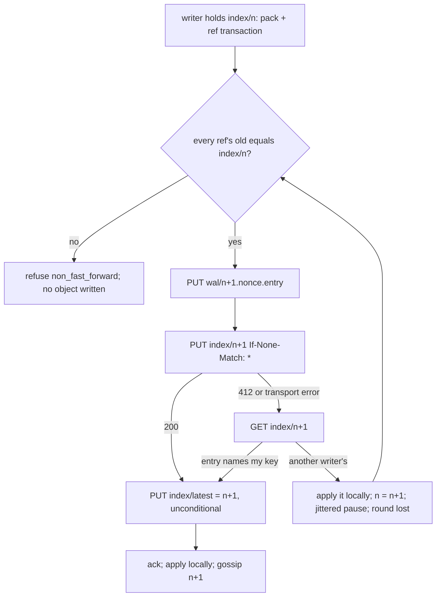

# Write-ahead log

## Overview

The log is the repository. Every push and every compaction is one entry
in object storage, and the index is a sequence of immutable objects, one
per committed entry, each holding the full reference map and what a
reader needs to serve the repository at that point. A node applies
entries into a local bare repository to serve git, and that local copy is
disposable. This spec fixes the entry format, the index objects, the
create-if-absent commit that linearizes writers, the currency check, and
how a node materializes and catches up.

## Current state

Built in phase 1 and in the tree. `internal/wal` holds the formats
(`format.go`), the `Store` interface with `MemStore` and the S3 adapter
over `latere.ai/x/pkg/s3` (`store.go`, `memstore.go`, `s3.go`), the
commit and the currency check (`log.go`), repository metadata and names
(`meta.go`), and the sweeper (`sweep.go`). `internal/repo` holds the
local cache (`cache.go`) and the git subprocess wrapper (`git.go`).
`internal/httpgit` captures a push into an entry through a pre-receive
hook (`hook.go`) and commits it before git's own update. `cmd/origod`
runs the sweeper loop. The spike in
[docs/spikes/2026-09-06-conditional-writes.md](../docs/spikes/2026-09-06-conditional-writes.md)
is the evidence for the commit primitive: `PUT If-None-Match: *` is
honoured by MinIO and DigitalOcean Spaces and documented by AWS, `PUT
If-Match` is refused by Spaces, `CopyObject` conditions are ignored by
both, and versioning refuses no write. `pkg/s3` has no `If-Match` and its
fake answers 412 to one, so a compare-and-swap cannot enter the design
unnoticed. The Outcome lists what is verified and what is not.

## Decision record

| Option | Shape | Why not |
|---|---|---|
| One mutable index, `PUT If-Match: <etag>` | compare-and-swap on the ETag | Spaces answers 412 to every `If-Match` `PUT`; the primitive is not portable |
| `CopyObject` with a destination condition | write the candidate to a scratch key, copy it over the index under `If-Match` | MinIO and Spaces accept the header and ignore it: the copy overwrites |
| Versioned bucket, order by version | unconditional `PUT`, `ListObjectVersions` names the first | refuses no write; a loser learns it lost after its push was acknowledged |
| Immutable index objects, `PUT If-None-Match: *` on the next one | chosen: one create per commit, exactly one creator succeeds | honoured on every store the spike ran; one primitive, no ETag bookkeeping |

## Design

### Objects

Under `origo/repos/<id>/`, with `<seq>` a zero-padded 12 digit decimal so
keys sort in sequence order under a listing, and the largest sequence
`999999999999`:

| Key | Content |
|---|---|
| `meta` | `{"id", "owner", "slug", "created_at", "updated_at"}`; created once by `If-None-Match: *`, rewritten on rename |
| `wal/<seq>.<nonce>.entry` | one push, compaction, or delete: header, reference transaction, pack; immutable; `<nonce>` 16 hex characters |
| `index/<seq>` | the state after entry `seq`; immutable; created once by `If-None-Match: *`; `index/000000000000` is created with the repository, names no entry, and holds `HEAD` on the default branch |
| `index/latest` | `{"seq": n}`, a hint written unconditionally after each commit; may lag or go backwards; never leads correctness |
| `packs/<hash>.pack`, `packs/<hash>.idx` | packs produced by compaction (spec 006), `<hash>` 40 to 64 hex characters: git's own pack checksum without the `pack-` prefix |

The name `origo/names/<owner>/<slug>` holds the id and is created by
`If-None-Match: *`, so two repositories cannot take one name and a rename
claims the new name before it releases the old one.

### Entry

A writer that holds `index/<n>` writes its entry as
`wal/<n+1>.<nonce>.entry` with a nonce it draws from `crypto/rand`. Two
writers that both hold `index/<n>` write two different keys, so a loser
never overwrites the winner's entry; the index object names the key it
committed. Format, in order:

| Section | Content |
|---|---|
| header | JSON, one line, at most 4 KiB, unknown fields refused: `{"v": 1, "kind": "push"\|"compact"\|"delete", "seq", "at", "subject", "actor", "pack_bytes", "pack_sha256", "push_options"}`; `push_options` present only when the client sent any; `pack_sha256` empty when `pack_bytes` is 0 |
| refs | JSON, one line, at most 64 MiB: the reference transaction `[{"ref", "old", "new"}]`; `old` all zeros for a create, `new` all zeros for a delete; for `HEAD` the values are symbolic, `ref: refs/heads/main`; a reference appears at most once and `old` differs from `new` |
| pack | the packfile bytes exactly as received from the client (`push`) or produced by repack (`compact`); absent when `pack_bytes` is 0 |

The entry is uploaded with `Content-MD5` and its SHA-256 is computed
once; a pack is read once for the hash and once per upload attempt.

### Index object

`index/<n>` is the complete state after entry `n`, at most 64 MiB for the
parser and under 1 MiB by design (compaction, spec 006, folds entries
before the list grows past it):

```json
{"v": 1, "seq": 1043, "entry": "wal/000000001043.9f3c1a7be2d40c55.entry",
 "refs": {"refs/heads/main": "<sha>", "HEAD": "ref: refs/heads/main"},
 "entries": [{"seq": 1040, "key": "wal/000000001040.….entry", "kind": "push", "pack_sha256": "…"}, …],
 "packs": ["packs/<hash>.pack"], "compacted_through": 1039,
 "size_bytes": 123456789, "deleted_at": null}
```

`entries` lists every entry after `compacted_through` up to and
including `seq`, in order, with the object's own entry last; earlier
history is represented by `packs`. `size_bytes` is the sum of
`pack_bytes` over every entry since creation. `deleted_at` is set by a
`delete` entry and cleared by the next `push` entry (undelete). Each
index object carries the whole reference map, so a reader needs exactly
one of them. The parser refuses an unknown field, a version other than
1, an entry list out of order or outside `(compacted_through, seq]`, a
missing own entry, an invalid reference name or value, and a pack key
outside `packs/<hex>.pack`.

### Commit by create-if-absent



Linearization comes from create-if-absent alone: `index/<n+1>` is
created at most once, so exactly one writer holding `index/<n>` commits
entry `n+1`, and every other writer at `n` sees 412 and moves to `n+1`.
There is no ETag to track and no lock. For every `n` the sequence of
index objects is a total order because

$$\text{created}(\text{index}/n{+}1) \Rightarrow \neg\,\text{created by another writer}(\text{index}/n{+}1),$$

and every writer's precondition for creating `index/<n+1>` is holding
`index/<n>`, so the chain has no gaps.

Exact values of `internal/wal.Log.Commit`:

| Value | Setting |
|---|---|
| transaction check | before any write and again after every lost round: `old` of every reference must equal the held index's value, all zeros for an absent reference; a mismatch is `ConflictError{Ref, Expected, Actual}`, counted on `origo_wal_commit_conflicts_total` |
| lost round | the writer reads `index/<n+1>` back after any failed create (412 or transport error); if `entry` names its own key it won; otherwise it applies the stored index through the caller's `catchUp`, counts `origo_wal_commit_retries_total`, and replays at `n+2` |
| pause between rounds | `retry.Policy{Base: 1ms, Max: 16ms, Jitter: 1}` from `latere.ai/x/pkg/retry`: doubled per consecutive loss, capped at 16 ms, fully jittered, so losers of one round do not replay in step |
| rounds | at most 4096 per commit, then `ErrContended`; every lost round is a sequence another writer committed, so a live repository never reaches it |
| after the win | `origo_wal_commits_total` increments and `index/latest` is written; a failed hint write is a warning, not an error |
| orphan | an entry written whose index create was lost (a refused commit, a node killed at the `commit.before-index` failpoint) is never named by an index object; the sweeper removes it |

### Currency check

A node that holds sequence `n` asks `HEAD index/<n+1>`
(`internal/wal.Log.HasIndex`, timed on `origo_wal_head_check_seconds`):

- 404: the local copy is current. One round trip, no body.
- 200: a newer index exists. The node reads `index/latest`; when the
  hint is above `n+1` and `HEAD` confirms the hinted object exists it
  jumps there, then walks `HEAD index/<m+1>` forward until a 404 and
  reads the newest object once. That object lists every entry the node
  lacks since `compacted_through`.

A node with no local copy reads `index/latest` first; when the hint is
missing, unparsable, or names a swept object, it lists `index/` and
takes the highest key. A repository with no index object at all is
`ErrNotFound`. Gossip (spec 005) carries the newest sequence between
nodes so the common case is one `HEAD` that answers 404; correctness
never depends on gossip arriving.

### Materialization

`internal/repo.Cache.Acquire(id, write)` runs the currency check on
every open and, when the copy is behind, upgrades a reader to the write
lock, applies, and downgrades. `Apply` does, in order:

1. If there is no local copy: `git init --bare` under
   `<ORIGO_DATA_DIR>/repos/<id>.git` with the configuration below.
2. If there is no local copy or the local sequence is below
   `compacted_through`: `GET` every pack in `packs` not present locally
   into `objects/pack/` as `<hash>.idx` then `<hash>.pack`, written
   atomically.
3. For each listed entry above the local sequence: `GET` the entry,
   check `seq` and `kind` against the index row, spool the pack, verify
   its length and `pack_sha256`, run `git index-pack --stdin --fix-thin
   --strict`, and apply the transaction with `git update-ref --stdin`
   (`git symbolic-ref` for `HEAD`); values are set, not compared.
4. Reconcile the whole reference map to the index with `git
   for-each-ref` and one `update-ref --stdin`, so the copy equals the
   index whatever it held before.
5. Write `<ORIGO_DATA_DIR>/repos/<id>.origo.json` as `{"seq": n}`.

Materialization is idempotent and resumable. A git error whose stderr
names corruption (`corrupt`, `bad object`, `missing object`, `bad pack`,
and the rest of the list in `internal/repo/git.go`), or a failed
`git fsck --connectivity-only` on the sampled check that runs on every
256th write open, evicts the copy (`origo_repo_rebuilt_total`) and the
next open rebuilds it from the log. The log is never repaired from a
local copy.

Git configuration of a materialized repository: `core.protectNTFS`,
`receive.fsckObjects`, `receive.advertiseAtomic`,
`receive.advertisePushOptions`, `uploadpack.allowFilter`,
`uploadpack.allowAnySHA1InWant` on; `receive.autogc` off and `gc.auto`
0, because compaction is a log entry. Every git subprocess runs with the
environment of spec 016, `GIT_DIR` set, `HOME` an empty directory under
`ORIGO_DATA_DIR`, and a 5 minute deadline.

### Serving git from the local copy

`upload-pack` runs against the local copy after the currency check.
`receive-pack` runs with a pre-receive hook Origo installs in every
repository (`internal/httpgit/hook.go`, shell builtins only). The
request body is spooled to `<ORIGO_DATA_DIR>/spool/` and parsed for the
commands, the capabilities, the push options, and the pack offset. The
hook and the node talk over two FIFOs in a per-request directory:

| Variable | Set by | Meaning |
|---|---|---|
| `ORIGO_HOOK_DIR` | the node, on `git receive-pack` only | the directory holding the `updates` FIFO (the hook writes one line `quarantine <GIT_QUARANTINE_PATH>` and then the transaction git resolved, so the node can read the pushed objects before git migrates them) and the `verdict` FIFO (the node answers `ok` or `reject <code>: <message>`) |

Git quarantines and checks the objects, runs the hook, and the hook
blocks on the verdict while the node writes the entry and commits the
index object. After the commit and before it answers, the node runs
what needs the pushed objects (the `forced` flag of spec 008) with
`GIT_ALTERNATE_OBJECT_DIRECTORIES` set to the quarantine path the hook
reported. `ok` lets git move the references; `reject` becomes the
hook's stderr and git relays it in the sideband. The node then records
the new sequence without re-applying (`Cache.Advance`) and enqueues the
push event (spec 008). A push git
refuses before the hook (bad objects, a failed connectivity check, a
client that went away) never touches the log.

### Sweeper

`Log.Sweep` runs on every repository every `ORIGO_SWEEP_INTERVAL` and
deletes, once an object is older than `ORIGO_SWEEP_MIN_AGE`:

| Object | Deleted when |
|---|---|
| an entry with `seq` at or below `compacted_through` of the newest index | folded by compaction |
| an entry with `seq` above the newest index, or one the newest index does not name | an orphan |
| an index object below `compacted_through` and below the newest 64 | superseded; the newest 64 are always kept |
| everything under the repository, and its name | the newest index carries `deleted_at` older than the 7 day hold; the age rule does not apply |

A reader that holds a swept sequence is below `compacted_through` and
rebuilds from packs, which is step 2 of materialization.

### Deletion

`DELETE /v1/repos/{id}` commits a `delete` entry whose index object sets
`deleted_at`; nodes evict the local copy at once and answer 404. The
sweeper purges the prefix after the hold unless a later index object
cleared `deleted_at` (`undelete` commits a `push` entry with an empty
transaction).

### Sizes

| Value | Limit |
|---|---|
| single push | one entry, at most 2 GiB, the largest single `PUT` every provider accepts; enforced by spec 012 |
| repository | 50 GiB by default, per the authorizer's `quota_bytes` (spec 007, 012) |
| index object | 1 MiB by design; compaction (spec 006) runs before it can grow past this; 64 MiB parser limit |
| entry write | acknowledged after object storage returns 200; `Content-MD5` set |
| commit | acknowledged after the create of `index/<n+1>` returns 200 |

## Not in this spec

Multi-part entries for a push above 2 GiB. Concurrent `index-pack`
workers and one reference apply per bulk materialization (spec 005,
materialization budget). Compaction itself (spec 006). Enforcement of
the size limits (spec 012).

## Acceptance criteria

- A push produces exactly one entry and one index object, and killing the
  node at `commit.before-index` leaves the client with a failure, no
  visible change on a fresh node, one orphan the sweeper removes within
  `ORIGO_SWEEP_MIN_AGE` plus one interval, and a retry that lands at the
  same sequence under a fresh nonce (`internal/wal`,
  `TestCommitWritesOneEntryAndOneIndex`, `TestCommitFailpointAndWriteFailures`;
  `test/e2e`, `TestKillMidPush`).
- 16 writers holding the same `index/<n>` race for 20 rounds: exactly one
  index object per sequence, every writer's every push lands, and no two
  index objects share a sequence (`internal/wal`,
  `TestSixteenWritersTwentyRoundsOneWinnerPerSequence` on `MemStore`;
  `TestS3Suite` on MinIO under the `integration` tag).
- A create whose response is lost is settled by reading the object back:
  the writer that finds its own key continues as the winner (`internal/wal`,
  `TestCommitSurvivesALostResponse`).
- A holder of `index/<n>` whose `HEAD index/<n+1>` answers 404 serves
  `index/<n>`; after another node commits `n+1` the next check answers
  200 and the node serves `index/<n+1>` (`internal/wal`,
  `TestNewestFindsTheNewestIndex`; `internal/repo`,
  `TestMaterializeFromAnEmptyDiskThenCatchUp`, `TestReadersUpgradeAndWritersAdvance`).
- A node with an empty disk materializes a repository from packs and
  entries and `git fsck` passes on the result (`internal/repo`,
  `TestCompactionPacksAreFetched`; `test/e2e`, `TestPushThenCloneFromAnEmptyDisk`).
- A local copy with a deliberately corrupted pack is evicted and rebuilt
  from the log and serves the same history (`internal/repo`,
  `TestCorruptCopyIsRebuiltFromTheLog`).
- `FuzzParseHeader`, `FuzzParseTransaction`, and `FuzzParseIndex` in
  `internal/wal` and `FuzzReadPkt` and `FuzzParseReceive` in
  `internal/httpgit` find no panic: each runs as a seed-corpus test in
  the suite on every push and for 40 seconds under `make fuzz` (spec
  002) on the weekly schedule.
- 100 concurrent pushes to distinct branches from 8 clients all land and
  the newest index lists 100 entries in sequence order (proposed:
  `test/e2e`, `TestHundredConcurrentPushesFromEightClients`, after spec
  013 gives the suite a CI budget).
- A repository of 10 000 entries and 3 packs materializes onto an empty
  disk and `git fsck` passes (proposed: `test/e2e`,
  `TestMaterializeTenThousandEntries`, after spec 006 can produce the
  packs).
- The create race, `HEAD` 404, and `GET` 304 rows of the probe pass on
  DigitalOcean Spaces with the current build (`tools/spike/condwrite`,
  recorded in the spike; the conformance run against Spaces is spec 013).

## Outcome

Phase 1 shipped the log on 2026-09-06 as the Current state describes.
The first seven criteria have passing tests in the tree; the last three
wait for specs 006 and 013, which is why the spec stays at testing.

Measurements, one node on an Apple silicon laptop against MinIO in a
podman virtual machine (`test/e2e`, `TestMeasure` with
`ORIGO_E2E_MEASURE=1`), a floor for the client path rather than a
production figure:

| Measurement | Value |
|---|---|
| Pushes sustained for 60 s, 4 clients, 1 KiB commits, one node | 9.7 pushes/s (582 in 60 s) |
| Push latency seen by the client | p50 335 ms, p99 849 ms, including the git client process and the pack upload |
| `HEAD` currency check, 404 (current) | p50 0.36 ms, p99 2.28 ms (500 samples) |
| `HEAD` currency check, 200 (a newer index exists) | p50 0.42 ms, p99 3.93 ms (500 samples) |
| Materialize 1 000 entries onto an empty disk (first `ls-remote`) | 70.7 s: one `GET`, one `index-pack`, and one `update-ref` per entry |
| Full clone after that | 0.69 s |
| Writing the 1 000 entries through the log | 98 s, dominated by `pack-objects` in the test client |

Materialization is bound by two git subprocesses per entry, about 35 ms
each here. Spec 005 sets the budget and the two changes that meet it;
compaction (spec 006) is what removes the entry count from the path.

Divergences from the first draft, all kept and now in the Design:

- `index/000000000000` is created with the repository so a writer always
  holds an index object.
- `HEAD` is a symbolic reference in the map and `PATCH /v1/repos/{id}`
  moves it through the log.
- The header carries `push_options`.
- Metadata and names live beside the log, created by create-if-absent.
- The reference map is reconciled after applying entries; values are
  set, not compared.
- Multi-part entries are not implemented and the single push limit is 2
  GiB, one `PUT`.
- The S3 client is `latere.ai/x/pkg/s3`, signed by the standard library
  and checked against the published signature vector; `internal/wal`
  keeps the `Store` interface, `MemStore`, and a thin adapter mapping the
  client's sentinels to the Store's (`ErrNotFound`, `ErrPreconditionFailed`
  to `ErrExists`, `ErrNotModified`). The
  client sends `If-None-Match` only, asserted by the fake endpoint.
- The commit backoff is a `retry.Policy` from `latere.ai/x/pkg/retry`.
- The five fuzz functions run as seed-corpus tests in the suite; no gate
  runs them for 40 seconds. The 40 second run is `make fuzz` of spec 002
  with its weekly schedule, a builder item there.
- The sampled connectivity check runs on every 256th write open.
- Without compaction the `entries` list grows by one row per push; the
  1 MiB ceiling holds for roughly ten thousand pushes.
