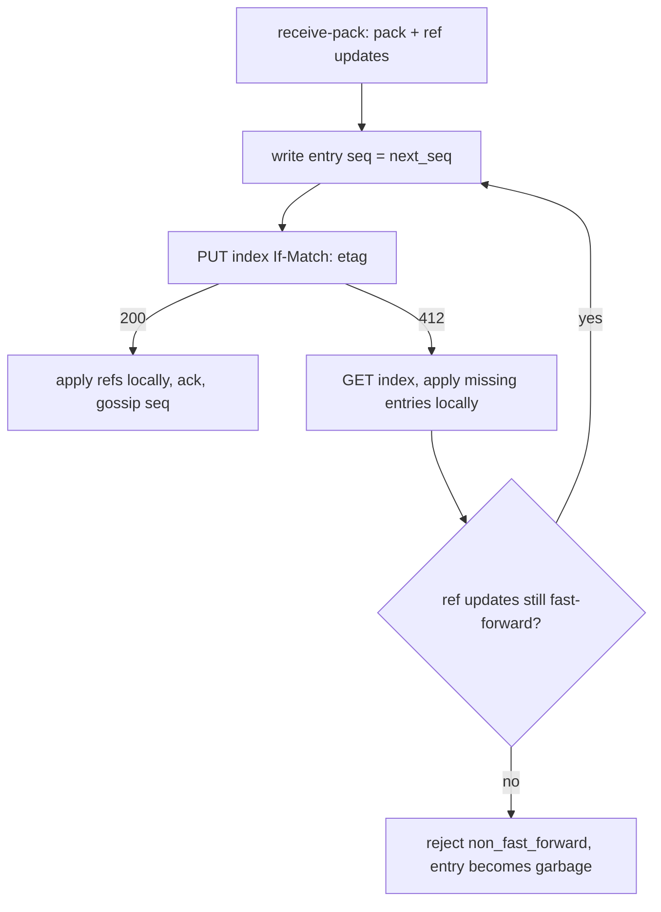

# Write-ahead log

## Overview

The log is the repository. Every push and every compaction is one entry
in object storage, and a small index object lists the entries and the
current references. A node applies entries into a local bare repository
to serve git, and that local copy is disposable. This spec fixes the entry
format, the index, the compare-and-swap that linearizes writes, and how a
node materializes and catches up.

## Current state

Spec 001 fixes the model. Object storage offers `PUT` with `If-Match` on
an ETag, which is the only primitive the design needs beyond `GET` and
`PUT`.

## Design

### Entry

`origo/repos/<id>/wal/<seq>.entry`, `seq` a zero-padded 12 digit decimal
assigned by the writer as `index.next_seq`. An entry is immutable once
written. Format, in order:

| Section | Content |
|---|---|
| header | JSON, one line: `{"v": 1, "kind": "push"\|"compact"\|"delete", "seq", "at", "subject", "actor", "pack_bytes", "pack_sha256"}` |
| refs | JSON, one line: the reference transaction `[{"ref", "old", "new"}]`, `old` `0000…` for a create, `new` `0000…` for a delete |
| pack | the packfile bytes exactly as received from the client (`push`) or produced by repack (`compact`); absent for `delete` |

A push whose packfile exceeds 2 GiB is written as several entries with a
`part` field and committed by the last; the index references the group.

### Index

`origo/repos/<id>/index`, JSON:

```json
{"v": 1, "next_seq": 1043, "refs": {"refs/heads/main": "<sha>", "HEAD": "ref: refs/heads/main"},
 "entries": [{"seq": 1040, "kind": "push", "pack_sha256": "…"}, …],
 "packs": ["packs/<hash>.pack"], "compacted_through": 1039, "size_bytes": 123456789}
```

`entries` lists every entry after `compacted_through`; earlier history is
represented by `packs`. The index is small by construction: compaction
(spec 006) folds entries into packs and truncates the list.

### Compare-and-swap



An orphaned entry (written, never indexed) is harmless: it is not in the
index, so no node applies it, and the sweeper of spec 006 deletes entries
above `next_seq` older than one hour. Two writers never produce the same
`seq` in the index because only one CAS succeeds per ETag.

### Materialization

A node that lacks `<id>` locally, or holds an older index, does:

1. `GET index` (conditional when a local ETag exists).
2. For each pack in `packs` not present locally, `GET` it into
   `objects/pack/` with its `.idx` (packs are stored with their index).
3. For each entry after the local sequence, `GET` the entry, verify
   `pack_sha256`, run `git index-pack --fix-thin` into `objects/pack/`,
   apply the reference transaction with `git update-ref --stdin`.
4. Record the index ETag and sequence in `origo.json` beside the
   repository.

Materialization is idempotent and resumable. A corrupt local repository
(failed `git fsck --connectivity-only` on a sampled check, or any git
error that names corruption) is deleted and rebuilt from the log; the log
is never repaired from a local copy.

### Serving git from the local copy

`upload-pack` runs against the local repository after the conditional
GET. `receive-pack` runs with a pre-receive hook that captures the pack
and the reference transaction instead of applying them, so the entry is
written and indexed before git's own update happens; the post-index
apply is `git update-ref --stdin` with the same transaction. Git
subprocesses run with `GIT_DIR` set, `core.protectNTFS` and
`receive.fsckObjects` on, and a per-request timeout.

### Deletion

`DELETE /v1/repos/{id}` writes a `delete` entry and sets
`index.deleted_at`. Nodes evict the local copy at once and answer 404. The
sweeper deletes every object under the prefix after the 7 day hold unless
`undelete` cleared `deleted_at`.

### Durability and sizes

| Value | Limit |
|---|---|
| single push | 2 GiB per entry part, 10 GiB total |
| repository | 50 GiB by default, per consumer authorizer response |
| index | 1 MiB; compaction runs before it can grow past this |
| entry write | acknowledged after object storage returns 200 with a matching ETag; `Content-MD5` set |

## Acceptance criteria

- A push produces one entry and one index update; killing the node
  between the two leaves no visible change and the sweeper removes the
  orphan.
- 100 concurrent pushes to distinct branches from 8 clients all land with
  the index listing 100 entries in some order and every ref correct.
- A node with an empty disk materializes a repository of 10 000 entries
  and 3 packs, and `git fsck` on the result passes.
- A local repository with a deliberately corrupted pack is rebuilt from
  the log and serves the same history.
- Fuzz tests on the entry header, the reference transaction, and the
  index parser find no panic in 10 minutes.
