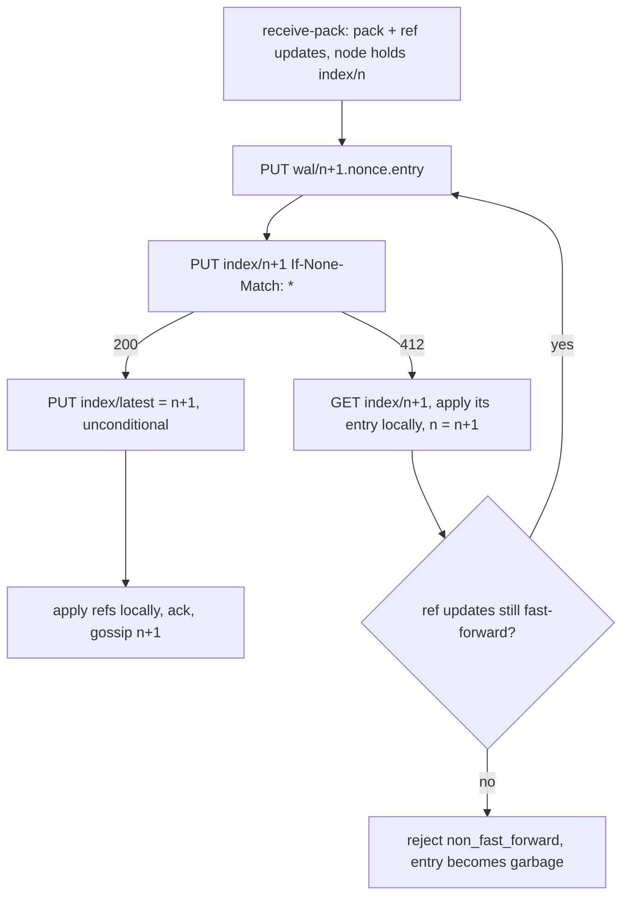

# Write-ahead log

## Overview

The log is the repository. Every push and every compaction is one entry
in object storage, and the index is a sequence of immutable objects, one
per committed entry, each holding the full reference map and what a
reader needs to serve the repository at that point. A node applies
entries into a local bare repository to serve git, and that local copy is
disposable. This spec fixes the entry format, the index objects, the
create-if-absent commit that linearizes writes, and how a node
materializes and catches up.

## Current state

Spec 001 fixes the model. The spike in
[docs/spikes/2026-09-06-conditional-writes.md](../docs/spikes/2026-09-06-conditional-writes.md)
ran the probe under `tools/spike/condwrite/` against MinIO and
DigitalOcean Spaces. MinIO honours every conditional primitive. Spaces
honours `PUT If-None-Match: *` (200 on an absent key, 412 on an existing
one, content untouched) and the conditional `GET` (304), and refuses `PUT
If-Match` with 412 on every one of 200 samples: 0 of 320 racing writers
got a 200. `CopyObject` conditions are ignored on both, and versioning
orders writes without refusing the loser. Decision: the index is not a
mutable object updated by `If-Match`. It is a sequence of immutable
objects `index/<seq>`, and a writer commits by creating the next one with
`If-None-Match: *`, which MinIO, Spaces, and AWS S3 all honour. The
probe's create race (20 rounds x 16 writers, exactly one 200 per round)
and the `HEAD` checks (404 on an absent key, 200 with the agreeing ETag on
a present one) were verified on MinIO and on Spaces with the current
build. The first draft's compare-and-swap on an ETag is kept in the
decision record and used nowhere.

## Decision record

| Option | Shape | Why not |
|---|---|---|
| One mutable index, `PUT If-Match: <etag>` | compare-and-swap on the ETag | Spaces answers 412 to every `If-Match` `PUT`; the primitive is not portable |
| `CopyObject` with a destination condition | write the candidate to a scratch key, copy it over the index under `If-Match` | MinIO and Spaces accept the header and ignore it: the copy overwrites |
| Versioned bucket, order by version | unconditional `PUT`, `ListObjectVersions` names the first | refuses no write; a loser learns it lost after its push was acknowledged |
| Immutable index objects, `PUT If-None-Match: *` on the next one | chosen: one create per commit, exactly one creator succeeds | honoured on every store the spike ran; one primitive, no ETag bookkeeping |

## Design

### Objects

Under `origo/repos/<id>/`:

| Key | Content |
|---|---|
| `wal/<seq>.<nonce>.entry` | one push, compaction, or delete: header, reference transaction, pack; immutable |
| `index/<seq>` | the state after entry `seq` is applied; immutable; created once by `If-None-Match: *` |
| `index/latest` | `{"seq": n}`, a hint written unconditionally after each commit; may lag, never leads correctness |
| `packs/<hash>.pack`, `.idx` | packs produced by compaction, named by the index objects that follow it |

`seq` is a zero-padded 12 digit decimal. Zero padding makes the keys sort
in sequence order under a listing.

### Entry

A writer that holds `index/<n>` writes its entry as `wal/<n+1>.<nonce>.entry`,
`nonce` 16 hex characters chosen at random by the writer. Two writers
that both hold `index/<n>` write two different keys, so a loser never
overwrites the winner's entry; the index object names the key it
committed. Format, in order:

| Section | Content |
|---|---|
| header | JSON, one line: `{"v": 1, "kind": "push"\|"compact"\|"delete", "seq", "at", "subject", "actor", "pack_bytes", "pack_sha256"}` |
| refs | JSON, one line: the reference transaction `[{"ref", "old", "new"}]`, `old` `0000…` for a create, `new` `0000…` for a delete |
| pack | the packfile bytes exactly as received from the client (`push`) or produced by repack (`compact`); absent for `delete` |

A push whose packfile exceeds 2 GiB is written as several entries with a
`part` field and committed by the last; the index object references the
group.

### Index object

`index/<n>` is the complete state after entry `n`:

```json
{"v": 1, "seq": 1043, "entry": "wal/000000001043.9f3c1a7be2d40c55.entry",
 "refs": {"refs/heads/main": "<sha>", "HEAD": "ref: refs/heads/main"},
 "entries": [{"seq": 1040, "key": "wal/000000001040.….entry", "kind": "push", "pack_sha256": "…"}, …],
 "packs": ["packs/<hash>.pack"], "compacted_through": 1039,
 "size_bytes": 123456789, "deleted_at": null}
```

`entries` lists every entry after `compacted_through` up to and
including `seq`; earlier history is represented by `packs`. The object is
small by construction: compaction (spec 006) folds entries into packs and
truncates the list. Each index object carries the whole reference map, so
a reader needs exactly one of them.

### Commit by create-if-absent



Linearization comes from create-if-absent alone: `index/<n+1>` is
created at most once, so exactly one writer holding `index/<n>` commits
entry `n+1`, and every other writer at `n` sees 412 and moves to `n+1`.
There is no ETag to track and no lock. Formally, for every `n` the
sequence of index objects is a total order because

$$\text{created}(index/n{+}1) \Rightarrow \neg\,\text{created by another writer}(index/n{+}1),$$

and every writer's precondition for creating `index/<n+1>` is holding
`index/<n>`, so the chain has no gaps.

A `PUT` whose response is lost in transport may have been applied. The
writer then reads `index/<n+1>`: if `entry` names its own key, it won and
continues at `D`; otherwise it lost and continues at `F`. An orphaned
entry (written, never named by an index object) is harmless: no node
applies it, and the sweeper of spec 006 deletes entries with `seq` at or
below the newest index that no index object names, and entries above the
newest index, once they are older than one hour.

`index/latest` may go backwards when two committers write it out of
order. It is a hint for cold starts and gossip-less nodes; a reader walks
forward from it.

### Currency check

A node that holds sequence `n` asks `HEAD index/<n+1>`:

- 404: the local copy is current. One round trip, no body.
- 200: a newer index exists. `GET index/<n+1>`, apply its entry, set
  `n = n+1`, and ask again.

The loop ends at the first 404. Gossip (spec 005) carries the newest
sequence between nodes so the common case is one `HEAD` that answers 404;
correctness never depends on gossip arriving. A node with no local
sequence reads `index/latest` for a starting point and walks forward; if
`index/<hint>` is missing (swept, or the hint lags), it lists `index/`
and takes the highest key.

### Materialization

A node that lacks `<id>` locally, or holds an older sequence, does:

1. Find the newest sequence with the currency check and `GET` that index
   object.
2. If the local sequence is below `compacted_through`, or there is no
   local copy, `GET` each pack in `packs` not present locally into
   `objects/pack/` with its `.idx` (packs are stored with their index).
3. For each listed entry above the local sequence, `GET` the entry by its
   key, verify `pack_sha256`, run `git index-pack --fix-thin` into
   `objects/pack/`, apply the reference transaction with
   `git update-ref --stdin`.
4. Record the sequence in `origo.json` beside the repository.

Materialization is idempotent and resumable. A corrupt local repository
(failed `git fsck --connectivity-only` on a sampled check, or any git
error that names corruption) is deleted and rebuilt from the log; the log
is never repaired from a local copy.

### Serving git from the local copy

`upload-pack` runs against the local repository after the currency
check. `receive-pack` runs with a pre-receive hook that captures the pack
and the reference transaction instead of applying them, so the entry is
written and committed before git's own update happens; the post-commit
apply is `git update-ref --stdin` with the same transaction. Git
subprocesses run with `GIT_DIR` set, `core.protectNTFS` and
`receive.fsckObjects` on, and a per-request timeout.

### Compaction and sweeping

Compaction (spec 006) commits the same way as a push: the primary writes
the new packs, writes a `compact` entry, and creates `index/<n+1>` whose
`packs` names the new packs, whose `compacted_through` is `n`, and whose
`entries` holds only the compaction entry. Readers at or above `n+1`
never touch the folded entries again.

The sweeper deletes index objects with `seq` below `compacted_through`
of the newest index once they are older than one hour, and always keeps
the newest 64 index objects. Folded entries are deleted on the same
schedule. A reader that holds a swept sequence is below
`compacted_through` and rebuilds from packs, which is step 2 above.

### Deletion

`DELETE /v1/repos/{id}` commits a `delete` entry whose index object sets
`deleted_at`. Nodes evict the local copy at once and answer 404. The
sweeper deletes every object under the prefix after the 7 day hold
unless a later index object cleared `deleted_at` (`undelete`).

### Durability and sizes

| Value | Limit |
|---|---|
| single push | 2 GiB per entry part, 10 GiB total |
| repository | 50 GiB by default, per consumer authorizer response |
| index object | 1 MiB; compaction runs before it can grow past this |
| entry write | acknowledged after object storage returns 200 with a matching ETag; `Content-MD5` set |
| commit | acknowledged after the create of `index/<n+1>` returns 200 |

## Acceptance criteria

- A push produces one entry and one index object; killing the node
  between the two leaves no visible change and the sweeper removes the
  orphan.
- 100 concurrent pushes to distinct branches from 8 clients all land,
  the newest index object lists 100 entries in sequence order, every ref
  is correct, and no two index objects share a sequence.
- 16 writers holding the same `index/<n>` race to create `index/<n+1>`:
  exactly one gets 200, the rest get 412, and the stored object is the
  winner's, over 20 rounds. The probe under `tools/spike/condwrite/`
  measures this.
- The design runs unchanged on MinIO and DigitalOcean Spaces: the
  probe's create race, `HEAD` 404, and `GET` 304 rows pass on both, and
  the conformance suite (spec 013) passes against both.
- A node holding `index/<n>` whose `HEAD index/<n+1>` answers 404 serves
  references equal to `index/<n>`; after another node commits `n+1`, the
  next `HEAD` answers 200 and the node serves `index/<n+1>`.
- A node with an empty disk materializes a repository of 10 000 entries
  and 3 packs, and `git fsck` on the result passes.
- A local repository with a deliberately corrupted pack is rebuilt from
  the log and serves the same history.
- Fuzz tests on the entry header, the reference transaction, and the
  index parser find no panic in 10 minutes.
