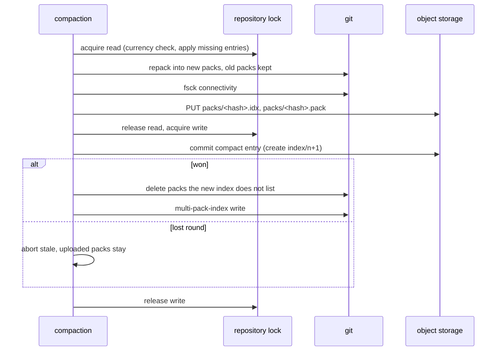

# Compaction

## Overview

A repository that receives many pushes accumulates many small entries.
Serving a fetch from thousands of thin packs is slow and materializing
from them slower. Compaction repacks on one node and records the result
as a log entry, so every other node downloads packs instead of
repacking.

## Current state

Spec 004 stores entries and lists packs in the index: `wal.Entry` has
`Kind: compact`, `Packs`, and `CompactedThrough`; `Log.Commit` builds
the index object for one (`packs` replaced, `entries` reset to the
compaction entry, `compacted_through` set); `repo.Cache.Apply` fetches
listed packs (`TestCompactionPacksAreFetched`); the sweeper deletes
folded entries, and index objects below `compacted_through`, which the
Truncation section below removes. Nothing produces a compaction entry:
`internal/compact` does not exist.

## Design

### Trigger

The first name in `Origo-Prefer` for a repository (spec 005) is its
compaction primary; with one node, every repository's primary is that
node. Every node checks the thresholds after every push it serves,
against the newest index the commit produced:

| Condition | Threshold |
|---|---|
| entries since compaction | `len(entries) > 64` |
| bytes of those entries | sum of `pack_bytes` over `entries` > 256 MiB |
| size of the index object | > 512 KiB |

The byte threshold reads `pack_bytes` off each row of the index
object's `entries` list (spec 004, Index object), which is what the
index carries for it: `size_bytes` is the listed packs plus that sum
and cannot be split back into the two, and summing the entry headers
instead would cost one `GET` per entry on every push.

When any of them holds, the primary schedules the compaction in the
background and returns; a node that is not the primary creates the
request object `origo/gc/<id>` below and returns. The request never
waits for either. The primary also runs a sweep every 10 minutes that
checks the thresholds over the repositories it holds locally and lists
`origo/gc/`, so a repository pushed to through other nodes is found
whether or not the primary holds it. `compact.Manager.GC` is the
method spec 019's endpoint calls, and it answers one of three results:
`Ran` with the before and after figures, `Running` with `started_at`,
or `Primary` on a node that is not the primary. The endpoint's request
and response shape, its rate limit, and its event are spec 019's. At
most one compaction per
repository runs on a node at a time: a trigger that finds one running
is a no-op, and the sweep starts the next one. A node that is not the
primary never compacts; it only downloads packs and writes requests.
Two primaries after a placement change are harmless: create-if-absent
lets one commit and the other aborts.

This spec owns compaction wherever it is asked for. The request object
`origo/gc/<id>` holds `{"requested_at", "node", "reason"}` with
`reason` `threshold` or `gc`; an existing one is left alone whichever
reason arrives second. It is written by a node that is not the primary
in two cases: after a push it served crossed a threshold, and on `POST
/v1/repos/{id}/gc` (spec 019), which on such a node forwards nothing
and compacts nothing and answers 202 naming the primary in the body's
`details`. On the primary, `gc` starts the procedure below at once,
whatever the thresholds say, and waits for it at most 10 seconds: a run
that finishes inside them is answered 200 with the before and after
figures of spec 019, and one still running at 10 seconds, or one that
was already running when the request arrived, is answered 202 with
`details.running: true` and `details.started_at`, the start time of the
run in progress, which the caller polls with `stats` (spec 019). The
bound exists because a full repack takes up to the 30 minute deadline
and every ingress cuts an idle response before that: the `kind`
example overlay's ingress carries a 600 second read timeout (spec 018)
and an operator's may be shorter, so `gc` never blocks longer than 10
seconds whatever sits in front of the node. A threshold compaction and a `gc` are the same run.
The hourly limit of spec 019 refuses only `POST /v1/repos/{id}/gc`: a
threshold run is never rate-limited, and either kind of run counts as
the compaction that makes the next `gc` inside the hour a 429. The primary's
10 minute sweep lists `origo/gc/`, usually empty, and for every id whose
primary it is materializes the repository if it does not hold it
(`Acquire`, which step 1 does anyway), runs the procedure, and deletes
the request object; the sweep on a node that is not the primary of a
listed id leaves it. A request is therefore acted on within 10 minutes
while the primary is up; the compaction sweep on any node deletes a
request object older than 24 hours, which only a primary that never
ran leaves behind, and the next push through any node writes a fresh
one. Any node's sweep also drops the request of a repository the log
no longer holds: a purge (spec 004) removes the repository and leaves
the request under `origo/gc/`, where it would otherwise fail one run
per sweep for a whole day.

### Procedure

`internal/compact.Run(repo)` on the primary, under its own deadline of
30 minutes for the whole run (the repack subprocess runs with that
deadline rather than the 5 minutes of spec 004, which spec 012 records).
Every git subprocess of the run takes a slot of the node's subprocess
semaphore through `compact.Slots`, the seam spec 012 wires
`ORIGO_MAX_GIT_PROCS` into; a node passes nil until that spec lands and
the run takes no slot. A run that waits more than 5 seconds for a slot
skips this run with `origo_compactions_total{result="skipped"}` and the
next sweep retries it:

1. `Acquire` the repository for reading, which runs the currency check
   and applies every missing entry; hold `index/<n>`. The read lock
   keeps eviction and a rebuild away from the directory; fetches share
   it. The cache's lock is a `sync.RWMutex`, so a push that arrives
   while the repack runs waits for the write lock, and readers that
   arrive after that push queue behind it. That wait is bounded by the
   next step, not by the 30 minute deadline.
2. `git repack --geometric=2 --write-midx --write-bitmap-index` without
   `-d`: it writes new packs that fold the small ones into geometrically
   sized ones, leaves large packs alone, and deletes nothing, so every
   pack the held index lists is still on disk. After a compaction gap of
   at most 64 thin entries this is seconds; a full repack happens once,
   after an import (spec 019) or a first compaction of a large history.
3. `git fsck --connectivity-only --no-progress`; a failure aborts with
   `origo_compactions_total{result="error"}` and the copy is evicted for
   rebuild (spec 004). The eviction happens after the run releases the
   read lock, not inside this step: evicting takes the write lock, so
   evicting under the read lock the run holds would deadlock.
4. The run's pack set is what the multi-pack index of step 2 names,
   read from its `PNAM` chunk: a repack without `-d` leaves every
   superseded pack on disk on purpose, and the multi-pack index names
   exactly the packs it left current, the new ones and the large ones
   the geometric roll-up left alone. Upload every pack of that set the
   held index does not already list, with its `.idx`, under the log key
   the mapping of spec 004 gives its file name (`pack-<hash>.pack` is
   `packs/<hash>.pack`); the `.idx` first so a reader never sees a pack
   without one. A pack the held index already lists is carried into the
   new list without being uploaded again, which is what keeps the list
   small over many runs.
5. Release the read lock and take the write lock; a push that landed in
   between has advanced the local sequence, and `Log.Commit` sees it in
   the next step. Commit a `compact` entry with an empty transaction, no
   pack, `Packs` = the packs of step 2 (the new ones and the large ones
   left alone), `PacksBytes` = the bytes of those `.pack` files, and
   `CompactedThrough = n`, through `Log.Commit`; the commit sets the
   index's `size_bytes` to `PacksBytes` (spec 004), so after a
   compaction the figure is what the log holds and the next push adds
   its own pack bytes to it. The catch-up callback refuses: a lost round means a push landed after
   step 1, and a replay would produce an index whose `entries` no longer
   names that push. The compaction aborts with `result="stale"`, its
   entry becomes an orphan the sweeper removes, the uploaded packs stay
   for the next run, the write lock is released, and the primary starts
   again from step 1 at the next trigger.
6. On success, still under the write lock, swap the pack list: delete
   the packs under `objects/pack/` that the new index does not list
   (`git repack -d` semantics, done by the node so the set on disk equals
   the index) and run `git multi-pack-index write --bitmap`, so the
   multi-pack index names exactly the packs on disk and the bitmap of
   step 2 is rebuilt over them. A failure of this step is a warning and
   not a failure of the run: the log is already correct when the commit
   returns, so a failed swap leaves the copy holding packs the index
   does not list, which the next run's repack folds and this step then
   removes, and answering the caller an error would say the compaction
   did not happen. Release the write lock, `result="ok"`,
   `origo_compaction_seconds` observed, and the truncation below removes
   what the compaction folded.

### Truncation

Truncation is what makes a compaction pay: the entries it folded and
the packs it superseded stop costing storage. It removes those two
kinds of object and nothing else, once each is older than
`ORIGO_SWEEP_MIN_AGE`:

| Object | Removed |
|---|---|
| an entry with `seq` at or below `compacted_through` of the newest index | yes, folded into the compaction's packs |
| a pack under `packs/` that the newest index does not list | yes; the age lets a node that started materializing on the previous index finish |
| an index object | never, whatever `compacted_through` says |

An index object is never removed because the currency check is `HEAD
index/<n+1>` and a 404 means current. A warm node holding `index/<n>`
below a truncation point would read the 404 left by a deleted
`index/<n+1>` as proof that its copy is current and would serve stale
references for as long as it held the copy. Keeping the objects is the
cheaper side of the trade: an index object is one small object per
push, bounded by 1 MiB (spec 004), against a check that would otherwise
need a second round trip or a mutable marker. Spec 004's Sweeper table
carries the same three rows; this spec's builder removes the index rule
from `internal/wal/sweep.go`, which implements it today and which
nothing reaches because `compacted_through` is 0 until this spec lands,
and with it the `Indexes` count of `SweepReport` and the two assertions
on it in `TestSweepRemovesOrphansAndKeepsWhatAnIndexNames`, which pass
against the old rule.

### Invariants

Compaction never changes a reference and never drops a reachable
object: the transaction is empty, the reference map is copied, and step 3
proves connectivity before anything is uploaded. It commits by the same
create-if-absent as a push, so a push and a compaction never interleave
in the index and the index stays a total order. Compaction does not
prune loose objects: `git repack` without `-d` and without `-A`
leaves every loose object under `objects/` in place, so an unreachable
loose object (a server-side operation of spec 020 that ran out of
budget) is removed only by eviction (spec 005) or a rebuild (spec 004)
of the copy, never by a compaction.

### Cost

Compaction is CPU on one node and upload bandwidth once; replicas trade
bandwidth for CPU. The tuning target is a repository receiving 100 pushes
per minute staying under 100 entries with its fetch latency flat.

## Not in this spec

Repacking on a node other than the primary. Compacting LFS objects.
`origo_orphan_objects` accounting (spec 019). The `gc` endpoint's
request and response shape, rate limit, and event (spec 019).

## Acceptance criteria

- After 500 pushes of 1 KiB commits to one repository through node 1
  of spec 013's ports table and after the background run the last
  threshold crossing scheduled completes, the newest index lists at
  most 64 entries and at most 6 packs, and `git fsck` passes on the
  copy a clone through node 2 of that table materializes. The wait for
  that run pushes once every 15 seconds, which is what the next push on
  a live repository does: under a push storm the run in flight when the
  last push lands is the one that push overtakes, so it ends `stale`
  and nothing after it scheduled a run, and the repository would
  otherwise sit until the primary's 10 minute sweep. The pushes the
  wait adds are why the history check compares the clone against the
  working copy rather than a count of 500 (proposed:
  `test/e2e`,
  `TestClusterFiveHundredPushesStayUnder64EntriesAnd6Packs`, in the
  `e2e` job of spec 013 against its stack and not in the unit suite the
  gate runs, because 500 pushes through the real git take minutes; the
  unit suite covers the procedure with a fixture of 65 entries written
  through `Log.Commit`, `internal/compact`, `TestThresholdFoldsEntries`).
- A push that lands between step 1 and step 5 makes the compaction
  abort with `result="stale"`, the push is in the newest index, and the
  next run folds it (proposed: `internal/compact`,
  `TestPushDuringCompactionIsPreserved`).
- The after-push trigger returns before the compaction starts, a second
  trigger while one runs starts none, a `gc` while one runs answers 202
  with `details.running: true` and the run's start time within 10
  seconds, and a clone served during step 2 succeeds (proposed:
  `internal/compact`, `TestTriggerIsBackgroundAndSingle`).
- A `gc` request on a node that is not the primary creates
  `origo/gc/<id>`, answers 202 naming the primary, and the primary's
  sweep compacts within one sweep interval and deletes the request
  object with a fake clock (proposed: `internal/compact`,
  `TestGcRequestIsPickedUpByThePrimary`).
- 65 pushes to one repository through a node that is not its primary,
  the primary holding no copy, leave `origo/gc/<id>` with `reason:
  "threshold"` after the 65th, and the primary's next sweep
  materializes the repository, compacts it to at most 64 entries, and
  deletes the request object (proposed: `internal/compact`,
  `TestPushOnANonPrimaryRequestsCompaction`).
- A node that read the previous index before compaction and fetches its
  entries after it completes materializes successfully as long as the
  entries are younger than `ORIGO_SWEEP_MIN_AGE` (proposed:
  `internal/compact`, `TestDelayedReaderSurvivesCompaction` with a fake
  clock).
- A pack no index lists is deleted by the sweeper after
  `ORIGO_SWEEP_MIN_AGE` and one that the newest index lists is kept
  (proposed: `internal/wal`, `TestSweepRemovesUnlistedPacks`).
- After a compaction that folds 70 entries, every index object of the
  repository is still in the log, however old and however far below
  `compacted_through`, and a node holding one of them learns it is
  behind: the currency check on the held sequence answers 200 and not
  the 404 a deleted successor would leave (`internal/wal`,
  `TestSweepRemovesOrphansAndKeepsWhatAnIndexNames` for the sweeper
  half; `internal/compact`,
  `TestHolderOfAFoldedSequenceSeesTheNewerIndex` for the holder's
  check, in the package the compaction that makes it reachable lives
  in).
- Fetch latency of a 20 MiB repository after 200 pushes is within 25%
  of its latency after 10 pushes, measured as the p50 of 10 clones each
  through node 1 of spec 013's ports table, asserted on every push to
  `main` (proposed: `test/e2e`,
  `TestClusterCompactionKeepsFetchLatencyFlat`, in the `e2e` job of
  spec 013). The figures are the Design's tuning target scaled to that
  job's 30 minute budget, which already carries the 500 push test;
  `TestMeasure` under `ORIGO_E2E_MEASURE=1` runs the same routine on a
  1 GiB fixture and 1 000 pushes and asserts nothing.

## Outcome

Built on 2026-09-08 in seven commits: the `pack_bytes` row on the log,
the sweeper rules, `internal/compact` with the procedure, the request
objects and the sweep, the threshold check on the node after every
push, the trigger on the receive path, and the stack tests.

| Criterion | Test |
|---|---|
| 500 pushes through node 1 leave at most 64 entries and at most 6 packs, and a clone through node 2 passes `git fsck` | `test/e2e`, `TestClusterFiveHundredPushesStayUnder64EntriesAnd6Packs` (`e2e` job); `internal/compact`, `TestThresholdFoldsEntries` for the unit half |
| a push between step 1 and step 5 aborts the run with `result="stale"`, is in the newest index, and the next run folds it | `internal/compact`, `TestPushDuringCompactionIsPreserved` |
| the trigger returns before the run, a second trigger starts none, a `gc` answers `running` with the start time, and a clone during the repack succeeds | `internal/compact`, `TestTriggerIsBackgroundAndSingle`, `TestGcOnThePrimaryRunsAndReportsFigures`; `internal/httpgit`, `TestPushTriggersTheCompactionCheck` |
| a `gc` on a node that is not the primary writes `origo/gc/<id>`, answers with the primary, and the primary's sweep compacts and deletes the request | `internal/compact`, `TestGcRequestIsPickedUpByThePrimary` |
| 65 pushes through a node that is not the primary leave `origo/gc/<id>` with `reason: "threshold"`, and the primary, holding no copy, materializes and folds them | `internal/compact`, `TestPushOnANonPrimaryRequestsCompaction` |
| a node that read the previous index materializes after the compaction while the entries are younger than `ORIGO_SWEEP_MIN_AGE` | `internal/compact`, `TestDelayedReaderSurvivesCompaction` |
| a pack no index lists is swept after `ORIGO_SWEEP_MIN_AGE` and a listed one is kept | `internal/wal`, `TestSweepRemovesUnlistedPacks` |
| no index object is ever swept, and a holder of a folded sequence learns it is behind | `internal/wal`, `TestSweepRemovesOrphansAndKeepsWhatAnIndexNames`; `internal/compact`, `TestHolderOfAFoldedSequenceSeesTheNewerIndex` |
| fetch latency after many pushes is within 25% of its latency after 10 | `test/e2e`, `TestClusterCompactionKeepsFetchLatencyFlat` (`e2e` job); `TestMeasure` under `ORIGO_E2E_MEASURE=1` for the 1 GiB fixture |
| a run that waits more than 5 seconds for a subprocess slot skips (spec 012) | `internal/compact`, `TestCompactionSkipsWhenNoSlot` |

The Truncation section was written against the rule this builder
implemented, so the design and the tree agree: truncation removes the
folded entries and the packs no index lists, and an index object is
never removed. That closes spec 005's open item, the 404 currency check
under a swept index object. `internal/wal/sweep.go` lost its index
rule, the `Indexes` count of `SweepReport`, and the two assertions on
it, and spec 004's Sweeper table carries the same rows.

Divergences from the first draft, each kept, with the reason; the
Design above states each as the rule, so a reader finds one answer:

- **The index row carries `pack_bytes`, which the byte threshold
  sums.** The first draft's index object carried no such figure:
  `size_bytes` is that
  sum plus the listed packs and cannot be split back into the two, and
  reading each entry's header to sum them would cost one `GET` per
  entry on every push. `wal.IndexEntry.PackBytes` and
  `Index.EntriesBytes` are new; the field is omitted on a row with no
  pack and an index object written before it existed reads as 0, so
  nothing in the tree has to be rewritten. Spec 004's Outcome records
  it.
- **The pack set of a run is what the multi-pack index names.** The
  first draft uploaded every pack under `objects/pack/` the held index
  did not list, which after a repack without `-d` is every superseded
  pack as well: `git repack` leaves them on disk on purpose. The
  multi-pack index the same repack wrote names exactly the packs it
  left current, the new ones and the large ones the geometric roll-up
  left alone, so the run reads its `PNAM` chunk (`internal/compact/midx.go`).
  A pack the held index already lists is carried into the new list
  without being uploaded again, which is what keeps the list small over
  many runs (`TestASecondRunCarriesTheLargePackForward`).
- **A run that fails the connectivity check evicts the copy after it
  releases the read lock.** The first draft evicted inside step 3;
  evicting takes the write lock, so doing it there deadlocks against
  the read lock the run holds. The run releases
  first and evicts then, which is the same outcome one lock ordering
  later (`TestRunFailuresAreCountedAndReported`).
- **A request object for a repository the log no longer holds is
  deleted by any node's sweep**, beside the 24 hour rule the first
  draft gave. A purge (spec 004) removes the repository and leaves the
  request under `origo/gc/`, where it would fail one run per sweep for
  a whole day (`TestSweepReportsStoreFailures`).
- **A failed pack swap in step 6 is a warning, not a failure of the
  run.** The log is already correct
  when the commit returns, so a failed pack swap on disk leaves the
  copy holding packs the index does not list, which the next run's
  repack folds and this step then removes. Answering the caller an
  error would say the compaction did not happen.
- **The subprocess semaphore is the `compact.Slots` seam.** Spec 012
  owns `ORIGO_MAX_GIT_PROCS` and had not landed, so the manager takes a
  slot through an interface a node passes nil for today;
  `TestCompactionSkipsWhenNoSlot` drives it with a semaphore that
  grants nothing, and spec 012 wires the real one.
- **`GC` is a method, not an endpoint.** The endpoint's shape, its rate
  limit, and the `compacted` event are spec 019's, as the Not in this
  spec section says; `compact.Manager.GC` answers what spec 019's
  handler needs (`Ran` with the before and after figures, `Running`
  with `started_at`, or `Primary` on a node that is not the primary).
- **The stack criteria's wait pushes between rounds.** Under a push
  storm the run in flight when the last push lands is the one that push
  overtakes, so it ends `stale` and no push after it scheduled
  anything: the repository is left with no run pending until the
  primary's ten minute sweep, which is longer than the test's patience.
  `waitForCompaction` pushes once every 15 seconds while it waits,
  which is what the next push on a live repository does, and the
  criterion's "after the background run the last threshold crossing
  scheduled completes" is met either way. The pushes it adds are why
  the criterion's history check compares the clone against the working
  copy rather than a count of 500.
- **The fetch-latency criterion runs on 20 MiB and 200 pushes**, not the
  1 000 pushes of the Design's tuning target, because the `e2e` job's
  30 minute budget already carries the 500 push test. `TestMeasure`
  runs the same routine on a 1 GiB fixture and 1 000 pushes and asserts
  nothing, which the criterion names.

One item this spec closes for another:

- Spec 004's ninth criterion needed the packs a compaction produces;
  they exist now, and `TestSlowMaterializeTenThousandEntries` stays
  spec 004's to write in spec 013's `e2e-slow` job. Spec 004's Outcome
  records it.

Items for other specs:

- Spec 012: `compact.Slots` is the seam for `ORIGO_MAX_GIT_PROCS`, and
  `TestCompactionSkipsWhenNoSlot` is in `internal/compact` as the
  decisions table says.
- Spec 019: `compact.Manager.GC`, `compact.Figures`, and
  `compact.Manager.Primary` are what the `gc` endpoint and `stats`
  need; `compacted_at` is the `at` of the newest `compact` entry the
  index names.
- Spec 011: nothing. `origo_compactions_total{result}` and
  `origo_compaction_seconds` were already in `internal/metrics`, so
  `internal/compact` records through the `metrics.Set` handles and
  registers no series of its own.
- `latere.ai/x/pkg`: nothing new was needed. `pkg/wait` is the sweep's
  ticker; the multi-pack index parser is git's own format and belongs
  in this repository, not in a generic package.

The two stack criteria are proved by the `e2e` job of spec 013; the
kind stack cannot run on this machine. That job is green on `main` at
`ef6d945` (run 34257319187), with every other job, and the spec is
complete. The `build` and `race` jobs of the first attempt failed on
the module proxy answering `INTERNAL_ERROR` to two downloads and were
re-run.
