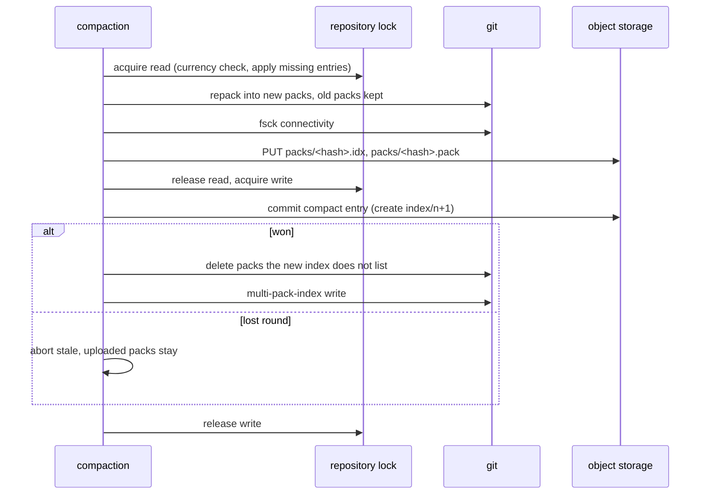

# Compaction

## Overview

A repository that receives many pushes accumulates many small entries.
Serving a fetch from thousands of thin packs is slow and materializing
from them slower. Compaction repacks on one node and records the result
as a log entry, so every other node downloads packs instead of
repacking.

## Current state

Spec 004 stores entries and lists packs in the index: `wal.Entry` has
`Kind: compact`, `Packs`, and `CompactedThrough`; `Log.Commit` builds
the index object for one (`packs` replaced, `entries` reset to the
compaction entry, `compacted_through` set); `repo.Cache.Apply` fetches
listed packs (`TestCompactionPacksAreFetched`); the sweeper deletes
folded entries and superseded index objects. Nothing produces a
compaction entry: `internal/compact` does not exist.

## Design

### Trigger

The first name in `Origo-Prefer` for a repository (spec 005) is its
compaction primary; with one node, every repository's primary is that
node. Every node checks the thresholds after every push it serves,
against the newest index the commit produced:

| Condition | Threshold |
|---|---|
| entries since compaction | `len(entries) > 64` |
| bytes of those entries | sum of `pack_bytes` over `entries` > 256 MiB |
| size of the index object | > 512 KiB |

When any of them holds, the primary schedules the compaction in the
background and returns; a node that is not the primary creates the
request object `origo/gc/<id>` below and returns. The request never
waits for either. The primary also runs a sweep every 10 minutes that
checks the thresholds over the repositories it holds locally and lists
`origo/gc/`, so a repository pushed to through other nodes is found
whether or not the primary holds it. At most one compaction per
repository runs on a node at a time: a trigger that finds one running
is a no-op, and the sweep starts the next one. A node that is not the
primary never compacts; it only downloads packs and writes requests.
Two primaries after a placement change are harmless: create-if-absent
lets one commit and the other aborts.

This spec owns compaction wherever it is asked for. The request object
`origo/gc/<id>` holds `{"requested_at", "node", "reason"}` with
`reason` `threshold` or `gc`; an existing one is left alone whichever
reason arrives second. It is written by a node that is not the primary
in two cases: after a push it served crossed a threshold, and on `POST
/v1/repos/{id}/gc` (spec 019), which on such a node forwards nothing
and compacts nothing and answers 202 naming the primary in the body's
`details`. On the primary, `gc` starts the procedure below at once,
whatever the thresholds say, and waits for it at most 10 seconds: a run
that finishes inside them is answered 200 with the before and after
figures of spec 019, and one still running at 10 seconds, or one that
was already running when the request arrived, is answered 202 with
`details.running: true` and `details.started_at`, the start time of the
run in progress, which the caller polls with `stats` (spec 019). The
bound exists because a full repack takes up to the 30 minute deadline
and every ingress cuts an idle response before that: the ingress of
`deploy/base` carries a 600 second read timeout and an operator's may be
shorter, so `gc` never blocks longer than 10 seconds whatever sits in
front of the node. A threshold compaction and a `gc` are the same run
and both count toward the hourly `gc` limit of spec 019. The primary's
10 minute sweep lists `origo/gc/`, usually empty, and for every id whose
primary it is materializes the repository if it does not hold it
(`Acquire`, which step 1 does anyway), runs the procedure, and deletes
the request object; the sweep on a node that is not the primary of a
listed id leaves it. A request is therefore acted on within 10 minutes
while the primary is up; the compaction sweep on any node deletes a
request object older than 24 hours, which only a primary that never
ran leaves behind, and the next push through any node writes a fresh
one.

### Procedure

`internal/compact.Run(repo)` on the primary, under its own deadline of
30 minutes for the whole run (the repack subprocess runs with that
deadline rather than the 5 minutes of spec 004, which spec 012 records).
Every git subprocess of the run takes a slot of the subprocess
semaphore of spec 012; a run that waits more than 5 seconds for a slot
skips this run with `origo_compactions_total{result="skipped"}` and the
next sweep retries it:

1. `Acquire` the repository for reading, which runs the currency check
   and applies every missing entry; hold `index/<n>`. The read lock
   keeps eviction and a rebuild away from the directory; fetches share
   it. The cache's lock is a `sync.RWMutex`, so a push that arrives
   while the repack runs waits for the write lock, and readers that
   arrive after that push queue behind it. That wait is bounded by the
   next step, not by the 30 minute deadline.
2. `git repack --geometric=2 --write-midx --write-bitmap-index` without
   `-d`: it writes new packs that fold the small ones into geometrically
   sized ones, leaves large packs alone, and deletes nothing, so every
   pack the held index lists is still on disk. After a compaction gap of
   at most 64 thin entries this is seconds; a full repack happens once,
   after an import (spec 019) or a first compaction of a large history.
3. `git fsck --connectivity-only --no-progress`; a failure aborts with
   `origo_compactions_total{result="error"}` and the copy is evicted for
   rebuild (spec 004).
4. Upload every pack now under `objects/pack/` that the held index does
   not list, with its `.idx`, under the log key the mapping of spec 004
   gives its file name (`pack-<hash>.pack` is `packs/<hash>.pack`); the
   `.idx` first so a reader never sees a pack without one.
5. Release the read lock and take the write lock; a push that landed in
   between has advanced the local sequence, and `Log.Commit` sees it in
   the next step. Commit a `compact` entry with an empty transaction, no
   pack, `Packs` = the packs of step 2 (the new ones and the large ones
   left alone), and `CompactedThrough = n`, through `Log.Commit`. The
   catch-up callback refuses: a lost round means a push landed after
   step 1, and a replay would produce an index whose `entries` no longer
   names that push. The compaction aborts with `result="stale"`, its
   entry becomes an orphan the sweeper removes, the uploaded packs stay
   for the next run, the write lock is released, and the primary starts
   again from step 1 at the next trigger.
6. On success, still under the write lock, swap the pack list: delete
   the packs under `objects/pack/` that the new index does not list
   (`git repack -d` semantics, done by the node so the set on disk equals
   the index) and run `git multi-pack-index write --bitmap`, so the
   multi-pack index names exactly the packs on disk and the bitmap of
   step 2 is rebuilt over them. Release the write lock, `result="ok"`,
   `origo_compaction_seconds` observed, and the sweeper (spec 004)
   deletes the folded entries and the superseded index objects once
   they are older than `ORIGO_SWEEP_MIN_AGE`.

The sweeper gains one rule: a pack under `packs/` that the newest index
does not list and that is older than `ORIGO_SWEEP_MIN_AGE` is deleted.
The age keeps a node that started materializing on the previous index
able to finish.

### Invariants

Compaction never changes a reference and never drops a reachable
object: the transaction is empty, the reference map is copied, and step 3
proves connectivity before anything is uploaded. It commits by the same
create-if-absent as a push, so a push and a compaction never interleave
in the index and the index stays a total order.

### Cost

Compaction is CPU on one node and upload bandwidth once; replicas trade
bandwidth for CPU. The tuning target is a repository receiving 100 pushes
per minute staying under 100 entries with its fetch latency flat.

## Not in this spec

Repacking on a node other than the primary. Compacting LFS objects.
`origo_orphan_objects` accounting (spec 019). The `gc` endpoint's
request and response shape, rate limit, and event (spec 019).

## Acceptance criteria

- After 500 pushes of 1 KiB commits to one repository through one node,
  the newest index lists at most 64 entries and at most 6 packs, and
  `git fsck` passes on a fresh node's copy (proposed: `test/e2e`,
  `TestE2EFiveHundredPushesStayUnder64EntriesAnd6Packs`, a test of the
  one-node run of spec 013 and not of the unit suite the gate runs,
  because 500 pushes through the real git take minutes; the unit suite
  covers the procedure with a fixture of 65 entries written through
  `Log.Commit`, `internal/compact`, `TestThresholdFoldsEntries`).
- A push that lands between step 1 and step 5 makes the compaction
  abort with `result="stale"`, the push is in the newest index, and the
  next run folds it (proposed: `internal/compact`,
  `TestPushDuringCompactionIsPreserved`).
- The after-push trigger returns before the compaction starts, a second
  trigger while one runs starts none, a `gc` while one runs answers 202
  with `details.running: true` and the run's start time within 10
  seconds, and a clone served during step 2 succeeds (proposed:
  `internal/compact`, `TestTriggerIsBackgroundAndSingle`).
- A `gc` request on a node that is not the primary creates
  `origo/gc/<id>`, answers 202 naming the primary, and the primary's
  sweep compacts within one sweep interval and deletes the request
  object with a fake clock (proposed: `internal/compact`,
  `TestGcRequestIsPickedUpByThePrimary`).
- 65 pushes to one repository through a node that is not its primary,
  the primary holding no copy, leave `origo/gc/<id>` with `reason:
  "threshold"` after the 65th, and the primary's next sweep
  materializes the repository, compacts it to at most 64 entries, and
  deletes the request object (proposed: `internal/compact`,
  `TestPushOnANonPrimaryRequestsCompaction`).
- A node that read the previous index before compaction and fetches its
  entries after it completes materializes successfully as long as the
  entries are younger than `ORIGO_SWEEP_MIN_AGE` (proposed:
  `internal/compact`, `TestDelayedReaderSurvivesCompaction` with a fake
  clock).
- A pack no index lists is deleted by the sweeper after
  `ORIGO_SWEEP_MIN_AGE` and one that the newest index lists is kept
  (proposed: `internal/wal`, `TestSweepRemovesUnlistedPacks`).
- Fetch latency of a 100 MiB repository after 1 000 pushes is within
  10% of its latency after 10 pushes, measured as the p50 of 10 clones
  each, asserted on every push to `main` (proposed: `test/e2e`,
  `TestE2ECompactionKeepsFetchLatencyFlat`, a plain test of the one-node
  run; the fixture is sized so the test fits the job budget of spec
  013, and `TestMeasure` under `ORIGO_E2E_MEASURE=1` prints the same
  figures for a 1 GiB fixture without asserting them).
