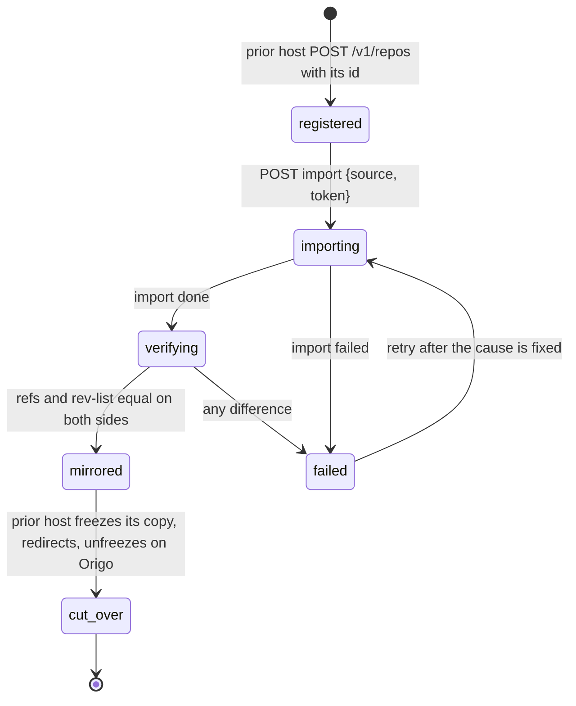

# Migration of existing repositories from a prior host

## Overview

An operator adopting Origo has repositories somewhere else: another git
host, a file server holding bare repositories, or a product that stored
each repository as a directory. Migration moves every one of them into
Origo without a remote breaking, without a push lost, and with proof
that the history is identical. This spec fixes the migration protocol on
Origo's side: how a batch of repositories is imported, how the prior
host keeps serving old URLs, how writes are cut over, and how the result
is verified. What the prior host does with its own records is its own
spec; this one names only what it must call.

At Latere the prior host is the data plane product, which holds each
repository as a workspace with a `.git` directory in its file plane,
served over smart HTTP with a single-writer lock shared with sandbox
mounts. The design below is written for any prior host and uses that one
as the worked example.

## Current state

Spec 019 defines `POST /v1/repos/{id}/import` for one repository from an
HTTPS source with a bearer, resumable through `GET /v1/repos/{id}/import`,
refusing pushes while it runs, and emitting `imported`. Spec 007 lets the
prior host act for its users with the `act` claim. Nothing coordinates
many imports, a cut-over, or a verification against the source.

## Design

### Roles

| Role | Held by | Does |
|---|---|---|
| prior host | the system being migrated from | serves the old clone URLs, owns the repository records, runs the authorizer for the migrated repositories, calls Origo's API |
| Origo | this component | imports, verifies, serves the new URLs, emits events |
| operator | a person | runs the migration command, watches the report, decides the cut-over |

Origo has no notion of "the prior host" beyond a source URL and a
bearer per repository; the prior host is a consumer like any other.

### Phases per repository



| Phase | Origo | Prior host |
|---|---|---|
| registered | `POST /v1/repos` with the prior host's id for the repository, so the id never changes across the migration (spec 003) | records the Origo repository id on its own record |
| importing | `POST /v1/repos/{id}/import` from the prior host's clone URL with a bearer the prior host mints for Origo (spec 019: 256 MiB batches, 30 minute budget, `transfer.fsckObjects`); pushes to Origo answer `repo_importing` | keeps serving reads and writes; a write during the import is caught by verification |
| verifying | `GET /v1/repos/{id}/verify?source=<url>` (below) compares the two sides | none |
| mirrored | serves reads; writes are allowed but the prior host has not yet sent any | keeps serving both |
| cut_over | `POST /v1/repos/{id}/unfreeze` if frozen; from now on the only writable copy | `freeze` on its own copy, a final `verify`, then its clone URLs answer HTTP 308 to Origo's URL for `info/refs` and the two service endpoints, or proxy them, for 30 days; its mounts clone from Origo |

A repository whose verification finds a difference is imported again
after the operator fixes the cause; the import refuses a non-empty
repository (`repo_not_empty`), so the operator deletes and undeletes it
or the prior host registers a fresh id. Both paths are documented; the
second is the default because it keeps the failed attempt for inspection.

### Verification

`GET /v1/repos/{id}/verify?source=<https URL>` (action `admin`, the
source bearer in `Origo-Source-Token`): the node runs `git ls-remote`
against the source and against its own copy and compares every reference
by name and hash, then `git rev-list --all --count` and the set of
reachable object ids on both sides for repositories under 10 000
objects, or the reference comparison alone above that with the count as
a second check. Response:

```json
{"equal": true, "refs": {"source": 42, "origo": 42, "differing": []},
 "objects": {"source": 18211, "origo": 18211}, "checked_at": "…"}
```

`equal: false` lists every differing reference with both hashes. The
check is read-only on both sides, bounded by the 30 second read budget
of spec 009, and idempotent.

### Batches

The operator drives many repositories with `origod migrate`, a
subcommand of the binary that reads a manifest of `{id, owner, slug,
source, token_env}` lines, runs the phases above with a concurrency of
`ORIGO_MIGRATE_PARALLEL` (default 4), writes a report line per repository
as it finishes, and exits non-zero when any repository is `failed`. It
resumes: a repository already `mirrored` or `cut_over` is skipped by
reading Origo's state. Tokens come from the environment variables the
manifest names, never from the manifest itself. The command is the
documented way to migrate; the endpoints exist so a prior host can also
drive the migration from its own code.

### Events

`imported` (spec 019) after the import; `verified` with `{"equal",
"refs", "objects"}` after each verification; both on the push event
channel of spec 008, so the prior host can advance its own record
without polling.

### Worked example: the Latere data plane

The data plane registers every repository-kind workspace on Origo with
the workspace's id, mints a read bearer for Origo per repository, and
lets `origod migrate` run against a manifest it generates. After
`mirrored`, it flips its workspace to a pointer: its `/git/{owner}/{slug}`
routes answer 308 to `https://git.latere.ai/{owner}/{slug}.git`, its
sandbox mounts clone from Origo through the same delegation the product
already uses, and its single-writer lock is retired because Origo's
commit is the serialization point. Its own spec owns those three changes.

## Not in this spec

Migrating LFS objects between hosts (each host's LFS store is copied by
`git lfs fetch --all` on the prior host and `git lfs push --all` to Origo
by the operator; spec 010 serves them). Migrating repositories larger
than the import budget in one run (split by the operator with a shallow
first import and `deepen`, a later addition). Anything about the prior
host's data model.

## Acceptance criteria

- `verify` on an identical fixture returns `equal: true` with matching
  counts, and after one extra commit on the source returns `equal: false`
  naming that reference with both hashes (proposed: `internal/api`,
  `TestVerifyDetectsADivergedReference`).
- `origod migrate` over a manifest of 20 fixture repositories with
  parallelism 4 reaches `mirrored` for all 20, writes one report line
  each, skips all 20 on a second run, and exits non-zero when one source
  is unreachable, naming it (proposed: `cmd/origod`,
  `TestMigrateBatchIsResumableAndReportsFailures`).
- A write on the source between import and verification is detected by
  verification, and after a fresh id and a second import the repository
  reaches `mirrored` (proposed: `test/e2e`, `TestMigrationCatchesALateWrite`).
- A 308 from a stub prior host to Origo makes `git clone` and `git push`
  against the old URL succeed against Origo with no client change
  (proposed: `test/e2e`, `TestOldCloneURLRedirectsToOrigo`).
- `verified` events are delivered with the documented payload
  (proposed: `internal/events`, `TestVerifiedEventPayload`).
- `docs/migration.md` walks the operator through one repository and one
  batch, and is exercised by a maintainer once before the first migration
  at Latere.
