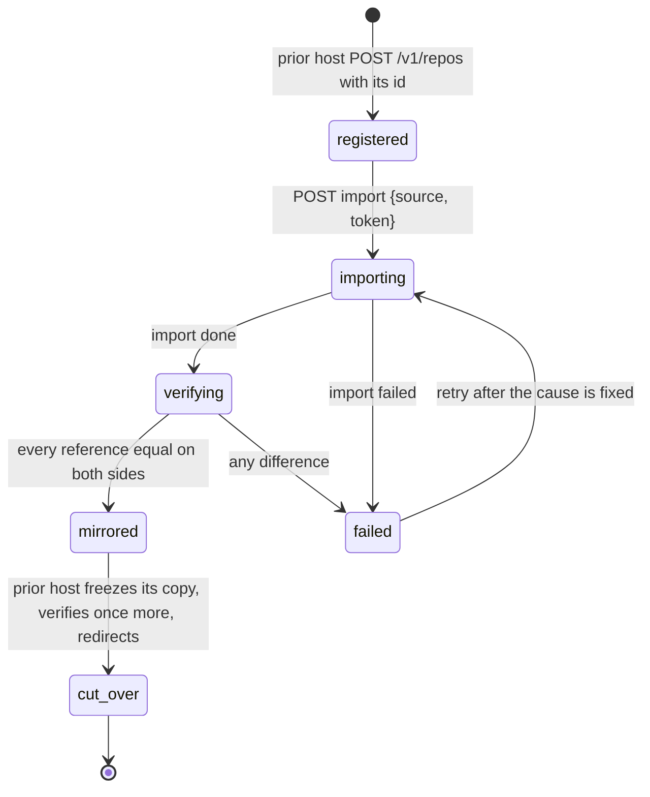

# Migration of existing repositories from a prior host

## Overview

An operator adopting Origo has repositories somewhere else: another git
host, a file server holding bare repositories, or a product that stored
each repository as a directory. Migration moves every one of them into
Origo without a remote breaking, without a push lost, and with proof
that the history is identical. This spec fixes the migration protocol on
Origo's side: how a batch of repositories is imported, how the prior
host keeps serving old URLs, how writes are cut over, and how the result
is verified. What the prior host does with its own records is its own
spec; this one names only what it must call.

The worked example throughout is a prior host that keeps each repository
as a bare `.git` directory on a shared filesystem, serves it over smart
HTTP, and serializes writes with a single-writer lock. The design below
is written for any prior host and uses that one only to make the steps
concrete.

## Current state

Spec 019 defines `POST /v1/repos/{id}/import` for one repository from an
HTTPS source with a bearer, resumable through `GET /v1/repos/{id}/import`,
refusing pushes while it runs, and emitting `imported`. Spec 007 lets the
prior host act for its users with the `act` claim. Nothing coordinates
many imports, a cut-over, or a verification against the source.

## Design

### Roles

| Role | Held by | Does |
|---|---|---|
| prior host | the system being migrated from | serves the old clone URLs, owns the repository records, runs the authorizer for the migrated repositories, calls Origo's API |
| Origo | this component | imports, verifies, serves the new URLs, emits events |
| operator | a person | runs the migration command, watches the report, decides the cut-over |

Origo has no notion of "the prior host" beyond a source URL and a
bearer per repository; the prior host is a consumer like any other.

### Phases per repository



| Phase | Origo | Prior host |
|---|---|---|
| registered | `POST /v1/repos` with the manifest's `id`, the prior host's own id when that is a UUID and one it minted otherwise, so the id never changes across the migration (spec 003) | records the Origo repository id on its own record |
| importing | `POST /v1/repos/{id}/import` from the prior host's clone URL with a bearer the prior host mints for Origo (spec 019: one entry, 30 minute budget, `transfer.fsckObjects`, the source host in `ORIGO_EGRESS_ALLOW`); pushes to Origo answer `repo_importing` | keeps serving reads and writes; a write during the import is caught by verification |
| verifying | `verify` (below) compares the two sides and records the result in `meta` | none |
| mirrored | serves reads; writes are allowed but the prior host has not yet sent any; Origo's copy is never frozen by this protocol | keeps serving both |
| cut_over | nothing to do: from now on Origo's is the only writable copy | `freeze` on its own copy, a final `verify`, then its clone URLs answer HTTP 308 to Origo's URL for `info/refs` and the two service endpoints, or proxy them, for 30 days; the 308 target carries a token the prior host mints as the URL's user info, `https://x:<token>@<origo>/r/<id>.git/…`, because git's HTTP client drops an `Authorization` header on a redirect that changes the host and every route of Origo is authenticated. The consequence is that the token is in the redirect URL and in anything that logs one, the prior host's own access log included, so the token is a short-lived repository-bound token (spec 007) for the repository being cut over and nothing wider, and the prior host stops minting it when the redirect comes down; spec 016's threats table carries the row. Its mounts clone from Origo |

A repository whose verification finds a difference is imported again
after the operator fixes the cause. The import refuses a non-empty
repository (`repo_not_empty`), so the prior host registers a fresh id,
writes it to its record and to a new manifest line, and the failed
attempt stays under the old id for inspection until the operator
deletes it; that is the one documented path, because deleting and
undeleting the old id would not empty it (an undelete restores the
history, spec 004).

### Verification

| Method | Path | Behaviour |
|---|---|---|
| POST | `/v1/repos/{id}/verify` | `{"source": "<https URL>", "token": "<optional bearer for the source>"}`, the same body shape as spec 019's `import`, action `admin`; compares the source and Origo's copy and answers the document below; read-only on both sides and idempotent, a `POST` only because the source bearer travels in the body, where it is never logged, and not in a header or a query string; 400 `invalid_request` for a non-HTTPS source, one the egress rules of spec 016 refuse, or one that does not answer `ls-remote`, which is the caller's input and carries `field: "source"` in `details` |

The node runs `git ls-remote --end-of-options <source>` with the token
and the egress proxy in the environment the way spec 019's import does,
the proxy terminating the source's TLS and trusting
`ORIGO_EGRESS_CA_BUNDLE` beside the system roots (spec 016) and
passing `-c transfer.fsckObjects=true` on git's command line, not as a
`GIT_CONFIG_*` key, because it is no secret (spec 016), drops the peeled
lines (`<ref>^{}`, which name a tag's target and not a reference) and
the `HEAD` line, whose value on the other side is a name and not a
hash, and
runs `git for-each-ref` on its own copy, and compares every reference
by name and hash; `equal` is true when the two maps are identical. It
then counts
the reachable objects on its own side with `git rev-list --objects
--all` and reports the count, which the operator compares with the
prior host's own figure; nothing is counted on the source, because a
count over a remote needs a clone. Response:

```json
{"equal": true,
 "refs": {"source": 42, "origo": 42, "differing": [{"name": "refs/heads/main", "source": "<sha>", "origo": "<sha>"}]},
 "objects": {"origo": 18211}, "checked_at": "…"}
```

`differing` lists every reference present on one side only or with two
hashes, with the missing side's hash empty. The node then writes
`verified_at` and `verified_equal` into `meta` (spec 004), which `GET
/v1/repos/{id}` reports (null when never verified); that is the state
`origod migrate` resumes from. The check is read-only on both sides,
bounded by the 30 second read budget of spec 009, and idempotent.

### Batches

The operator drives many repositories with `origod migrate -manifest
<file> -report <file>`, a subcommand of the binary dispatched by the
subcommand table of spec 002, that reads the manifest, drives each
repository from `registered` to `mirrored`
concurrently, writes a report line per repository as it finishes, and
exits 1 when any repository is `failed` and 0 otherwise (a usage error
is exit 2, as for every subcommand of spec 002). Cut-over is the prior
host's step and is not driven by the command. The command reads the
three variables of the table below and none of the node's: it is a
client of Origo's API, not a node.

The manifest is JSON lines, one object per repository:

```json
{"id": "<uuid>", "prior_id": "ws_8f3a", "owner": "acme", "slug": "api", "source": "https://old.example.com/acme/api.git", "token_env": "MIGRATE_TOKEN_ACME", "default_branch": "trunk"}
```

| Field | Required | Purpose |
|---|---|---|
| `id` | yes | the repository's id on Origo, a UUID (spec 003) |
| `prior_id` | no | the prior host's own id, which Origo never reads and the report copies back |
| `owner` | yes | the owner label the repository is registered under (spec 003) |
| `slug` | yes | the slug label |
| `source` | yes | the https URL the import and the verification fetch |
| `token_env` | yes | the environment variable holding the bearer for that source |
| `default_branch` | no | the repository's default branch at registration; absent means the source's `HEAD` target at import, which the import's `HEAD` transaction writes. Not yet accepted: the shape check refuses a field it does not know, so the builder item below is what admits it |

The whole manifest is read and held to that shape before any call: a
line whose `id` is not a UUID, whose owner or slug is not a label, whose
`source` is not an https URL, whose `default_branch` is not a reference
name, or whose `token_env` names an empty variable is a usage error,
exit 2, with the line number on standard error and no request to Origo
and no report file written. `id` is the repository's id on Origo and
must be a UUID (spec 003). A prior host whose own ids are not UUIDs
mints one per repository when it writes the manifest, records it on
its own record, and may carry
the old id in `prior_id`, which Origo never reads and the report
copies back; the mapping between the two lives in the prior host and
in the manifest, nowhere in Origo. Tokens come from the environment
variables `token_env` names, never from the manifest itself. The
report is JSON lines, one object per repository in finishing order:

```json
{"id": "<uuid>", "prior_id": "ws_8f3a", "owner": "acme", "slug": "api", "state": "mirrored", "refs": 42, "objects": 18211, "seconds": 31.4, "error": ""}
```

`state` is `mirrored`, `skipped`, or `failed`, `seconds` is the whole
drive of one repository rounded to the millisecond, and `error`
carries the failing step and Origo's error code for `failed`. The
command resumes from Origo's state and nothing else:
`GET /v1/repos/{id}` answering 404 means `registered` is needed,
`GET /v1/repos/{id}/import` says whether the import ran, and
`verified_at` with `verified_equal: true`
means `mirrored`, which is reported as `skipped` on a second run.

| Variable | Required | Default | Purpose |
|---|---|---|---|
| `ORIGO_MIGRATE_URL` | yes | none | the Origo the command drives, an absolute URL such as `https://git.example.com` |
| `ORIGO_MIGRATE_TOKEN_ENV` | yes | none | the name of the environment variable holding the bearer the command presents to Origo, a token with `admin` on every repository in the manifest; the token itself is never on the command line and never in the manifest |
| `ORIGO_MIGRATE_PARALLEL` | no | `4` | repositories `origod migrate` drives at once |

The command is the
documented way to migrate; the endpoints exist so a prior host can also
drive the migration from its own code.

### Events

`imported` (spec 019) after the import and `verified` after each
verification, both through `events.Emit` of spec 008, which fixes the
key, the id, delivery, retry, dead-letter, and repair for every kind,
with the shared fields of spec 019, so the prior host can advance its
own record without polling. `verify` calls `Emit` after it wrote
`verified_at` and before it answers.

| Event | Extra fields |
|---|---|
| `verified` | `equal`, `refs`, `objects`, `checked_at` as in the `verify` response |

### Worked example: a filesystem-backed prior host

The prior host registers every repository on Origo under the id it
already uses, mints a read bearer for Origo per repository, and lets
`origod migrate` run against a manifest it generates. After `mirrored`,
it turns its own repository into a pointer: its `/git/{owner}/{slug}`
routes answer 308 to `https://<origo-host>/{owner}/{slug}.git`, its
existing clients clone from Origo through the same delegation, and its
single-writer lock is retired because Origo's commit is the
serialization point. Those three changes are the prior host's to make.

## Not in this spec

Migrating LFS objects between hosts (each host's LFS store is copied by
`git lfs fetch --all` on the prior host and `git lfs push --all` to Origo
by the operator; spec 010 serves them). Migrating repositories larger
than the import budget in one run (split by the operator with a shallow
first import and `deepen`, a later addition). Anything about the prior
host's data model.

## Acceptance criteria

- `verify` on an identical fixture returns `equal: true` with the
  reference counts equal and `objects.origo` equal to the fixture's
  reachable-object count, writes `verified_at` and `verified_equal`
  into `meta`, and after one extra commit on the source returns
  `equal: false` naming that reference with both hashes; the source is
  `test/stubs/source` in-process and the handler is constructed with
  `AllowLoopback` (spec 016), the only way a test admits a loopback
  source (proposed: `internal/api`,
  `TestVerifyDetectsADivergedReference`).
- `origod migrate` over a manifest of 20 fixture repositories served by
  the stub source of spec 013 (`test/stubs/source`, in-process, the
  handler constructed with `AllowLoopback` of spec 016 so the source's
  loopback address is admitted, which the test reaches through
  `newHandler`, the package variable in `cmd/origod` holding `api.New`
  that the test replaces with a wrapper setting the field, so no
  file outside a `_test.go` writes it; the stub is named under
  `origo-source.localhost` and serves a certificate for it through the
  stub's `WithSANs`, because a single-label name is not a valid
  `ORIGO_EGRESS_ALLOW` entry) with parallelism 4 reaches `mirrored` for
  all 20, writes one report line each in the documented shape with
  `prior_id` copied through, reports all 20 as `skipped` on a second
  run without importing again, exits 1 when one source is
  unreachable, naming it in `error`, and refuses a manifest line whose
  `id` is not a UUID before it calls Origo (proposed: `cmd/origod`,
  `TestMigrateBatchIsResumableAndReportsFailures`).
- The source bearer of `verify` and `import` appears in no log line, no
  process argument, and no URL of the node, asserted over the node's
  log output and the stub source's request list, which records
  whether the bearer was carried and never its value (proposed:
  `internal/api`, `TestSourceTokenIsNeverLogged`, in-process with
  `AllowLoopback`; this is also where spec 019's import asserts the
  same for its bearer).
- A write on the source between import and verification, made with
  the source stub's `Commit` through its host port of spec 013's ports
  table, is detected by verification, and after a fresh id and a
  second import the repository reaches `mirrored`; the source is the
  in-cluster stub at `https://origo-stubs.origo.svc:8443`, which the
  stack's nodes reach because the overlay names it in
  `ORIGO_EGRESS_ALLOW` with its pinned `clusterIP` and the dialer's
  cluster exception of spec 016 admits that address (proposed: `test/e2e`,
  `TestClusterMigrationCatchesALateWrite`, in the `e2e` job of spec
  013).
- A 308 from a stub prior host to Origo makes `git clone` and `git push`
  against the old URL succeed against Origo with no client change
  (proposed: `test/e2e`, `TestE2EOldCloneURLRedirectsToOrigo`).
- `verified` events are delivered with the documented payload
  (proposed: `internal/events`, `TestVerifiedEventPayload`).
- The shell blocks of `docs/migration.md`, one repository and then one
  batch, run unchanged against the kind stack of spec 013 and end with
  `mirrored` for every repository (proposed: `test/e2e`,
  `TestClusterMigrationDocCommandsRun`, which runs
  `tools/docs/run-blocks.sh docs/migration.md`, the script spec 013
  owns under "Documents as tests", with the stack's `ORIGO_TEST_URL`
  and `ORIGO_TEST_ADMIN_TOKEN` in the environment).

## Outcome

Built. `verify` is `internal/api/verify.go`, the batch client is
`cmd/origod/migrate.go` behind the subcommand dispatcher of spec 002,
which this spec built, and the runbook is `docs/migration.md`, whose
shell blocks are its own test.

| Criterion | Test |
|---|---|
| `verify` on an identical fixture is `equal` with the counts equal, the copy's reachable-object count, `verified_at` and `verified_equal` in `meta`, and a diverged reference after one commit on the source | `internal/api`, `TestVerifyDetectsADivergedReference` |
| `origod migrate` over 20 fixture repositories with parallelism 4 reaches `mirrored`, writes the documented report line with `prior_id`, reports `skipped` on a second run without importing again, exits 1 on an unreachable source naming it in `error`, and refuses a manifest id that is not a UUID before it calls Origo | `cmd/origod`, `TestMigrateBatchIsResumableAndReportsFailures` |
| The source bearer of `verify` and of spec 019's `import` is in no log line, no process argument, and no URL | `internal/api`, `TestSourceTokenIsNeverLogged` |
| A write on the source between import and verification is caught, and a fresh id and a second import reach `mirrored` | `test/e2e`, `TestClusterMigrationCatchesALateWrite` |
| A 308 from a stub prior host makes `git clone` and `git push` against the old URL succeed against Origo with no client change | `test/e2e`, `TestE2EOldCloneURLRedirectsToOrigo` |
| `verified` events are delivered with the documented payload | `internal/events`, `TestVerifiedEventPayload` |
| The shell blocks of `docs/migration.md` run unchanged against the stack and end with every repository `mirrored` | `test/e2e`, `TestClusterMigrationDocCommandsRun` |

Beside those: `TestVerifyRefusals` and `TestParseLsRemote` in
`internal/api`, `TestMigrateUsageAndConfiguration`,
`TestManifestIsHeldToTheShape`, and `TestMigrateRefusalsAreReported` in
`cmd/origod`, and the `POST /v1/repos/{id}/verify` line in
`TestEveryRouteRequiresAToken` of spec 016's route sweep.

Coverage: `internal/api` 90.6%, `cmd/origod` 92.9%, `internal/events`
94.8%, `internal/wal` unchanged.

Stack proof: the `e2e` job of the dispatched run 34349791440 of
`verify.yml` on main, at commit `55129e5`, ran
`go test -tags=e2e ./test/e2e/... -run TestCluster` against the stack
and passed, which is where `TestClusterMigrationCatchesALateWrite` and
`TestClusterMigrationDocCommandsRun` run. Two jobs of that run failed
on work this spec does not touch: `test/conformance` on spec 021's
`TestContract/020` and `TestContract/012/rate_limited`, and the cover
gate on spec 008's `TestEmittedEventsRetryAndRepairLikePushes`, fixed
on main afterwards. The job's step runs without `-v`, so a test that
skipped would print the same `ok`. The eighteenth round's second review
found that `requireNodes`, the guard every cluster criterion of the
deck shares, was not the only way out of these two: `stubClient` in
`test/e2e` skipped when `test/e2e/testdata/stub-ca.pem` was missing,
after `requireNodes` had already found the stack answering. It fails
now, so `requireNodes` is the one skip, which the same job's other
`TestCluster*` tests passing rules out.

Items left to another builder, from the same review:

- Spec 021's builder, who owns the workflows: the `e2e` and `e2e-slow`
  jobs run `go test -v` for the `test/e2e` package, so every
  `TestCluster*` name is in the log and a stack proof names the test it
  cites instead of arguing from the package's `ok`. One line each in
  `.github/workflows/verify.yml`. Closed on 2026-09-09 by spec 017's
  builder in `1f4bbb9`, which put `-v` on both lines and on the
  conformance line beside them. The citation above is not refreshed:
  the run it names is the evidence on that commit, and a later run
  proves a later tree. The next dispatched or tag run is the first
  whose log names `TestClusterMigrationCatchesALateWrite` and
  `TestClusterMigrationDocCommandsRun` outright.

Named stack proof, and what moves this spec to `complete`: the `cluster
e2e tier` job of the tag run 34461461220 of `verify.yml` on `v0.1.0`, at
commit `2b2468d`, ran `go test -v -tags=e2e ./test/e2e/... -run
TestCluster` against the kind stack and its log names
`--- PASS: TestClusterMigrationCatchesALateWrite (4.47s)` and
`--- PASS: TestClusterMigrationDocCommandsRun (24.18s)`, with every
other job of that run green. That was the last item, and the spec moves
to `complete`. One row of the table above is proved without a name: the
`308` redirect row is `TestE2EOldCloneURLRedirectsToOrigo`, which runs
in the `integration and one-node e2e tiers` job, and `make test-tiers`
runs `go test` without `-v`, so the evidence there is the package's
`ok` over the `TestE2E` selection plus the test's one way out, the
`requireStack` skip that the job's `ORIGO_TEST_S3_ENDPOINT` rules out;
the job passed in run 34460223906 of `verify.yml` on main at commit
`058eb6d`. Every other row is named in a run above. The
`default_branch` builder item below moves no status. The citation above
of run 34349791440 stands as the evidence on its own commit and is not
refreshed.

### Divergences

- The comparison drops the `HEAD` line of `ls-remote` beside the peeled
  lines. `git ls-remote` advertises `HEAD` with the hash it resolves to
  and `git for-each-ref` does not list it at all, so an identical
  repository would answer `equal: false` on `HEAD` alone. The Design
  above now states the rule, and `TestParseLsRemote` holds it.
- A source that does not answer `ls-remote` is 400 `invalid_request`
  with `field: "source"`. The spec named only the two refusals decided
  before any connection; the code table has no code for a source that
  is down, and the source is the caller's input, so the same code
  carries it with the step in the developer register. The endpoint row
  above states it.
- The 308 of the cut-over carries the Origo token as the redirect
  target's user info. Git's HTTP client drops an `Authorization` header
  on a redirect that changes the host, and every route of Origo is
  authenticated, so a client with no Origo credential of its own is
  asked for one and the criterion's "no client change" fails. The prior
  host already mints the import bearer, so it mints this one too. The
  phase table, `docs/migration.md`, and the criterion's test state it.
- A manifest line the command refuses is a usage error, exit 2, with no
  request to Origo and no report file, rather than a `failed` report
  line: the criterion says the refusal comes before Origo is called,
  and exit 2 is what spec 002 gives a usage error. The Design states it.
- The subcommand dispatcher of spec 002 was not in the tree, so this
  spec built it: `serve` (the default, which is where the node's
  configuration is now loaded, so `migrate` reads none of it) and
  `migrate`. `check` stays spec 018's and is an unknown subcommand
  until it lands. Spec 002's Outcome records it.
- `AllowLoopback` reaches `cmd/origod` through `newHandler`, the
  package variable holding `api.New` that `migrate_test.go` replaces
  with a wrapper setting the field, so the field is written in a
  `_test.go` file and nowhere else and spec 016's
  `TestAllowLoopbackIsSetOnlyByTests` holds. The source stub of spec 013
  gained `WithSANs`, because the batch test reaches it under
  `origo-source.localhost`: a single-label name is not a valid
  `ORIGO_EGRESS_ALLOW` entry and the Go resolver answers a `.localhost`
  name with the loopback address.
- The report's `seconds` is the whole drive of one repository, rounded
  to the millisecond.

### Builder items

- The manifest's optional `default_branch` column, in the field table
  above, is not built: `origod migrate` registers every repository with
  the default of `POST /v1/repos` and the import's `HEAD` transaction
  then moves it to the source's own symbolic target, which is what the
  absent column means. The column is for a prior host whose default
  branch is not the source's `HEAD` at import, and it is one field on
  the manifest struct, one refusal in the shape check, and one field on
  the create call. Small, and it moves no status.
