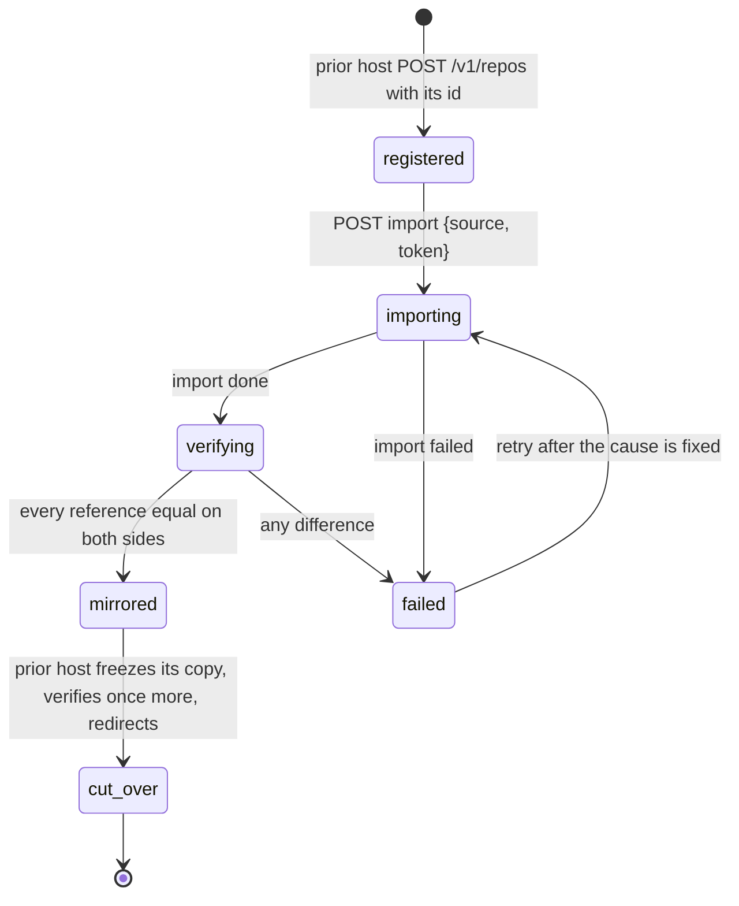

# Migration of existing repositories from a prior host

## Overview

An operator adopting Origo has repositories somewhere else: another git
host, a file server holding bare repositories, or a product that stored
each repository as a directory. Migration moves every one of them into
Origo without a remote breaking, without a push lost, and with proof
that the history is identical. This spec fixes the migration protocol on
Origo's side: how a batch of repositories is imported, how the prior
host keeps serving old URLs, how writes are cut over, and how the result
is verified. What the prior host does with its own records is its own
spec; this one names only what it must call.

At Latere the prior host is the data plane product, which holds each
repository as a workspace with a `.git` directory in its file plane,
served over smart HTTP with a single-writer lock shared with sandbox
mounts. The design below is written for any prior host and uses that one
as the worked example.

## Current state

Spec 019 defines `POST /v1/repos/{id}/import` for one repository from an
HTTPS source with a bearer, resumable through `GET /v1/repos/{id}/import`,
refusing pushes while it runs, and emitting `imported`. Spec 007 lets the
prior host act for its users with the `act` claim. Nothing coordinates
many imports, a cut-over, or a verification against the source.

## Design

### Roles

| Role | Held by | Does |
|---|---|---|
| prior host | the system being migrated from | serves the old clone URLs, owns the repository records, runs the authorizer for the migrated repositories, calls Origo's API |
| Origo | this component | imports, verifies, serves the new URLs, emits events |
| operator | a person | runs the migration command, watches the report, decides the cut-over |

Origo has no notion of "the prior host" beyond a source URL and a
bearer per repository; the prior host is a consumer like any other.

### Phases per repository



| Phase | Origo | Prior host |
|---|---|---|
| registered | `POST /v1/repos` with the manifest's `id`, the prior host's own id when that is a UUID and one it minted otherwise, so the id never changes across the migration (spec 003) | records the Origo repository id on its own record |
| importing | `POST /v1/repos/{id}/import` from the prior host's clone URL with a bearer the prior host mints for Origo (spec 019: one entry, 30 minute budget, `transfer.fsckObjects`, the source host in `ORIGO_EGRESS_ALLOW`); pushes to Origo answer `repo_importing` | keeps serving reads and writes; a write during the import is caught by verification |
| verifying | `verify` (below) compares the two sides and records the result in `meta` | none |
| mirrored | serves reads; writes are allowed but the prior host has not yet sent any; Origo's copy is never frozen by this protocol | keeps serving both |
| cut_over | nothing to do: from now on Origo's is the only writable copy | `freeze` on its own copy, a final `verify`, then its clone URLs answer HTTP 308 to Origo's URL for `info/refs` and the two service endpoints, or proxy them, for 30 days; its mounts clone from Origo |

A repository whose verification finds a difference is imported again
after the operator fixes the cause. The import refuses a non-empty
repository (`repo_not_empty`), so the prior host registers a fresh id,
writes it to its record and to a new manifest line, and the failed
attempt stays under the old id for inspection until the operator
deletes it; that is the one documented path, because deleting and
undeleting the old id would not empty it (an undelete restores the
history, spec 004).

### Verification

| Method | Path | Behaviour |
|---|---|---|
| POST | `/v1/repos/{id}/verify` | `{"source": "<https URL>", "token": "<optional bearer for the source>"}`, the same body shape as spec 019's `import`, action `admin`; compares the source and Origo's copy and answers the document below; read-only on both sides and idempotent, a `POST` only because the source bearer travels in the body, where it is never logged, and not in a header or a query string; 400 `invalid_request` for a non-HTTPS source or one the egress rules of spec 016 refuse |

The node runs `git ls-remote --end-of-options <source>` with the token
and the egress proxy in the environment the way spec 019's import does,
the proxy terminating the source's TLS and trusting
`ORIGO_EGRESS_CA_BUNDLE` beside the system roots (spec 016), drops the peeled
lines (`<ref>^{}`, which name a tag's target and not a reference), and
runs `git for-each-ref` on its own copy, and compares every reference
by name and hash; `equal` is true when the two maps are identical. It
then counts
the reachable objects on its own side with `git rev-list --objects
--all` and reports the count, which the operator compares with the
prior host's own figure; nothing is counted on the source, because a
count over a remote needs a clone. Response:

```json
{"equal": true,
 "refs": {"source": 42, "origo": 42, "differing": [{"name": "refs/heads/main", "source": "<sha>", "origo": "<sha>"}]},
 "objects": {"origo": 18211}, "checked_at": "…"}
```

`differing` lists every reference present on one side only or with two
hashes, with the missing side's hash empty. The node then writes
`verified_at` and `verified_equal` into `meta` (spec 004), which `GET
/v1/repos/{id}` reports (null when never verified); that is the state
`origod migrate` resumes from. The check is read-only on both sides,
bounded by the 30 second read budget of spec 009, and idempotent.

### Batches

The operator drives many repositories with `origod migrate -manifest
<file> -report <file>`, a subcommand of the binary dispatched by the
subcommand table of spec 002, that reads the manifest, drives each
repository from `registered` to `mirrored`
concurrently, writes a report line per repository as it finishes, and
exits non-zero when any repository is `failed`. Cut-over is the prior
host's step and is not driven by the command. The command reads the
three variables of the table below and none of the node's: it is a
client of Origo's API, not a node.

The manifest is JSON lines, one object per repository:

```json
{"id": "<uuid>", "prior_id": "ws_8f3a", "owner": "acme", "slug": "api", "source": "https://old.example.com/acme/api.git", "token_env": "MIGRATE_TOKEN_ACME"}
```

`id` is the repository's id on Origo and must be a UUID (spec 003). A
prior host whose own ids are not UUIDs mints one per repository when
it writes the manifest, records it on its own record, and may carry
the old id in `prior_id`, which Origo never reads and the report
copies back; the mapping between the two lives in the prior host and
in the manifest, nowhere in Origo. Tokens come from the environment
variables `token_env` names, never from the manifest itself. The
report is JSON lines, one object per repository in finishing order:

```json
{"id": "<uuid>", "prior_id": "ws_8f3a", "owner": "acme", "slug": "api", "state": "mirrored", "refs": 42, "objects": 18211, "seconds": 31.4, "error": ""}
```

`state` is `mirrored`, `skipped`, or `failed`, and `error` carries the
failing step and Origo's error code for `failed`. The command resumes
from Origo's state and nothing else: `GET /v1/repos/{id}` answering
404 means `registered` is needed, `GET /v1/repos/{id}/import` says
whether the import ran, and `verified_at` with `verified_equal: true`
means `mirrored`, which is reported as `skipped` on a second run.

| Variable | Required | Default | Purpose |
|---|---|---|---|
| `ORIGO_MIGRATE_URL` | yes | none | the Origo the command drives, an absolute URL such as `https://git.example.com` |
| `ORIGO_MIGRATE_TOKEN_ENV` | yes | none | the name of the environment variable holding the bearer the command presents to Origo, a token with `admin` on every repository in the manifest; the token itself is never on the command line and never in the manifest |
| `ORIGO_MIGRATE_PARALLEL` | no | `4` | repositories `origod migrate` drives at once |

The command is the
documented way to migrate; the endpoints exist so a prior host can also
drive the migration from its own code.

### Events

`imported` (spec 019) after the import and `verified` after each
verification, both through `events.Emit` of spec 008, which fixes the
key, the id, delivery, retry, dead-letter, and repair for every kind,
with the shared fields of spec 019, so the prior host can advance its
own record without polling. `verify` calls `Emit` after it wrote
`verified_at` and before it answers.

| Event | Extra fields |
|---|---|
| `verified` | `equal`, `refs`, `objects`, `checked_at` as in the `verify` response |

### Worked example: the Latere data plane

The data plane registers every repository-kind workspace on Origo with
the workspace's id, mints a read bearer for Origo per repository, and
lets `origod migrate` run against a manifest it generates. After
`mirrored`, it flips its workspace to a pointer: its `/git/{owner}/{slug}`
routes answer 308 to `https://git.latere.ai/{owner}/{slug}.git`, its
sandbox mounts clone from Origo through the same delegation the product
already uses, and its single-writer lock is retired because Origo's
commit is the serialization point. Its own spec owns those three changes.

## Not in this spec

Migrating LFS objects between hosts (each host's LFS store is copied by
`git lfs fetch --all` on the prior host and `git lfs push --all` to Origo
by the operator; spec 010 serves them). Migrating repositories larger
than the import budget in one run (split by the operator with a shallow
first import and `deepen`, a later addition). Anything about the prior
host's data model.

## Acceptance criteria

- `verify` on an identical fixture returns `equal: true` with the
  reference counts equal and `objects.origo` equal to the fixture's
  reachable-object count, writes `verified_at` and `verified_equal`
  into `meta`, and after one extra commit on the source returns
  `equal: false` naming that reference with both hashes (proposed:
  `internal/api`, `TestVerifyDetectsADivergedReference`).
- `origod migrate` over a manifest of 20 fixture repositories served by
  the stub source of spec 019 with parallelism 4 reaches `mirrored` for
  all 20, writes one report line each in the documented shape with
  `prior_id` copied through, reports all 20 as `skipped` on a second
  run without importing again, exits non-zero when one source is
  unreachable, naming it in `error`, and refuses a manifest line whose
  `id` is not a UUID before it calls Origo (proposed: `cmd/origod`,
  `TestMigrateBatchIsResumableAndReportsFailures`).
- The source bearer of `verify` and `import` appears in no log line, no
  process argument, and no URL of the node, asserted over the node's
  log output and the stub source's request log (proposed:
  `internal/api`, `TestSourceTokenIsNeverLogged`).
- A write on the source between import and verification is detected by
  verification, and after a fresh id and a second import the repository
  reaches `mirrored` (proposed: `test/e2e`, `TestE2EMigrationCatchesALateWrite`).
- A 308 from a stub prior host to Origo makes `git clone` and `git push`
  against the old URL succeed against Origo with no client change
  (proposed: `test/e2e`, `TestE2EOldCloneURLRedirectsToOrigo`).
- `verified` events are delivered with the documented payload
  (proposed: `internal/events`, `TestVerifiedEventPayload`).
- The shell blocks of `docs/migration.md`, one repository and then one
  batch, run unchanged against the kind stack of spec 013 and end with
  `mirrored` for every repository (proposed: `test/e2e`,
  `TestClusterMigrationDocCommandsRun`, which runs
  `tools/docs/run-blocks.sh docs/migration.md`, the script spec 013
  owns under "Documents as tests", with the stack's `ORIGO_TEST_URL`
  and `ORIGO_TEST_ADMIN_TOKEN` in the environment).
