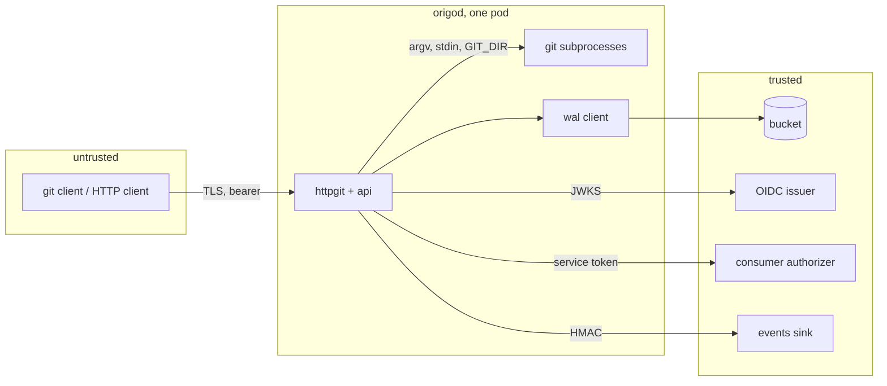

# Security and threat model

## Overview

A git server holds source code and accepts bytes from anyone who can
reach it. This spec names the assets, the attackers, the trust
boundaries, and the control that answers each threat, so a reviewer
outside the project can check the design rather than take it on faith.
It also fixes the disclosure process and the hardening of the process
and the pod.

## Current state

Phase 1 verifies the static bearer of spec 002 in constant time, runs
every git subprocess through `internal/repo.Git` with the environment
below, `core.protectNTFS` and `receive.fsckObjects` on, a 5 minute
deadline, and a process group that is killed whole. The pod runs with
the security context below (`deploy/base/deployment.yaml`). `SECURITY.md`
exists at the root with the disclosure process. The gate runs `vuln` on
every push. Not yet: `transfer.fsckObjects`, `core.protectHFS`, a bill
of materials, a validator fuzz test, a test over the subprocess
environment.

## Design

### Assets

Repository contents and history; the bucket credentials; the token
signing key `ORIGO_TOKEN_KEY`; `ORIGO_AUTHORIZER_TOKEN`;
`ORIGO_EVENTS_SECRET`; the availability of the service for every
repository at once.

### Trust boundaries

Everything left of `origod` is hostile. The bucket, the issuer, the
authorizer, and the sink are trusted for what they say but not for
availability (spec 015). Gossip peers (spec 005) are trusted for
nothing: an announcement triggers a currency check and grants nothing.
A git subprocess handles hostile bytes and is treated as semi-trusted:
it runs with the minimal environment below, no shell, no network, a
deadline, and under the pod's security context.

### Threats and controls

| Threat | Control | Spec |
|---|---|---|
| Reading a repository without permission | every request authenticated; authorization asked of the consumer per action and cached for at most 600 seconds; deny by default and never fail-open; repository-bound tokens scoped to one repository and one scope | 007 |
| Writing to a repository without permission | same; `write` is asked at `info/refs?service=git-receive-pack`, before the pack is accepted | 007 |
| A service acting as a user beyond its mandate | `act` is recorded on every entry and event; the authorizer sees both subject and actor and may refuse the pair | 007 |
| Malformed or malicious git objects | `receive.fsckObjects` (phase 1), `transfer.fsckObjects`, `core.protectNTFS` (phase 1), `core.protectHFS`; Origo never checks out a tree on the server except into the archive stream, which is `git archive` with no filesystem write | 004, 009 |
| Command injection through refs, owner, slug, or paths | reference names validated by `internal/wal.ValidRefName`; owner and slug by the grammar of spec 003; subprocess arguments never pass through a shell; `GIT_DIR` set explicitly; the only hook is Origo's own pre-receive, installed by the node and never from a push | 003, 004 |
| Resource exhaustion by one client | per-subject rate limit, per-node subprocess cap, body and repository size limits, subprocess deadlines | 012 |
| Exhaustion through the bucket | breakers and per-operation deadlines so one slow client cannot hold a subprocess open against a slow bucket | 015 |
| Token theft | short-lived repository tokens; issuer tokens verified for audience; tokens never logged, never in URLs on the server side; the basic auth password is accepted for git and never written to a log line | 007, 011 |
| Secret exposure in logs or metrics | fixed-vocabulary labels; the redaction test of spec 011; the registers rule for messages | 011 |
| Tampering with the log | objects are immutable once written; entry lengths and digests are checked at materialization; a mismatch is an integrity error, never repaired from a local copy | 004, 015 |
| Cross-repository leakage on a node | one bare repository per id under `repos/`, `GIT_DIR` per request, no shared object store, no alternates | 004 |
| Supply chain | the image is built from a pinned Go toolchain and a pinned Debian base with git, with a bill of materials and provenance attached to the release; dependencies are the standard library and `latere.ai/x/pkg` | 002, 017 |
| A compromised node | the node holds the bucket credentials and the signing key; the blast radius is every repository the credentials reach, which is why one installation serves one trust domain and the bucket prefix is dedicated | 001 |

### Process and pod hardening

The pod in `deploy/base`: `runAsNonRoot` as user and group 65532,
`readOnlyRootFilesystem`, `allowPrivilegeEscalation: false`,
capabilities `drop: [ALL]`, seccomp `RuntimeDefault`,
`automountServiceAccountToken: false`, the cache volume and `/tmp` the
only writable mounts, CPU request 250m, memory request 256Mi and limit
2Gi. Git subprocesses inherit exactly this environment
(`internal/repo.Git.Env`): `PATH`, `HOME` (an empty directory under
`ORIGO_DATA_DIR`), `GIT_DIR`, `GIT_CONFIG_NOSYSTEM=1`,
`GIT_CONFIG_GLOBAL=/dev/null`, `GIT_TERMINAL_PROMPT=0`, `LC_ALL=C`, plus
`GIT_PROTOCOL` on the smart HTTP services and `ORIGO_HOOK_DIR` on
`receive-pack`. No credential helper, no user hooks.

### Transport

TLS terminates at the ingress; the public listener may be plain HTTP
inside the cluster only. Bearer tokens are required on every request
including `info/refs`; the one unauthenticated path is
`GET /.well-known/jwks.json` (spec 007). There is no anonymous read in
v1; an operator who wants public repositories does so through the
authorizer answering allow for an anonymous subject, which is not in
this spec.

### Disclosure

`SECURITY.md` at the root: report to `security@latere.ai`, acknowledged
within 3 business days, fixed releases within 30 days for high
severity, credit in the release notes on request. Vulnerable
dependencies are caught by the gate's `vuln` check on every push.

## Not in this spec

Anonymous reads. Encryption of objects beyond what the bucket does.
Audit export beyond the log itself.

## Acceptance criteria

- A request without a token, with a token for another audience, or with
  an expired token is refused with 401 on `info/refs`, `git-upload-pack`,
  `git-receive-pack`, `GET /v1/repos/{id}`, and the LFS batch endpoint
  (spec 007's verifier test extended over every route: proposed
  `cmd/origod`, `TestEveryRouteRequiresAToken`).
- A pushed pack containing a `.git` tree entry, an NTFS-reserved name,
  or a broken object is rejected with git's message and no entry is
  written (proposed: `internal/httpgit`, `TestMaliciousPackWritesNothing`,
  packs built by `internal/gittest`).
- A reference name, owner, or slug containing a shell metacharacter,
  `..`, or a control character is refused by the validators and no
  subprocess starts (`internal/wal`, `TestValidRefName`; proposed:
  `FuzzValidRefName`, `FuzzValidLabel`).
- A git subprocess observes exactly the documented environment
  (proposed: `internal/repo`, `TestSubprocessEnvironment`, running `env`
  through `Git.Command`).
- The pod runs with the documented security context in the kind stack,
  and a test overlay that relaxes `readOnlyRootFilesystem` is refused by
  Pod Security admission at `restricted` (proposed: `test/e2e`,
  `TestPodSecurityContext` on the stack of spec 013).
- `SECURITY.md` exists (in the tree) and the release carries a bill of
  materials and provenance (spec 017's artifact criterion).
