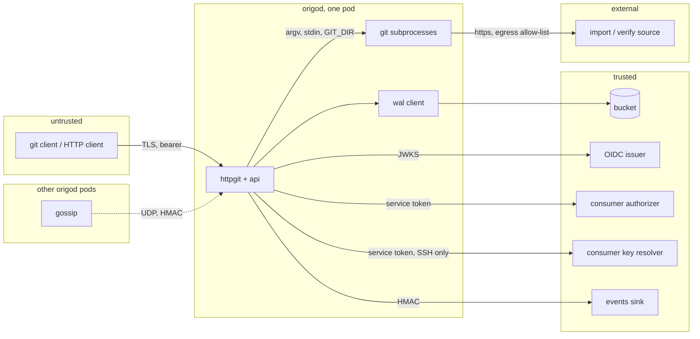

# Security and threat model

## Overview

A git server holds source code and accepts bytes from anyone who can
reach it. This spec names the assets, the attackers, the trust
boundaries, and the control that answers each threat, so a reviewer
outside the project can check the design rather than take it on faith.
It also fixes the disclosure process and the hardening of the process
and the pod.

## Current state

Built on 2026-09-09. Spec 007 verifies every token against the
configured issuers and the node's own key and asks the authorizer
before any lookup; the node runs every git subprocess through
`internal/repo.Git` with the environment below, `core.protectNTFS`,
`core.protectHFS`, `receive.fsckObjects`, and `transfer.fsckObjects`
on, and a 5 minute deadline; the smart HTTP services run in their own
process group that is killed whole, the other subprocesses under the
context's kill. The egress dialer and the forward proxy are
`internal/api/egress.go`, built by `cmd/origod` from the three
variables of spec 002 and handed to the handler, whose `import` and
`verify` (specs 019, 014) are the callers to come. The pod runs with
the security context below (`deploy/base/deployment.yaml`) and the
NetworkPolicy `origod-gossip` of `deploy/base/networkpolicy.yaml`,
with `origod-http` beside it. `SECURITY.md` exists at the root with
the disclosure process. The gate runs `vuln` on every push. Not yet: the
`release-verify` job of `release.yml` at which `cosign verify` accepts
the image and `sha256sum -c` accepts the archives, which the first tag
closes. The bill of materials ships with that tag as three SPDX release
assets; its attachment to the image, and the provenance beside it, are
deferred while the repository is private, by spec 017's attestation
rule. Both callers of the dialer
have landed: `import` with spec 019 and `verify` with spec 014, whose
`TestSourceTokenIsNeverLogged` covers the bearer of both.

The item spec 012 left to this build is done: `Guard.quota` in
`internal/auth` returns the `*Unavailable` of an authorizer that
produced no answer and `Guard.Decide` propagates it on a write, so a
repository-bound token's write during an outage is refused with
`authorizer_unavailable` like every other write, while a deny or an
allow with no figure still leaves the default because the token's
scope already decided the access;
`TestBoundTokenWriteFailsClosedDuringAuthorizerOutage` holds it, and
spec 012's Outcome records the fix.

## Design

### Assets

Repository contents and history; the bucket credentials; the token
signing key `ORIGO_TOKEN_KEY`; `ORIGO_AUTHORIZER_TOKEN`;
`ORIGO_EVENTS_SECRET`; `ORIGO_GOSSIP_SECRET`; the availability of the
service for every repository at once.

### Trust boundaries

Everything left of `origod` is hostile. The bucket, the issuer, the
authorizer, and the sink are trusted for what they say but not for
availability (spec 015). Gossip peers (spec 005) are the other pods of
the same Deployment and hold `ORIGO_GOSSIP_SECRET`; a datagram is
believed for membership only when its MAC verifies, and even then it
grants nothing: an announcement triggers a currency check, the log
decides what is served. The NetworkPolicy `origod-gossip` in
`deploy/base`, which this spec adds and owns, admits UDP 7946 from the
Deployment's own pods only, selected by the pod labels the Deployment
and spec 013's StatefulSet share; it is defence in depth, not the
control, because a policy is enforced by the network plugin and a MAC
by the node. A policy restricts every ingress it does not admit for
the pods it selects, so `origod-http` in the same file admits TCP 8080
and 8081, the two listeners of spec 002, from every peer: the ingress
controller, the probes, and the scrape; the bearer of spec 007 is the
control there. `origod-ssh` beside it admits TCP 2222 from every peer
for the same reason, because the public key and the authorizer are the
control on that listener and not the network (spec 024); it is inert
until an installation sets `ORIGO_SSH_ADDR`. The three are additive,
and `origod-gossip` alone is what the stack criterion reads.
The source of an `import` or a `verify` (specs 019, 014) is a host the
caller names, so it is hostile until the egress allow-list admits it,
and trusted only for the bytes git checks.
A git subprocess handles hostile bytes and is treated as semi-trusted:
it runs with the minimal environment below, no shell, no network, a
deadline, and under the pod's security context.

### Threats and controls

| Threat | Control | Spec |
|---|---|---|
| Reading a repository without permission | every request authenticated; authorization asked of the consumer per action and cached for at most 600 seconds; deny by default and never fail-open; repository-bound tokens scoped to one repository and one scope | 007 |
| Writing to a repository without permission | same; `write` is asked at `info/refs?service=git-receive-pack`, before the pack is accepted | 007 |
| A service acting as a user beyond its mandate | `act` is recorded on every entry and event; the authorizer sees both subject and actor and may refuse the pair | 007 |
| Malformed or malicious git objects | `receive.fsckObjects` (phase 1), `transfer.fsckObjects`, `core.protectNTFS` (phase 1), `core.protectHFS`; Origo never checks out a tree on the server except into the archive stream, which is `git archive` with no filesystem write | 004, 009, 016 |
| Command injection through refs, owner, slug, or paths | reference names validated by `internal/wal.ValidRefName`; owner and slug by the grammar of spec 003; subprocess arguments never pass through a shell; `GIT_DIR` set explicitly; the only hook is Origo's own pre-receive, installed by the node and never from a push | 003, 004, 016 |
| Resource exhaustion by one client | per-subject rate limit, per-node subprocess cap, body and repository size limits, subprocess deadlines | 012 |
| Server-side request forgery through `import` and `verify` | every server-side fetch goes to a host on the egress allow-list `ORIGO_EGRESS_ALLOW` (spec 002): comma separated exact hostnames or `*.` wildcards, matched with `latere.ai/x/pkg/hostmatch` after lower-casing and trailing-dot removal, each entry an FQDN, an IP literal, or a `*.` wildcard by `hostmatch.ValidPattern`, so a single-label name such as `localhost` cannot be listed and a test names its source under `.localhost`, which the resolver answers with loopback and no DNS query (RFC 6761); the default, unset, refuses every source. Whatever the list says, the fetch runs through a `DialContext` that resolves the host inside the dial, once per connection, refuses every resolved address in a refused range, and dials the first admitted address by IP, skipping a refused address among admitted ones, so a name that rebinds between the check and the connection cannot redirect it; the refused ranges are RFC 1918, RFC 4193 (ULA), loopback, link-local, and unspecified, plus the cluster's service and pod ranges from `ORIGO_CLUSTER_CIDRS` (spec 002), default empty, meaning only the well-known ranges. One exception, so an operator can name a source that runs inside the cluster on purpose: an entry of `ORIGO_EGRESS_ALLOW` in the form `host=address` (spec 002), an exact host with one IP literal, fixes the address the dialer uses for that host. A pinned host is admitted at that address and at no other, inside a range `ORIGO_CLUSTER_CIDRS` lists or outside it, so the pin is the one exception to the cluster ranges and to the well-known ranges alike, including kind's service range inside RFC 1918, and a name that answers with any other address is refused however public that address is. A pinned address no listed range contains is a valid entry and no start-up problem: the pin says where the host is rather than opening a hole in a range, so it holds across a change of the cluster's ranges. An exact host without a pinned address, or a `*.` wildcard, never admits a cluster address; loopback, link-local, and unspecified addresses are never admitted this way, pinned or not. The kind overlay of spec 013 uses it: `ORIGO_EGRESS_ALLOW=origo-stubs.origo.svc=10.96.0.42`, the fixed `clusterIP` of the stubs' Service, and `ORIGO_CLUSTER_CIDRS` naming kind's service and pod ranges let the nodes import from the in-cluster source stub, which is what the cluster tests of specs 014 and 019 fetch from. The dialer takes one more option, `AllowLoopback`, which admits loopback addresses for a host on the list; it is a field of the handler's constructor in `internal/api`, false in every deployment because `cmd/origod` never sets it and no configuration variable exists for it, and true only in a unit test of `import` or `verify` (specs 014, 019) that serves its source from `test/stubs/source` in-process. Every redirect hop is resolved and dialed the same way. A refused source is 400 `invalid_request` with `details.reason: "egress"` and no connection is opened; a hop the proxy below refuses is answered to git with 403 and kept as the proxy's first refusal, which the operation reports as that 400 once git exits. The dialer is what git's `http.proxy` cannot give, so the fetch runs through a local forward proxy the node starts per import on a loopback port, which git is pointed at and which applies the dialer. The proxy is the one place that dials the source, so it, not git, terminates the source's TLS: git is given the source with its scheme rewritten to `http://` and talks plain HTTP to the proxy; the proxy dials the source over TLS at the pinned address, verifies its certificate against the system roots plus the PEM bundle `ORIGO_EGRESS_CA_BUNDLE` (spec 002) names when it is set, unset in production and set by the kind overlay of spec 013 to the CA of the source stub's certificate, and forwards every request through the same dialer. The proxy follows redirects itself: a 3xx from the source is never returned to git, the proxy resolves and dials the `Location` through the dialer like a first hop, at most 10 hops, so every hop is checked; it refuses `CONNECT` with 405 and opens no connection for it; and because the URL git is given is `http://`, git never asks for a tunnel, so no `https://` hop, first or redirected, is ever tunnelled past the dialer, which a `CONNECT` tunnel would hide from it. Git is configured through the environment for what is secret, stated here once and referenced by specs 019 and 014: `GIT_CONFIG_COUNT=2`, `GIT_CONFIG_KEY_0=http.<source>.extraheader` with `GIT_CONFIG_VALUE_0=Authorization: Bearer <token>`, `<source>` the rewritten `http://` URL git is given, and `GIT_CONFIG_KEY_1=http.proxy` with `GIT_CONFIG_VALUE_1=http://<credential>:egress@127.0.0.1:<port>` of that proxy, `<credential>` a random value the node draws per import from `crypto/rand` and `egress` a fixed password, there because git prompts for one when a proxy URL carries a user alone and a prompt under `GIT_TERMINAL_PROMPT=0` ends the fetch, so the count stays 2 and the credential travels in the proxy URL and nowhere else; a source given without a token gets the proxy key alone and a count of 1, never an empty bearer; the source URL, the token, the proxy, and the credential never appear on git's command line. `transfer.fsckObjects=true` is no secret and goes on the command line as `-c transfer.fsckObjects=true`, so the count stays 2 and a process listing shows the check is on. The proxy answers 407 to a request without the credential, so another process on the node that finds the loopback port gets no fetch through it, and closes when git exits. `latere.ai/x/pkg/egress` is not used here: it substitutes credentials through a `CONNECT` proxy, a different purpose, and `CONNECT` hides from the proxy the hop the pinned dialer must see | 016; 019, 014 |
| A migration cut-over token read out of a redirect URL | the 308 a prior host answers during a cut-over (spec 014) carries the Origo bearer as the target's user info, because git's HTTP client drops an `Authorization` header on a redirect that changes the host and every route of Origo is authenticated; a token in a URL is in the redirect the prior host logs, in every proxy between the two, and in the client's own history, which is why Origo itself puts no token in a URL. What bounds the exposure is what the token is: the prior host mints a short-lived repository-bound token (spec 007) for the one repository being cut over, so a token read out of a log buys reads and writes of that repository until it expires and nothing else, and the prior host stops minting it when the redirect comes down. Origo's own side of the cut-over is unchanged: the token is presented as a bearer, never logged, and never written into a URL by a node | 014; 007 |
| Membership forgery through gossip | every datagram carries an HMAC-SHA256 under `ORIGO_GOSSIP_SECRET`; one without a valid MAC is dropped before it is parsed and counted on `origo_gossip_packets_total{direction="dropped"}`, so a sender without the secret cannot enter the live set, keep a dead node in it, or trigger a catch-up, and cannot change who a repository's compaction primary, import lease holder, or orphan sweeper is (specs 006, 019); the NetworkPolicy `origod-gossip` on the gossip port, this spec's, is defence in depth | 005, 016 |
| Amplification through gossip | a valid datagram is at most one catch-up, and catch-ups triggered by gossip are rate-limited to one per repository per second, so a flood from a node that holds the secret costs one `HEAD` per named repository per second and nothing else; a datagram that names a repository the node does not hold is dropped; an invalid one costs one HMAC | 005 |
| Exhaustion through the bucket | breakers and per-operation deadlines so one slow client cannot hold a subprocess open against a slow bucket | 015 |
| Token theft | short-lived repository tokens; issuer tokens verified for audience; tokens never logged, never in URLs on the server side; the basic auth password is accepted for git and never written to a log line | 007, 011 |
| Secret exposure in logs or metrics | fixed-vocabulary labels; the redaction test of spec 011; the registers rule for messages | 011 |
| Tampering with the log | objects are immutable once written; entry lengths and digests are checked at materialization; a mismatch is an integrity error, never repaired from a local copy | 004, 015 |
| Cross-repository leakage on a node | one bare repository per id under `repos/`, `GIT_DIR` per request, no shared object store, no alternates | 004 |
| Supply chain | the image is built from a pinned Go toolchain and a pinned Debian base with git, signed with cosign keyless against the release workflow's identity, with an SPDX bill of materials shipped as a release asset; dependencies are the standard library and `latere.ai/x/pkg`. Attaching the bill of materials and the build provenance to the image as attestations is pending the repository becoming public, or the organization plan being upgraded and spec 017's condition changed with it: GitHub's attestation API refuses a private repository on this plan, which is what failed the v0.1.0 tag of 2026-09-10 | 002, 017 |
| A compromised node | the node holds the bucket credentials and the signing key; the blast radius is every repository the credentials reach, which is why one installation serves one trust domain and the bucket prefix is dedicated | 001 |
| SSH host key theft giving a machine in the middle | one host key set for the whole installation, in the Secret `origod-ssh-host-key`, read at start-up, never in the bucket and never in the log; rotation is the four-step overlap of spec 024, where the new key is announced through `hostkeys-00@openssh.com` before it is presented, so it is a procedure an operator can run rather than a flag day; a stolen key is a machine in the middle for every client until rotation completes | 024 |
| A public key bound to the wrong subject | Origo stores no key: it asks the operator's key resolution endpoint, whose contract requires one subject per fingerprint installation-wide and refuses a fingerprint already registered, because a store that binds one key to two subjects lets pushes be attributed to the wrong person; a resolver that does not answer refuses the connection and never allows it | 024, 007 |
| A key that outlives its person | the resolve answer's `ttl` bounds it, 60 seconds by default and capped at 600, and a not-found answer is cached 5 seconds, so a revocation at the store stops the key inside the window Origo already uses for an authorizer deny | 024 |
| More than git over an SSH connection | only `session` channels, one per connection, only `exec`, and only `git-upload-pack` and `git-receive-pack`; shell, subsystem, pty, env, X11, agent forwarding, and every port-forwarding channel and global request are refused before a channel is opened, no subprocess starts and no repository is read on a refusal, and the surface is a maintained list a hostile-client test walks, the way the route sweep above is a maintained list | 024 |
| Unauthenticated cost on an SSH connection | the handshake is work before any identity is known: a 30 second deadline over handshake and authentication together, at most 3 public key attempts, no password and no keyboard-interactive method, no banner naming the installation, and nothing that touches the bucket or the authorizer before authentication succeeds | 024, 012 |
| Delegation over a transport that cannot carry it | a public key carries no claims, so `act` is never derived on the SSH path and the key store cannot assert a pair; the actor is empty on every SSH-originated authorizer call and on every entry an SSH push commits, and a service that must act for a person uses HTTPS with a token the issuer signed | 024, 007 |

### Process and pod hardening

The pod in `deploy/base`: `runAsNonRoot` as user and group 65532,
`readOnlyRootFilesystem`, `allowPrivilegeEscalation: false`,
capabilities `drop: [ALL]`, seccomp `RuntimeDefault`,
`automountServiceAccountToken: false`, the cache volume and `/tmp` the
only writable mounts, CPU request 250m (50m in the kind overlay of
spec 013, which runs three nodes on one machine), memory request
256Mi and limit 2Gi. Git subprocesses inherit exactly this environment
(`internal/repo.Git.Env`): `PATH`, `HOME` (an empty directory under
`ORIGO_DATA_DIR`), `GIT_DIR`, `GIT_CONFIG_NOSYSTEM=1`,
`GIT_CONFIG_GLOBAL=/dev/null`, `GIT_TERMINAL_PROMPT=0`, `LC_ALL=C`, plus,
per operation and nothing else: `GIT_PROTOCOL` on the smart HTTP
services and `ORIGO_HOOK_DIR` on `receive-pack`;
`GIT_ALTERNATE_OBJECT_DIRECTORIES` on the `forced` check of spec 008;
the `GIT_CONFIG_COUNT`, `GIT_CONFIG_KEY_<n>`, and `GIT_CONFIG_VALUE_<n>`
of the egress row on an `import` or a `verify` (specs 019, 014), whose
`transfer.fsckObjects` travels as a `-c` argument and not in the
environment; and
`GIT_INDEX_FILE`, `GIT_OBJECT_DIRECTORY`, and
`GIT_ALTERNATE_OBJECT_DIRECTORIES` on a server-side operation (spec
020). No credential helper, no user hooks.

### Transport

TLS terminates at the ingress; the public listener may be plain HTTP
inside the cluster only. Bearer tokens are required on every request
including `info/refs`; the unauthenticated paths are
`GET /.well-known/jwks.json` (spec 007) and the probes `GET /readyz` and
`GET /version` (spec 002), which serve no repository state. There is no anonymous read in
v1; an operator who wants public repositories does so through the
authorizer answering allow for an anonymous subject, which is not in
this spec.

### Disclosure

`SECURITY.md` at the root: report to `security@latere.ai`, acknowledged
within 3 business days, fixed releases within 30 days for high
severity, credit in the release notes on request. The releases that
receive a fix are spec 017's rule, the two most recent minor series;
until the first release, `main` alone does, and `SECURITY.md` says so.
Vulnerable dependencies are caught by the gate's `vuln` check on every
push.

## Not in this spec

Anonymous reads. Encryption of objects beyond what the bucket does.
Audit export beyond the log itself.

## Acceptance criteria

- A request without a token, with a token for another audience, or with
  an expired token is refused with 401 on every route the public
  listener serves except the unauthenticated three, the sweep a
  maintained list of the routes, because `http.ServeMux` exposes no
  patterns, so every route a later spec adds needs a line in the list
  (`cmd/origod`, `TestEveryRouteRequiresAToken`, the route sweep spec
  007 names beside its verifier tests).
- A pushed pack containing a `.git` tree entry, an NTFS-reserved name,
  or a broken object is rejected with git's message and no entry is
  written (proposed: `internal/httpgit`, `TestMaliciousPackWritesNothing`,
  packs built by `internal/gittest`).
- A reference name containing a shell metacharacter, `..`, or a
  control character, and an owner or slug containing a shell
  metacharacter or a control character or that is `.` or `..` whole
  (`a..b` is a label of spec 003's grammar and never a path component
  a subprocess sees), is refused by the validators, which `Log.CreateRepo`
  and the handlers of `internal/api` run before any subprocess starts
  (`internal/wal`, `TestValidRefName`, `TestValidLabel`), and
  `FuzzValidRefName` and `FuzzValidLabel` in `internal/wal` find no
  input the validator accepts that git refuses: each runs as a
  seed-corpus test in the suite on every push and for 40 seconds under
  `make fuzz` (spec 013) on the weekly schedule (proposed:
  `internal/wal`, `FuzzValidRefName`, `FuzzValidLabel`).
- A git subprocess observes exactly the documented environment
  (proposed: `internal/repo`, `TestSubprocessEnvironment`, running `env`
  through `Git.Command`).
- The egress dialer, tested on its own in `internal/api` with no
  operation around it: a host not on `ORIGO_EGRESS_ALLOW`, or one that
  resolves to `127.0.0.1`, `10.0.0.1`, `169.254.169.254`, `fd00::1`,
  or an address in `ORIGO_CLUSTER_CIDRS` though listed by a `*.`
  wildcard, or a redirect to one of those, is refused with the error
  the handlers map to 400 `invalid_request` with `details.reason:
  "egress"` and opens no connection, asserted by a listener that
  counts connections; a host listed as `host=10.96.0.42` that resolves
  to `10.96.0.42`, inside `ORIGO_CLUSTER_CIDRS`, is dialed, the same
  host resolving to `10.96.0.43` or to `127.0.0.1` is refused, and a
  host listed exactly without a pinned address that resolves into
  `ORIGO_CLUSTER_CIDRS` is refused; a pinned address on a `*.`
  wildcard, or one that is not an IP literal, fails the start-up in
  the one message of spec 002; with the list unset every host is
  refused; a refused address among admitted ones is skipped and the
  first admitted one dialed; with `AllowLoopback` set through the
  constructor a listed host on `127.0.0.1` is dialed and an unlisted
  one is still refused;
  and a host whose name resolves to a public address on the check and
  to `127.0.0.1` on the next lookup (a resolver the test controls) is
  dialed at the first address and never reaches the loopback listener
  (proposed: `internal/api`, `TestEgressDialerHonoursTheAllowList`,
  `TestEgressDialerAdmitsOnlyThePinnedClusterAddress`,
  `TestEgressDialerAllowLoopbackIsATestSeam`,
  `TestEgressDialerPinsTheResolvedAddress`; `internal/config`,
  `TestEgressAllowPinsOnlyExactHosts`). That `import` and `verify`
  run through the dialer is asserted by specs 019 and 014 in their own
  criteria.
- A production configuration admits no loopback source: the node
  `cmd/origod` builds from a configuration with `ORIGO_EGRESS_ALLOW`
  naming a host that resolves to `127.0.0.1` refuses it with
  `details.reason: "egress"`, no variable of spec 002's table sets
  `AllowLoopback`, and the only writes of that field in the module are
  in `_test.go` files, asserted by walking the module's Go files from a
  test-only constant resolved from the test's own source file
  (proposed: `cmd/origod`, `TestEgressAdmitsNoLoopbackInProduction`;
  `internal/api`, `TestAllowLoopbackIsSetOnlyByTests`).
- A gossip datagram without a valid MAC is dropped and never enters
  the live set (spec 005, `TestGossipDropsABadMAC`), and 10 000 valid
  gossip datagrams for one repository in one second cause at most one
  catch-up (spec 005, `TestGossipCatchUpIsRateLimited`).
- The egress proxy, tested on its own in `internal/api`: a source that
  answers 302 to a second listener is followed by the proxy, which
  dials the hop through the dialer, so a redirect to a refused address
  is refused with `details.reason: "egress"` and opens no connection;
  a `CONNECT` request to the proxy answers 405 and opens no connection;
  and a `git ls-remote` through the proxy at an `http://` URL sends no
  `CONNECT`, asserted by the proxy's request log (proposed:
  `internal/api`, `TestEgressProxyFollowsRedirectsAndRefusesConnect`).
- The pod runs with the documented security context in the kind stack,
  the memory request and limit of the Design and a CPU request at the
  base's 250m or the overlay's 50m, and a pod manifest that sets `allowPrivilegeEscalation: true`,
  `test/e2e/testdata/privileged-pod.yaml` applied with
  `cluster.ApplyManifestExpectRefusal` of spec 013's `test/e2e/cluster`,
  is refused by Pod Security admission at `restricted`, the label spec
  013's overlay puts on the namespace, the returned refusal text naming
  `restricted` and the pod never created; the same test reads the
  NetworkPolicy `origod-gossip` with `cluster.Get` and asserts it
  exists in the namespace and that its one ingress rule admits UDP
  7946 from pods carrying the `origod` labels and nothing else, no
  other port, protocol, or peer (proposed: `test/e2e`,
  `TestClusterPodSecurityContext` on the stack of spec 013).
- `SECURITY.md` exists at the module root and names the report address
  `security@latere.ai`, read through a test-only constant resolved from
  the test's own source file (proposed: `cmd/origod`,
  `TestSecurityPolicyIsPresent`), states which releases receive a fix
  in the words of spec 017's rule, and the release carries a bill of
  materials as a signed release asset (spec 017's artifact criterion).
  The attestations that attach that bill of materials and the build
  provenance to the image are deferred while the repository is
  private, by spec 017's attestation rule; this criterion's
  attestation half is what that defers.

## Outcome

Built on 2026-09-09 in nine commits: the two configuration keys of the
bare repository and the subprocess environment test, the validator
fuzz tests, the three egress variables, the dialer and the proxy with
the seam, the node's wiring, the hostile pack test, the two
NetworkPolicies, the stack test, and `SECURITY.md`. Every criterion has
a test in the tree:

| Criterion | Test |
|---|---|
| every route refuses a missing, foreign-audience, or expired token except the three unauthenticated paths | `cmd/origod`, `TestEveryRouteRequiresAToken` (spec 007) |
| a `.git`, NTFS, or HFS+ tree entry or a broken object is rejected with git's message and no entry is written | `internal/httpgit`, `TestMaliciousPackWritesNothing` |
| a reference name, owner, or slug with a metacharacter, `..`, or a control character is refused; the fuzz finds nothing git refuses | `internal/wal`, `TestValidRefName`, `TestValidLabel`, `FuzzValidRefName`, `FuzzValidLabel`, whose seed corpora run in the `test` gate on every push. The 40 second search is `make fuzz` in the weekly `fuzz` job, which has never run: `gh run list --event=schedule` returns nothing and the job's `if: github.event_name == 'schedule'` puts it out of reach of a dispatch, so the cron `0 3 * * 0` is the only path and Sunday 2026-09-13 at 03:00 UTC is the first fire. The seeds are proved and the search is not |
| a git subprocess observes exactly the documented environment | `internal/repo`, `TestSubprocessEnvironment`; `TestBareRepositoryConfiguration` for the four config keys |
| the egress dialer on its own | `internal/api`, `TestEgressDialerHonoursTheAllowList`, `TestEgressDialerAdmitsOnlyThePinnedClusterAddress`, `TestEgressDialerAllowLoopbackIsATestSeam`, `TestEgressDialerPinsTheResolvedAddress`, `TestEgressPinAppliesOutsideClusterRanges`; `internal/config`, `TestEgressAllowPinsOnlyExactHosts`, `TestEgressCABundleIsReadAtStartup` |
| a production configuration admits no loopback source; the seam is written in `_test.go` files only | `cmd/origod`, `TestEgressAdmitsNoLoopbackInProduction`; `internal/api`, `TestAllowLoopbackIsSetOnlyByTests` |
| a gossip datagram without a valid MAC is dropped; 10 000 datagrams cause at most one catch-up | spec 005, `TestGossipDropsABadMAC`, `TestGossipCatchUpIsRateLimited` |
| the egress proxy on its own: a followed redirect, a refused hop, `CONNECT` 405, `git ls-remote` sends no `CONNECT` | `internal/api`, `TestEgressProxyFollowsRedirectsAndRefusesConnect` |
| the pod's security context, the refused privileged pod, the gossip NetworkPolicy | `test/e2e`, `TestClusterPodSecurityContext`, in the `e2e` job |
| `SECURITY.md` names the report address; the release carries a bill of materials | `cmd/origod`, `TestSecurityPolicyIsPresent`; the bill of materials is spec 017's artifact criterion, shipped as a release asset by the first tag, its attachment as an attestation deferred while the repository is private |

Divergences and interpretations, all kept and stated in the Design:

- The route sweep of `TestEveryRouteRequiresAToken` is a list of the
  routes, spec 007's build, not a walk of the mux's patterns:
  `http.ServeMux` exposes none, and a recording mux would change the
  `Register(mux *http.ServeMux)` signature of four packages. A route
  added later needs a line in the list.
- The proxy URL carries a fixed password beside the credential,
  `http://<credential>:egress@127.0.0.1:<port>`: git prompts for a
  password when a proxy URL carries a user alone, and a prompt under
  `GIT_TERMINAL_PROMPT=0` ends the fetch. The proxy reads the user
  alone.
- `GitConfig` with an empty token sets `GIT_CONFIG_COUNT=1` and the
  proxy key alone: an `Authorization: Bearer` header with no value is
  not a credential.
- `origod-http` is a second NetworkPolicy beside `origod-gossip`, and
  `origod-ssh` a third: a policy restricts every ingress it does not
  admit for the pods it selects, so a gossip-only policy would close
  the two listeners to the ingress controller and the probes, and a
  policy set without `origod-ssh` would close the SSH listener spec 024
  adds. The criterion reads `origod-gossip` alone, which keeps its one
  rule.
- A label containing `..` inside, `a..b`, stays admitted: spec 003's
  grammar admits it, a label is never a path component a subprocess
  sees, and `FuzzValidLabel` holds the validator to git's path rules
  instead, where `.` and `..` as whole labels are what git refuses.
- `ORIGO_EGRESS_ALLOW` entries go through `hostmatch.ValidPattern`,
  which takes an FQDN or an IP literal and refuses a single-label
  name, so `localhost` cannot be listed; the tests use
  `source.localhost`, which the resolver answers with loopback and no
  DNS query (RFC 6761). The README's items table carries the row.
- The pinned dialer resolves inside `DialContext` and filters the
  answer, dialing the first admitted address and skipping a refused
  one among admitted ones, the Design's "refuses every resolved
  address in a refused range, and dials one of the remaining".
- A `host=address` pin fixes the address for its host everywhere, not
  only inside `ORIGO_CLUSTER_CIDRS`. The dialer read the pin as an
  exception to the cluster ranges alone, so a pin naming an address no
  listed range contains did nothing: the host was judged by the
  well-known ranges, refused when the pin was private and admitted at
  any address when it was public. `TestEgressPinAppliesOutsideClusterRanges`
  holds the rule, spec 019's builder fixed the dialer, and the entry
  needs no start-up refusal for an address outside the ranges.
- `TestClusterPodSecurityContext` asserts the memory request and limit
  of the Design and the CPU request at the base's 250m or the kind
  overlay's 50m, spec 005's two figures, because the stack under test
  is either. Spec 019's builder made the assertion the two figures on
  2026-09-09, where it had been that a request was set.
- A hop the proxy refuses is answered to git with 403 and kept as the
  proxy's first refusal (`Proxy.Refusal`), so the operation reports the
  400 of the Design once git exits; git sees no envelope.

Two defects the fuzz found in `internal/wal.ValidRefName`, fixed at the
root with the seeds in the tree: a component ending in a dot,
`refs/heads/a.`, which git refuses; and a name that is not UTF-8,
which git accepts and the JSON index object rewrites to U+FFFD, so it
could never round-trip through the log. Both are refused now.

Fixed in a package this spec owns, recorded in spec 012's Outcome: a
repository-bound token's write during an authorizer outage fell back
to `auth.DefaultQuotaBytes` and went through; it is refused with
`authorizer_unavailable` now (`internal/auth`,
`TestBoundTokenWriteFailsClosedDuringAuthorizerOutage`).

Deferred: that `import` and `verify` run through the dialer with
`-c transfer.fsckObjects=true` is asserted by specs 019 and 014 in
their own criteria; the bill of materials by spec 017, whose
attestation half spec 017's attestation rule defers.
Spec 019 closed the import half on 2026-09-09: `internal/api`,
`TestExportRoundTrip` asserts the clone's exact command line and that
neither the source's `https` URL nor its bearer reaches git's
arguments.

Stack proof: `TestClusterPodSecurityContext` passed in the `e2e` job
of the dispatched run 34296753008 of `verify.yml` on main, at commit
`54a4b34`, with every other job of the run green.

Verified on 2026-09-09 (seventeenth round): the Design states every
divergence above as its rule, the two validator defects are recorded
in spec 004's Outcome, and `SECURITY.md` states the supported releases.
The spec stays at `testing` by the lifecycle rule of `specs/README.md`:
what remains is a criterion another spec owns the test for, the bill
of materials (spec 017), the way specs 003 and 004 wait. Spec 017
built the pipeline on 2026-09-09: the `build` job of `release.yml`
builds three SPDX documents, ships them as release assets, and signs
every image and `checksums.txt` with cosign keyless, which the
`release-verify` job checks from a clean runner. The v0.1.0 tag of
2026-09-10 then showed that the same job's `attest-sbom` and
`attest-build-provenance` steps cannot run at all here: GitHub's
attestation API refuses a private repository on Latere's plan. Spec
017's attestation rule makes those four steps and the matching
`gh attestation verify` conditional on the repository being public.
So this row splits. The shipping half, a signed release carrying its
bill of materials, is closed: the tag run 34461460766 of `v0.1.0`, at
commit `2b2468d`, put `sbom-origod.spdx.json`,
`sbom-origo-stubs.spdx.json`, and `sbom-source.spdx.json` on the
release beside the four archives and `checksums.txt`, and its `verify
the published release` job checked both image signatures and the
`checksums.txt` bundle against the tag workflow's identity and the
GitHub OIDC issuer and refused a foreign identity. The attachment
half, the bill of materials and the provenance verifiable as
attestations on the image, is closed by the repository becoming
public, or by the plan being upgraded and spec 017's condition changed
with it, and by no tag before then. That half is what holds this spec
at `testing`, and it is a user's decision rather than work. Beside it
one thing is unproved rather than open: the 40 second `make fuzz`
search of the validator row above has never run, because the weekly
`fuzz` job has never fired. It closes on Sunday 2026-09-13 at 03:00 UTC
with no decision from anyone, so it moves no status; if that run finds
a case the row reopens. The dialer's
half is done: spec 019 asserted `import` and spec 014 asserted `verify`
on 2026-09-09, `TestSourceTokenIsNeverLogged` in `internal/api` holding
the bearer of both, and `cmd/origod` reaches `AllowLoopback` only
through a `_test.go` replacement of its `newHandler` variable, which
`TestAllowLoopbackIsSetOnlyByTests` proves.
Coverage at `5fa8275`: `internal/api` 93.1%, `internal/auth` 96.4%,
`internal/config` 99.4%, `internal/httpgit` 93.8%, `internal/repo`
93.6%, `internal/wal` 97.8%, `cmd/origod` 94.8%.

Decided on 2026-09-09, closing the pinned-address question the
seventeenth round left open: a `host=address` entry fixes the address
the dialer uses for that host, inside `ORIGO_CLUSTER_CIDRS` or outside
it, and no pin is a start-up refusal. The pin names where the host is,
which is what the operator means by writing it, so it holds across a
change of the cluster's ranges and with `ORIGO_CLUSTER_CIDRS` unset;
the two rules the round weighed both left a written pin doing nothing,
one of them by refusing a configuration the operator did mean. The
opposite rule, that a pin inside a cluster range is the error, does
not apply: the ranges are what a fetch must never reach and the pin is
the one exception to them (this spec's egress row, spec 002's rows),
and the kind overlay's `origo-stubs.origo.svc=10.96.0.42` inside
kind's service range is the pin's own use. The Design's egress row
states the rule, `internal/api` implements it, and
`TestEgressPinAppliesOutsideClusterRanges` holds it.

Verified on 2026-09-09 (eighteenth round), the two assertions left to
spec 019's builder made and the pin rule decided:
`TestClusterPodSecurityContext` reads the CPU request at 250m or 50m,
`TestValidLabel` admits `a..b`, and the dialer applies a pin wherever
its address is.

