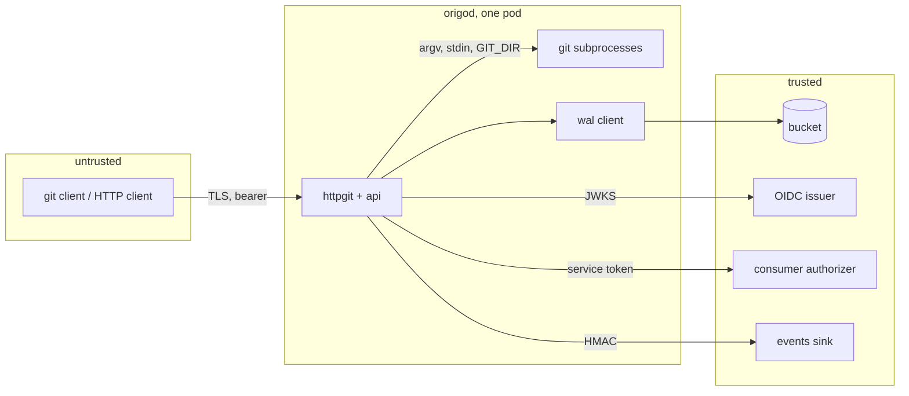

# Security and threat model

## Overview

A git server holds source code and accepts bytes from anyone who can
reach it. This spec names the assets, the attackers, the trust
boundaries, and the control that answers each threat, so a reviewer
outside the project can check the design rather than take it on faith.
It also fixes the disclosure process and the hardening of the process
and the pod.

## Current state

Phase 1 verifies a static bearer, runs git subprocesses with
`receive.fsckObjects` and `core.protectNTFS`, bounds request bodies, and
holds no secret beyond the bucket credentials. There is no written threat
model and no `SECURITY.md`.

## Design

### Assets

Repository contents and history; the bucket credentials; the token signing
key for repository-bound tokens; the authorizer token; the events secret;
the availability of the service for every repository at once.

### Trust boundaries

Everything left of `origod` is hostile. The bucket, the issuer, the
authorizer, and the sink are trusted for what they say but not for
availability (spec 015). A git subprocess handles hostile bytes and is
treated as semi-trusted: it runs with a minimal environment, no shell,
no network, a timeout, and under the pod's security context.

### Threats and controls

| Threat | Control | Spec |
|---|---|---|
| Reading a repository without permission | every request authenticated; authorization asked of the consumer per action and cached briefly; deny by default; repository-bound tokens scoped to one repository and one action | 007 |
| Writing to a repository without permission | same; `write` asked before the pack is accepted, not after | 007 |
| A service acting as a user beyond its mandate | `act` is recorded on every entry and event; the authorizer sees both subject and actor and may refuse the pair | 007 |
| Malformed or malicious git objects | `receive.fsckObjects`, `transfer.fsckObjects`, `core.protectNTFS`, `core.protectHFS`; symlink and path checks are git's, and Origo never checks out a tree on the server except into the archive stream, which uses `git archive` with no filesystem write | 004, 009 |
| Command injection through refs, owner, slug, or paths | ref names validated by `git check-ref-format`; owner and slug by a strict grammar; subprocess arguments never pass through a shell; `GIT_DIR` set explicitly; hooks are Origo's own with no user hooks ever executed | 003, 004 |
| Resource exhaustion by one client | per-subject rate limit, per-node subprocess cap, body and repository size limits, subprocess timeouts, connection limits | 012 |
| Exhaustion through the bucket | breakers and timeouts so one slow client cannot hold a subprocess open against a slow bucket | 015 |
| Token theft | short-lived repository tokens; issuer tokens verified for audience; tokens never logged, never in URLs on the server side (basic auth password is accepted for git and stripped from logs) | 007, 011 |
| Secret exposure in logs or metrics | fixed-vocabulary labels; the leak tests of spec 011; the registers rule for messages | 011 |
| Tampering with the log | objects are immutable once written; entry digests are checked at materialization; a mismatch is an integrity error, never repaired from a local copy | 004, 015 |
| Cross-repository leakage on a node | one bare repository per id under the cache directory, `GIT_DIR` per request, no shared object store, no alternates | 004 |
| Supply chain | the image is built from a pinned Go toolchain and a pinned git, with a software bill of materials and provenance attached to the release; dependencies are the standard library plus `latere.ai/x/pkg` | 002, 017 |
| A compromised node | the node holds bucket credentials and the signing key; the blast radius is every repository the credentials reach, which is why one Origo installation serves one trust domain and the bucket prefix is dedicated | 001 |

### Process and pod hardening

Non-root user, read-only root filesystem with the cache volume the only
writable mount, `automountServiceAccountToken: false`, all capabilities
dropped, seccomp `RuntimeDefault`, no privilege escalation, resource
limits set. Git subprocesses inherit an environment of exactly `PATH`,
`HOME` pointing at an empty directory, `GIT_DIR`, and the `GIT_CONFIG_*`
variables Origo sets; `GIT_TERMINAL_PROMPT=0` and no credential helper.

### Transport

TLS terminates at the ingress; the public listener may be plain HTTP
inside the cluster only. Bearer tokens are required on every request
including `info/refs`; there is no anonymous read in v1 (an operator who
wants public repositories does so through the authorizer answering allow
for an anonymous subject, a later option).

### Disclosure

`SECURITY.md` at the root: report to `security@latere.ai`, acknowledged
within 3 business days, fixed releases within 30 days for high severity,
credit in the release notes on request. Vulnerable dependencies are
caught by the gate's `vuln` check on every push.

## Acceptance criteria

- A request without a token, with a token for another audience, or with
  an expired token is refused on every endpoint including `info/refs`.
- A pushed pack containing a `.git` directory entry, an NTFS-reserved
  name, or a broken object is rejected with git's message and nothing is
  written to the log.
- A ref name, owner, or slug containing shell metacharacters or `..`
  is refused at validation and never reaches a subprocess (fuzz test over
  the validators).
- A git subprocess observes only the documented environment
  (test spawns `env` through the same runner).
- The image runs with the documented security context in the kind stack
  and the pod fails to start if the context is relaxed by a test overlay.
- `SECURITY.md` exists and the release carries a bill of materials and
  provenance (spec 017).
