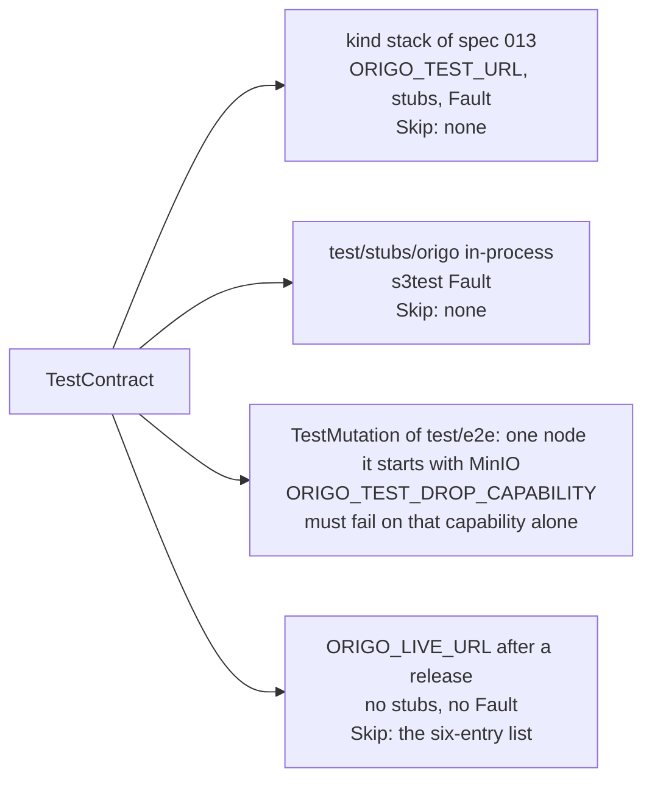

# Conformance suite

## Overview

The contract in spec 003 is only worth something if it is checked. This
spec turns it into a Go test package that runs against any base URL: a
live Origo, the contract stub of spec 013, a consumer's own stub, or a
future provider. Origo's own release is gated on it (spec 017), and
consumers run it against their stubs so their integration tests and the
real service agree. The stubs and the stack it runs on are spec 013's;
this spec is the suite, the code table it compares against, the
mutation job that proves the suite can fail, and the run against the
live service after a release.

## Current state

Nothing of this spec exists. `test/e2e` covers the flows of specs 003
and 004 against one node with the phase 1 bearer; `internal/contract`
holds the codes and the header and no table of sentences; the
sentences the code sends are the `Message` fields of the
`httpjson.Error` literals in `cmd/origod`, `internal/httpgit`, and
`internal/api`, and spec 003's Outcome lists the ones that differ from
the contract, which the code table test below is what fixes. Spec 013's
stubs and overlay, which the suite needs for its delegation and
deny-flipping cases and for its CI run, are not built either.

## Design

### The package

`test/conformance` is importable:

```go
conformance.Run(t, conformance.Target{
    URL:        "https://git.example.com",
    Token:      "<a token with admin on every repository the suite creates>",
    Issuer:     "<the stub issuer's URL, for the delegation and token cases>",
    Authorizer: "<the stub authorizer's control URL, to flip allow and deny>",
    EventsSink: "<the stub sink's control URL, to read deliveries>",
    Source:     "<a git source URL for the import and verify cases; empty on a live target>",
    SourceToken: "<the bearer that source requires>",
    Fault:      <a Fault, to cut the bucket and delete an object; nil on a live target>,
    Skip:       []string{"<a subtest name>"},
})
```

It drives the real `git` binary and `net/http` against the target and
asserts every table of spec 003 and of the specs it points at, one
subtest per row, named `TestContract/<spec>/<row>`: the repository
lifecycle, each advertised capability, fetch by reachable hash, atomic
pushes, non-fast-forward rejection, the read endpoints against a fixture
it pushes itself, archive reproducibility, delegation with `act`,
repository-bound tokens, push event delivery and signature, LFS, the
administration operations of spec 019, the server-side operations of
spec 020 once they exist, and every error code with its sentence. Every
repository the suite creates carries a slug prefixed `conformance-` and
is deleted at the end of the run, so a run against a shared installation
leaves nothing; `Run` deletes by the ids it created and never lists or
deletes by prefix, so a repository another test pushed beside it, spec
017's release fixture among them, survives the run.

Cases a target does not support are skipped by a `Skip` list on the
target, never silently: each skipped case is reported by name. Four
groups skip on their own when the field they need is empty, because
they drive the stubs and a live service has none: the delegation cases
(`act` on a service token, which need `Issuer` to mint one), the
deny-flipping cases (403 before lookup, the authorizer outage, and
`authorizer_unavailable`, which need `Authorizer` to flip an answer),
the quota row (`over_quota`, which needs `Authorizer` to set
`quota_bytes` on a rule below the size of the push the case makes,
because no target's default quota is small enough to fill in a test),
and the source group (the `import` of spec 019 and the `verify` of
spec 014, with `repo_importing`, `repo_not_empty`, and the `imported`
event, which need `Source` and `SourceToken`: on the stack the source
stub of spec 013 at `https://origo-stubs.origo.svc:8443/fixture.git`
with `stub-source-token`, the address the nodes reach through
`ORIGO_EGRESS_ALLOW`; the stub run leaves them empty and reports the
group skipped, because a loopback source needs the `AllowLoopback`
seam spec 016 restricts to `_test.go` files, and specs 019 and 014
prove `import` and `verify` in-process in their own tests). Two rows
need a fault in the bucket that a caller outside the installation
cannot cause: `storage_unavailable` (spec 003) needs the
bucket unreachable, and `repository_unavailable` (spec 015) needs a
pack object gone. `Fault` is an interface with `CutStorage(t)`, which
makes the bucket unreachable until the test ends, and
`DeleteObject(t, key)`; the stack run implements it with the
NetworkPolicy spec 015's cluster scenario uses,
`test/e2e/testdata/cut-storage.yaml` applied with `cluster.ApplyManifest`
of spec 013's `test/e2e/cluster` and removed by its cleanup (enforced
by the Cilium row of spec 013's overlay table), and a delete through
the MinIO host port with the `ORIGO_TEST_S3_ENDPOINT` family the job
exported; the stub run implements it on the `s3test.Server` behind
the contract stub (spec 013 wires the stub through the S3 adapter to
`latere.ai/x/pkg/s3/s3test` so the presigned transfers of spec 010
resolve), `CutStorage` through the server's `Fail` for every request
until the test ends and `DeleteObject` through the adapter's `Delete`,
and a live target has none. `test/conformance` imports
`test/e2e/cluster` only from files under the `e2e` build tag, the
stack run's `Fault`, so the package a consumer imports, and
`TestStubConforms` in the unit suite, pull in no `kubectl` helper. The live run's `Skip` list is exactly the table
below and nothing else; the run prints each entry as skipped, so a
report with fewer or more skipped names is a failure of the run.

| Skipped on the live run | Why |
|---|---|
| the delegation group: `act` on a service token, the repository-bound token minted through delegation | needs `Issuer` to mint the token |
| the deny-flipping group: 403 before lookup, the authorizer outage, `authorizer_unavailable` | needs `Authorizer` to flip an answer |
| the quota row: `over_quota` | needs `Authorizer` to lower `quota_bytes` |
| the source group: `import`, `verify`, `repo_importing`, `repo_not_empty`, the `imported` event | needs `Source` and `SourceToken` |
| the `storage_unavailable` row of spec 003 | needs `Fault` to cut the bucket |
| the `repository_unavailable` row of spec 015 | needs `Fault` to delete a pack object |

Every other case runs against the live service, so the live run proves
the surface and the stack run proves the surface, the trust logic, and
the degraded rows.

Two codes no target can produce inside a test run are checked from the
code table alone and by no case of the suite: `gone` (spec 019), which
needs the 7-day hold after a delete to pass, and `operation_timeout`
(spec 009), which needs a git subprocess held past its deadline. For
them the table check below is the whole proof: the code has a sentence
and a status, and a literal in the code sends it. Every other row of
the table is produced on a target by one case of the suite, skipped
with its group when the field the group needs is empty.

`TestContract` is the package's own test over `Run`. It carries the
`e2e` build tag, like every test that needs a stack, so the unit suite
the gate runs never reaches for one, and it skips with the message
`nothing answers at ORIGO_TEST_URL` when the target does not answer,
so the tier runs on a developer's machine without the stack. The stack
run reads its target from `ORIGO_TEST_URL` and
`ORIGO_TEST_ADMIN_TOKEN` (spec 002), whose defaults are the ports
table of spec 013 (`http://localhost:30080`, and a token minted at the
issuer's host port for the dev subject), and reaches the three stub
control endpoints at the host ports of the same table
(`http://localhost:30081`, `30082`, `30083`) and MinIO for its `Fault`
at `http://localhost:30900`, all held by the package as defaults so
spec 013's `e2e` job sets nothing. The live run reads `ORIGO_LIVE_URL` and
`ORIGO_LIVE_TOKEN` (spec 002), two repository secrets: the installation
a release reaches and a token with `admin` on the `conformance-`
prefix. `ORIGO_LIVE_URL` set selects the live run over the stack
default: `TestContract` then targets it with `ORIGO_LIVE_TOKEN`, no
stub endpoints, no `Fault`, and the skip list above, and never reads
`ORIGO_TEST_URL`, so one test serves both runs and the `live` job sets
the two secrets and nothing else.

### The code table

`internal/contract` gains the code table as data: code, status, and
the one sentence, for every row of the Code tables of spec 003 and of
specs 007, 009, 010, 015, and 019, which is every code the
cross-reference in `specs/README.md` lists except spec 020's; spec 020
adds its rows, `invalid_change` and `merge_conflict`, and the literals
that send them when it lands, and the rule below that a row no literal
sends is a failure applies to the codes of a spec at `testing` or
later, so the table never fails on a code whose handler is not built
yet. The table check covers every row without a target: every code
has one sentence and one status, and every literal in the code has a
row; the suite's cases produce the rows on a target, except the two
the paragraph above names. Spec 010's three rows are
rendered in the LFS body shape and through `contract.Sentence`, never
as an `httpjson.Error`, so for them the test asserts the `Sentence`
call and no literal. `TestEveryCodeHasOneSentence`
walks every Go file of the module outside `tools/`, parses it with
`go/parser`, and collects every composite literal of type
`httpjson.Error` (the envelope type of `latere.ai/x/pkg/httpjson`,
which every handler renders through `httpjson.WriteError`): its `Code` field must be a `contract.Code*` constant
the table holds, and its `Message` field must be a string literal equal
to the table's sentence for that code. A `Message` built from an
expression (`err.Error()`, a concatenation, a `fmt.Sprintf`) is a
failure, because the reason belongs in `details`, and so is a table row
no literal sends, for a code of a spec at `testing` or later, so a dead
row is noticed. Each failure names the file
and line. The sideband and hook lines (`ERR <code>: <sentence>`,
`reject <code>: <sentence>`) are rendered from the same table by
`contract.Sentence(code)` and hold no sentence of their own, so the
grep over `httpjson.Error` literals is the whole of what can drift. The
suite compares live responses to the same table. The divergences spec
003's Outcome lists are fixed by making this test pass. The test walks
the module from a root held in a test-only constant resolved from its
own source file with `runtime.Caller`, never from the working
directory, so the `tempdir` gate of spec 002, which runs the suite
from an empty directory, and the `hermetic` gate see the module's
files; spec 011's register test reads its spec the same way, and the
builder is told here.

### The mutation job

A job in `verify.yml` runs `TestMutation` of `test/e2e` once per
capability the node controls through git configuration, with
`ORIGO_TEST_DROP_CAPABILITY` (spec 002) set to that capability's name.
`TestMutation` is a wrapper, not a second suite: it starts one node of
its own from the `ORIGO_TEST_S3_ENDPOINT` family the job exported,
with the variable in the node's environment, the same way spec 008's
repair case starts its nodes; runs `conformance.Run` against that node
with an in-process issuer, authorizer, and sink and no `Fault`; and
passes only when the run fails and every failed subtest is one that
asserts the dropped capability (the capability's row of spec 003's
table, and the fetch or push that uses it), so a suite that fails for
another reason, or that does not notice the drop, fails the job. With
the variable unset the test skips. The variable is read by `internal/config` and
acted on by `internal/repo` when it writes the repository
configuration of spec 004: `filter` turns `uploadpack.allowFilter` off,
`allow-tip-sha1-in-want` and `allow-reachable-sha1-in-want` turn
`uploadpack.allowAnySHA1InWant` off, `atomic` turns
`receive.advertiseAtomic` off, `push-options` turns
`receive.advertisePushOptions` off. `shallow`, `deepen-since`,
`deepen-not`, and `report-status-v2` are advertised by git whatever the
configuration and are not in the mutation set; the suite asserts them
on every run. Any other value is a start-up error. The job runs with
MinIO as a service container, like the `integration` job of spec 013,
and no stack, because the capabilities are per node and `TestMutation`
starts the node, under the 20 minute budget spec 013's job table gives
it: five runs of the suite, so a suite that takes more than 4 minutes
against one node is a spec change, not a budget change.

| Test variable | Purpose |
|---|---|
| `ORIGO_TEST_DROP_CAPABILITY` | defined in spec 002's table; set by the mutation job on the node under test, one name from the set above |
| `ORIGO_TEST_URL`, `ORIGO_TEST_ADMIN_TOKEN` | defined in spec 002's table; the stack run's target, defaulting to the ports table of spec 013 when unset |
| `ORIGO_LIVE_URL`, `ORIGO_LIVE_TOKEN` | defined in spec 002's table; the live run's target, two repository secrets; the `live` job is skipped when the URL is unset, so a fork runs no live run |

### Runs



| Run | Target | When |
|---|---|---|
| stack | the kind stack of spec 013, in its `e2e` job, through `ORIGO_TEST_URL` and `ORIGO_TEST_ADMIN_TOKEN` with the stubs and `Fault` wired; `TestSameAnswersOnStubAndStack` runs in the same job, because it needs the stack as its second target | every push to `main` and every pull request, inside that job's 30 minute budget |
| stub | `test/stubs/origo` in-process, its bucket the `s3test` server spec 013 wires behind it so the LFS rows run, `TestStubConforms` with an empty `Skip` list | every push, in the unit suite |
| mutation | `TestMutation` of `test/e2e`, which starts one node with MinIO from the `ORIGO_TEST_S3_ENDPOINT` family and runs `conformance.Run` against it, once per capability, 20 minutes (spec 013's job table) | every push |
| live | the installation `ORIGO_LIVE_URL` names, with `ORIGO_LIVE_TOKEN`, the `conformance-` prefix, and the skip list above | the `live` job of `release.yml`, after spec 017's deploy step and before its publish step, when the secret is set; its report and timings are attached to the release (spec 017) |
| previous release | the fixture of release N-1 on release N (spec 017, `TestPreviousReleaseFixture`) | in the release pipeline |

## Not in this spec

The stubs, the overlay, the tiers, and the CI budgets (spec 013). A
conformance run against a provider other than Origo. Performance
assertions beyond the thresholds the owning specs name.

## Acceptance criteria

- `TestContract` passes against the kind stack on every push to `main`
  inside spec 013's `e2e` job with nothing skipped, and against the
  installation `ORIGO_LIVE_URL` names after a release with exactly the
  six entries of the skip list skipped and each reported by name
  (`verify.yml`; `release.yml`, the `live` job; the release evidence of
  spec 017).
- With `Fault` wired, the `storage_unavailable` row answers 503 with
  the table's sentence while the bucket is cut (on the stack, by
  `cluster.ApplyManifest` of `cut-storage.yaml`) and the
  `repository_unavailable` row answers 503 with `details.key` naming
  the deleted pack (on the stack, deleted through the MinIO host
  port), on the stack and on the stub; on a target with no `Fault`
  both rows are skipped and reported (proposed:
  `test/conformance`, `TestContract/003/storage_unavailable`,
  `TestContract/015/repository_unavailable`).
- Removing any one git-controlled capability (`filter`,
  `allow-tip-sha1-in-want`, `allow-reachable-sha1-in-want`, `atomic`,
  `push-options`) from the server's advertised set makes
  `conformance.Run` fail on exactly the subtests that assert that
  capability and on no other, and an unknown value refuses start-up,
  the five runs inside the job's 20 minutes (proposed: `test/e2e`,
  `TestMutation`, which starts the node with `ORIGO_TEST_DROP_CAPABILITY`
  from the job and skips without it; `.github/workflows/verify.yml`,
  the `mutation` job running it once per capability; `internal/config`,
  `TestDropCapabilityIsOneOfTheSet`).
- The contract stub passes `TestContract` with an empty `Skip` list,
  the LFS rows included, because its bucket is the `s3test` server
  spec 013 wires through the S3 adapter and presigned URLs resolve
  against it (proposed: `test/stubs/origo`, `TestStubConforms`).
- A consumer's integration tests written against the stub pass
  unchanged against a live node (spec 003's criterion; proposed:
  `test/conformance`, `TestSameAnswersOnStubAndStack`, which runs one
  consumer-shaped flow against the in-process stub and against the
  stack at `ORIGO_TEST_URL` and compares the responses field by field;
  it runs in spec 013's `e2e` job beside `TestContract`).
- Every `httpjson.Error` literal in the module carries a `Code` the
  table holds and a `Message` that is the string literal of the
  table's sentence, every table row of a spec at `testing` or later is
  sent by at least one literal or, for spec 010's three LFS rows, by
  one `contract.Sentence` call,
  and a `Message` built from an expression fails with its file and
  line; the test fails on the tree as it stands today, on the
  lower-case sentences spec 003's Outcome lists, and passes once they
  are the table's (proposed: `internal/contract`,
  `TestEveryCodeHasOneSentence`).
- A run against a shared installation leaves no repository behind and
  touches no other: after `TestContract`, `GET /v1/repos/{id}` answers
  404 for every id the run created, and a repository created beside
  the run under a `conformance-` slug by the test itself still answers
  200 (proposed: `test/conformance`, `TestRunCleansUp`).
