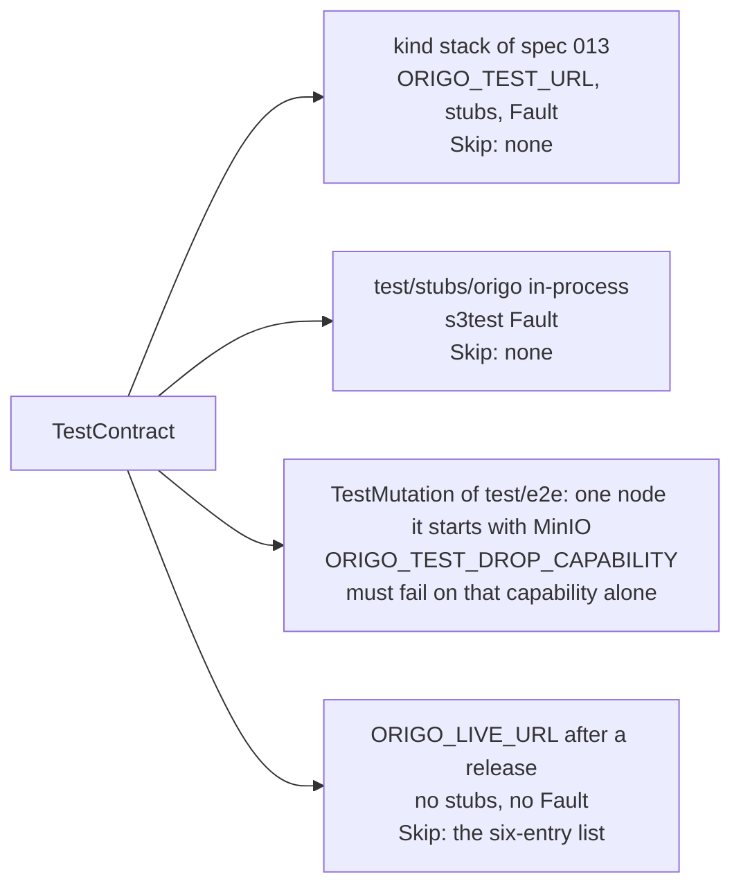

# Conformance suite

## Overview

The contract in spec 003 is only worth something if it is checked. This
spec turns it into a Go test package that runs against any base URL: a
live Origo, the contract stub of spec 013, a consumer's own stub, or a
future provider. Origo's own release is gated on it (spec 017), and
consumers run it against their stubs so their integration tests and the
real service agree. The stubs and the stack it runs on are spec 013's;
this spec is the suite, the code table it compares against, the
mutation job that proves the suite can fail, and the run against the
live service after a release.

## Current state

Built on 2026-09-09; the Outcome below records what landed. The suite
is `test/conformance`, the code table with its statuses is
`internal/contract`, the mutation seam is `ORIGO_TEST_DROP_CAPABILITY`
through `internal/config` and `internal/repo`, and the stub of spec 013
serves the whole contract in-process. The spec has been `complete`
since the live run of the v0.1.3 release on 2026-09-11.

## Design

### The package

`test/conformance` is importable:

```go
conformance.Run(t, conformance.Target{
    URL:        "https://git.example.com",
    Token:      "<a token with admin on every repository the suite creates>",
    Issuer:     "<the stub issuer's URL, for the delegation and token cases>",
    Authorizer: "<the stub authorizer's control URL, to flip allow and deny>",
    EventsSink: "<the stub sink's control URL, to read deliveries>",
    Source:     "<a git source URL for the import and verify cases; empty on a live target>",
    SourceToken: "<the bearer that source requires>",
    Fault:      <a Fault, to cut the bucket and delete an object; nil on a live target>,
    Skip:       []string{"<a subtest name>"},
})
```

It drives the real `git` binary and `net/http` against the target and
asserts every table of spec 003 and of the specs it points at, one
subtest per row, named `TestContract/<spec>/<row>`: the repository
lifecycle, each advertised capability, fetch by reachable hash, atomic
pushes, non-fast-forward rejection, the read endpoints against a fixture
it pushes itself, archive reproducibility, delegation with `act`,
repository-bound tokens, push event delivery and signature, LFS, the
administration operations of spec 019, the server-side operations of
spec 020 once they exist, and every error code with its sentence. Every
repository the suite creates carries a slug prefixed `conformance-` and
is deleted at the end of the run, so a run against a shared installation
leaves nothing; `Run` deletes by the ids it created and never lists or
deletes by prefix, so a repository another test pushed beside it, spec
017's release fixture among them, survives the run.

The `rate_limited` case (spec 012) needs no field of `Target`: it reads
`RateLimit-Limit` and `RateLimit-Remaining` off a response under the
token it will spend, then proves the limit by the counter rather than
by exhausting it, which is the only observation that survives a
balancer. It holds against an installation at the default, against the
`kind` stack, which runs at 6000 because its scenarios exceed 600, and
against a production installation of two to eight replicas. A target
with the limit off sends no header and the case is reported skipped.
The 429 half is asserted where it converges and recorded in
`Report.Unverified` where it cannot; the decision below carries the
figures and the reasoning.

Cases a target does not support are skipped by a `Skip` list on the
target, never silently: each skipped case is reported by name. Four
groups skip on their own when the field they need is empty, because
they drive the stubs and a live service has none: the delegation cases
(`act` on a service token, which need `Issuer` to mint one), the
deny-flipping cases (403 before lookup, the authorizer outage, and
`authorizer_unavailable`, which need `Authorizer` to flip an answer),
the quota row (`over_quota`, which needs `Authorizer` to set
`quota_bytes` on a rule below the size of the push the case makes,
because no target's default quota is small enough to fill in a test),
and the source group (the `import` of spec 019 and
`repo_not_empty`, with `repo_importing` and the `imported` event
asserted inside the `import` case, which need `Source` and
`SourceToken`: on the stack the source
stub of spec 013 at `https://origo-stubs.origo.svc:8443/fixture.git`
with `stub-source-token`, the address the nodes reach through
`ORIGO_EGRESS_ALLOW`; the stub run leaves them empty and reports the
group skipped, because a loopback source needs the `AllowLoopback`
seam spec 016 restricts to `_test.go` files, and specs 019 and 014
prove `import` and `verify` in-process in their own tests). Two rows
need a fault in the bucket that a caller outside the installation
cannot cause: `storage_unavailable` (spec 003) needs the
bucket unreachable, and `repository_unavailable` (spec 015) needs a
pack object gone. `Fault` is an interface with `CutStorage(t)`, which
makes the bucket unreachable until the test ends, and
`DeleteObject(t, key)`; the stack run implements it with the
NetworkPolicy spec 015's cluster scenario uses,
`test/e2e/testdata/cut-storage.yaml` applied with `cluster.ApplyManifest`
of spec 013's `test/e2e/cluster` and removed by its cleanup (enforced
by the Cilium row of spec 013's overlay table), and a delete through
the MinIO host port with the `ORIGO_TEST_S3_ENDPOINT` family the job
exported; the stub run implements it on the `s3test.Server` behind
the contract stub (spec 013 wires the stub through the S3 adapter to
`latere.ai/x/pkg/s3/s3test` so the presigned transfers of spec 010
resolve), `CutStorage` through the server's `Fail(n, status)` as
`Fail(math.MaxInt, 503)` with `Fail(0, 0)` registered on the test's
cleanup, which is how that method covers every request until the test
ends, and `DeleteObject` through the adapter's `Delete`,
and a live target has none. `test/conformance` imports
`test/e2e/cluster` only from files under the `e2e` build tag, the
stack run's `Fault`, so the package a consumer imports, and
`TestStubConforms` in the unit suite, pull in no `kubectl` helper. The live run's `Skip` list is exactly the table
below and nothing else; the run prints each entry as skipped, so a
report with fewer or more skipped names is a failure of the run.

| Skipped on the live run | Why |
|---|---|
| the delegation group: `act` on a service token, the repository-bound token minted through delegation | needs `Issuer` to mint the token |
| the deny-flipping group: 403 before lookup, the authorizer outage, `authorizer_unavailable` | needs `Authorizer` to flip an answer |
| the quota row: `over_quota` | needs `Authorizer` to lower `quota_bytes` |
| the source group: `import` and `repo_not_empty`, with `repo_importing` and the `imported` event asserted inside `import` | needs `Source` and `SourceToken` |
| the `storage_unavailable` row of spec 003 | needs `Fault` to cut the bucket |
| the `repository_unavailable` row of spec 015 | needs `Fault` to delete a pack object |

Every other case runs against the live service, so the live run proves
the surface and the stack run proves the surface, the trust logic, and
the degraded rows.

Two codes no target can produce inside a test run are checked from the
code table alone and by no case of the suite: `gone` (spec 019), which
needs the 7-day hold after a delete to pass, and `operation_timeout`
(spec 009), which needs a git subprocess held past its deadline. For
them the table check below is the whole proof: the code has a sentence
and a status, and a call site in the code sends it. Every other row of
the table is produced on a target by one case of the suite, skipped
with its group when the field the group needs is empty.

`TestContract` is the package's own test over `Run`. It carries the
`e2e` build tag, like every test that needs a stack, so the unit suite
the gate runs never reaches for one, and it skips with the message
`nothing answers at ORIGO_TEST_URL` when the target does not answer,
so the tier runs on a developer's machine without the stack. The stack
run reads its target from `ORIGO_TEST_URL` and
`ORIGO_TEST_ADMIN_TOKEN` (spec 002), whose defaults are the ports
table of spec 013 (`http://localhost:30080`, and a token minted at the
issuer's host port for the dev subject), and reaches the three stub
control endpoints at the host ports of the same table
(`http://localhost:30081`, `30082`, `30083`) and MinIO for its `Fault`
at `http://localhost:30900`, all held by the package as defaults so
spec 013's `e2e` job sets nothing. The live run reads `ORIGO_LIVE_URL` and
`ORIGO_LIVE_TOKEN` (spec 002), two repository secrets: the installation
a release reaches and a token with `admin` on the `conformance-`
prefix. `ORIGO_LIVE_URL` set selects the live run over the stack
default: `TestContract` then targets it with `ORIGO_LIVE_TOKEN`, no
stub endpoints, no `Fault`, and the skip list above, and never reads
`ORIGO_TEST_URL`, so one test serves both runs and the `live` job sets
the two secrets and nothing else.

### The code table

`internal/contract` gains the code table as data: code, every status
the row lists, and the one sentence, for every row of the Code tables
of spec 003 and of specs 007, 009, 010, 015, 019, 020, and 026, which
is every code the cross-reference in `specs/README.md` lists, the 25 of
the `producers` table below; spec 020's two rows, `invalid_change` and
`merge_conflict`, are in the table from the start and spec 020 adds
the call sites that send them when it lands, and the rule below that a
row no call site sends is a failure applies to the codes whose
producing spec (the table below) is at `testing` or later, so the
table never fails on a code whose handler is not built yet. The table check covers every row without a target: every code
has one sentence and at least one status, and every call site passes a code of
the table; the suite's cases produce the rows on a target, except the two
the paragraph above names. Spec 010's three rows are
rendered in the LFS body shape and through `contract.Sentence`, never
through `contract.Write`, so for them a `contract.Sentence` call is the
call site the rule below counts; the same holds for `non_fast_forward`,
whose only call site today is the hook verdict of `internal/httpgit`,
which the sideband rule below turns into a `contract.Sentence` call. The table gains the statuses beside the sentence. A row holds every
HTTP status the Status column of its spec's Code table lists, in the
column's order: one for most codes, two for `repo_frozen` (403 on a
write, 409 on a second freeze, spec 019); a code whose column names
the sideband and one JSON status (`non_fast_forward`) holds the JSON
status. `contract.Status(code) int` answers the first status of the
row and panics on an unknown code the way `Sentence` does; the test
below is in the package, reads the row itself, and accepts a call
site whose status is any status of the row, so a handler sends
`repo_frozen` under 403 or 409 and nothing else. `contract.Write(w,
status, code, details)` keeps its status argument, so no call site
changes shape; the test below holds the argument to the table.

`TestEveryCodeHasOneSentence` walks every Go file of the module
outside `tools/`, parses each with `go/parser`, and reads selectors
with `go/ast` alone: `httpjson.Error` and `contract.Write` are the
selectors on the import names `httpjson` and `contract`, and a file
that imports either package under another name is a failure, so the
walk needs no type checker. It fails on:

- a composite literal of type `httpjson.Error` or a call of
  `httpjson.WriteError` in any package but `internal/contract`,
  because `contract.Write` is the one renderer of the envelope;
- a call of `contract.Write`, `contract.Error`, or `contract.Sentence`
  whose code argument is not a `contract.Code*` identifier (a string
  literal, a variable, an expression), because the constants are the
  table's keys and a string can name a code the table lacks;
- a call of `contract.Write` whose status argument is not a status of
  the row of the code it passes: the argument is an integer literal or
  an `http.Status*` selector, which the test resolves by parsing the
  `net/http` package under `runtime.GOROOT()` with the same parser for
  its `Status*` integer constants, and any other form (a variable, a
  call) is a failure, so a handler cannot send a code under a status
  its spec does not give it. This rule runs only when the code
  argument is a `contract.Code*` identifier: a call the bullet above
  already reports has no row to check against and yields one finding,
  not two;
- a code of the table with no call site of the three functions
  anywhere in the module, for a code whose producing spec is at
  `testing` or `complete`, so a dead row is noticed; a code whose
  producer was not there yet, spec 020's two and spec 012's two when
  the rule was written, may have none.

Each failure names the file and line. The test also holds the table
itself: every code constant has one sentence and at least one status,
and `Codes()` lists every constant.

The call-site rule is keyed on the spec that produces a code, not the
spec that defines it, because three codes of spec 003's table are
produced by handlers a later spec builds: `ref_not_found` by the read
API of spec 009, `over_quota` and `rate_limited` by the enforcement of
spec 012. The test holds `producers map[string]string`, code to spec
number, which is the table below in full; a builder copies it. It
reads the `status:` line of the frontmatter of `specs/<nnn>-*.md`
under the module root, or under `specs/.archive/` where a terminal
spec sits, for each number; a number found in neither, or a code in
`producers` and not in `Codes()` or the reverse, is a failure, so a
spec that adds a row adds it here. Spec 012 is a dependency of this
spec for the same reason: the `over_quota` row of the suite needs its
enforcement.

| Producing spec | Codes |
|---|---|
| 003 | `invalid_request`, `unauthenticated`, `forbidden`, `repo_not_found`, `repo_exists`, `non_fast_forward`, `storage_unavailable` |
| 007 | `authorizer_unavailable` |
| 009 | `ref_not_found`, `blob_too_large`, `operation_timeout` |
| 010 | `lfs_object_mismatch`, `lfs_object_not_stored`, `lfs_locks_unsupported` |
| 012 | `over_quota`, `rate_limited` |
| 015 | `repository_unavailable` |
| 019 | `gone`, `repo_frozen`, `repo_importing`, `repo_not_empty`, `import_not_found` |
| 020 | `merge_conflict`, `invalid_change` |
| 026 | `directory_unsupported` |

The test proves it can fail on a negative fixture,
`test/conformance/testdata/negative/bad.go.txt`. It sits outside
`internal/contract`, because the literal rule exempts that package by
directory, and ends in `.go.txt` so no Go tool parses it and the
module walk, which reads `.go` files and skips `tools/` and every
`testdata` directory, never sees it; the test feeds it to the same
walk by path. The file is this and nothing else:

```go
// SPDX-FileCopyrightText: 2026 Latere AI
// SPDX-License-Identifier: MIT

// Package negative is the fixture TestEveryCodeHasOneSentence must fail on.
package negative

import (
	"net/http"

	"latere.ai/x/pkg/httpjson"

	"github.com/latere-ai/origo/internal/contract"
)

func bad(w http.ResponseWriter) {
	_ = httpjson.Error{Code: "not_found", Message: "Not found."}
	contract.Write(w, http.StatusNotFound, "not_found", nil)
}
```

The walk must yield exactly two findings, the literal at
`test/conformance/testdata/negative/bad.go.txt:16` and the string
code at `test/conformance/testdata/negative/bad.go.txt:17`, and no
third: the status rule does not run on line 17 because its code
argument is not a `contract.Code*` identifier, and the call-site rule
does not run on the fixture because it is not part of the module
walk. The test compares the findings to that list, file and line, so
a walk that misses one or reports the status of line 17 fails.

Every line git relays to the client that carries a code of the table,
the hook verdict `reject <code>: <sentence>` of `internal/httpgit`
(git prints it as `remote: <code>: <sentence>`), the `ERR <code>:
<sentence>` pkt-line of specs 015 and 019, and the sideband
`over_quota` of spec 012, is `<code>: <sentence>` exactly, the
sentence read through `contract.Sentence` with nothing appended or
substituted. The reference and the hashes of a refused push go to the
handler's `info` log line for the rejected push (`repo`, `code`,
`ref`, `expected`, `actual`), never the sideband; the storage error
stays on the `commit failed` error line as today. This spec owns the
rule and its test, which is where spec 003's Outcome points: the walk
does not see a string a handler builds by hand, and the suite's
`storage_unavailable` case cannot reach the verdict, because with the
bucket cut `info/refs` answers 503 before a pack is sent, so
`TestRejectLinesAreTheTableSentences` in `internal/httpgit` holds the
verdicts. It pushes twice through the handler over the in-memory
store: once over a reference moved behind the client, and once with
the store's fault (`wal.MemStore.SetFault`) set to fail the entry `Put`
after the advertisement,
and asserts that git's output carries `remote: <code>: <sentence>`
for `non_fast_forward` and for `storage_unavailable`, the sentence
equal to `contract.Sentence` of the code, and that the moved
reference's name and the two hashes are on the `info` line and not in
the output. The suite's `non_fast_forward` case compares the line git
reports to the same sentence on every target. The suite compares
every live response to the same table. The test walks the module
from a root held in a test-only constant resolved from its own source
file with `runtime.Caller`, never from the working directory, so the
`tempdir` gate of spec 002, which runs the suite from an empty
directory, and the `hermetic` gate see the module's files; spec 011's
register test reads its spec the same way, and the builder is told
here.

### The mutation job

A job in `verify.yml` runs `TestMutation` of `test/e2e` once per
capability the node controls through git configuration, with
`ORIGO_TEST_DROP_CAPABILITY` (spec 002) set to that capability's name.
`TestMutation` is a wrapper, not a second suite: it starts one node of
its own from the `ORIGO_TEST_S3_ENDPOINT` family the job exported,
with the variable in the node's environment, the same way spec 008's
repair case starts its nodes; runs `conformance.Run` against that node
with an in-process issuer, authorizer, and sink and no `Fault`; and
passes only when the run fails and every failed subtest is one that
asserts the dropped capability (the capability's row of spec 003's
table, and the fetch or push that uses it), so a suite that fails for
another reason, or that does not notice the drop, fails the job. With
the variable unset the test skips. The variable is read by `internal/config` and
acted on by `internal/repo` when it writes the repository
configuration of spec 004: `filter` turns `uploadpack.allowFilter` off,
`allow-tip-sha1-in-want` and `allow-reachable-sha1-in-want` turn
`uploadpack.allowAnySHA1InWant` off, `atomic` turns
`receive.advertiseAtomic` off, `push-options` turns
`receive.advertisePushOptions` off. `shallow`, `deepen-since`,
`deepen-not`, and `report-status-v2` are advertised by git whatever the
configuration and are not in the mutation set; the suite asserts them
on every run. Any other value is a start-up error. The job runs with
MinIO as a service container, like the `integration` job of spec 013,
and no stack, because the capabilities are per node and `TestMutation`
starts the node, under the 20 minute budget spec 013's job table gives
it: five runs of the suite, so a suite that takes more than 4 minutes
against one node is a spec change, not a budget change.

| Test variable | Purpose |
|---|---|
| `ORIGO_TEST_DROP_CAPABILITY` | defined in spec 002's table; set by the mutation job on the node under test, one name from the set above |
| `ORIGO_TEST_URL`, `ORIGO_TEST_ADMIN_TOKEN` | defined in spec 002's table; the stack run's target, defaulting to the ports table of spec 013 when unset |
| `ORIGO_LIVE_URL`, `ORIGO_LIVE_TOKEN` | defined in spec 002's table; the live run's target, two repository secrets; the `live` job is skipped when the URL is unset, so a fork runs no live run |

### Runs



| Run | Target | When |
|---|---|---|
| stack | the kind stack of spec 013, in its `e2e` job, through `ORIGO_TEST_URL` and `ORIGO_TEST_ADMIN_TOKEN` with the stubs and `Fault` wired; `TestSameAnswersOnStubAndStack` runs in the same job, because it needs the stack as its second target | every push to `main` and every pull request, inside that job's 30 minute budget |
| stub | `test/stubs/origo` in-process, its bucket the `s3test` server spec 013 wires behind it so the LFS rows run, `TestStubConforms` with an empty `Skip` list | every push, in the unit suite |
| mutation | `TestMutation` of `test/e2e`, which starts one node with MinIO from the `ORIGO_TEST_S3_ENDPOINT` family and runs `conformance.Run` against it, once per capability, 20 minutes (spec 013's job table) | every push |
| live | the installation `ORIGO_LIVE_URL` names, with `ORIGO_LIVE_TOKEN`, the `conformance-` prefix, and the skip list above | the `live` job of `release.yml`, after spec 017's deploy step and before its publish step, when the secret is set; its report and timings are attached to the release (spec 017) |
| previous release | the fixture of release N-1 on release N (spec 017, `TestPreviousReleaseFixture`) | in the release pipeline |

## Not in this spec

The stubs, the overlay, the tiers, and the CI budgets (spec 013). A
conformance run against a provider other than Origo. Performance
assertions beyond the thresholds the owning specs name.

## Acceptance criteria

- `TestContract` passes against the kind stack on every push to `main`
  inside spec 013's `e2e` job with nothing skipped, and against the
  installation `ORIGO_LIVE_URL` names after a release with exactly the
  six entries of the skip list skipped and each reported by name
  (`verify.yml`; `release.yml`, the `live` job; the release evidence of
  spec 017).
- With `Fault` wired, the `storage_unavailable` row answers 503 with
  the table's sentence while the bucket is cut (on the stack, by
  `cluster.ApplyManifest` of `cut-storage.yaml`) and the
  `repository_unavailable` row answers 503 with `details.key` naming
  the deleted pack (on the stack, deleted through the MinIO host
  port), on the stack and on the stub; on a target with no `Fault`
  both rows are skipped and reported (proposed:
  `test/conformance`, `TestContract/003/storage_unavailable`,
  `TestContract/015/repository_unavailable`).
- Removing any one git-controlled capability (`filter`,
  `allow-tip-sha1-in-want`, `allow-reachable-sha1-in-want`, `atomic`,
  `push-options`) from the server's advertised set makes
  `conformance.Run` fail on exactly the subtests that assert that
  capability and on no other, and an unknown value refuses start-up,
  the five runs inside the job's 20 minutes (proposed: `test/e2e`,
  `TestMutation`, which starts the node with `ORIGO_TEST_DROP_CAPABILITY`
  from the job and skips without it; `.github/workflows/verify.yml`,
  the `mutation` job running it once per capability; `internal/config`,
  `TestDropCapabilityIsOneOfTheSet`).
- The contract stub passes `TestContract` with an empty `Skip` list,
  the LFS rows included, because its bucket is the `s3test` server
  spec 013 wires through the S3 adapter and presigned URLs resolve
  against it (proposed: `test/stubs/origo`, `TestStubConforms`).
- A consumer's integration tests written against the stub pass
  unchanged against a live node (spec 003's criterion; proposed:
  `test/conformance`, `TestSameAnswersOnStubAndStack`, which runs one
  consumer-shaped flow against the in-process stub and against the
  stack at `ORIGO_TEST_URL` and compares the responses field by field;
  it runs in spec 013's `e2e` job beside `TestContract`).
- No `httpjson.Error` literal and no `httpjson.WriteError` call exists
  outside `internal/contract`, every `contract.Write`, `contract.Error`,
    and `contract.Sentence` call passes a `contract.Code*` constant,
  every `contract.Write` call passes a status of that code's row
  (`repo_frozen` under 403 or 409, every other code under its one
  status), and every code whose producing spec is at `testing` or
  later has at least one call site; the negative fixture
  `test/conformance/testdata/negative/bad.go.txt` yields exactly two
  findings, `bad.go.txt:16` for the `httpjson.Error` literal and
  `bad.go.txt:17` for the string code, and no status finding
  (proposed: `internal/contract`, `TestEveryCodeHasOneSentence`).
- A push refused by the log reaches the client as `remote: <code>:
  <sentence>` with the table's sentence and nothing else, for
  `non_fast_forward` over a moved reference and for
  `storage_unavailable` when the entry `Put` fails after the
  advertisement, and the moved reference's name and hashes are on the
  handler's `info` log line and not in git's output (proposed:
  `internal/httpgit`, `TestRejectLinesAreTheTableSentences`).
- A run against a shared installation leaves no repository behind and
  touches no other: after `TestContract`, `GET /v1/repos/{id}` answers
  404 for every id the run created, and a repository created beside
  the run under a `conformance-` slug by the test itself still answers
  200 (proposed: `test/conformance`, `TestRunCleansUp`).

## Outcome

Built on 2026-09-09 in eight commits: the code table's statuses with
`Status`, `Statuses`, `Line`, and `Refusal`, and the `go/ast` walk with
its negative fixture; the 503 of a read's fallback failure; the
sideband rule with `TestRejectLinesAreTheTableSentences`;
`ORIGO_TEST_DROP_CAPABILITY` in `internal/config` and `internal/repo`
with the node's wiring; the stub's events, limits, compaction, and
`Fault`; `test/conformance` with its four tests; `TestMutation` with
the jobs of `verify.yml` and the `live` job of `release.yml`; and,
once spec 020 landed beside it, the four cases of its Operations
table, 59 cases in all, 23 of them spec 003's with one per advertised
capability.

| Criterion | Test |
|---|---|
| `TestContract` against the kind stack with nothing skipped, and against `ORIGO_LIVE_URL` with exactly the six groups skipped and each reported by name | `test/conformance`, `TestContract`, in the `e2e` job for the stack, which asserts an empty skip list when the `Fault` is wired; the live run is the `live` job of `release.yml`, which asserts the six groups and runs at the next release |
| `storage_unavailable` under the cut and `repository_unavailable` with `details.key` naming the deleted object, through `Fault`; skipped and reported without one | `test/conformance`, `TestContract/003/storage_unavailable` and `TestContract/015/repository_unavailable`; on the stub through `TestStubConforms`, on the stack in the `e2e` job, skipped and reported in `TestContract`'s live run |
| removing one capability fails `conformance.Run` on its subtests alone, an unknown value refuses start-up, five runs inside 20 minutes | `test/e2e`, `TestMutation` (about 30 seconds a run against MinIO) and `TestMutationsCoverTheSet`; `verify.yml`, the `mutation` job over the five names; `internal/config`, `TestDropCapabilityIsOneOfTheSet`; `internal/repo`, `TestDropCapabilityTurnsItsKeyOff` |
| the contract stub passes with an empty `Skip` list, the LFS rows included | `test/stubs/origo`, `TestStubConforms`: 57 cases pass, and the source group's two alone skip themselves |
| a consumer's tests written against the stub pass unchanged against a live node | `test/conformance`, `TestSameAnswersOnStubAndStack`, in the `e2e` job |
| the code table walk and the negative fixture | `internal/contract`, `TestEveryCodeHasOneSentence`, `TestTableWalkFailsOnTheNegativeFixture` (findings at `bad.go.txt:16` and `:17` and no third), `TestTableWalkReportsEveryRule` |
| `remote: <code>: <sentence>` for `non_fast_forward` and `storage_unavailable`, the reference and hashes on the `info` line | `internal/httpgit`, `TestRejectLinesAreTheTableSentences` |
| a run leaves no repository behind and touches no other | `test/conformance`, `TestRunCleansUp` |
| one case per row of spec 020's Operations table (020's criterion, owned here) | `test/conformance`, `TestContract/020/commits`, `/merge`, `/cherry-pick`, `/revert`: each row's success path against a repository the case pushes, with `invalid_change`, `merge_conflict`, and the `non_fast_forward` of a stale `expected_head` |

Divergences and interpretations, each kept, with the reason:

- **The walk checks five functions, not three.** `contract.Refuse`
  and `contract.Line` are the other two ways a code leaves the table:
  `Refuse` prepares an envelope where the code is chosen for a handler
  that renders it elsewhere (the read API's `readError`, the LFS
  failures, the frozen and importing refusals), and `Line` is the
  sideband form. A checked set of three would let a code reach a
  response through either unchecked.
- **The `invalid_request` row carries 416 beside 400.** Spec 009's blob
  endpoint answers a `Range` past the end of the blob with 416 and
  `Content-Range`, a status its Design names and no Code table lists;
  the row holds it so the walk accepts the one call site rather than
  the endpoint losing the status HTTP gives that refusal.
- **`Fault.DeleteObject` takes a key prefix and answers the key.** An
  entry object is `wal/<seq>.<nonce>.entry` and the suite knows the
  sequence and never the nonce, so the fault resolves the one object
  under the prefix; the `repository_unavailable` case deletes the entry
  that carries a fresh push's pack, which is the pack object of a
  repository that was never compacted, and asserts `details.key` names
  it.
- **The `repository_unavailable` case deletes and undeletes the
  repository around the deletion.** A node warm for the repository
  serves it from its copy whatever the bucket holds; the delete evicts
  the copy on every node at its next currency check and the undelete
  makes the next request materialize again, so the missing object is
  met on the stub's one node and on any cold node of the stack, where
  the request is repeated until the balancer reaches one.
- **The `rate_limited` case proves the limit by the counter, and
  exhausts only where exhaustion converges.** Revised 2026-09-11; what
  it replaces is below. It reads `RateLimit-Limit` and
  `RateLimit-Remaining` off a response under the token it will spend,
  and off the second response and not the first: since spec 012's fix
  the two figures are the effective subject's own, and the bucket runs
  in front of the authorizer, so a subject the authorizer names a rate
  for reads the node's figure once before its own. With `Issuer` set it
  runs under a subject of its own; on a live target it runs last, under
  the run's token, and the cleanup waits out `Retry-After`.

  The assertion every target meets is the burst: 64 requests, sent by
  32 workers at once, on which every response must carry both figures,
  `RateLimit-Limit` must not move under one subject, and
  `RateLimit-Remaining` must be inside it. 64 is twice the largest
  replica count `deploy/base/hpa.yaml` scales to, so every bucket behind
  a balancer is hit at least twice however wide the installation has
  scaled; the burst is concurrent because a bucket refills while it
  runs, and only requests arriving faster than `L/60` a second move the
  counter down.

  The figures the burst collected are also how the case reads the shape
  of the target, with no header naming the node. One bucket answers with
  one run of consecutive figures, nearly one a request: it falls a token
  a request, and refill repeats a figure but never skips one. Several
  buckets break that in one of two ways and the case takes both: at
  different depths they leave a gap between their runs, and at the same
  depth they leave one run in which each figure is answered once a
  bucket, so the run is a fraction of the burst. The fraction is
  measured against what one bucket would have left, `burst` less the
  `L/60` a second it gave back over the burst's own wall clock, so a
  slow target is not mistaken for a wide one. That decides the second
  half. On one bucket the case exhausts and asserts the 429, its
  `Retry-After`, its `details.limit`, and a `RateLimit-Remaining` of
  `0`, under a bound of

  $$N > \frac{L}{1 - r}, \qquad r = \frac{L/60}{\rho}$$

  which is the drain: a bucket of depth `L` refilling at `L/60` a second
  against a runner sending `rho` leaves `L - N(1 - r)` tokens after `N`
  requests, so `2L` holds for every runner that sends at least twice as
  fast as one node refills. The `kind` stack runs at 6000 a minute, 100
  tokens a second, and so asks the runner for 200, which 32 workers
  against a NodePort clear by a wide margin. On several buckets the
  refusal is recorded in `Report.Unverified` and nothing is spent on it,
  because the balancer's total refill outruns the runner and no bound
  converges. A single bucket that still refuses nothing inside the bound
  is recorded the same way, and so is a target whose buckets refilled at
  least as fast as the burst spent, where no figure fell at all. What
  stays fatal on every target is the burst's own assertion: both headers
  on every response, a `RateLimit-Limit` that does not move under one
  subject, and a `RateLimit-Remaining` inside it.

  What this replaces: the case sent one more than the figure and then on
  to four times it, on the reading that the stack's three nodes each
  hold a bucket. That never converged on a live installation and it hid
  a defect rather than finding one. Run 34529402937 of `release.yml` for
  v0.1.2 read 600 off the header while the subject's real budget was
  6000 a node across two replicas, sent 2401 requests, met no refusal,
  and failed the release. Spec 012 fixed the header. Four times a
  truthful 6000 would have been 24001 requests against production on
  every release, and twice it 12001, both to end in an unverified
  result at the replica counts production runs: spending thousands of
  requests to learn what a burst of 64 states outright is not a release
  gate. The counter is what the draft field is for and what a
  well-behaved client wants, so it is worth having beyond this test.

  The stub and the stack are unchanged in what they must meet: both
  answer from one bucket, so both run the burst and the exhaustion half
  and neither adds anything to `Report.Unverified`, which
  `TestStubConforms` and the stack branch of `TestContract` still
  require empty. A live installation behind a balancer asserts the
  burst, states the number of buckets it answered from, and records the
  429 unverified, which the live branch logs.
- **The push event rows are asserted where a sink can be read.** The
  live run has no `EventsSink`, and spec 021's six groups name none for
  events, so the cases of spec 008 and the event assertions of specs
  007 and 019 assert the operation everywhere and the delivery only
  with a sink, recording each delivery they could not observe in
  `Report.Unverified`; `TestStubConforms` and the stack run require
  that list empty. A seventh group would have made the live skip list
  seven entries, which the criterion forbids, so `Report.Unverified` is
  where a live run states what it could not observe and the live branch
  logs the list. This is settled rather than deferred: the criterion
  asks the live run for the six groups and for every other case to
  pass, which the run of 2026-09-11 did, and its fourteen event
  deliveries are named in its log rather than hidden. A target that
  supplies a sink, the stub and the stack among them, still admits
  nothing to the list.
- **`fetch-by-hash` runs under protocol version 0.** Protocol v2 lets a
  client want any object whatever `uploadpack.allowAnySHA1InWant` says,
  so only v0 proves the two sha1-in-want rows, and the mutation of
  either capability drops both, because one configuration key advertises
  both.
- **The `non_fast_forward` case moves the reference from a `pre-push`
  hook.** git refuses a stale push on the client before sending it, so
  the server's refusal is reached only when the reference moves between
  the advertisement and the pack; a `pre-push` hook in the second clone
  runs the first clone's push at exactly that point, which is
  deterministic and pure git. `TestRejectLinesAreTheTableSentences`
  uses the same device.
- **The freeze case pushes through fresh repository-bound tokens.** The
  push path reads a pusher's `meta` once per advertisement window (spec
  019's rule, 60 seconds), so a pusher who pushed before the freeze is
  refused only at the next window; the case mints a write token for the
  push after the freeze and another after the unfreeze, which is what a
  pusher who has not pushed in the last minute sees.
- **The `e2e` job runs the suite in a `go test` line of its own.**
  `TestContract` and `TestSameAnswersOnStubAndStack` keep the names the
  spec gives them, which spec 013's prefix rule (`TestCluster`) would
  not select, so the job's second line selects the two by name and
  `TestE2EJobsSelectByPrefix` admits it beside the prefix line.
- **The `live` job of `release.yml` first ran after the reusable
  release workflow.** The deploy and publish steps lived inside
  `latere-ai/ci`'s `service-release.yml`, so the job could not sit
  between them until spec 017 restructured the pipeline on 2026-09-09;
  it sits between `deploy` and `publish` now, as the Runs table says.
  The test skips when `ORIGO_LIVE_URL` is unset, so a fork runs no live
  run.
- **`TestMutation` runs the suite in a second process of the test
  binary.** A failed subtest fails the test that ran it, so the run
  whose failure is the expected outcome happens in a child process,
  `TestMutationRun`, which writes `Report` to a file the parent reads;
  no variable of spec 002 is added, the two names are private to the
  binary.
- **Test files are walked too.** The spec says every Go file of the
  module; the suite therefore holds its own `sentences` table, one
  `contract.Sentence` call per constant, and compares every response to
  it, and the LFS tests of spec 010 take a `Refusal` in place of a
  status and a code.
- **The cursor reason is read as a prefix.** Spec 009 names
  `details.reason: "cursor"` and its test asserts
  `cursor: not a commit of this walk`; the developer register is the
  handler's, so the case asserts the prefix.
- **`gc` accepts 200 or 202.** Whether the first `gc` of a fresh
  repository runs inside the wait or is scheduled depends on which node
  answers; the case asserts the shape of either and the 429 of a second
  `gc` after a run.
- **The `atomic-push` case asserts a three-reference atomic push
  lands as one push.** A push with a stale reference under `--atomic`
  is refused by git on the client, so the server's atomicity is proved
  by the capability row and the one event of the multi-reference push.
- **Coverage of `test/conformance` goes through `check`.** A suite's
  failure branches are statements a green run never takes; the simple
  assertions fail through one helper, so the package clears the floor
  (91.8%) without an exemption and every assertion stays.

Defects found in existing code, fixed at the root in their own
commits:

- `internal/api`'s `writeReadError` sent `storage_unavailable` under
  500, a status the row does not list; it is 503 now, and
  `TestEveryCodeHasOneSentence` fails on the old status (spec 009's
  Outcome records it).
- The sideband of spec 003's Outcome: the `non_fast_forward` and
  `storage_unavailable` verdicts carried text of their own; both are
  `contract.Line` of the code now, with the reference, the expected and
  actual hashes on the `push refused` info line and the storage error
  on the `commit failed` error line.

Deferred, each named on its criterion:

- The live run, which needed a release: the `live` job of `release.yml`
  runs `TestContract` against `ORIGO_LIVE_URL` and asserts the six
  groups. Closed on 2026-09-11 by the v0.1.3 release run 34546335576,
  recorded at the end of this Outcome.
- Spec 014's `verify` case of the source group. It was never written.
  014 reached `complete` on 2026-09-09 with `verify` proved in its own
  tests, `TestSourceTokenIsNeverLogged` and
  `TestClusterMigrationCatchesALateWrite` among them, and it added no
  conformance case. The skip table above named the case anyway, which
  was an overclaim; the row now names the two cases the source group
  holds, `import` and `repo_not_empty`, which is what `cases019.go`
  registers and what every skipped run reports. A `verify` case is
  worth adding and is 014's to add. It is not a condition on this
  spec: the criterion counts the six groups, and the group is reported
  by name whether it carries two cases or three.

Open, for the deck:

- A push of `refs/heads/HEAD` was accepted: git's `check-ref-format
  --branch` refuses a branch named `HEAD` while `receive-pack` and
  `wal.ValidRefName` admitted it, and spec 003 says a push to `HEAD` is
  refused. Closed on 2026-09-12: `wal.ValidRefName` refuses the name,
  with the seed in `TestValidRefName` and `FuzzValidRefName`; spec
  004's Outcome records it.
- `test/conformance` and `test/stubs/origo` import `internal/`
  packages, so a module outside this one cannot import them; a
  consumer runs the suite from this module's tree today. Either the
  code table moves to a public package or the suite ships as a
  binary.
- A freeze is enforced for a pusher who pushed in the last minute only
  at the next advertisement window (spec 019's rule); the suite works
  around it with fresh tokens, and a consumer that freezes a busy
  repository should know.

Items for `latere.ai/x/pkg`: none.

Stack proof: the `e2e` job of the dispatched run 34358421294 of
`verify.yml` on main, at commit `e9e516e`, ran
`go test -tags=e2e ./test/conformance/... -run 'TestContract|TestSameAnswersOnStubAndStack'`
against the kind stack, with `ORIGO_TEST_URL` on node 1 of spec 013's
ports table, and passed in 65 s; every other job of the run was green,
and the `mutation` job passed `TestMutation` for all five capabilities.
The `fuzz` job is on the weekly schedule and did not run.

What that `ok` covers is the whole suite, not a subset. `TestContract`
builds the stack target with the three stub endpoints and the `Fault`,
fails on any failed case, fails when a `Fault` is wired and anything is
skipped, and fails on a non-empty `Report.Unverified`, so a green stack
run is every case of the deck answered, spec 020's four rows and spec
019's included. The step ran without `-v` — that flag landed later, in
spec 017's `1f4bbb9` — so no case is named in the log and the evidence
is the package's `ok` plus those three assertions inside the test. The
one way out that leaves no trace is `stackTarget`'s skip when nothing
answers at `ORIGO_TEST_URL`, which the job's passing `Bring the stack
up` step and the step's 65 s of wall clock rule out: a skipped test
returns at once.

The spec stayed at `testing` on the two deferred items above, neither
of them a stack run: the live run of `TestContract`
against `ORIGO_LIVE_URL`, and spec 014's `verify` case of the source
group, which is not in `test/conformance` yet.

What the live run can and cannot close, stated once here for the specs
that wait on it. `has` gates a case on a field of the `Target`, and a
live target sets none of the four: no `Issuer`, no `Authorizer`, no
`Source` and `SourceToken`, no `Fault`. So all six groups skip in every
live run, by design, and `TestContract` asserts exactly that. The eight
cases in them, `003/storage_unavailable`, `007/forbidden`,
`007/authorizer_unavailable`, `007/delegation`, `012/over_quota`,
`015/repository_unavailable`, `019/repo_not_empty`, and `019/import`,
can never be closed by a `live` job, whatever secrets are set. They
close on the stack instead, and they have: the `cluster e2e tier` job
of the tag run 34461461220 of `verify.yml` on `v0.1.0` names
`--- PASS: TestContract (67.32s)`, and the stack branch of
`TestContract` fails on a non-empty skip list whenever a `Fault` is
wired, so a passing stack run is proof that all eight ran. What the
live run adds is the other 51 cases against a real installation, and
the assertion that the skip list on one is exactly the six groups.

Named stack proof, at the first release: the `cluster e2e tier` job of
the tag run 34461461220 of `verify.yml` on `v0.1.0`, at commit
`2b2468d`, ran the conformance step with `-v` and its log names
`--- PASS: TestContract (67.32s)` with every group and every case
beneath it, and `--- PASS: TestSameAnswersOnStubAndStack`. The
`conformance against the published image` job of the Release run
34461460766 ran the same suite against the image the tag published and
names `--- PASS: TestContract (65.84s)`. The `mutation` job of run
34461461220 passed for all five capabilities. The citation of run
34358421294 above stands as the evidence on its own commit and is not
refreshed.

The first release ran on 2026-09-10 and did not produce the live run.
The `live` job of the tag run 34461460766 of `v0.1.0` executed and its
`TestContract` skipped, because the repository carries neither
`ORIGO_LIVE_URL` nor `ORIGO_LIVE_TOKEN`. With the URL empty the test
takes its stack branch instead of its live branch, finds nothing at
`ORIGO_TEST_URL`, and skips there: the job's log reads
`contract_test.go:136: nothing answers at ORIGO_TEST_URL
(http://localhost:30080)` then `--- SKIP: TestContract (0.00s)`. The
job never dialled an installation. A skipped test passes, so the job is
green, and this spec does not read that green as the run.

The `install from the release artifacts` job of the same run did run
`TestContract` in live mode, and it passed: `contract_test.go:133: live
run against http://localhost:30180: 51 passed`, with exactly the six
groups skipped. Its target is a kind cluster the job had just built
from the published artifacts, so it closes spec 018's job row. It does
show the live branch working, its six-group assertion included, on a
target other than the stub or the stack. What the first criterion above
waits on is that branch against the installation `ORIGO_LIVE_URL`
names, which is a deployed Origo and not a cluster a job made.

Spec 017's Outcome records that limit and its lifting. The two secrets
were set, `https://code.latere.ai` answers, and the v0.1.3 release run
34546335576 of 2026-09-11 produced the run this spec waited on. Its
`live` job, id 103120952813, reports
`contract_test.go:133: live run against ***: 51 passed` and
`--- PASS: TestContract (173.69s)`, and names the skipped cases of
exactly the six groups: `003/storage_unavailable` for storage,
`007/forbidden` and `007/authorizer_unavailable` for deny-flipping,
`007/delegation` for delegation, `015/repository_unavailable` for
repository, `019/repo_not_empty` and `019/import` for source, and
`012/over_quota` for quota. Eight case names over six groups, each
reported by name and no seventh group, which is the first criterion in
full.

That run's `Report.Unverified` holds the two shapes the divergences
above allow a live target and no other: the fourteen event deliveries,
which a target with no `EventsSink` cannot show, and the 429 of
`012/rate_limited`, recorded as `one bucket answered the burst but
nothing refused within 12000 requests, so this target refills faster
than the runner sends`, which is the drain bound failing to converge on
the installation's refill. The burst itself passed:
`RateLimit-Remaining over 64 requests in 517ms: 5999 down to 5989, 11
figures in 1 runs, about 52 refilled`, one bucket and one run of
consecutive figures. Both entries are what the live branch is specified
to record; the stack and the stub still require the list empty.

With the live run green the spec is `complete`. Every other criterion
has had a passing test in the tree since 2026-09-09, and the stack
proofs above stand on the runs that produced them.

A review on 2026-09-11 read the Design against `test/conformance`,
`internal/contract`, and the jobs and found the nine fields of
`Target`, the two methods of `Fault`, the `conformance-` prefix with
deletion by created id, the six groups gating exactly the eight cases
the live run reports skipped, the stack branch requiring nothing
skipped and nothing unverified, the burst of 64 requests from 32
workers, the producers table with one row per code, the negative
fixture's two lines, the five-name mutation set, the package's five
default ports, and every named test present. `TestStubConforms` run
verbosely answers 57 passed and 2 skipped, 59 cases, which is also the
live run's 51 passed plus its 8 skipped; the Outcome had said 64 cases
and 60 passing and says 59 and 57 now. The Current state still said
the spec was at `testing`, the producers table lacked spec 026's row
that the test's map carries, a rule still said two specs' codes had no
producer "today", and a divergence bullet still said the `live` job
could not sit between deploy and publish until spec 017 restructured
the pipeline, which it did. Each reads as the tree and the runs stand.
