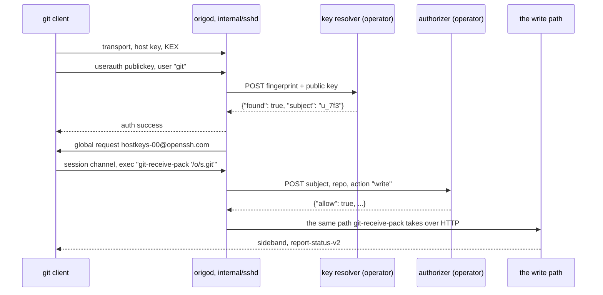

# SSH access

## Overview

Origo speaks git smart HTTP and nothing else. A person clones with
`https://git.example.com/owner/slug.git` and, when git asks for a
password, pastes a bearer token from the installation's OIDC issuer.
That works and it is what every automated consumer wants, but it is not
how most people carry a git credential: they carry a key pair, and they
expect `git clone git@git.example.com:owner/slug.git` to work.

This spec adds SSH as a second transport in front of the same write
path. It carries `git-upload-pack` and `git-receive-pack` and nothing
else. It authenticates a public key to a subject through an endpoint the
operator runs, the way spec 007 asks the operator's authorizer to decide
an operation, and it stores no key of its own: Origo still holds no
user, no permission, and no database (spec 001, invariant 6).

Everything below the transport is unchanged. A push over SSH is the same
log entry, committed by the same create-if-absent on `index/<n+1>`,
acknowledged only when durable, and followed by the same `push` event.
There is no second write path and no second durability rule.

## Current state

Not built. `cmd/origod` runs two HTTP listeners and a gossip socket
(spec 002); `internal/httpgit` owns the smart HTTP handlers, spools the
push body, runs the git subprocess through `internal/repo.Git`, and asks
`internal/auth.Guard` before any read of the repository. The module's
direct dependencies are the standard library, `latere.ai/x/pkg`, and the
OpenTelemetry SDK (spec 001, invariant 7, as spec 011 amended it), and
`latere.ai/x/pkg` carries no SSH package.

No component of Latere's stack holds an SSH public key today. Auth
serves the authorizer of spec 007 and has no key concept; this spec
states what a key store must answer and leaves the store to the
operator.

## Design

### 1. The server runs inside `origod`

The SSH server is a third listener of the node, `internal/sshd`, beside
the public and internal HTTP listeners of spec 002. It terminates the
SSH transport, authenticates the key, parses the one `exec` request, and
calls the same package-level service `internal/httpgit` calls: the
guard, the limits table, the repository cache, the spooled body, the
subprocess, the hook, and the log commit. The two transports differ in
how bytes arrive and in nothing else.

The alternative is a separate front end that terminates SSH and speaks
to `origod` over the internal network. It has two shapes and both are
worse.

| Shape | What it costs |
|---|---|
| translate to smart HTTP over a loopback or in-cluster hop | the pack crosses two hops in each direction; spec 003's rule that a push body is spooled to disk before git runs applies at both ends, so a 2 GiB push is spooled twice; the sideband, the `report-status-v2` frames, and the `ERR` pkt-line are re-encoded by a component that must stay bug-compatible with git's framing forever |
| link the same packages | it is `origod` under another name, with a second configuration surface, a second set of storage breakers (spec 015), a second bucket credential, and a version that can drift from the node's |

Neither buys anything. Origo's nodes are already stateless and
interchangeable (invariant 3), so the reason a front end usually
exists — an application that cannot hold a long-lived connection — does
not apply to a Go binary that already holds streaming clone connections
for minutes. One listener in the process the writes already run in keeps
invariants 1 and 2 in one place.

The listener is opt-in: `ORIGO_SSH_ADDR` unset means the node runs
exactly as it runs today, so an existing installation is unchanged by
the release that carries this.

### 2. The session, end to end



Two remote calls stand between a connection and a pack: the key
resolver, once per fingerprint per `ttl`, and the authorizer, once per
`(subject, actor, repo id, action)` per its own `ttl` (spec 007). Both
are cached in the node the same way and both deny when they cannot
answer.

### 3. Key resolution: the contract, for any operator

Origo never stores a public key. It asks one endpoint the operator runs,
named by `ORIGO_SSH_KEYS_URL` and called with the bearer
`ORIGO_SSH_KEYS_TOKEN`, which is the shape spec 007 already uses for the
authorizer. This section is provider-agnostic; nothing in it is
Latere's, and an operator who does not run Latere's auth implements it
as it stands.

**The call.** Per public key offered during authentication, with a 5
second timeout and one retry when the connection failed before a
response line arrived:

```
POST <ORIGO_SSH_KEYS_URL>
Authorization: Bearer <ORIGO_SSH_KEYS_TOKEN>
Content-Type: application/json

{"fingerprint": "SHA256:HxK…", "type": "ssh-ed25519", "public_key": "ssh-ed25519 AAAAC3Nz…"}
```

| Field | Value |
|---|---|
| `fingerprint` | the OpenSSH SHA-256 fingerprint of the offered key, `SHA256:` and the unpadded base64 of the SHA-256 of the key blob, the string `ssh-keygen -lf` prints |
| `type` | the key algorithm name, `ssh-ed25519`, `ecdsa-sha2-nistp256`, or `ssh-rsa` |
| `public_key` | the key in `authorized_keys` form, type and base64 blob, no options and no comment, so a store that keeps keys as text can match on it without re-encoding |

**The answer, always 200:**

```json
{"found": true, "subject": "u_7f3c", "key_id": "k_19", "ttl": 60}
{"found": false}
```

| Field | Meaning |
|---|---|
| `found` | whether this key names a subject that may authenticate now; a revoked, expired, or unknown key is `false` |
| `subject` | the effective subject, the same string the operator's OIDC issuer puts in `sub` for the same person, so one identity crosses both transports and the authorizer needs no second table |
| `key_id` | optional, the store's own id for the key; Origo logs it and sends it nowhere |
| `ttl` | optional, seconds this answer may be cached, default 60, capped at 600 |

**The five rules.**

1. **Answer 200 for both verdicts.** A 500, a timeout, or a body that
   does not parse is a refusal, never an allow. Authentication fails
   closed, exactly as an authorizer that does not answer denies.
2. **Resolve by fingerprint, not by user name.** The SSH user name is
   always `git` and carries no identity; see decision 7.
3. **One subject per fingerprint, installation-wide.** A store that lets
   two subjects register one key lets the second steal the first's
   authorship: every push under that key would be attributed to whoever
   the store answers. Refuse a fingerprint that is already registered.
4. **Answer `{"found": false}` without saying why.** Unknown, revoked,
   expired, and belonging-to-someone-else look alike on the wire; the
   client gets `Permission denied (publickey)` either way.
5. **Treat the endpoint's availability as Origo's.** It is on the path
   of every SSH connection. Sit near the nodes, answer from memory, and
   keep nothing slow in the request path.

**Last used comes from the call, not from a second endpoint.** Every
authentication that is not served from the node's cache is one resolve
call, so the store learns the time and the key without Origo reporting
anything. `ttl` is the granularity knob: 60 seconds gives a last-used
accurate to the minute and one call per user per minute; 600 gives a
tenth of the calls and a coarser figure.

**A single-tenant operator needs no service.** A file of fingerprints
and subjects served behind the same bearer satisfies this in full;
`authorized_keys` is already that table. The lifecycle — add, name,
list, remove, show last used — is the operator's product surface and
Origo has no opinion about it.

**The node's cache.** An answer is cached by fingerprint for its `ttl`,
a `{"found": false}` for 5 seconds, at most 65 536 entries, least
recently used evicted; the bounds and the deny window are spec 007's for
the authorizer and are the same here so an operator reasons about one
set of numbers. A revoked key stops authenticating within `ttl`.

### 4. Authentication and authorization stay split

SSH authenticates the key to a subject. It decides nothing else. Once
the `exec` names a service and a repository, the authorizer of spec 007
is asked with exactly the body it receives over HTTP:

```json
{"subject": "u_7f3c", "actor": "", "repo": {"id": "…", "owner": "…", "slug": "…"}, "action": "read"}
```

`action` is `read` for `git-upload-pack` and `write` for
`git-receive-pack`. The name form resolves `origo/names/<owner>/<slug>`
to an id before the call and the id form sends the id with an empty
owner and slug, which is spec 007's "authorization before lookup", so
the call happens before any read of `meta` or the index and a deny
teaches a caller nothing about whether the repository exists. For
`git-receive-pack` the allow is taken before the pack is read, which is
what 016's write row requires.

**Delegation does not exist over SSH.** `actor` is empty on every
SSH-originated authorizer call and the entry's `actor` field is empty on
every SSH push. The `act` claim of spec 007 is a statement inside a
token an issuer signed, and the authorizer can attribute it to that
issuer. A public key carries no claims and no signature over anything
but the session, so a key store that answered a pair would be a second,
unsigned delegation path with no issuer behind it. An operator who wants
a machine to push gives the machine a subject of its own — a deploy key
is its own subject — and grants that subject what it needs through the
authorizer, which is the machinery that already exists. A service that
must push *as a person* uses HTTPS with a token carrying `act`.

Repository-bound tokens (spec 007) are an HTTP surface and stay one:
there is no request on an SSH connection that could present one, and
minting one needs `POST /v1/repos/{id}/tokens`.

### 5. Host keys

Every node of an installation must present the same host key or a client
that reaches node 2 after node 1 sees `WARNING: REMOTE HOST
IDENTIFICATION HAS CHANGED`, which is a security warning arriving for a
non-security reason and teaches people to ignore it.

The host key is configuration, not state: `ORIGO_SSH_HOST_KEYS` is an
**ordered** comma-separated list of paths to OpenSSH private key files,
required when `ORIGO_SSH_ADDR` is set, with the same value on every node
of one installation. The keys live in the Secret `origod-ssh-host-key`,
generated once by the operator with `ssh-keygen` and mounted, the way
`ORIGO_TOKEN_KEY` lives in `origod-token-key` and is generated by a
block of the install document (spec 018). No manifest carries one.

It is deliberately not in the bucket. A host key read from object
storage would be unavailable exactly when spec 015 says the node must
still serve warm repositories, would make the SSH listener's start
depend on the bucket, and would put a long-lived private key inside the
blast radius of every credential that can read the bucket, which
includes backup and lifecycle tooling that has no business with it.

**Which key is presented.** SSH negotiates one host key algorithm per
connection and the server presents one key for it. Two `ssh-ed25519`
keys cannot both be presented. The rule is therefore explicit rather
than inherited: **the first key of each algorithm in the list is the one
presented**, and a second key of the same algorithm is announced only.
The builder enforces that rather than relying on what the library does
with a repeated algorithm.

**How every listed key reaches a client.** After authentication the node
sends the OpenSSH global request `hostkeys-00@openssh.com` carrying
every key in the list, and answers the client's
`hostkeys-prove-00@openssh.com` by signing the challenge with each key
named. A client with `UpdateHostKeys` on then writes the keys it does
not have into `known_hosts` by itself. The wire format of both is
OpenSSH's `PROTOCOL` document; `golang.org/x/crypto/ssh` implements
neither, so Origo sends and answers them over the connection's global
request surface.

**Rotation, in four steps.**

| Step | The list | What clients hold |
|---|---|---|
| 1 | `old` | old |
| 2 | `old,new` | old presented; `new` announced and written into `known_hosts` by clients that reconnect |
| 3 | `new,old` | new presented and already trusted by the clients of step 2; `old` still announced and still accepted |
| 4 | `new` | new only |

Steps 2 and 3 each wait longer than the reconnect tail of the client
population, which the operator knows and Origo does not; `docs/operations.md`
carries the procedure and says to measure it rather than guess.

`UpdateHostKeys` is on by default in recent OpenSSH clients only. JGit,
libssh2, and old clients never learn the new key, so the procedure also
says to publish the new fingerprint before step 3 and to expect those
clients to need a `known_hosts` edit. The extension shortens the tail;
it does not remove it.

### 6. The network path

The cluster's ingress is HTTP-only nginx and SSH is not HTTP, so SSH
does not go through it. The base gains a second Service, `origod-ssh`,
`ClusterIP` by default and selecting the same pods, with port 22 mapped
to the container's SSH port.

The container listens on **2222**, never on 22. The pod runs as user
65532 with `drop: [ALL]` (spec 016), so binding a privileged port would
mean adding `NET_BIND_SERVICE`, and one clone URL is not worth a
capability. The published port 22 is the Service's, which is where the
mapping belongs.

| The operator has | What they do | Clone URL |
|---|---|---|
| an L4 load balancer (any managed Kubernetes) | patch `origod-ssh` to `type: LoadBalancer` with the provider's annotations; the `digitalocean` and `aws` example overlays carry the patch | `git@git.example.com:owner/slug.git` |
| an ingress controller with TCP passthrough | map external 22 to `origod-ssh:22` in the controller's TCP services configuration; nginx's own `tcp-services` ConfigMap does this | the same |
| neither | `type: NodePort`, or a load balancer on another port | `ssh://git@git.example.com:2222/owner/slug.git` |

Port 22 is what buys the short form. `git@host:owner/slug.git` is scp
syntax and has no place to put a port, so any other port forces every
user and every CI configuration onto the `ssh://` form with the port in
it. That is the whole trade-off: one port on one address against a URL
shape people have to be told about. The install document states it and
does not pretend the third row is equivalent.

A NetworkPolicy `origod-ssh` in `deploy/base` admits TCP 2222 from every
peer, beside `origod-http` and `origod-gossip` (spec 016), because a
policy closes every ingress it does not admit for the pods it selects.

### 7. The command surface

An SSH connection to Origo can do two things:

```
git-upload-pack '<path>'
git-receive-pack '<path>'
```

and nothing else. The surface is a maintained list, the way spec 016's
route sweep is a maintained list, and every entry not on it is refused.

| The client asks for | Answer |
|---|---|
| a channel type other than `session` (`direct-tcpip`, `direct-streamlocal@openssh.com`, `x11`) | `ssh.UnknownChannelType`, no channel opened |
| a second `session` channel on one connection | rejected; one connection carries one operation |
| `shell` | rejected; the session's stderr carries `invalid_request: <sentence>` and the exit status is 1 |
| `exec` of anything but the two commands above, `git-upload-archive` and `git-lfs-authenticate` included | the same refusal |
| a second `exec` on one session | the same refusal |
| `subsystem` (sftp, netconf) | rejected |
| `pty-req`, `env`, `x11-req`, `auth-agent-req@openssh.com`, `signal`, `window-change` | `false` reply, nothing done; no environment variable a client sends ever reaches a subprocess (spec 016's environment rule) |
| the global requests `tcpip-forward`, `cancel-tcpip-forward`, `streamlocal-forward@openssh.com` | `false` reply, no listener opened |

No refusal opens a subprocess, reads the repository, or calls the
authorizer. The user name is not read: `git` is a convention and Origo
accepts any user name, because reading it would create a second identity
input that contradicts the fingerprint the key store resolved.

**Before authentication** the connection is cheap and bounded, because
nothing about the caller is known yet: a 30 second deadline over the
handshake and authentication together, at most 3 public key attempts
(`ServerConfig.MaxAuthTries`), no keyboard-interactive, no password
method, and no banner that names the installation.

**Refusals after authentication** travel on the session's stderr as
`<code>: <sentence>` — `contract.Line` of the code, byte for byte the
form spec 021 fixed for the sideband — and the exit status is 1. Git
prints stderr verbatim, so a person sees the same sentence they would
read in a JSON envelope. No new error code is defined by this spec: the
codes are 003's, 007's, 012's, and 015's, unchanged.

### 8. The path form

The argument is the repository, in the forms spec 003 already defines,
with the leading slash and the `.git` suffix optional because both
client URL shapes produce different strings for one repository:

| Written | Parsed as |
|---|---|
| `/owner/slug.git`, `owner/slug.git`, `/owner/slug`, `owner/slug` | the name form `/{owner}/{slug}.git` |
| `/r/<id>.git`, `r/<id>.git`, and the two without `.git` | the id form `/r/{id}.git` |
| `~owner/slug.git` | refused; the tilde form is a home-directory convention Origo has no filesystem for |
| anything else | refused with `invalid_request` |

Owner and slug pass spec 003's grammar and the validators of spec 016
before anything else happens, so a path is never a string a subprocess
sees. The argument is at most 4 KiB and the quoting is the one shell
convention git emits, single quotes with `'\''` for an embedded quote,
parsed by Origo and never by a shell.

### 9. What SSH does and does not get

| Surface | Over SSH | Why |
|---|---|---|
| clone, fetch, push, and every capability of spec 003's table | unchanged | the same subprocess, the same advertisement, the same `atomic` and `push-options` behaviour |
| durability, linearization, the `push` event, `act` recorded on an entry | unchanged | one write path; `actor` is empty because nothing set it |
| quotas and the size limits of spec 012 | unchanged | they live in the hook and the write path, below the transport; `over_quota` reaches the client on the sideband as it does today |
| the per-subject rate limit of spec 012 | one session costs one token | an HTTP clone is two requests, `info/refs` then `git-upload-pack`, and an SSH clone is one connection; charging one keeps `ORIGO_REQUESTS_PER_MINUTE` a bound on operations rather than on framing. `RateLimit-Limit` has no header to travel on and is not sent; a `rate_limited` refusal names its wait in the stderr line |
| the storage breakers and the refusals of spec 015 | unchanged | below the transport |
| stale reads (spec 015) | served, with `Origo-Stale: <seconds>` written to the session's stderr | it is the only out-of-band channel SSH has. It is **not** equivalent to the header: a git client cannot act on stderr, so the machine-checkable property of 003's rule is lost. A consumer that must not read stale uses HTTPS, and the install document says so |
| `Retry-After` (spec 003) | the wait is in the stderr line, no header | 003's header row is unchanged because SSH is not in contract 1 |
| the JSON API, the read API and archive (spec 009), the administration operations (spec 019), the server-side operations (spec 020) | HTTPS only | they are request-response JSON; SSH gives them no shape and adding one would be a second API surface to keep in step with the first |
| LFS (spec 010) | HTTPS only, and `git-lfs-authenticate` is refused | over an SSH remote git-lfs asks the server for an endpoint and a credential through that command. Answering it means minting a repository-bound token (spec 007) for the resolved subject and returning it as an `Authorization` header, which is a real and small feature and is a spec of its own; until then a repository with LFS objects is cloned over HTTPS or the operator sets `lfs.url` |
| the conformance suite (spec 021) and contract 1 (spec 003) | not part of either | contract 1 is what a platform integrating Origo codes against, and it is HTTP. SSH is a transport an installation offers to people, like the ingress; a later contract number may adopt it, and until then the suite stays HTTP and `docs/api.md` carries nothing new |
| `Origo-Prefer` (spec 005) | not sent | there is no header and no redirect on this path; placement is unchanged and the balanced Service still lands a session on any node |

### 10. Configuration

| Variable | Required | Default | Purpose |
|---|---|---|---|
| `ORIGO_SSH_ADDR` | no | unset | the SSH listener's address, `:2222` in the deployment; unset turns SSH off and the node runs as it does today |
| `ORIGO_SSH_HOST_KEYS` | when `ORIGO_SSH_ADDR` is set | none | an ordered comma-separated list of paths to OpenSSH private host key files, the same list on every node of one installation; the first key of each algorithm is presented and every key is announced through `hostkeys-00@openssh.com`; a path that does not parse, a list with no key, or a key algorithm outside `ssh-ed25519`, `ecdsa-sha2-nistp256`, and `ssh-rsa` at 2048 bits or more is a problem in spec 002's one start-up message |
| `ORIGO_SSH_KEYS_URL` | when `ORIGO_SSH_ADDR` is set | none | the operator's key resolution endpoint, the contract above |
| `ORIGO_SSH_KEYS_TOKEN` | when `ORIGO_SSH_ADDR` is set | none | the bearer Origo sends that endpoint |

Spec 002's table lists all four with this spec as their owner, the way
it lists spec 014's and spec 017's. `docs/configuration.md` is generated
from `internal/config`, and `TestConfigurationDocIsCurrent` (spec 018)
holds the page and the deck in step, so a variable named here before any
code reads it would fail that test. The rule the deck already uses for
an error code without a call site closes it: the page is required to
carry a variable of a spec that has started and is not required to carry
one a spec has only designed, `TestUnstartedSpecsDoNotNeedAReferenceRow`
in `internal/config`. The four rows appear on the page with the commit
that reads them.

Acceptable client key algorithms are `ssh-ed25519`,
`ecdsa-sha2-nistp256`, `ecdsa-sha2-nistp384`, `ecdsa-sha2-nistp521`, and
`ssh-rsa` at 2048 bits or more verified with `rsa-sha2-256` or
`rsa-sha2-512` signatures only. `ssh-dss` is refused and SHA-1 RSA
signatures are refused, in the server's algorithm list rather than in a
check after the fact.

### 11. Metrics

Spec 011 owns every metric of the deck; these three are this spec's, in
its own table, the way spec 004 owns `ORIGO_HOOK_DIR` inside spec 002's
configuration reference.

| Metric | Type | Labels | Recorded by |
|---|---|---|---|
| `origo_ssh_sessions_total` | counter | `service` (`upload-pack`, `receive-pack`), `result` (`ok`, `refused`, `error`) | `internal/sshd`, once per session when it ends |
| `origo_ssh_auth_total` | counter | `result` (`ok`, `unknown_key`, `resolver_error`, `timeout`) | `internal/sshd`, once per authentication attempt |
| `origo_ssh_keys_seconds` | histogram | `result` (`found`, `not_found`, `error`) | `internal/sshd`, every call to the key resolver, the buckets of `origo_authorizer_seconds` |

No metric carries a subject, a fingerprint, a repository, or a key id:
the label vocabulary is fixed, which is spec 011's rule and spec 016's
control against secret exposure in metrics.

### 12. Deployment

| Object | Where | What |
|---|---|---|
| container port 2222 | `deploy/base` Deployment | `ORIGO_SSH_ADDR=:2222`; the security context is untouched and no capability is added |
| Service `origod-ssh` | `deploy/base` | `ClusterIP`, port 22 to target port 2222, the same pod selector as `origod`; an overlay changes the type |
| NetworkPolicy `origod-ssh` | `deploy/base/networkpolicy.yaml` | admits TCP 2222 from every peer, beside `origod-http`; a builder item of spec 016, which owns the file |
| Secret `origod-ssh-host-key` | `deploy/bootstrap` template, generated by the operator | the host keys; never in `deploy/base`, for the reason spec 018 gives for every Secret |
| `type: LoadBalancer` patch | `deploy/examples/digitalocean`, `deploy/examples/aws` | the provider's annotations for an L4 load balancer on port 22 |
| host ports 30022 and 30122 to 30124 | `deploy/examples/kind` | 30022 the balanced SSH Service, 30122 to 30124 the three pods' own, the rows this spec adds to spec 013's ports table so a stack test can reach one named node's SSH listener |
| the stub key resolver | `test/stubs/sshkeys`, run from `origo-stubs` behind `-sshkeys-listen` and `-sshkeys-token` | the row this spec adds to spec 013's stub table; it answers from a map a test writes over its control endpoint, on host port 30086 |

### 13. Threats this adds

Rows for spec 016's threats table, which that spec owns and whose
builder adds them:

| Threat | Control | Spec |
|---|---|---|
| Host key theft giving a machine in the middle | one key set, in a Secret, read at start-up, never in the bucket and never in the log; rotation is the four-step overlap above, so it is a procedure an operator can actually run rather than a flag day; a stolen key is a machine in the middle for every client until rotation completes, which is why the procedure exists before the feature is used | 024 |
| A public key bound to the wrong subject | the key store answers one subject per fingerprint and refuses a fingerprint already registered (rule 3); Origo trusts the store, so registration is where the binding is proved, and a store that lets a key be registered twice lets pushes be attributed to the wrong person | 024 |
| A key that outlives its person | the resolve `ttl` bounds it: a revoked key stops authenticating within `ttl`, 60 seconds by default, and a `{"found": false}` is cached 5 seconds so a revocation is not held by a negative answer | 024 |
| More than git over an SSH connection | only `session` channels, only one, only `exec`, only the two service commands; shell, subsystem, pty, env, agent forwarding, X11, and every port-forwarding channel and global request are refused before anything is opened, and a hostile-client test walks the list | 024 |
| Unauthenticated cost before any identity is known | a 30 second deadline over handshake and authentication, at most 3 public key attempts, no password and no keyboard-interactive method, and no work that touches the bucket or the authorizer before authentication succeeds | 024, 012 |
| Delegation over a transport that cannot carry it | `act` is never derived on the SSH path and the key store cannot assert one; `actor` is empty on every SSH-originated authorizer call and on every SSH entry | 024, 007 |
| A key store outage read as an allow | authentication fails closed; a resolver that does not answer refuses the connection and is counted on `origo_ssh_auth_total{result="resolver_error"}`, the rule spec 007 fixes for the authorizer | 024, 007 |

The trust boundary diagram of spec 016 gains the key resolver beside the
authorizer, in the trusted subgraph and trusted for what it says rather
than for its availability.

### 14. The dependency, and invariant 7

`golang.org/x/crypto/ssh` becomes a direct dependency and
`golang.org/x/crypto` a fourth upstream root of `./cmd/origod`'s build
list, which spec 001's seventh invariant constrains and the `depcheck`
gate of `.lateregate.yaml` enforces with a reason per root. Two builder
items follow, neither of them this spec's to write into another spec's
file: `depcheck` gains an allow row naming `golang.org/x/crypto` with
its reason, and invariant 7's sentence is amended to name it, the way
spec 011 amended it for the OpenTelemetry SDK and recorded why in its
Outcome.

The alternative is writing an SSH transport by hand, and it is not a
real alternative: the invariant exists to keep a cloud SDK, a Kubernetes
client, and a database driver out of a binary that must run anywhere,
not to make the node reimplement key exchange, cipher negotiation, and
MAC verification. `golang.org/x/crypto/ssh` is maintained by the same
people as the toolchain, sits in a namespace `depcheck` already admits
for the OTLP exporters, and pulls in `golang.org/x/sys` and nothing
else. Writing this by hand would be the larger security liability by a
wide margin.

### 15. Documentation

| Document | Change |
|---|---|
| `docs/install.md` | a step for SSH after the key generation step: generate the host keys with `ssh-keygen -t ed25519` into `origod-ssh-host-key`, set the four variables, choose one of the three network paths of decision 6 with the clone URL each produces, and point Origo at the key resolution endpoint. The five rules of the contract go beside the authorizer's rules in step 2, with `test/stubs/sshkeys` named as the reference implementation for a first installation and explicitly not for production. The first-clone section gains the SSH form. One sentence says that LFS and the JSON API are HTTPS, and one says a consumer that must not read stale uses HTTPS. Its `sh` blocks are its test (spec 018), so the SSH step runs in the `install` job |
| `docs/configuration.md` | generated from `internal/config` by `make docs`; the four variables appear when the build lands, and the `specindex` job's `git diff --exit-code docs/` is what proves it |
| `docs/operations.md` | the four-step host key rotation, what to wait between steps and how to measure it, the fingerprint to publish, and which clients never learn a new key by themselves |
| `docs/api.md` | unchanged. SSH defines no endpoint, header, or code, and the page is generated from those tables |

## Not in this spec

- Storing, adding, listing, or removing a public key. That is the
  operator's, and the task below states what Latere's auth must build.
- `git-lfs-authenticate`, and with it LFS over an SSH remote. Named in
  decision 9 with what it would take.
- The JSON API, the read API, the archive, and the administration and
  server-side operations over SSH.
- Certificate authentication (`ssh-ed25519-cert-v01@openssh.com`). A
  certificate is a signed assertion and could carry a subject without a
  key store at all, which is a smaller design than this one and a
  different contract; it is worth its own spec once SSH is running.
- SSH in contract 1, and SSH in the conformance suite.
- Anonymous read over SSH. There is no anonymous read (spec 016).

## A task for the operator's identity service

Latere's key store is auth's, beside the authorizer of its spec 072.
This is what that spec must cover, stated here so the requirement is
recorded and written into auth's own deck by whoever owns it:

| Item | What it must cover |
|---|---|
| storage | one relation keyed by the SHA-256 fingerprint, unique installation-wide, carrying the principal, a name the person chose, the algorithm, the key blob, created, last used, and optional expiry and revocation times |
| the resolve endpoint | a `POST` under `/internal/origo/`, the request and answer above, under `/internal/` behind the same NetworkPolicy and bearer rotation as the authorizer of spec 072, answering from the same in-memory snapshot so no call queries Postgres |
| last used | written from the resolve call, batched and at most once per key per minute, so the request path writes nothing |
| the subject | the principal's `sub`, the same value auth's OIDC tokens carry, so one identity crosses HTTPS and SSH |
| the management API | add with a name, list with fingerprints and last used, remove; a key already registered to anyone is refused with a distinct error the UI can render, and the person is told which of their own keys it is when it is theirs |
| acceptance | `ssh-ed25519`, `ecdsa-sha2-nistp256/384/521`, and `ssh-rsa` at 2048 bits or more; `ssh-dss` refused; options and commands in an `authorized_keys` line stripped and never stored as semantics |
| audit | a row on add and on remove, none on resolve, because a resolve happens on every connection |
| the surface | list, add, and remove in the account settings of the web UI, which is a consequence of the API rather than part of it |

## Acceptance criteria

- The real git client clones, fetches, and pushes over SSH in both URL
  forms against a node with an in-process stub resolver, and the entry
  the push commits carries the resolved subject and an empty actor
  (proposed: `internal/sshd`, `TestSSHCloneFetchPushWithRealGit`, driving
  `git` with `GIT_SSH_COMMAND` and a `known_hosts` file the test wrote).
- A hostile client is refused every request that is not one of the two
  services, one at a time and each asserted: a shell, `exec` of `ls`, of
  `git-upload-archive`, and of `git-lfs-authenticate`, a second `exec`, a
  second session channel, an sftp subsystem, a `direct-tcpip` channel, a
  `tcpip-forward` global request, `pty-req`, `env`, `x11-req`, and agent
  forwarding; no refusal starts a subprocess, reads the repository, or
  calls the authorizer, asserted by a counting stub (proposed:
  `internal/sshd`, `TestSSHRefusesEverythingButTheTwoServices`, the
  maintained list of decision 7, which a later entry adds a line to).
- Two host keys are configured, the first of each algorithm is the one
  presented, and a client receives `hostkeys-00@openssh.com` naming
  both and gets a valid signature for each from
  `hostkeys-prove-00@openssh.com` (proposed: `internal/sshd`,
  `TestSSHHostKeysArePresentedAndAnnounced`).
- An unknown fingerprint is refused, a resolver answering 500 or not at
  all refuses within 5 seconds and recovers without a restart, a
  `{"found": false}` is not cached past 5 seconds, and a key revoked at
  the store stops authenticating within `ttl` on a fake clock (proposed:
  `internal/sshd`, `TestSSHKeyResolverFailsClosedAndRecovers`,
  `TestSSHRevokedKeyStopsWithinTTL`).
- The authorizer decides the operation: a subject the authorizer allows
  `read` clones and is refused `git-receive-pack` with
  `forbidden: <sentence>` on stderr and exit 1; the call carries the
  empty actor; and on an unknown name and an unknown id the call happens
  before any store read, so a denied caller cannot tell a repository
  apart from one that does not exist (proposed: `internal/sshd`,
  `TestSSHAuthorizerDecidesTheOperation`, `TestSSHDenyBeforeLookup`).
- `rate_limited`, `over_quota`, and `storage_unavailable` reach the
  client as `<code>: <sentence>` on stderr with the wait in the line, byte
  for byte `contract.Line` of the code, and a stale read carries
  `Origo-Stale: <seconds>` on stderr (proposed: `internal/sshd`,
  `TestSSHRefusalsAreTheTableSentences`).
- The path parser accepts every form of decision 8 and refuses the rest,
  and `FuzzSSHPath` finds no input it accepts that spec 003's grammar or
  spec 016's validators refuse: the seed corpus runs in the `test` gate
  on every push and for 40 seconds under `make fuzz` (spec 013) on the
  weekly schedule (proposed: `internal/sshd`, `TestSSHPathForms`,
  `FuzzSSHPath`).
- Before authentication the connection is bounded: a client that
  completes the handshake and sends nothing is closed after 30 seconds,
  a fourth public key attempt is refused, and no password or
  keyboard-interactive method is offered (proposed: `internal/sshd`,
  `TestSSHUnauthenticatedConnectionIsBounded`).
- A start-up with `ORIGO_SSH_ADDR` set and any of the other three unset,
  with a host key file that does not parse, or with an `ssh-dss` host
  key fails with all the problems in spec 002's one message; with
  `ORIGO_SSH_ADDR` unset the node starts with none of them set and opens
  no SSH listener (proposed: `internal/config`,
  `TestSSHConfigurationIsAllOrNothing`; `cmd/origod`,
  `TestSSHListenerIsOptional`).
- Stack: a push over SSH through the balanced host port of the ports
  table is readable by a clone over HTTPS through node 2, so one write
  path serves both transports (proposed: `test/e2e`,
  `TestClusterSSHPushIsReadableOverHTTPS`, in the `e2e` job of spec 013).
- Stack: the host key presented on each of the three per-node SSH host
  ports is byte-identical, which is the criterion decision 5 exists for
  (proposed: `test/e2e`, `TestClusterSSHHostKeyIsTheSameOnEveryNode`, in
  the `e2e` job).
- Stack: a shell request and a `direct-tcpip` channel are refused by the
  deployed node, not only by the package (proposed: `test/e2e`,
  `TestClusterSSHRefusesAShell`, in the `e2e` job).
- The install document's SSH step runs against the `kind` overlay in the
  `install` job of `verify.yml` and in `install-release` on a tag, and
  ends in a clone over SSH from the installation the blocks built (spec
  018's document-as-test rule, `tools/docs/run-blocks.sh`).

## Build order

Nothing in Origo blocks this. Every spec it depends on is at `testing`
or later, which is the dispatch gate, and the surface it touches is
additive: no HTTP route changes, no entry format changes, and a node
without `ORIGO_SSH_ADDR` behaves exactly as it does today.

Three things land in order inside the build. First the two deck edits of
decision 14, the `depcheck` allow row and invariant 7's amendment,
because the gate fails on the first commit that imports the package
otherwise. Then `internal/sshd` with the stub resolver of spec 013's
table, which is where every unit criterion is proved. Then the
deployment: the Service, the NetworkPolicy row spec 016 owns, the ports
table rows spec 013 owns, and the install document's step, which is
where the stack criteria are proved.

One thing outside Origo gates the *use* of it rather than the build: an
installation needs a key store answering the contract of decision 3. The
stub of `test/stubs/sshkeys` satisfies it for the test stack and for a
first installation, and Latere's own is the task above, in auth's deck
beside its spec 072. A self-hoster needs neither: a file of fingerprints
behind a bearer is the whole requirement.
