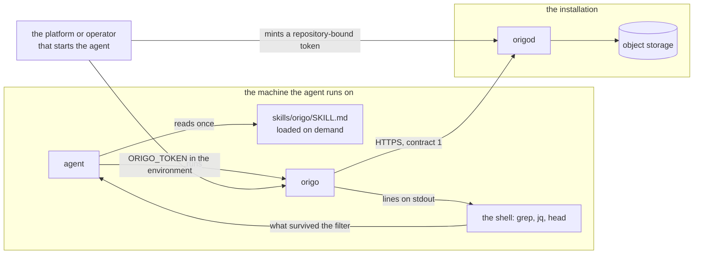

# Agent client

## Overview

An agent that works on a repository today either clones it or writes
HTTP calls by hand. A clone costs a checkout of every file to read one
of them; a hand-written call costs the agent a guess at a path, a
header, and a body, and it gets the guess wrong. Origo already serves
what an agent needs: a read API for refs, history, trees and blobs
(spec 009), a directory and a name resolver (spec 026), operations that
create a commit from a request without a clone (spec 020), a credential
scoped to one repository with a lifetime (spec 007), one error envelope
(spec 003), and an advertised request rate (spec 012). What is missing
is the shape.

This spec is `origo`, a second binary of this repository, and a skill
document beside it. The command prints lines a shell can filter and
takes `--json` on every read. The skill is what teaches an agent to use
it: how to get a credential, which four variables to set, what the
defaults are, and four pipelines that answer the questions an agent
actually asks.

The design constraint that separates this from any other client is that
an agent pays for every byte that reaches its model, on every turn that
byte stays in the context. Response shape is therefore not presentation
here, it is the primary design concern, and the Byte defaults section is
where most of the decisions are. That same constraint is what chose the
command over a tool server, and the measurement is in Not in this spec.

## Current state

Nothing of this is built. `cmd/` holds `origod` alone. The pieces it
stands on are released:

- Spec 009's read API in `v0.1.0`: `GET /v1/repos/{id}/refs`,
  `GET /v1/repos/{id}/commits`, `GET /v1/repos/{id}/commits/{sha}`,
  `GET /v1/repos/{id}/compare/{base}...{head}`,
  `GET /v1/repos/{id}/tree/{sha}`, `GET /v1/repos/{id}/blob/{sha}`,
  with cursor paging, `Origo-Commit` on every response, and
  `Origo-Truncated` where a body was cut.
- Spec 020's four write routes: `POST /v1/repos/{id}/commits`,
  `POST /v1/repos/{id}/merge`, `POST /v1/repos/{id}/cherry-pick`,
  `POST /v1/repos/{id}/revert`.
- Spec 003's repository representation at `GET /v1/repos/{id}` and its
  error envelope.
- Spec 007's `POST /v1/repos/{id}/tokens`, which mints a token bound to
  one repository with a scope and a lifetime, and copies the minter's
  `act` claim into it.
- Spec 026's `GET /v1/repos`, landed after the first draft of this
  spec: a directory mode that lists what the subject may see, and a name
  mode that resolves `?owner=&slug=`. The first draft caveated both,
  saying an agent could not list repositories and could never name one
  by `<owner>/<slug>`. Both caveats are gone and the command has
  `origo repos` and takes a name wherever it takes an id.

Nothing in Origo changes for this spec. It defines no endpoint, no
header, no error code, no metric, no event, and no failpoint, and
`origod` reads none of its four variables.

## Design

### Where it lives

`origo` is **a second binary of this repository**, `cmd/origo`, built by
the same tag, shipped in the same release archives, and run on the
machine where the agent runs. Four placements were weighed, and the
reasoning is unchanged from the first draft because it was about the
repository and not about the protocol.

| Placement | What it costs |
|---|---|
| **`cmd/origo` in this repository, chosen** | one more archive per platform in spec 017's `release-archives`, one `depcheck` row, one document, and one skill. `origod` is untouched: no route, no listener, no configuration, no threat-model surface. The client surface moves in the same commit as the contract it is shaped from, and spec 021's stack is what it is proved against |
| a subcommand, `origod origo` | no new artifact, and `origod migrate` is the precedent for a client mode in the node's binary. Refused: an agent runs this command in a loop on a laptop, and putting it inside the process that holds the write-ahead log means an operator's image carries an agent's client and spec 002's subcommand table grows with every read a client wants |
| a separate repository | the split spec 023 makes for the web interface, refused here for the reason that split was made: the web interface is a service with a deployment, sessions, templates, and a visual design, while this is a stateless client binary with no surface of its own. A second repository would put it on a second release cadence and out of reach of the conformance stack, and version skew against contract 1 is exactly the failure it would buy |
| a hosted service | there is nothing to host. The command is a client; the installation it calls is the service |

The arrow that matters is the one through the shell. A tool call cannot
pipe into another tool call, so a tool server must fuse the pipeline in
advance and every fusion it did not anticipate is unreachable. A command
puts the fusion in the caller's hands at no resident cost, which is why
`origo ls -r -n 0 | grep -i handler` is a documented pipeline here and
a content search was scoped out of the tool surface as impossible.

### Three packages

The layering is the point of the spec, not an implementation detail. The
first draft's binary had its byte formatting fused into its tool
handlers, so a second front end could not have reused a line of it.

| Package | What it holds | What it must not hold |
|---|---|---|
| `internal/origoclient` | every call this repository's clients make on contract 1: the routes, the query grammar, the paging, the `Range` arithmetic, the parent-directory path resolution, the short-id expansion, the short `Retry-After` wait, and spec 003's envelope decoded into a typed refusal | a line of output, a default a caller did not ask for, an environment variable, a flag, `os.Stdout`, and any knowledge of what a human or a model reads |
| `internal/origocli` | the commands, their flags, the byte defaults, the line writers, the `--json` writers, the truncation vocabulary, and the exit codes. It takes an `io.Writer` pair and returns an exit code | an HTTP call. It reaches the network only through `origoclient` |
| `cmd/origo` | `main`: the environment, the signal context, and `os.Exit` | anything a test would want to call |

A future MCP server, if a product ever needs one for an agent with no
shell, is a fourth package on `origoclient` beside `origocli`, and it
inherits the routes, the paging and the refusals without inheriting a
single formatting decision. That is the whole reason the boundary is
drawn where it is.

`origoclient`'s transport is the standard one, cloned so the command's
connection settings are its own, and it carries no OpenTelemetry
transport. That is a decision and is recorded here rather than left to
be read as an omission: nothing upstream of a command on a laptop holds
a trace to continue, no exporter is configured in that process, and
`otelhttp` would pull `go.opentelemetry.io` into a binary whose
`depcheck` row states it reaches no OpenTelemetry package. The node's own
outbound calls are instrumented and unaffected.

### Configuration

Four variables and no configuration file. `origod` reads none of them,
so they are not in spec 002's reference and not in
`docs/configuration.md`, which `tools/configdoc` generates from
`internal/config`: a row there would be a row the generator cannot
produce and `make docs` would drift. `docs/cli.md` is their reference.

`TestConfigurationDocIsCurrent` of `internal/config` held the stronger
rule that every variable a started spec defines is in the node's deck,
which was true while Origo had one binary. These four make it false, so
the test now reads the rule it always meant: a variable a started spec
defines has a row on a page under `docs/`, and `docs/configuration.md`
holds the node's deck and nothing else. The generalisation is spec 018's
criterion, unchanged in what it asserts about `make docs`.

| Variable | Value |
|---|---|
| `ORIGO_URL` | the installation, `https://git.example.com`. Required; a URL that is not `https://` is refused at start-up unless its host is a loopback address |
| `ORIGO_TOKEN` | the bearer sent on every call, in the `Authorization: Bearer` form. Required. Never logged, never printed, never in an error line |
| `ORIGO_REPO` | the repository every command works on unless `-repo` names another: a lower-case UUID, or `<owner>/<slug>`, which spec 026's name mode resolves. Optional |
| `ORIGO_AUTHOR` | `Name <email>`, the author of every commit the write commands create. Required for a write command; refused if the address has no `@` |

`ORIGO_URL` is not a new name for a new idea. `docs/install.md` already
sets it in its own `sh` blocks to mean the installation's base URL, and
the command reads it with that same meaning, so a reader who has
installed Origo has already exported the variable the command wants.

`ORIGO_TOKEN` sits one word from `ORIGO_TOKEN_KEY`, which is the node's
signing key in PEM. A person who runs both on one machine will
eventually put one in the other, so a value that begins `-----BEGIN` is
refused at start-up by name rather than sent to an installation as a
bearer. That is four lines of code against a mistake whose other outcome
is a private key in an HTTP header.

`ORIGO_AUTHOR` is one string on this side and two fields on the wire:
spec 020's `author` is `{"name", "email"}` and `validateCommon` refuses
a body whose email holds no `@`. The command splits `Name <email>` at
the angle brackets and refuses the value at start-up rather than letting
Origo refuse the request, so a mistyped variable costs no round trip.

Timeouts are fixed and take no knob: 60 seconds for a read and for
`origo commit`, whose own budgets are 30 seconds (spec 009, and spec
020's commit route), and 330 seconds for `merge`, `cherry-pick` and
`revert`, whose budget is `MergeBudget`, 300 seconds.

### Authentication

The credential arrives in the environment and is one bearer. The
command **never mints, never signs, never exchanges, and never
refreshes** a credential. There is no code path in `origoclient` that
calls `POST /v1/repos/{id}/tokens`, and its absence is asserted by a
test rather than left to review, because that route is the one `admin`
action a read client could be tempted into.

**The credential to hand it is a repository-bound token** of spec 007:
`POST /v1/repos/{id}/tokens` with `{"scope": "read", "ttl": 3600}` for
an agent that reads, `"write"` for one that also commits. It is bound to
one repository, so a mistake cannot reach another; its scope is the
whole of what the agent may do, so `admin` is unreachable and no
administration route can be called even if a command for one existed;
and it expires, so a leak is bounded. The skill's first block is the
`curl` that mints it, run by the person or the platform that starts the
agent, and the skill says plainly that the command does not do this for
you and why.

**An agent acting for a person** is spec 007's `act` claim, and the
command constructs nothing. The platform that starts the agent holds a
service token with `act: <the person's sub>` and mints the bound token
from it; spec 007 copies `act` from the minter into the minted token. So
the credential handed to the agent already carries the delegation, every
entry the agent's commits produce records `subject` as the person and
`actor` as the service, and every push event carries `pusher.sub` and
`pusher.actor` the same way. An agent a person runs for themselves uses
a token minted from their own, with no `act`, and the history says the
person did it, which is true.

**A token from the issuer** is accepted and is the broader case: it is
not bound to a repository, so the authorizer decides each call, and what
the agent may do is what the person may do. It is what an operator with
no minting path starts with, and **it is the only credential `origo
repos` works under**.

That last point is a fact about the model rather than a gap. A
repository-bound token's decision was made at minting, for one
repository, so `internal/auth`'s guard refuses the `list` action on its
scope before the authorizer is asked (`guard.go`, `ReasonScope`), and no
directory on the authorizer changes that. There is no subject-wide
answer to give for a credential that names one repository, and inventing
one would mean the client deciding what the installation refused to.
`origo repos` therefore answers `forbidden` with `action=list` under the
credential the skill recommends, and the line says what to do instead:
name the repository with `-repo`, or use a token from the issuer. Every
other command works under a bound token, and the skill's pipelines all
name a repository.

The first draft hit the same wall from the other side, and its
Validation row 8 recorded it: its repository list would have called
`GET /v1/repos/{id}` per alias and answered `forbidden` for all but one.
Spec 026 gave the route a real directory but it did not, and could not,
give a bound token a subject-wide question to ask. The spec states the cost plainly rather than
forbidding it: a leak of it is a leak of the person's whole access,
where a leak of a bound token is a leak of one repository for at most an
hour.

**The hour is real.** Spec 007 caps `ttl` at 3600 seconds and an agent
session outlives it. A 401 `unauthenticated` with `details.reason:
"expired"` is one line on stderr naming the expiry and telling the
caller to mint again, and exit status 1. A command is one process, so
there is no retry loop to stop: the next invocation either has a fresh
token or gets the same line.

### The command surface

Twelve commands. The names are git's where git has one, because that is
the vocabulary an agent already holds and a name it already knows costs
no explanation. Every read command takes `--json`, which prints the
contract's own JSON rather than a second shape invented here.

`-repo` on every command is a lower-case UUID or `<owner>/<slug>`; a
name is resolved once through the name mode of `GET /v1/repos`,
`?owner=&slug=`. `-ref` on
every read command is any reference name, a short name, or an object id.

| Command | What it does |
|---|---|
| `origo repos` | one line per repository the subject may see, `<id>  <owner>/<slug>`, paged through spec 026's directory mode. It is the one command a repository-bound token does not have: see below |
| `origo info` | the repository in one screen: `owner/slug`, default branch, full head, `size_bytes`, `updated_at`, `pushed_at`, from one call |
| `origo refs` | `<name> <7 hex>` per line; `-heads` (default), `-tags`, `-all`, `-prefix` |
| `origo ls [path]` | one line per tree entry: the path, `/` for a tree, `*` for `100755`, `@` for `120000`, and the size for a blob; `-r` walks the whole tree, paging past the route's 5 000 per page |
| `origo cat <path>` | the file's text on stdout, windowed by `-n`, `-offset` and `-max-bytes`, with its header line on stderr so a redirect writes the file and nothing else |
| `origo log` | `<7 hex> <YYYY-MM-DD> <author name> <subject, at most 72 characters>` per commit; `-n`, `-path`, `-since`, `-until`, paging past the route's 200 per page |
| `origo show <commit>` | the metadata, the full message, the trailers, the totals, and one stat line per file; `-p` adds the patch, `-path` narrows it |
| `origo diff <base> <head>` | one stat line per file and a totals line; `-p` adds the patch, `-path` narrows it |
| `origo commit <path>...` | a commit from named local files, `-m`, `-expect`, `-branch`, `-delete`, `-create`, `-from`, `-dry-run` |
| `origo merge <source>` | `-branch`, `-expect`, `-strategy`, `-m`, `-dry-run` |
| `origo cherry-pick <sha>...` | `-branch`, `-expect`, `-mainline`, `-dry-run` |
| `origo revert <sha>...` | the same arguments, backwards |

`cherry-pick` and `revert` are two commands where the first draft's tool
surface fused them into one. The fusion was bought there by a real cost,
two tool definitions of the same shape resident in every context; a
second command name costs a row in a help page nobody's model is
holding.

There is no `search` command and no `-author` flag, and the reason has
changed. The first draft refused both because Origo serves neither and
synthesizing one would mean downloading a repository to grep it. Origo
still serves neither, and the rule that this client adds nothing Origo
does not serve still stands. What has changed is that the shell serves
both: `origo ls -r -n 0 | grep -i handler` finds a file and
`origo log -n 200 | grep '<name>'` finds an author's commits, each one
process and each filtered before a byte reaches a model. That is the
argument for the shape in one line, and both pipelines are documented
and tested.

**Five facts about the routes, read from `internal/api/read.go` and
`internal/api/operations.go` rather than from the endpoint table,
because a builder who reads only the table gets each of them wrong.**
The first three were found by the first review of this spec and bind the
command exactly as they bound the tools; the last two were found by the
second.

1. **A reference with a slash cannot travel in a path segment.** The
   `{sha}` segment of `commits/{sha}`, `tree/{sha}` and `blob/{sha}`,
   and each side of `compare/{base}...{head}`, is a full object id or a
   short name with no slash; `shortNameRe` refuses anything else with
   400 `invalid_request`. A full name goes in `?ref=`, `?base=` or
   `?head=` with the segment set to the placeholder `-`, and a query
   parameter beside a real segment is refused too. So `origoclient`
   always sends the placeholder form, and `-ref feature/x` works on
   every command. `refs` and `commits` take their names in the query
   already and need nothing.
2. **`?path=` on the tree route lists a directory, never a file.** The
   handler runs `git ls-tree -l -z <oid> -- <path>/` with a trailing
   slash, so `?path=internal/api/read.go` matches nothing.
   `origoclient.File` resolves a file by listing its **parent
   directory** and matching the basename among the full paths `ls-tree`
   prints, which is one call and no descent; a directory past the
   route's 5 000 entries is paged with `cursor` until the basename is
   seen. `origo ls` uses the same call with the directory the caller
   named.
3. **`refs` answers a bare JSON array**, `[{"name","sha","peeled"}]`,
   with no envelope and no cursor, and `Origo-Truncated: true` at
   10 000. The cap is a wall and not a page: there is no way to ask for
   the rest, so `origo refs -n 0` past 10 000 names the wall rather than
   promising a continuation that does not exist.
4. **A cursor is exclusive and names the last item served.**
   `next_cursor` on `commits` is the sha of the last commit of the page
   and on `tree` the path of the last entry, and the next request
   restarts the walk and discards up to and including it. A cursor the
   walk does not contain is 400 `invalid_request`, so a client pages by
   handing back what it was given and never by counting.
5. **A dry run and a real write answer differently, and neither field is
   safe to read positionally.** Spec 020's four routes flatten their
   common fields to the top level of the body and decode with
   `DisallowUnknownFields`, so a stray key is 400. A real write answers
   201 with `entry_seq` set and **`committed` absent entirely**, never
   `true`; a dry run answers 200 with `entry_seq` null and
   `committed: false`. The receipt therefore reads `committed` as
   present-and-false rather than as a boolean with a default.

### Byte defaults

An agent pays for every byte that reaches its model, on every turn it
stays in the context. Four rules, then the numbers.

1. **The default answer is the smallest one that answers the question.**
   The larger one is one flag away, and the flag is named where the
   answer was cut. Stat before patch, subject before body, one directory
   before a recursive walk, 20 commits before 200.
2. **Every cut answer ends with one bracketed line naming the exact flag
   that continues it, on stderr**, and an answer with no such line is
   complete. The word truncated never appears without the flag that
   undoes it. `[truncated: lines 0-799 of 3120, 32768 of 141002 bytes;
   add -offset 800]`.
3. **The line goes to stderr and the data goes to stdout.** This is the
   rule the tool shape could not have: a truncation notice inside the
   payload would reach `grep`, and `origo cat x.go > x.go` would write a
   note into the file. Every header line, truncation line and stale line
   is stderr; every data line is stdout.
4. **The truncation an answer reports is the truncation that happened.**
   Where Origo cut a body itself, with `Origo-Truncated: true`, the line
   says Origo cut it and names the last entry seen, and a partial list
   is never presented as a complete one.

| Command | Default answer | Cut at | How more is asked for |
|---|---|---|---|
| `origo repos` | 200 rows | the authorizer's paging | `-n 0` |
| `origo info` | one repository, one call | never | the other commands |
| `origo refs` | 100 refs | Origo's 10 000 | `-n 0` |
| `origo ls` | 200 entries, one directory | Origo's 5 000 per page, paged | `-r`, `-n 0` |
| `origo cat` | 800 lines or 32 KiB of printed text, whichever first | Origo's 50 MiB blob rule, handled by `Range` before it fires | `-offset`, `-n`, `-max-bytes` |
| `origo log` | 20 commits, subject only | Origo's 200 per page, paged | `-n`, `-n 0` |
| `origo show` | metadata, message, per-file stat | Origo's 1 MiB compare | `-p`, `-path` |
| `origo diff` | per-file stat and a totals line | Origo's 1 MiB compare | `-p`, `-path`, `-max-bytes` |

Three of those deserve their reasoning.

**Stat before patch** is the largest saving in the set. A change of
1 MiB of diff is far past any agent's budget, and Origo will hand over
1 MiB before it cuts. `origoclient` fetches the comparison and
`origocli` parses the `diff --git` headers and the `+` and `-` lines
into per-file counts locally, printing one line per file. The bytes are
paid on the local machine, which is a reason the binary is local. The
caller then names the file it cares about and gets that file's patch
through `-path`, which is one more process. Where the fetched comparison
carried `Origo-Truncated: true`, the summary covers the files inside the
cut alone and the stderr line says so and names the last file, because a
file list silently missing its tail is a wrong answer, not a small one.
If this proves the common path, a stat mode on spec 009's `compare`
would let Origo answer it in a fraction of the bytes; that is a spec
against Origo and it is on the deck's Later list rather than worked
around here.

**Reading a file** is two calls because Origo's blob route takes a blob
object id, not a path. `origoclient.File` resolves `ref` and `path`
through the tree route, which also gives it the size, so it knows before
it asks whether a `Range` is needed and never provokes `blob_too_large`.
Fact 2 above is why the resolution is one listing of the path's parent
directory and a match on the basename: one call for a nested path as for
a root one, and no descent.

`-max-bytes` bounds what is printed and not what is fetched, and the
`Range` exists for one reason only: the node refuses a request for more
than 50 MiB at once. Windowing the fetch by the byte cap instead would
make `-offset` unusable past the cap and would compute the file's line
count from a fragment, so `origo cat -offset 900` on a large file would
answer nothing and present it as the whole file. The bytes are paid on
the local machine, which is the same trade the stat-first diff makes and
the same reason the binary is local.

A byte cap cannot cut a line in half, because a fragment is not a line of
the file and the next window would have to start mid-line for the two to
compose. So a single line longer than `-max-bytes` is printed whole and
the answer says why, which keeps the windows exact.

**`info` is one call.** The first draft's `repo_overview` was four: the
repository, the branches, the tags, and five commits. It existed because
a tool call cannot pipe into another. Here the counts are
`origo refs -all | wc -l` and the recent history is `origo log -n 5`, so
`info` is `GET /v1/repos/{id}` and nothing else, and the agent that
wants the other three pays for the three it wants.

**Revalidation is cut.** The first draft held every read's `ETag` in
memory and sent `If-None-Match` on a repeat, which is worth its code in
a process that lives for a session. A command is one process and one or
two calls, so the cache would never see a second identical request, and
this spec writes no file, so it cannot persist between runs. The header
is not sent and the cache does not exist. `Origo-Stale` is still read
and still reported: a stale line on stderr says the installation
answered from a copy it did not check, because an agent that reads a
head, then writes, gets `non_fast_forward` and should know why.

**Errors are one line.** Spec 003's envelope carries a code, one user
sentence, and developer details. `origoclient` returns the envelope
decoded; `origocli` writes `<code>: <message>` with that row's details
on stderr and exits 1, and writes nothing else:

| Origo code | What the line adds beyond the sentence |
|---|---|
| `non_fast_forward` | `expected` and `actual`, so the caller re-reads and retries with the actual head |
| `merge_conflict` | `paths`, and the commit for a replay |
| `invalid_change` | `index` and `reason` |
| `over_quota` | `limit`, `bytes`, `max` |
| `ref_not_found` | `ref` |
| `repo_not_found`, `repo_frozen`, `gone` | nothing beyond the sentence; all three are terminal for a caller |
| `unauthenticated` | `reason`, and for `expired` the instruction to mint again |
| `forbidden` | `action` and the authorizer's `reason` |
| `directory_unsupported` | `reason`, and that a repository must be named directly |
| `rate_limited`, `storage_unavailable`, `repository_unavailable`, `authorizer_unavailable` | the wait from `Retry-After` |
| `operation_timeout` | `operation` and `budget_seconds` |

A `rate_limited` or a 503 whose `Retry-After` is at most 5 seconds is
waited out and retried once inside `origoclient`, which costs the caller
one process instead of two; a longer one is one line naming the wait,
because a turn is more expensive than a sleep but a minute of one is
not. `RateLimit-Limit` is read from the response and named in that line,
so the caller sees the figure in force rather than a default.

### Write safety

**No command in this binary can make a commit unreachable.** Every
mutation is one of spec 020's operations, each of which appends a commit
whose parent is `expected_head` and moves one branch to it. No command
deletes a branch, a tag, a repository, or a file's history; there is no
force, no rewrite, and no reference deletion in the surface, because
there is none in spec 020 either. This is the property to preserve when
the surface grows.

Three independent bounds sit in front of a mistake, and none of them
relies on another. The first draft had a fourth, the `-write` flag that
decided whether the write tools were in `tools/list` at all. It does not
survive: a flag on a command the caller types is a flag the caller can
also not type, so it gates nothing. What gated the tools was that a
model cannot invoke a tool it has never seen, and a command surface has
no equivalent. The credential is what does that work here, which is why
the skill leads with `"scope": "read"`.

1. **The credential cannot.** The token to hand a reading agent is scope
   `read`, and Origo refuses a write under it with `forbidden` whatever
   the binary sends. It is the gate, it is enforced by the installation
   rather than by the client, and the end-to-end criterion below proves
   it against a running node.
2. **`-expect` is required, and the command never fills it in.** A write
   is a statement about a branch the caller has read. A branch that
   moved is `non_fast_forward` with the actual head, and the caller
   re-reads instead of clobbering. `-dry-run` is on all four write
   commands and its receipt says `dry-run` rather than `committed`, so a
   plan can be checked before it lands; it defaults to false, because a
   silent default of true would let a caller believe it had committed
   when it had not.
3. **Origo's own limits bound a loop.** 60 operations per repository per
   minute, `ORIGO_REQUESTS_PER_MINUTE` per subject, `quota_bytes`, 1 000
   changes, 10 MiB per file, 64 MiB per body (spec 012, spec 020). This
   client enforces no limit Origo does not: a duplicated figure drifts
   from the one that is enforced, and the figure that is enforced is the
   one the operator set. It reports them, with the limit and the wait.

`author` is not a flag. The command sends `ORIGO_AUTHOR`, so a model
writing a command line cannot choose who a commit is attributed to. The
committer is `Origo <origo@<host>>` with the subject and actor in the
trailers, which spec 020 fixes.

Spec 020 makes `expected_head` optional and `author` required on every
one of its four routes: `validateCommon` refuses a body with no author
and accepts one with a null `expected_head`. This surface inverts the
first and hides the second, and says so rather than leaving a builder to
find it. `-expect` accepts a short object id: anything under 40
hexadecimal characters is expanded through
`GET /v1/repos/{id}/commits/{sha}` before the write is sent, so a short
id that no longer resolves is `ref_not_found` with nothing written, and
a short id of a commit the branch has moved off still produces
`non_fast_forward` with the actual head.

**`origo commit` reads named files and writes none.** Its positional
arguments are repository paths, read from the working directory at the
same path unless `-file <repopath>=<localpath>` maps one, and `-delete`
names a path to remove. The binary opens nothing the caller did not
name, creates no file, keeps no cache on disk, and takes no path outside
the working directory. A change carries the file's bytes, which the
client base64 encodes for spec 020's `content`: a model producing base64
is slow, expensive and sometimes wrong, and it is the wire's problem.

**A branch allow-list is refused.** It is the obvious next guard, and it
would be a second access control model living in a file on a laptop,
diverging silently from the authorizer that actually decides. Spec 023
refuses the same thing for the same reason. Branch-level authorization
belongs on spec 007's contract, which today asks about a repository and
an action and not about a reference; until it asks, the bound token's
scope and its repository are the bounds.

**What is irreversible.** Spec 019 holds a deleted repository for seven
days and answers `gone` afterwards. That hold never applies to anything
this command does, for two independent reasons: no command deletes a
repository, and deletion is an `admin` action that neither a `read` nor
a `write` bound token can reach. The recovery path for a commit an agent
should not have made is inside the surface, `origo revert`, which is
itself additive and leaves the mistake in the history where an audit can
see it.

### The skill

`skills/origo/SKILL.md` is the document that turns the command into
something an agent uses correctly on the first try. Its resident cost is
its frontmatter, a name and one sentence; the body loads when the agent
decides the sentence matches the task. That asymmetry is the whole
advantage of the shape, so the body has to earn its place and the
frontmatter has to be honest about when to load it.

It teaches five things and nothing else:

Its resident cost is measured, not asserted: the frontmatter's `name` and
`description` are **99 bytes** together, against the **5 725 bytes** of
`tools/list` JSON the first draft's eight read tools would have held in
every context of every session. The body is 5 447 bytes and is paid once,
by an agent that decided the sentence matched its task.

1. **The credential**, as one `curl` that mints a repository-bound
   token, with `"scope": "read"` first and the sentence that says the
   command will not mint one for you.
2. **The four variables**, as one block to export.
3. **The defaults**, as the byte table above in a form a reader scans:
   what each command gives you without a flag, and the one flag that
   gives you more.
4. **The truncation vocabulary**: a bracketed line on stderr names the
   flag that continues the answer, and no such line means the answer is
   whole.
5. **Four pipelines**, which are the reason for the shape:

   | Question | The pipeline |
   |---|---|
   | where is the file that handles this | `origo ls -r -n 0 \| grep -i handler` |
   | what has this person changed lately | `origo log -n 200 \| grep '<name>'` |
   | what changed between these two commits, and then show me one file | `origo diff <base> <head>` then `origo diff -p -path <file> <base> <head>` |
   | read the head, commit against it, undo it | `origo log -n 1 --json \| jq -r '.commits[0].sha'`, then `origo commit -m '<message>' -expect <sha> <path>`, then `origo revert -expect <new head> <sha>` |

The skill is user register, not contributor register: it addresses the
reader who is about to run the command, it states what to do and what
each answer means, and it carries no design reasoning. The reasoning is
this spec.

## Not in this spec

The line, drawn so a later contributor does not grow this into a second
API.

- **MCP, and the measurement that decided it.** The first draft of this
  spec was `origo-mcp`, eleven Model Context Protocol tools over stdio.
  It was measured against its own governing constraint and failed it.
  The tool schemas of a registry built to that draft's own tables
  serialize to **5 725 bytes** of `tools/list` JSON for the eight read
  tools and **10 137 bytes** for all eleven, roughly 1.6 k and 2.9 k
  tokens, resident in the agent's context on every turn of every session
  the server is configured in, used or not. The draft's own budget was
  5 KiB and 8 KiB, so it failed its first acceptance criterion, and the
  budget was reachable only by deleting every argument description,
  which brings the two to 4 084 and 7 272 bytes and leaves each argument
  named and unexplained. Beside the budget, six of the eleven tools were
  pre-fused pipelines that existed only because one tool call cannot
  pipe into another: `repo_overview` was four HTTP calls, `read_file`
  was a tree call and a blob call, `show_commit` and `diff` were a
  commits call and a compare call, and the cursor in `list_refs` was
  client-side slicing of one answer. And the draft refused a search tool
  as "a clone with extra steps" and refused an author filter for want of
  a parameter, where both are one shell pipeline against a command that
  prints lines: finding a file in a three thousand file repository cost
  about fifteen paged tool calls and three thousand entries of context
  under the tool shape, and costs one process and one `grep` here. **The
  figures above are measured, not estimated, and they are recorded here
  so the decision is not reopened from memory.** What MCP genuinely buys
  is an agent with no shell and per-tool permissioning owned by the
  host. Neither is Origo's question. If a product needs them, the server
  is a fourth package on `internal/origoclient` and its own spec, and
  its first paragraph is how it fits eleven tools into a budget this one
  could not.
- **Anything Origo does not already serve.** Every command is one or
  more calls to contract 1 as `docs/api.md` documents it. Local work is
  allowed where it changes no semantics and only reduces bytes: parsing
  a diff Origo returned into per-file counts, turning a line window into
  a `Range`, expanding a short object id, base64 encoding a file the
  caller named. Fetching more than the answer needs in order to
  synthesize a feature Origo lacks is refused: content search, blame, an
  author filter. Each of those is a spec against Origo, and the shell
  covers two of them today.
- **Administration.** Create, delete, undelete, rename, transfer,
  freeze, unfreeze, import, export, `gc`, `verify`. All are `admin`
  (spec 019), all are what a bound token is chosen to exclude, and
  giving an agent a credential that can reach them would undo the
  authentication section.
- **Minting a token.** `POST /v1/repos/{id}/tokens` is `admin`. The
  command takes a credential; it does not make one.
- **Git.** No clone, no worktree, no subprocess, no `git` on the
  machine. An agent that wants a whole tree to work on locally clones it
  with git; this command exists for the work a clone is too expensive
  for.
- **Writing the filesystem.** The command reads the files a caller
  names on a `commit` and writes none, keeps no cache on disk, and holds
  no configuration file.
- **LFS** (spec 010), **push events** (spec 008), **the archive**
  (spec 009): a tarball, a pointer file, and a webhook are not things an
  agent puts in a context window.
- **A shell completion script, a pager, and colour.** Each is a
  concession to a human at a terminal, and each costs bytes or an escape
  sequence in a model's context. The output is plain text on stdout in
  every environment.

## What must land first

Nothing in Origo. Every route the commands call is released. Three items
outside this spec's own directory:

| Item | Owner | What it is |
|---|---|---|
| `release-archives` builds `origo` for the four platforms of `RELEASE_PLATFORMS` and sums it into `checksums.txt` beside `origod`, spec 017's artifact table gains the `origo_<version>_<os>_<arch>.tar.gz` row, and the `release-verify` job of `release.yml` gains `--pattern 'origo_*.tar.gz'` on its `gh release download` | 017 | the upload is glob-driven (`out/release/*.tar.gz`), so the archives reach the release on their own, but `release-verify` downloads by an explicit pattern and then runs `sha256sum -c checksums.txt` over what it fetched. Four sums in that file with no files beside them fails the next tag, so the pattern is not optional and is the one line a builder would otherwise miss. No second image: the command runs beside an agent, not in a cluster, and `Dockerfile.ci` copies the node's binary alone |
| a `depcheck` row for `github.com/latere-ai/origo/cmd/origo` in `.lateregate.yaml` | 002 | a strict subset of the node's allow list, not a copy of it: the standard library, and `latere.ai/x/pkg` with `github.com/google/uuid` behind it, both reached only through `internal/contract`, which the binary imports so the error codes it branches on are the ones the node writes and cannot drift. It reaches no OpenTelemetry package and no `golang.org/x/crypto`, so an HTTP client over `net/http` and `encoding/json` adds no upstream root to the module, unlike spec 024's `golang.org/x/crypto/ssh`. The gate fails a stale allowance as well as an unadmitted import, so the row is what the build reaches and not what it might. Spec 001's seventh invariant needs no amendment: its module half, the direct dependencies a reader can name, is unchanged, and its gate half names `./cmd/origod` and is joined by a second row rather than widened |
| `docs/cli.md`, its row in `docs/README.md`, and `skills/origo/SKILL.md` | this spec | below |

Build order inside the spec: `internal/origoclient` against a
`net/http/httptest` stand-in; `internal/origocli` read commands with the
byte defaults and the truncation vocabulary; the write commands;
`cmd/origo`; the release and `depcheck` rows; the document and the
skill; the end-to-end scenario. The first two are where the design is.

## What it adds to the documentation

- **`docs/cli.md`**, user register: what the command is in three
  sentences, how to mint a repository-bound token with `curl`, the four
  variables, the twelve commands with one line each, the byte defaults,
  the truncation vocabulary, the pipelines, and what it cannot do. Its
  `sh` blocks are its test under `tools/docs/run-blocks.sh` the way
  `docs/migration.md`'s are, which the last acceptance criterion names.
- **`skills/origo/SKILL.md`**, user register, as the section above
  describes. `docs/cli.md` links to it and says what a skill is for a
  reader who does not run an agent.
- **`docs/README.md`** gains its row under Building against it, and the
  repository `README.md` one sentence naming the binary.
- **`docs/api.md` is unchanged.** This spec defines no endpoint, no
  header, and no code, so `tools/apidoc` renders the same page.
  **`docs/configuration.md` is unchanged** for the reason in
  Configuration.
- `CHANGELOG.md` under `## Unreleased`, in a consumer's words: a second
  binary, what it is for, the skill beside it, and that a release now
  carries eight archives rather than four.

## Validation

### First pass, 2026-09-10

Reviewed against the Model Context Protocol at revision `2026-07-28` and
against `internal/api`, `internal/auth`, `test/e2e` and
`.github/workflows` as they stood. The table is kept because eight of
its ten rows are facts about Origo, not about the protocol, and every
one of those eight binds the command shape exactly as it bound the
tools. The last column says where each row lives now.

| # | What was wrong | What it says now | After the rewrite |
|---|---|---|---|
| 1 | the protocol table named the stateless era's `_meta` fields but not the envelope, so a builder would have written a result with no `resultType` and accepted a request with no protocol version | five rows added covering the two required `_meta` fields, `resultType`, the unknown-tool error, `serverInfo`, and the `structuredContent` serialization SHOULD | obsolete: the protocol is out of scope, and the rows went with it |
| 2 | the route tables took a reference in a path segment; `internal/api/read.go` refuses any segment with a slash, so every call would have answered 400 on a branch named `feature/x` | every call uses the placeholder segment `-` with `?ref=`, `?base=`, `?head=` | binding: fact 1 of The command surface, and `-ref feature/x` is an acceptance criterion |
| 3 | the file read was to resolve a path through `?path=` on the tree route, and the spec left open whether that reaches a nested path. The handler appends a trailing slash, so a file path matches nothing, ever | one listing of the path's **parent directory** with a match on the basename, paged past 5 000 entries | binding: fact 2, and `origo cat` on a nested path is an acceptance criterion |
| 4 | the commit view promised one stat line per file for every commit; the single-commit route carries only the totals and the per-file lines come from a comparison a root commit has no base for | `parents[0]` is the base, and a root commit gets the totals with one line saying why there is no comparison | binding: `origo show` does exactly this |
| 5 | nothing said `refs` answers a bare array | fact 3 | binding: fact 3 |
| 6 | the `depcheck` row was "the same allow list as the node", which admits OpenTelemetry and `golang.org/x/crypto` that this binary never reaches, and the spec did not say which half of spec 001's seventh invariant binds a second binary | the row is a named strict subset, and the invariant's module half binds the binary while its gate half names `./cmd/origod` | binding, with the package renamed and a sentence added about the gate failing a stale allowance |
| 7 | spec 020 makes `expected_head` optional and `author` required; the spec inverted both without saying it was doing so | a paragraph states Origo's own rule and why this surface inverts it | binding: the paragraph is in Write safety |
| 8 | the repository list would call `GET /v1/repos/{id}` for every alias under a bound token and answer `forbidden` for all but one | the row said a bound token lists the repository it names | superseded by spec 026: `origo repos` is one call to `GET /v1/repos`, and the alias map that caused the defect is gone |
| 9 | the three end-to-end criteria named `ORIGO_TEST_URL`, which selects the cluster stack through `requireNodes`; the one-node run they describe is `requireStack` and `startNode` | each names the one-node harness, and the document test names the two variables it passes into `run-blocks.sh` | binding: every end-to-end criterion below names `requireStack` and `startNode` |
| 10 | "the whole scenario is eleven tool calls" counts seven | the criterion asks that every one of the eleven tools is called at least once | obsolete with the tool surface; the scenario below counts its commands instead |

### Second pass, 2026-09-11

The shape changed, so the spec went back to `drafted` and forward again
rather than being edited in place at `validated`. This pass is what
carries it to `validated` a second time. What it changed, beyond
replacing the surface:

| # | What was wrong | What it says now |
|---|---|---|
| 11 | the first draft's Open section asked the user to choose between the tool shape and the command shape and gave the measurement. Leaving the question open invites it to be reopened from memory, without the figures | the measurement is in Not in this spec, with the byte counts and the fifteen-call search, and MCP is named as a fourth package on `origoclient` if a product ever needs it |
| 12 | the repository list tool and its comma-separated alias map existed because Origo had no collection route and no name resolution, and the spec said a name could never be resolved | spec 026 landed both. `origo repos` calls `GET /v1/repos`, `-repo <owner>/<slug>` resolves through its name mode, and the alias map is gone |
| 13 | the ETag revalidation cache was specified for a process that lives for a session, and a command is one process | cut, with the reason recorded in Byte defaults. `Origo-Stale` is still read and reported |
| 14 | `repo_overview` was four calls fused because a tool cannot pipe | `origo info` is one call, and the other three are `origo refs` and `origo log` when they are wanted |
| 15 | the `-write` flag was named as one of four independent write gates. On a command a caller types, a flag the caller can decline to type gates nothing | three gates, and the paragraph says why the fourth did not survive. The credential is the gate, and the end-to-end criterion proves it |
| 16 | nothing separated the payload from the commentary, so a truncation notice would have reached a `grep` and `origo cat x.go > x.go` would have written a note into the file | rule 3 of Byte defaults: data on stdout, every header, truncation and stale line on stderr |
| 17 | the first draft was one binary with its formatting fused into its tool handlers, which is what made a second front end impossible | three packages with a stated boundary, and `internal/origoclient` formats nothing |
| 18 | `ORIGO_TOKEN` sits one word from the node's `ORIGO_TOKEN_KEY`, and nothing caught a PEM key sent as a bearer | a value beginning `-----BEGIN` is refused at start-up by name |
| 20 | the author variable was `Name <email>` on both sides. Spec 020's `author` is `{"name", "email"}` and `validateCommon` refuses an email with no `@`, so the whole string would have travelled as a name with an empty address and been refused on the wire | Configuration says the variable is one string here and two fields there, the command splits at the angle brackets, and the start-up refusal catches a missing `@` before a round trip |
| 21 | the write receipt was read as five fields with `committed` a boolean. A real write answers 201 with `committed` absent, never `true`, and only a dry run carries `committed: false` with a null `entry_seq` | fact 5, and the receipt reads `committed` as present-and-false rather than as a boolean with a default |
| 19 | spec 026's directory was read as making `origo repos` work for an agent. It does not: a repository-bound token's `list` is refused on its scope by `internal/auth`'s guard before the authorizer is asked, whatever directory the authorizer has, so the recommended credential answers `forbidden` and not `directory_unsupported`. Found by running the end-to-end test against a node rather than against a stand-in | Authentication states it as a property of the model, the command surface marks `repos` as the one command a bound token does not have, `directoryHint` explains both refusals, and the two end-to-end criteria assert the bound-token refusal and the issuer-token listing separately |
| 22 | the commit route's budget was given as 300 seconds with the other three. `MergeBudget` is 300 and covers merge, cherry-pick and revert; the commit route runs under the 30 second budget the reads have | Configuration gives `origo commit` the 60 second client timeout of a read, and 330 to the other three |
| 23 | the file read windowed the fetch by `-max-bytes`, so `-offset` past that cap answered nothing and the line count was of the fetched fragment. The acceptance criterion's own "no overlap and no gap" would have failed under the default flags, which is the configuration every caller uses. Found by testing at the default rather than with the cap turned off | the `Range` is for the node's 50 MiB rule alone, the cap bounds what is printed, and a line longer than the cap is printed whole with a line saying why |
| 24 | `origo repos -n 1` bounded the answer but not the request, so it fetched the node's default page of fifty rows to print one | the loop asks for what is still wanted, up to spec 026's 200 |

**The dependency ordering, stated rather than assumed.** Spec 026 is at
`drafted` while the route it specifies, `GET /v1/repos`, is built,
served and in `docs/api.md`. This spec therefore does not go to
`dispatched`, whose gate is every dependency at `testing` or later; it
is built against the route as the tree holds it, and 026's status is
what lags its code rather than a design still moving. A reader who finds
025 at `testing` before 026 has the reason here.

Unchanged after checking: spec 007's `Mint` writes `repo`, `scope` and a
copied `act` and caps `ttl` at 3 600 seconds; spec 009's budget is 30
seconds and its caps are 10 000 refs, 200 commits, 5 000 tree entries,
1 MiB of compare and 50 MiB of blob; spec 020's budget is 300 seconds
and its receipt is the five fields `commit`, `branch`, `entry_seq`,
`tree`, `committed`; `release-verify` downloads by
`--pattern 'origod_*.tar.gz'` and the upload beside it is glob-driven,
exactly as What must land first says.

## Open

One thing this spec found and does not own.

**A reference name that collides with an existing one answers
`storage_unavailable`.** Creating `refs/heads/topic` in a repository that
already holds `refs/heads/topic/x` is a git directory-file conflict: git
cannot hold a file and a directory at one path. The node surfaces it as
503 `storage_unavailable`, "The repository is temporarily unavailable.
Nothing was lost. Try again in a few minutes.", which tells a caller to
wait for something that will never change. The right answer is a 409 of
its own, or `invalid_request` with the conflicting name, and it belongs
to spec 020 with the rest of the operation refusals rather than here.
Found while writing this spec's end-to-end test, which had picked a
colliding name; the test now names a branch that does not collide and
says why. This client adds no refusal Origo does not send, so it reports
what it is told.

## Acceptance criteria

- Every read route `origoclient` calls sends the placeholder segment `-`
  with the name in `?ref=`, `?base=` or `?head=`, so a ref named
  `feature/x` reaches `commits`, `tree`, `blob` and `compare` without a
  400, asserted against a stand-in that fails any request whose path
  segment is not `-` (proposed: `internal/origoclient`,
  `TestEveryRouteSendsThePlaceholderSegment`).
- `origoclient.File` resolves a nested path through one listing of its
  parent directory, `tree/-` with `?ref=` and `?path=internal/api`,
  matching the basename among the full paths, pages past a 5 000 entry
  directory until the basename is seen, and returns the entry's object
  id, size and mode; a path with no such entry is `ref_not_found` and no
  blob call is made (proposed: `internal/origoclient`,
  `TestFileResolvesThroughTheParentDirectory`).
- A blob larger than the whole-read bound is fetched with a `Range`
  covering the window the caller asked for and never answers
  `blob_too_large`; a 429 with `Retry-After: 3` is waited out and
  retried once and the call answers the retry's body; one with
  `Retry-After: 60` returns a refusal naming the wait and the
  `RateLimit-Limit` in force (proposed: `internal/origoclient`,
  `TestBlobRangeAvoidsTheBlobLimit`, `TestShortRetryAfterIsWaitedOnce`).
- Every code of the error table decodes into a typed refusal carrying
  the code, the sentence and that row's details, and `origoclient`
  exposes no method that calls `POST /v1/repos/{id}/tokens` or any route
  of spec 019, asserted over the package's exported method set
  (proposed: `internal/origoclient`, `TestRefusalsDecodeWithTheirDetails`,
  `TestClientCannotMintOrAdminister`).
- `origo ls -r -n 0` prints every entry of a tree that pages three
  times, in order, with no duplicate and no gap, and every line is data
  on stdout while the paging is silent; `origo ls` without `-n 0` prints
  200 entries and one bracketed line on stderr naming `-n 0` (proposed:
  `internal/origocli`, `TestListWalksAndPagesTheWholeTree`).
- `origo log -n 200` pages past the route's 200 per page, prints 200
  lines of `<7 hex> <YYYY-MM-DD> <author> <subject>` with every subject
  at most 72 characters, and `origo log` with no flag prints 20 and one
  stderr line naming `-n` (proposed: `internal/origocli`,
  `TestLogPagesAndHoldsTheColumns`).
- `origo cat` on a 3 120-line file prints 800 lines on stdout, its
  header and one bracketed line naming `-offset 800` on stderr, and
  `-offset 800` prints lines 800 to 1 599, the two windows being the
  file's lines 0 to 1 599 exactly with no overlap and no gap; a file with
  a NUL byte in its first 8 KiB prints the binary refusal with no file
  bytes on stdout (proposed: `internal/origocli`,
  `TestCatWindowsAndRefusesBinary`).
- The same walk **at the default `-max-bytes`**, following each `-offset`
  the answer names, rebuilds a file larger than the cap line for line and
  reports the file's own line count at every step, not a fragment's; and
  a single line longer than `-max-bytes` is printed whole with one line
  saying why, because a fragment is not a line and two windows must
  compose (proposed: `internal/origocli`, `TestCatWindowsAtTheDefaultCap`,
  `TestCatHoldsTheByteCapExceptAcrossOneLine`).
- `create_branch` sends `from` when and only when it is set: absent on a
  commit onto an existing branch, the named revision on a branch off one,
  and an explicit `null` for the first commit of an empty repository,
  which is the shape spec 020 reads by presence rather than by value
  (proposed: `internal/origoclient`,
  `TestCreateBranchSaysWhetherItHasAStartingPoint`).
- `origo diff` over a fixture with 12 changed files prints 12 stat lines
  and a totals line and no patch; `-path` with two of them prints those
  two patches and fetches `compare` twice with `?path=`; against a
  stand-in that answers `Origo-Truncated: true` the stderr line names
  the last file seen and says the comparison was cut, and the summary is
  not presented as complete (proposed: `internal/origocli`,
  `TestDiffIsStatFirstAndHonestAboutTheCut`).
- Every cut answer ends with one bracketed line on stderr naming the
  flag of the next call, asserted as a table over `repos`, `refs`, `ls`,
  `cat`, `log`, `show` and `diff`, no complete answer carries one, and no
  bracketed line ever reaches stdout (proposed: `internal/origocli`,
  `TestEveryTruncationNamesItsFlagOnStderr`).
- `--json` on each of the seven read commands prints the contract's own
  JSON, byte-identical to the body Origo answered where the command
  makes one call, and valid JSON on one line where it pages (proposed:
  `internal/origocli`, `TestJSONIsTheContractsOwnShape`).
- No write command has an `author` flag, the body `origo commit` sends
  carries `author` from `ORIGO_AUTHOR` and `content` as the base64 of
  the named file's bytes, byte-identical to a hand-written spec 020
  request for the same change, and `-dry-run` sends `dry_run` and prints
  a receipt saying `dry-run` (proposed: `internal/origocli`,
  `TestAuthorIsNotFlagControlledAndDryRunSaysSo`).
- A `-expect` of 7 hexadecimal characters is expanded through
  `GET /v1/repos/{id}/commits/{sha}` before the write is sent, one that
  no longer resolves answers `ref_not_found` with no write attempted, and
  one of a commit the branch has moved off answers `non_fast_forward`
  carrying the actual head (proposed: `internal/origocli`,
  `TestShortExpectIsExpandedBeforeTheWrite`).
- The command refuses to start with no `ORIGO_URL`, with a non-loopback
  `ORIGO_URL` that is not `https://`, with an `ORIGO_TOKEN` beginning
  `-----BEGIN`, with a write command and no `ORIGO_AUTHOR`, and with an
  `ORIGO_AUTHOR` whose address has no `@`, each with one sentence on
  stderr and exit status 2 (proposed: `internal/origocli`,
  `TestStartupRefusals`).
- `-repo <owner>/<slug>` resolves once through the name mode of
  `GET /v1/repos`, `?owner=&slug=`, and every later call in the same
  process uses the id it returned; an installation answering 501
  `directory_unsupported` to `origo repos` prints one line saying a
  repository must be named directly and exits 1 (proposed:
  `internal/origocli`, `TestNameResolvesOnceAndTheIdIsUsedAsItStands`,
  `TestReposPagesAndSaysWhenThereIsNoDirectory`).
- `origo commit` reads only files under the working directory: a
  positional path, a `-file` mapping, and an absolute path each pointing
  outside it are refused with one sentence and exit 2, and no request
  leaves the process; a directory is named rather than walked (proposed:
  `internal/origocli`, `TestLocalReadsStayUnderTheWorkingDirectory`).
- Each code of the error table becomes one line `<code>: <message>` with
  that row's details and nothing else, over a stand-in that answers each
  envelope; a code with no row adds nothing beyond its sentence, a 429
  names the wait and the `RateLimit-Limit` in force, and a 401 with
  `details.reason: "expired"` adds the instruction to mint again
  (proposed: `internal/origocli`, `TestOrigoErrorsBecomeOneLine`).
- The skill's `name` and `description` together are at most 256 bytes,
  its body is the five things the section above names, and every flag
  either document mentions is one the binary accepts (proposed:
  `internal/origocli`, `TestTheSkillsResidentCostIsItsFrontmatter`,
  `TestDocumentedFlagsMatchTheBinary`).
- `make release-archives` writes eight archives, `origo` and `origod` for
  the four platforms of `RELEASE_PLATFORMS`, and one `checksums.txt`
  naming all eight; `release-verify` downloads by a pattern for each, so
  no sum is checked against a file that was not fetched, and no image is
  added (proposed: `cmd/origo`, `TestTheReleaseCarriesBothBinaries`).
- With `ORIGO_TOKEN` set to a distinctive string, a run of every command
  writes it to no stdout byte, no stderr byte, and no request the
  stand-in received other than the `Authorization` header, mirroring
  spec 014's `TestSourceTokenIsNeverLogged` (proposed:
  `internal/origocli`, `TestTokenIsNeverWritten`).
- `cmd/origo` exits 0 on a served command, 1 on a refusal, and 2 on an
  unknown command or a start-up refusal, and its `main` holds no
  behaviour a test cannot reach through `origocli.Run` (proposed:
  `cmd/origo`, `TestMainDispatchesAndExits`).
- The command table of `docs/cli.md` names exactly the twelve commands
  the binary serves, and `skills/origo/SKILL.md` names no command and no
  flag the binary does not have, so neither document can drift from the
  binary (proposed: `internal/origocli`,
  `TestDocumentedCommandsMatchTheBinary`).
- Against a running node, `origo` with a repository-bound `write` token
  lists the repository, reads a file, lists 20 commits of history,
  commits two files with `-expect` from `origo log -n 1 --json`, sees the
  new head in a second `origo info`, reverts that commit with
  `origo revert`, and is refused `non_fast_forward` on a third write
  carrying the stale head; `origo ls -r -n 0 | grep` finds a file by name
  and `origo log -n 200 | grep` finds a commit by author; `merge`,
  `cherry-pick`, `show` and `refs` are each called at least once in the
  same run, and the working directory holds no `.git` and nothing the
  test did not write, with no clone and no `git` process (proposed:
  `test/e2e`, `TestE2EOrigoReadsCommitsAndReverts`, a plain test of the one-node run:
  `requireStack` and `startNode` of `test/e2e/harness_test.go`, under the
  `TestE2E` prefix `make test-tiers` selects, and not `requireNodes`,
  which is the cluster stack `ORIGO_TEST_URL` names).
- The same scenario under a `read` scoped bound token answers `forbidden`
  on the first write and leaves the branch where it was, which is the
  proof that the credential is the write gate (proposed: `test/e2e`,
  `TestE2EOrigoReadTokenCannotWrite`, the one-node run as above).
- Against a node whose authorizer has no directory, `origo repos` answers
  `directory_unsupported` and says a repository must be named, and
  `origo info` with that repository named is served (proposed:
  `test/e2e`, `TestE2EOrigoDirectoryUnsupported`, the one-node run as
  above).
- Every `sh` block of `docs/cli.md` runs against the one-node run under
  `tools/docs/run-blocks.sh`, with `ORIGO_TEST_URL` and
  `ORIGO_TEST_ADMIN_TOKEN` pointed at that node, from minting the
  repository-bound token to the four pipelines, so the document cannot
  document a command that does not work; the test mirrors spec 014's
  `TestClusterMigrationDocCommandsRun` with the one-node harness in place
  of `requireNodes` (proposed: `test/e2e`, `TestE2EOrigoDocCommandsRun`).

## Outcome

Built and shipped in `v0.2.0`, released on 2026-09-11 by the tag run
34617034527 at commit `a60893d`, whose every job passed, `conformance
against the live installation` and `verify the published release` among
them. The release carries `origo` beside `origod` for the four
platforms, which is what `TestTheReleaseCarriesBothBinaries` holds
against the workflow. The installation the run deployed answers `GET
https://code.latere.ai/version` with `{"version":"v0.2.0",...}`.

Every criterion has a passing test in the tree. The unit tests ran in
the `gate / test`, `gate / race` and `gate / cover` jobs of the verify
run 34619859907 on main at `8aa2296`, and the four end-to-end tests in
that run's `integration and one-node e2e tiers` job, which runs `make
test-tiers` over the `TestE2E` prefix; all are `success`. Read back on
2026-09-11 with `go test -v`, each reports `--- PASS`:
`TestTheReleaseCarriesBothBinaries` and `TestMainDispatchesAndExits` in
`cmd/origo`; `TestTokenIsNeverWritten` and
`TestDocumentedCommandsMatchTheBinary` in `internal/origocli`;
`TestE2EOrigoReadsCommitsAndReverts` (22.10s),
`TestE2EOrigoReadTokenCannotWrite` (17.87s),
`TestE2EOrigoDirectoryNeedsAnIssuerToken` (3.12s) and
`TestE2EOrigoDocCommandsRun` (3.84s) in `test/e2e`.

One divergence, of naming and not of behaviour. The directory criterion
proposes `TestE2EOrigoDirectoryUnsupported`, which is in no file. The
criterion's two assertions are in `TestE2EOrigoDirectoryNeedsAnIssuerToken`
in `test/e2e/origo_test.go`: against a node whose authorizer has no
directory, `origo repos` exits 1 with `directory_unsupported` and names
`-repo` as what to do instead, and `origo info` with that repository
named is served. That test carries two rows beyond the criterion, the
served listing once a directory is set and the refusal of `repos` under
a repository-bound token, so it is the wider test and keeps its name.
