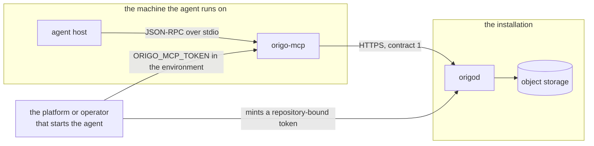

# MCP server

## Overview

An agent that works on a repository today either clones it or writes
HTTP calls by hand. A clone costs a checkout of every file to read one
of them; a hand-written call costs the agent a guess at a path, a
header, and a body, and it gets the guess wrong. Origo already serves
what an agent needs: a read API for refs, history, trees and blobs
(spec 009), operations that create a commit from a request without a
clone (spec 020), a credential scoped to one repository with a lifetime
(spec 007), one error envelope (spec 003), and an advertised request
rate (spec 012). What is missing is the shape: an agent wants a tool
called *read this file at this ref*, not a REST client.

This spec is `origo-mcp`, a second binary of this repository that
speaks the Model Context Protocol over standard input and output beside
an agent, and turns eleven task-shaped tools into calls on contract 1.
It runs in read-only mode by default. It never clones, never runs git,
never mints a credential, and adds nothing to `origod`.

The design constraint that separates this from any other client is that
an agent pays for every byte that reaches its model. Response shape is
therefore not presentation here, it is the primary design concern, and
the Token efficiency section below is where most of the decisions are.

## Current state

Nothing is built. `cmd/` holds `origod` alone. The pieces it stands on
are all released in `v0.1.0`:

- Spec 009's read API: `GET /v1/repos/{id}/refs`,
  `GET /v1/repos/{id}/commits`, `GET /v1/repos/{id}/commits/{sha}`,
  `GET /v1/repos/{id}/compare/{base}...{head}`,
  `GET /v1/repos/{id}/tree/{sha}`, `GET /v1/repos/{id}/blob/{sha}`,
  with cursor paging, `ETag` revalidation, `Origo-Commit` on every
  response, and `Origo-Truncated` where a body was cut.
- Spec 020's four write routes: `POST /v1/repos/{id}/commits`,
  `POST /v1/repos/{id}/merge`, `POST /v1/repos/{id}/cherry-pick`,
  `POST /v1/repos/{id}/revert`.
- Spec 003's repository representation at `GET /v1/repos/{id}` with
  `owner`, `slug`, `default_branch`, `head`, `size_bytes`,
  `updated_at`, and `pushed_at`, and its error envelope.
- Spec 007's `POST /v1/repos/{id}/tokens`, which mints a token bound to
  one repository with a scope and a lifetime, and copies the minter's
  `act` claim into it.

Nothing in Origo changes for this spec. It defines no endpoint, no
header, no error code, no metric, no event, and no failpoint, and
`origod` reads none of its four variables.

## Design

### The protocol revision

The spec targets Model Context Protocol revision **`2026-07-28`**,
confirmed against `modelcontextprotocol.io/specification/latest`, which
resolves to that revision, and against its `server/tools`,
`server/resources`, `basic/transports`, and `basic/authorization`
pages and the `schema/2026-07-28/schema.ts` the specification cites.
The properties this design relies on, each read there rather than
recalled:

| Property of `2026-07-28` | What this design does with it |
|---|---|
| there is no `initialize` handshake and no connection-scoped session; every request carries its protocol version and client capabilities in `_meta.io.modelcontextprotocol/*` | the server holds no per-connection state at all, which is what lets one process serve one agent with one credential and nothing else |
| two standard transports: stdio (newline-delimited JSON-RPC over a client-launched subprocess) and Streamable HTTP | stdio only, for the reasons in Where it lives |
| a tool carries `name`, `title`, `description`, `inputSchema`, optional `outputSchema`, and optional `annotations` | the tool table below fixes all of them |
| `ToolAnnotations` are `readOnlyHint` (default false), `destructiveHint` (default true), `idempotentHint` (default false), and `openWorldHint` (default true), and a client must treat them as untrusted unless the server is trusted | every tool states all four rather than leaning on a default, because three of the four defaults are the unsafe reading |
| a tool result carries `content` blocks, optional `structuredContent` against `outputSchema`, and `isError` for a failure the model can correct | one text block everywhere, `structuredContent` on the three write tools alone |
| the tool set may vary by the authorization presented but must not vary per connection or as a side effect of another request | the write tools are absent or present for the life of the process, decided by a start-up flag |
| authorization is optional, and an implementation on stdio should not follow it but should take credentials from the environment | the credential is `ORIGO_MCP_TOKEN` and there is no OAuth flow anywhere in this binary |
| a host should keep a human in the loop and should confirm a tool invocation | assumed as a courtesy, relied on for nothing |

An older host is common, so the server also answers a client whose
first message is an `initialize` request with the initialization-based
handshake the protocol's versioning page defines for backward
compatibility, negotiating `2025-06-18`, and serves the same registry
either way. Only the envelope differs.

### Where it lives

`origo-mcp` is **a second binary of this repository**, `cmd/origo-mcp`,
built by the same tag, shipped in the same release archives, and run by
an agent host on the machine where the agent runs. Four placements were
weighed.

| Placement | What it costs |
|---|---|
| **`cmd/origo-mcp` in this repository, stdio, chosen** | one more archive per platform in spec 017's `release-archives`, one `depcheck` row, and one document. `origod` is untouched: no route, no listener, no configuration, no threat-model surface. The tool surface moves in the same commit as the contract it is shaped from, and spec 021's stack is what it is proved against |
| a subcommand, `origod mcp` | no new artifact, and `origod migrate` is the precedent for a client mode in the node's binary. Refused: the registry grows with every tool anyone adds, and it would grow inside the process that holds the write-ahead log and inside the image an installation runs. A migration is an operator's one-shot lifecycle step; an agent's tool server is a surface that keeps growing, and it would arrive in spec 002's configuration reference and spec 016's threat model with each addition |
| a separate repository | the split spec 023 makes for the web interface, and refused here for the reason that split was made: the web interface is a service with a deployment, sessions, templates, and a visual design, while this is a stateless client binary with no surface of its own. A second repository would put the tool surface on a second release cadence and out of reach of the conformance stack, and version skew against contract 1 is exactly the failure it would buy |
| a hosted MCP endpoint at the installation | refused for v1, on the protocol's own terms. See below |

**Why there is no hosted endpoint, in the words the question deserves.**
Latere runs Origo at `git.latere.ai`; it runs `origo-mcp` beside each
agent, pointed at that address. There is no MCP endpoint on the
installation and none is planned in this spec. The reason is not
distaste for hosting. An MCP server on an HTTP transport is an OAuth
2.1 resource server: it must publish protected resource metadata, it
must validate that an access token was issued for itself as the
audience, and it must not accept or transit any other token. An Origo
bearer is issued by the operator's OIDC issuer with `aud: origo`, so a
hosted MCP server could not take one. It would need an authorization
server of its own, and then, holding only its own tokens, it would have
to obtain an Origo credential for each caller. The only way to do that
inside Origo's model is `POST /v1/repos/{id}/tokens`, whose action is
`admin`. **A hosted MCP server would therefore have to hold `admin` on
every repository it serves**, which is the credential broader than the
task that the authentication section refuses. Multi-tenancy, a session
store, and a second place where a deny can be got wrong come after
that. If a remote-MCP client ever needs one, it is its own spec, and
its first paragraph is how the `admin` credential is avoided.

A self-hoster runs the binary they already downloaded. The release
already ships `darwin/amd64` and `darwin/arm64` archives, which no
installation runs; they exist for a person's machine, which is where
this binary belongs.

### Configuration

Four variables and one flag. `origod` reads none of them, so they are
not in spec 002's reference and not in `docs/configuration.md`, which
`tools/configdoc` generates from `internal/config`: a row there would
be a row the generator cannot produce and `make docs` would drift.
`docs/mcp.md` is their reference.

| Variable | Value |
|---|---|
| `ORIGO_MCP_URL` | the installation, `https://git.example.com`. Required; a URL that is not `https://` is refused at start-up unless its host is a loopback address |
| `ORIGO_MCP_TOKEN` | the bearer sent on every call, in the `Authorization: Bearer` form. Required. Never logged, never in a tool result |
| `ORIGO_MCP_REPOS` | comma-separated `alias=<repository id>` pairs, the set `origo.list_repos` answers and the set every `repo` argument resolves against. Optional; empty means the one repository a bound token names, and a `repo` argument that is a lower-case UUID is always accepted |
| `ORIGO_MCP_AUTHOR` | `Name <email>`, the author of every commit the write tools create. Required with `-write`; refused at start-up if the address has no `@` |

`-write` is the flag, not a variable, because an agent host records the
command and its arguments in a configuration file a person reads, and
the one fact a person needs to see there is whether this server can
change anything.

Timeouts are fixed and take no knob: 60 seconds for a call to a read
route, whose own budget is 30 seconds (spec 009), and 330 seconds for
`origo.merge` and `origo.replay_commits`, whose budget is 300 (spec
020). A call that reaches the timeout is one line to the model naming
the operation.

### Authentication

The credential arrives in the environment and is one bearer. The server
**never mints, never signs, never exchanges, and never refreshes** a
credential; there is no code path in it that can widen its own access.

**The credential to hand it is a repository-bound token** of spec 007:
`POST /v1/repos/{id}/tokens` with `{"scope": "read", "ttl": 3600}` for
an agent that reads, `"write"` for one that also commits. It is bound
to one repository, so a mistake cannot reach another; its scope is the
whole of what the agent may do, so `admin` is unreachable and no
administration route can be called even if a tool for one existed; and
it expires, so a leak is bounded. When the token carries a `repo`
claim, the server reads it once at start-up to learn which repository
it serves, and refuses every `repo` argument naming another before any
request leaves the machine. That decoding is shaping only, never an
authorization decision: the server does not verify the signature, and
Origo verifies every call regardless.

**An agent acting for a person** is spec 007's `act` claim, and the
server constructs nothing. The platform that starts the agent holds a
service token with `act: <the person's sub>`, and mints the bound token
from it; spec 007 copies `act` from the minter into the minted token.
So the credential handed to the agent already carries the delegation,
every entry the agent's commits produce records `subject` as the person
and `actor` as the service, and every push event carries `pusher.sub`
and `pusher.actor` the same way. An agent a person runs for themselves
uses a token minted from their own, with no `act`, and the history says
the person did it, which is true.

**A token from the issuer** is accepted and is the broader case: it is
not bound to a repository, so the authorizer decides each call, and
what the agent may do is what the person may do. It is what an operator
with no minting path starts with. The spec states the cost plainly
rather than forbidding it: a leak of it is a leak of the person's whole
access, where a leak of a bound token is a leak of one repository for
at most an hour.

**The hour is real and must be said out loud.** Spec 007 caps `ttl` at
3600 seconds, and an agent session outlives it. When Origo answers 401
`unauthenticated` with `details.reason: "expired"`, the tool result is
one line, `the credential this server was started with has expired;
restart it with a freshly minted token`, and the server makes no
further request until it is restarted. Without that line an agent
retries a dead credential until its budget is gone.

**An operator running their own Origo** does nothing new. They already
run an issuer and an authorizer (spec 007); minting is a route their
Origo already serves; the binary is in the release they already
download. There is no service to deploy, no database, no second access
control model, and no change to the installation.

### The tool surface

Eleven tools: eight that read and three that write. The names are the
tasks, not the routes. Every `inputSchema` is
`"additionalProperties": false`, so an argument the schema does not
name is refused by the client before a request is made.

`repo` on every tool is an alias from `ORIGO_MCP_REPOS` or a repository
id. It is never `<owner>/<slug>`: the JSON surface cannot resolve a
name, which the deck records as a decision of specs 003 and 023, and
the alias map is what stands in until it can.

#### The eight read tools

| Tool | Input | Result | Origo calls |
|---|---|---|---|
| `origo.list_repos` | none | one line per configured repository: `<alias>  <id>  <owner>/<slug>`, and a closing line saying this is the list the server was configured with and not the list the subject may see | `GET /v1/repos/{id}` once per alias, cached for the process |
| `origo.repo_overview` | `repo` | the default branch, the full head object id, `pushed_at`, `size_bytes`, the branch and tag counts, and the five newest commits as history lines. The one call that orients an agent in a repository it has not seen | `GET /v1/repos/{id}`, `GET /v1/repos/{id}/refs` twice, `GET /v1/repos/{id}/commits` |
| `origo.list_refs` | `repo`, `kind` (`branches` \| `tags` \| `all`, default `branches`), `prefix`, `limit` (default 100), `cursor` | `<name> <7 hex>` per line. Origo's `refs` has no cursor and caps at 10 000 with `Origo-Truncated`, so the cursor here is a position in the one answer and the cap is reported as the cap it is | `GET /v1/repos/{id}/refs` |
| `origo.list_files` | `repo`, `ref` (default `HEAD`), `path`, `recursive` (default false), `limit` (default 200), `cursor` | one line per entry: the path, a trailing `/` for a tree, `*` for `100755`, `@` for `120000`, and the size for a blob. No object ids: nothing takes a tree entry's id as an argument | `GET /v1/repos/{id}/tree/{sha}` |
| `origo.read_file` | `repo`, `path`, `ref` (default `HEAD`), `offset_lines` (default 0), `max_lines` (default 800), `max_bytes` (default 32768) | a header line `<path>@<7 hex>  <n> bytes  <m> lines`, then the text. Binary is refused by naming its size and object id rather than putting it in the context | `GET /v1/repos/{id}/tree/{sha}` to resolve the path to a blob id and its size, then `GET /v1/repos/{id}/blob/{sha}` with a `Range` when the window or the 50 MiB rule needs one |
| `origo.history` | `repo`, `ref` (default `HEAD`), `path`, `since`, `until`, `limit` (default 20), `cursor` | one line per commit: `<7 hex> <YYYY-MM-DD> <author name> <subject, at most 72 characters>`. Bodies, trailers, and committer fields are dropped; `origo.show_commit` has them | `GET /v1/repos/{id}/commits` |
| `origo.show_commit` | `repo`, `commit`, `include_patch` (default false), `paths`, `max_patch_bytes` (default 32768) | the metadata, the full message, the trailers, the totals, and one stat line per file; the patch only when asked. A merge commit is compared against its first parent, which the result says | `GET /v1/repos/{id}/commits/{sha}`, and `GET /v1/repos/{id}/compare/{base}...{head}` for the file list and any patch |
| `origo.diff` | `repo`, `base`, `head`, `paths`, `include_patch` (default false), `max_patch_bytes` (default 32768) | stat first: `+12 -3  internal/api/read.go` per file and a totals line, no patch. With `paths`, the patch of those files alone; with `include_patch`, the whole patch up to `max_patch_bytes`, cut at a file boundary | `GET /v1/repos/{id}/compare/{base}...{head}`, once per path when `paths` is given |

There is no search tool. Origo has no search endpoint, spec 009 scopes
one out, and a client-side search would mean downloading a repository
to grep it, which is a clone with extra steps. `origo.history` with
`path`, `since`, and `until` is what history search is here. An author
filter is not offered because `GET /v1/repos/{id}/commits` has no
author parameter; adding one is a spec against Origo, not a loop in
this binary.

#### The three write tools

Each is one of spec 020's operations, and each carries `expected_head`
as a required argument. There is no call that writes a branch without
naming the commit the caller believes is there. `author` is not in any
schema: the server sends `ORIGO_MCP_AUTHOR`, so a model cannot choose
who a commit is attributed to. The committer is `Origo <origo@<host>>`
with the subject and actor in the trailers, which spec 020 fixes.

| Tool | Input beyond `repo`, `branch`, `expected_head`, `dry_run` | Route |
|---|---|---|
| `origo.commit_files` | `message`, `changes` (1 to 1 000 of `{path, text \| content_ref \| delete, mode}`), `create_branch`, `from` | `POST /v1/repos/{id}/commits` |
| `origo.merge` | `source`, `strategy` (`fast_forward_only` \| `merge_commit` \| `fast_forward_if_possible`, default the third), `message` | `POST /v1/repos/{id}/merge` |
| `origo.replay_commits` | `mode` (`cherry_pick` \| `revert`), `commits` (1 to 100), `mainline` | `POST /v1/repos/{id}/cherry-pick` or `POST /v1/repos/{id}/revert` |

Cherry-pick and revert are one tool because their inputs and their
semantics are identical, a list of commits applied to a branch forward
or backward, and two tool definitions of the same shape cost an agent
context on every turn for nothing.

A change carries `text`, not base64. Spec 020's `content` is base64 and
the server encodes it; a model produces base64 slowly, expensively, and
sometimes wrongly, and it is the wire's problem, not the model's.
Content that is not text is `content_ref`, an object id already in the
repository. A change larger than spec 020's limits is refused by Origo
with `invalid_change`, and this server adds no limit of its own.

`expected_head` accepts a short object id. Anything under 40 hexadecimal
characters is expanded through `GET /v1/repos/{id}/commits/{sha}`
before the write is sent, so a short id that no longer resolves is
`ref_not_found` and nothing is written, and a short id of a commit the
branch has moved off still produces `non_fast_forward` with the actual
head. History lines print 7 hexadecimal characters and
`origo.repo_overview` prints the full head, which is the only place a
full id is worth its tokens.

#### Annotations

| Tools | `readOnlyHint` | `destructiveHint` | `idempotentHint` | `openWorldHint` |
|---|---|---|---|---|
| the eight read tools | true | false | true | false |
| `origo.commit_files`, `origo.merge`, `origo.replay_commits` | false | false | false | false |

`destructiveHint: false` on the write tools is a claim, and the Write
safety section is its proof. `openWorldHint: false` everywhere is
literal: the world of this server is one installation named by
`ORIGO_MCP_URL`, and often one repository inside it.

### Token efficiency

An agent pays for every byte that reaches its model, on every turn it
stays in the context. Five rules, then the numbers.

1. **One representation per call.** No tool declares an `outputSchema`
   or returns `structuredContent`, except the three write tools. A
   schema and the serialized duplicate the protocol recommends beside
   it are two copies of the same bytes in the one place where bytes are
   paid per call. This is a choice, not a deviation: structured content
   is optional in the protocol, and a server that returns none breaks
   no rule. The write tools are the exception because their result is a
   five-field receipt a host acts on, `commit`, `branch`, `entry_seq`,
   `tree`, and `committed`, and about forty tokens of duplication buys
   a machine-checkable record of a change.
2. **The default answer is the smallest one that answers the
   question.** The larger one is one argument away, and the argument is
   named in the result. Stat before patch, subject before body, one
   directory before a recursive walk, 20 commits before 200.
3. **Every incomplete result ends with one bracketed line that names
   the exact next call**, and a result with no such line is complete.
   The word truncated never appears without the argument that
   continues it. `[truncated: lines 0-799 of 3120, 32768 of 141002
   bytes; call read_file again with offset_lines=800]`.
4. **The truncation the result reports is the truncation that
   happened.** Where Origo cut a body itself, with `Origo-Truncated:
   true`, the result says Origo cut it, names the last file it saw, and
   does not present a partial file list as a complete one.
5. **The tool list is paid on every turn.** Every description is at
   most two sentences and carries no example. The whole `tools/list`
   result is at most 5 KiB of JSON in read-only mode and 8 KiB with
   `-write`.

| Tool | Default answer | Cut at | How more is asked for |
|---|---|---|---|
| `origo.repo_overview` | 5 commits, both ref counts | never | the other tools |
| `origo.list_refs` | 100 refs | Origo's 10 000 | `cursor=<n>` |
| `origo.list_files` | 200 entries, one directory | Origo's 5 000 per page | `cursor=<path>`, `recursive=true` |
| `origo.read_file` | 800 lines or 32 KiB, whichever first | Origo's 50 MiB blob rule, handled by `Range` before it fires | `offset_lines=<n>`, `max_lines`, `max_bytes` |
| `origo.history` | 20 commits, subject only | Origo's 200 per page | `cursor=<sha>`, `limit` |
| `origo.show_commit` | metadata, message, per-file stat | Origo's 1 MiB compare | `include_patch=true`, `paths=[…]` |
| `origo.diff` | per-file stat and a totals line | Origo's 1 MiB compare | `paths=[…]`, `include_patch=true`, `max_patch_bytes` |

Three of those deserve their reasoning.

**Stat before patch** is the largest saving in the set. A change of
1 MiB of diff is far past any agent's budget, and Origo will hand over
1 MiB before it cuts. The server fetches the comparison, parses the
`diff --git` headers and the `+` and `-` lines into per-file counts
locally, and returns one line per file. The bytes are paid on the
local machine, which is a reason the binary is local. The agent then
names the file it cares about and gets that file's patch through
`?path=`, which is one more call. Where the fetched comparison carried
`Origo-Truncated: true`, the summary covers the files inside the cut
alone, and the closing line says so and names the last file, because a
file list silently missing its tail is a wrong answer, not a small one.
If this proves to be the common path, a stat mode on spec 009's
`compare` would let Origo answer it in a fraction of the bytes; that is
a spec against Origo, and it is recorded in the deck's Later list
rather than worked around here.

**Reading a file** is two calls because Origo's blob route takes a blob
object id, not a path. The server resolves `ref` and `path` through
`GET /v1/repos/{id}/tree/{sha}`, which also gives it the size, so it
knows before it asks whether a `Range` is needed and never provokes
`blob_too_large`. Whether `?path=` on that route answers the entry for
a nested path, or whether the server must descend a level at a time, is
a question about how spec 009's `ls-tree` invocation behaves that the
spec does not state, so the acceptance criterion below makes the
builder prove nested resolution rather than assume it.

**Revalidation** costs the agent nothing and saves the installation
work. The server keeps the `ETag` of every read response in memory,
keyed by repository, route and arguments, at most 512 entries, and
sends `If-None-Match`; a 304 is answered from the held body. An
`Origo-Stale` response is served to the model with one line saying the
installation answered from a stale copy, because an agent that acts on
a stale head and then writes gets `non_fast_forward` and should know
why.

**Errors are one line.** Spec 003's envelope carries a code, one user
sentence, and developer details. The tool result is
`isError: true` with `<code>: <message>` and the details that tell the
agent what to do next, and nothing else:

| Origo code | What the line adds beyond the sentence |
|---|---|
| `non_fast_forward` | `expected` and `actual`, so the agent re-reads and retries with the actual head |
| `merge_conflict` | `paths`, and the commit for a replay |
| `invalid_change` | `index` and `reason` |
| `over_quota` | `limit`, `bytes`, `max` |
| `ref_not_found` | `ref` |
| `repo_frozen`, `gone` | nothing beyond the sentence; both are terminal for an agent |
| `unauthenticated` | `reason`, and for `expired` the restart instruction above |
| `forbidden` | `action` and the authorizer's `reason` |
| `rate_limited`, `storage_unavailable`, `repository_unavailable`, `authorizer_unavailable` | the wait from `Retry-After` |
| `operation_timeout` | `operation` and `budget_seconds` |

A `rate_limited` or a 503 whose `Retry-After` is at most 5 seconds is
waited out and retried once by the server, which costs the agent
nothing; a longer one is returned as one line naming the wait, because
an agent turn is more expensive than a sleep but a minute of one is
not. `RateLimit-Limit` is read from the response and named in that
line, so the agent sees the figure in force rather than a default.

### Write safety

**No tool in this server can make a commit unreachable.** Every
mutation is one of spec 020's operations, each of which appends a
commit whose parent is `expected_head` and moves one branch to it. No
tool deletes a branch, a tag, a repository, or a file's history; there
is no force, no rewrite, and no reference deletion in the surface,
because there is none in spec 020 either. This is what
`destructiveHint: false` asserts, and it is the property to preserve
when the surface grows.

Four independent bounds sit in front of a mistaken agent, and none of
them relies on another.

1. **The tools are absent.** Without `-write`, `tools/list` returns the
   eight read tools and a call naming any other is the protocol's
   unknown-tool error. A model cannot invoke a tool it has never seen.
2. **The credential cannot.** The token to hand a reading agent is
   scope `read`, and Origo refuses a write under it with `forbidden`
   whatever the binary sends. The two gates are independent: a
   misconfigured flag is stopped by the token, a leaked write token is
   stopped by the flag.
3. **`expected_head` is required, and the server never fills it in.**
   A write is a statement about a branch the agent has read. A branch
   that moved is `non_fast_forward` with the actual head, and the agent
   re-reads instead of clobbering. `dry_run` is available on all three
   tools and its result says `committed: false`, so a plan can be
   checked before it lands; it defaults to false, because a silent
   default of true would let an agent believe it had committed when it
   had not.
4. **Origo's own limits bound a loop.** 60 operations per repository
   per minute, `ORIGO_REQUESTS_PER_MINUTE` per subject, `quota_bytes`,
   1 000 changes, 10 MiB per file, 64 MiB per body (spec 012, spec
   020). This server enforces no limit Origo does not: a duplicated
   figure drifts from the one that is enforced, and the figure that is
   enforced is the one the operator set. It reports them, with the
   limit and the wait, so the agent backs off rather than retrying.

**What is irreversible, and the seven-day hold.** Spec 019 holds a
deleted repository for seven days and answers `gone` afterwards. That
hold never applies to anything this server does, for two independent
reasons: no tool deletes a repository, and deletion is an `admin`
action that neither a `read` nor a `write` bound token can reach. The
recovery path for a commit an agent should not have made is inside the
surface: `origo.replay_commits` with `mode: "revert"`, which is itself
additive and leaves the mistake in the history where an audit can see
it. Nothing an agent can do here needs a hold, which is the point of
choosing an additive surface rather than adding a confirmation dialog
to a destructive one.

**A branch allow-list is refused.** It is the obvious next guard, and
it would be a second access control model living in a file on a
laptop, diverging silently from the authorizer that actually decides.
Spec 023 refuses the same thing for the same reason. Branch-level
authorization belongs on spec 007's contract, which today asks about a
repository and an action and not about a reference; until it asks, the
bound token's scope and its repository are the bounds, and they are
enforced by the installation rather than by the client.

### Resources and prompts

**Resources are omitted.** Three reasons, any one sufficient. The
resource set must not vary per connection and Origo has no collection
route, so the server cannot enumerate the repositories a subject may
see; the deck already records that the list needs both a directory
question on the authorizer and a route on Origo, and neither exists. A
resource template such as `origo://{repo}/blob/{ref}/{path}` would
duplicate `origo.read_file` exactly, with a second code path and a
second truncation policy. And `resources/read` has no vocabulary for a
partial answer: it returns contents or an error, so a 3 000-line file
would be returned whole or not at all, which is the failure this whole
design exists to avoid. If a host's file picker becomes how people
point an agent at a file, a template is additive and gets its own
spec.

**Prompts are omitted.** A prompt is a user-initiated template, and the
templates worth writing here, review this change, bump this dependency
across these repositories, are workflows of the product that runs the
agent, not knowledge about a git host. Shipping them would put Latere's
workflow opinions inside a component a self-hoster runs. What a prompt
would have carried is carried by the tool descriptions, which every
host already shows the model.

The server declares the `tools` capability with `listChanged: false`.
The set is fixed for the life of the process.

## Not in this spec

The line, drawn so a later contributor does not grow this into a second
API.

- **Anything Origo does not already serve.** Every tool call is one or
  more calls to contract 1 as `docs/api.md` documents it. Local work is
  allowed where it changes no semantics and only reduces tokens:
  parsing a diff Origo returned into per-file counts, turning a line
  window into a `Range`, expanding a short object id. Fetching more
  than the answer needs in order to synthesize a feature Origo lacks is
  refused: content search, blame, a repository listing, an author
  filter. Each of those is a spec against Origo.
- **Administration.** Create, delete, undelete, rename, transfer,
  freeze, unfreeze, import, export, `gc`, `verify`. All are `admin`
  (spec 019), all are what a bound token is chosen to exclude, and
  giving an agent a credential that can reach them would undo the
  authentication section.
- **Minting a token.** `POST /v1/repos/{id}/tokens` is `admin`. The
  server takes a credential; it does not make one.
- **Git.** No clone, no worktree, no subprocess, no `git` on the
  machine. An agent that wants a whole tree to work on locally clones
  it with git; this server exists for the work a clone is too expensive
  for.
- **The filesystem.** The server writes no file, keeps no cache on
  disk, and takes no path outside a repository.
- **LFS** (spec 010), **push events** (spec 008), **the archive**
  (spec 009): a tarball, a pointer file, and a webhook are not things
  an agent puts in a context window.
- **A hosted transport.** No Streamable HTTP listener, no OAuth flow,
  no multi-tenancy, no session store.
- **Sampling and elicitation.** The server asks the model nothing and
  asks the user nothing. A tool call answers or refuses.

## What must land first

Nothing in Origo. Every route the tools call is released in `v0.1.0`.
Three items outside this spec's own directory:

| Item | Owner | What it is |
|---|---|---|
| `release-archives` builds `origo-mcp` for the four platforms of `RELEASE_PLATFORMS` and sums it into `checksums.txt` beside `origod`, spec 017's artifact table gains the `origo-mcp_<version>_<os>_<arch>.tar.gz` row, and the `release-verify` job of `release.yml` gains `--pattern 'origo-mcp_*.tar.gz'` on its `gh release download` | 017 | the upload is glob-driven (`out/release/*.tar.gz`), so the archives reach the release on their own, but `release-verify` downloads by an explicit pattern and then runs `sha256sum -c checksums.txt` over what it fetched. Four sums in that file with no files beside them fails the next tag, so the pattern is not optional and is the one line a builder would otherwise miss |
| a `depcheck` row for `github.com/latere-ai/origo/cmd/origo-mcp` in `.lateregate.yaml` | 002 | the same allow list as the node, `latere.ai/x/pkg` and the standard library, with the reason that a newline-delimited JSON-RPC loop over `encoding/json` needs no upstream root at all, unlike spec 024's `golang.org/x/crypto/ssh` |
| `docs/mcp.md` and its row in `docs/README.md` | this spec | below |

Build order inside the spec: the stdio loop and the registry with the
eight read tools against a stub Origo; the truncation vocabulary and
the error mapping; the `-write` flag and the three write tools; the
release and `depcheck` rows; the document; the end-to-end scenario. The
first three are where the design is, and each is testable against a
`net/http/httptest` stand-in before anything talks to a node.

## What it adds to the documentation

- **`docs/mcp.md`**, user register: what the server is in three
  sentences, how to mint a repository-bound token with `curl`, the
  agent host configuration as one JSON block, the four variables and
  the flag, the eleven tools with one line each, the truncation
  vocabulary, and what it cannot do. Its `sh` blocks are its test under
  `tools/docs/run-blocks.sh` the way `docs/migration.md`'s are, which the
  last acceptance criterion names.
- **`docs/README.md`** gains its row, and the repository `README.md`
  one sentence naming the binary.
- **`docs/api.md` is unchanged.** This spec defines no endpoint, no
  header, and no code, so `tools/apidoc` renders the same page.
  **`docs/configuration.md` is unchanged** for the reason in
  Configuration.
- `CHANGELOG.md` under `## Unreleased`, in a consumer's words: a second
  binary, what it is for, and that a release now carries eight archives
  rather than four.

## Acceptance criteria

- `tools/list` without `-write` returns exactly the eight read tools
  and with `-write` exactly the eleven, every name and every
  annotation matching the tables above, and the whole result is at most
  5 KiB of JSON in read-only mode and 8 KiB in write mode (proposed:
  `cmd/origo-mcp`, `TestToolListIsGatedAndFitsTheBudget`).
- A `tools/call` of `origo.commit_files` against a server started
  without `-write` answers the protocol's unknown-tool error and the
  stub Origo receives no request at all (proposed: `cmd/origo-mcp`,
  `TestWriteToolsAreUnreachableWithoutTheFlag`).
- A client whose first message is an `initialize` request is served the
  initialization-based handshake at `2025-06-18` and a client that
  sends `tools/call` with `_meta.io.modelcontextprotocol/protocolVersion`
  of `2026-07-28` is served the stateless shape, both against the same
  registry and with byte-identical tool results (proposed:
  `cmd/origo-mcp`, `TestBothProtocolErasAreServed`).
- `origo.read_file` on `internal/api/read.go` at a ref resolves the
  nested path through the tree and fetches the blob by its object id: a
  3 120-line file answers 800 lines with the truncation line naming
  `offset_lines=800`, the next call answers lines 800 to 1599, the two
  windows are the file's lines 0 to 1599 exactly with no overlap and no
  gap, a 60 MiB blob is fetched with a `Range` and never answers
  `blob_too_large`, and a file with a NUL byte in its first 8 KiB
  answers the binary refusal with no file bytes in the result
  (proposed: `cmd/origo-mcp`, `TestReadFileResolvesNestedPathsAndWindows`).
- `origo.diff` over a fixture with 12 changed files answers 12 stat
  lines and a totals line and no patch; with `paths` of two of them it
  answers those two patches and fetches `compare` twice with `?path=`;
  and against a stub that answers `Origo-Truncated: true` it names the
  last file it saw and states that the comparison was cut, and the
  summary is not presented as complete (proposed: `cmd/origo-mcp`,
  `TestDiffIsStatFirstAndHonestAboutTheCut`).
- Every incomplete result ends with one bracketed line naming the
  argument of the next call, asserted as a table over `read_file`,
  `history`, `list_files`, `list_refs`, `diff`, and `show_commit`, and
  no complete result carries one (proposed: `cmd/origo-mcp`,
  `TestEveryTruncationNamesTheNextCall`).
- Each code of the error table becomes one `isError: true` line
  `<code>: <message>` with that row's details and nothing else, over a
  stub that answers each envelope; a 429 with `Retry-After: 3` is
  waited out and retried once and the tool answers the retry's body,
  and one with `Retry-After: 60` answers one line naming the wait and
  the `RateLimit-Limit` in force; a 401 with `details.reason:
  "expired"` answers the restart instruction and the server makes no
  further request (proposed: `cmd/origo-mcp`, `TestOrigoErrorsBecomeOneLine`,
  `TestShortRateLimitIsRetriedOnce`, `TestExpiredCredentialStopsTheServer`).
- No tool schema has an `author` property, every schema is
  `additionalProperties: false`, and the body `origo.commit_files`
  sends carries `author` from `ORIGO_MCP_AUTHOR` and `content` as the
  base64 of the `text` the tool was given, byte-identical to a
  hand-written spec 020 request for the same change (proposed:
  `cmd/origo-mcp`, `TestAuthorIsNotModelControlled`).
- An `expected_head` of 7 hexadecimal characters is expanded through
  `GET /v1/repos/{id}/commits/{sha}` before the write is sent, one that
  no longer resolves answers `ref_not_found` with no write attempted,
  and one of a commit the branch has moved off answers
  `non_fast_forward` carrying the actual head (proposed:
  `cmd/origo-mcp`, `TestShortExpectedHeadIsExpandedBeforeTheWrite`).
- The server refuses to start with `-write` and no `ORIGO_MCP_AUTHOR`,
  with an `ORIGO_MCP_AUTHOR` whose address has no `@`, with a
  non-loopback `ORIGO_MCP_URL` that is not `https://`, and with a
  token whose `exp` has passed, each with one sentence on stderr and
  exit status 2 (proposed: `cmd/origo-mcp`, `TestStartupRefusals`).
- A bound token naming one repository makes every tool call with
  another `repo` a refusal before any request leaves the process
  (proposed: `cmd/origo-mcp`, `TestBoundTokenPinsTheRepository`).
- With `ORIGO_MCP_TOKEN` set to a distinctive string, a run that
  exercises all eleven tools writes it to no tool result, no log line,
  and no stderr byte, mirroring spec 014's
  `TestSourceTokenIsNeverLogged` (proposed: `cmd/origo-mcp`,
  `TestTokenIsNeverWritten`).
- A second identical read tool call sends `If-None-Match` with the
  first response's `ETag`, a 304 answers from the held body, and the
  result is byte-identical to the first; a response carrying
  `Origo-Stale` adds the stale line (proposed: `cmd/origo-mcp`,
  `TestETagRevalidationSavesTheBody`).
- The tool table of `docs/mcp.md` names exactly the eleven tools of the
  registry with their read or write marking, so the document cannot
  drift from the binary (proposed: `cmd/origo-mcp`,
  `TestDocumentedToolsMatchTheRegistry`).
- Against a running node, `origo-mcp` started with a repository-bound
  `write` token reads a file, lists 20 commits of history, commits two
  files with `expected_head` from `origo.repo_overview`, sees the new
  head in a second `origo.repo_overview`, reverts that commit through
  `origo.replay_commits` with `mode: "revert"`, and is refused
  `non_fast_forward` on a third write carrying the stale head; the
  whole scenario is eleven tool calls, no clone, and no `git` process
  (proposed: `test/e2e`, `TestE2EMCPReadsCommitsAndReverts`, a plain
  test of the one-node run against `ORIGO_TEST_URL`).
- The same scenario under a `read` scoped bound token, with `-write`
  set, answers `forbidden` on the first write and leaves the branch
  where it was, which is the proof that the two write gates are
  independent (proposed: `test/e2e`,
  `TestE2EMCPReadTokenCannotWrite`).
- Every `sh` block of `docs/mcp.md` runs against the one-node run under
  `tools/docs/run-blocks.sh`, from minting the repository-bound token
  to a `tools/list` and a `tools/call` written to the process on its
  standard input, so the document cannot document a command that does
  not work; the test mirrors spec 014's
  `TestClusterMigrationDocCommandsRun` (proposed: `test/e2e`,
  `TestE2EMCPDocCommandsRun`).
