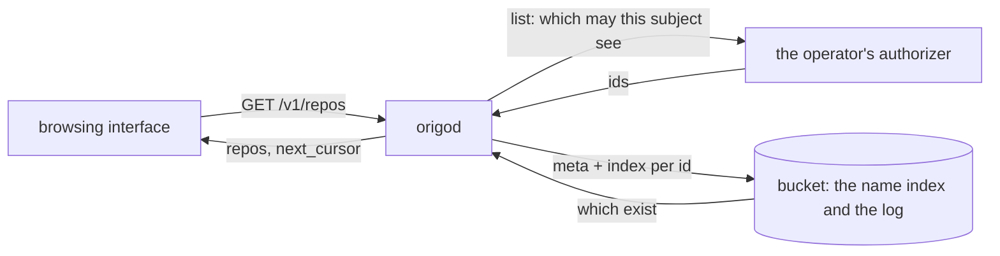

# Repository directory

## Overview

A person who opens a browsing interface onto an Origo installation
cannot be shown the repositories they may see, because no component can
answer the question alone. Origo's name index knows which repositories
*exist*; the authorizer knows which of them a subject may *see*. The
answer is the intersection, and Origo's whole route table is keyed by an
id the caller already holds.

This spec adds the two smallest things that close the gap, both stated
by the web interface's spec 023 in `latere-ai/origo-web`, which
deliberately did not build them because one of them changes a contract
an operator implements:

1. a fourth action, `list`, on the authorizer contract of spec 007, with
   an answer that says *this authorizer has no directory* without being
   read as an outage;
2. a collection route `GET /v1/repos`, in two modes: the directory, and
   the resolution of `<owner>/<slug>` to the representation
   `GET /v1/repos/{id}` serves.

Origo still stores no user and no permission. The directory is the
authorizer's answer, rendered through Origo's own representation.

## Current state

`internal/auth` holds the authorizer client (`authorizer.go`) with the
three actions `read`, `write`, `admin`, one request shape carrying a
`repo` object, and one answer shape whose `allow` field is mandatory: a
body without it is an `*Unavailable` and fails closed. `guard.go`
decides a request from a repository-bound token's scope or from that
client. `internal/api` serves `POST /v1/repos` and the id-keyed verbs;
there is no `GET /v1/repos`, so the collection path answers 404 through
`cmd/origod`'s unknown-route handler as `invalid_request`.
`internal/wal` already resolves a name: `(*Log).Resolve(owner, slug)`
reads `origo/names/<owner>/<slug>`, which is what `internal/httpgit`
calls for every clone in the label form. `test/stubs/authorizer` answers
from a rule table and records every request.

Spec 023's client in `latere-ai/origo-web` already treats a 400, 404,
405, or 501 from `GET /v1/repos` as *no directory* and degrades, so the
route lights up an interface that is written and shipped.

## Design

### The two questions and who can answer them



The subject side is the authorizer's alone: it is the component that
owns the permission model, and it is the only one that can produce the
set without walking every repository in the installation. The existence
side is Origo's alone. Neither is derivable from a token claim, and a
directory built from claims is a second access-control model that
diverges from the authorizer's answer the first time the two disagree.
Spec 023 records that rejection; this spec keeps it.

### The `list` action

The call is spec 007's call with two differences: the action is `list`,
and the body carries **no `repo` object**, which is what distinguishes
it from the three existing actions and what tells an endpoint that no
repository is named.

```
POST <ORIGO_AUTHORIZER_URL>
Authorization: Bearer <ORIGO_AUTHORIZER_TOKEN>
Content-Type: application/json

{"subject": "…", "actor": "…", "action": "list", "cursor": "…", "limit": 50}
```

| Field | Value |
|---|---|
| `subject` | the effective subject, as spec 007 defines it: the token's `sub`, or its `act` when the token carried one |
| `actor` | the delegating service when the token carried `act`, else empty |
| `action` | `list` |
| `cursor` | the `next_cursor` of the previous page, empty for the first |
| `limit` | how many entries the caller wants, 1 to 200; the endpoint may return fewer |

The answer is 200 in all three cases, as every answer on this contract
already is. A non-200, a timeout, or a body that parses as none of the
three is `authorizer_unavailable` and fails closed, exactly as spec 007
says.

```
200 {"repos": [{"id": "…", "owner": "…", "slug": "…"}], "next_cursor": "…"}
200 {"allow": false, "reason": "…"}
200 {"directory": false}
```

| Answer | Meaning | Origo's response |
|---|---|---|
| `repos` present, an array (empty is a valid page) | the page this subject may see, in an order of the endpoint's choosing that is stable across pages | 200 with the representation of each id that still exists |
| `allow` present and false | this subject sees nothing, and the endpoint is saying so rather than declining the question | 403 `forbidden` with the `reason` in `details.reason` |
| `directory` present and false | this authorizer does not implement the question | 501 `directory_unsupported` |
| anything else, including a body with none of the three keys | not an answer | 503 `authorizer_unavailable` |

**Why `{"directory": false}` and not a 501 from the endpoint.** Spec
007's first rule is that every verdict is 200 and that anything else is
a refusal Origo fails closed on. An authorizer that has not learned the
action must therefore be able to say so *inside* a 200, or it is
indistinguishable from one that is down, and an installation whose
authorizer predates this spec would report an outage on every home page
load instead of an interface that degrades. The three answers are
disjoint by key, so a client reads one field to tell them apart.

**An authorizer that answers nothing new stays correct.** An endpoint
built to spec 007 and never touched answers a `list` call however it
answers an unknown action. If it answers a 200 with `{"allow": false}`
it says *this subject sees nothing*, which is true of an installation
with no directory in the only sense the caller can act on. If it answers
a 4xx or 5xx it is read as unavailable, which the interface renders as a
failed page rather than a wrong one. Neither is a security hole: there
is no answer this contract can produce that widens access, because the
route below never serves a repository the endpoint did not name.

**Fail-closed is untouched elsewhere.** The `list` request and answer
are their own shapes in the client. The parser for `read`, `write`, and
`admin` keeps `allow` mandatory, so no body that omits it can be read as
an allow on any of the three.

**Rules 1 to 5 of spec 007 still hold, and a sixth applies here.**

6. **A `list` answer names ids, never permissions.** The endpoint
   returns the ids a subject may read. Origo asks nothing further about
   them: it does not call `read` per id, because that would make one
   page of 50 into 51 calls on the request path, against rule 5. The
   `list` answer *is* the read decision for the entries it names, for
   the representation this route serves and for nothing else. Every
   other route keeps asking per repository, so an id learnt from a
   directory page still costs a `read` decision when it is opened.

**Caching.** A `list` answer is not cached. It is a page rather than a
verdict, it varies by cursor, and its shape carries no `ttl`. Spec 007's
two caches and their bounds are unchanged.

**A repository-bound token cannot list.** Its decision was made at
minting, for one repository, so a directory question from one is 403
`forbidden` with `details.reason: "token scope does not allow this
action"`, without a call to the authorizer.

### The collection route

| Method | Path | Behaviour |
|---|---|---|
| GET | `/v1/repos` | two modes, chosen by the query. **Directory:** `?cursor=&limit=` asks the authorizer the `list` question and answers `{"repos": [<the representation of GET /v1/repos/{id}>], "next_cursor": <the authorizer's, or null>}`, dropping every id the log no longer holds; `limit` default 50, at most 200, and a value outside it is 400 `invalid_request` with `details.reason: "limit"`; 403 `forbidden` when the authorizer denied; 501 `directory_unsupported` when it answered `{"directory": false}`. **Name:** `?owner=&slug=` resolves the name through `origo/names/<owner>/<slug>`, the index the git label form already reads, then answers exactly as `GET /v1/repos/{id}` does for the id it resolved to: the authorizer is asked `read` on that id first and a deny is 403 whether or not the name resolved, so a refused caller learns nothing (spec 007, authorization before lookup); an allowed caller gets 404 `repo_not_found` when it did not resolve. One of `owner` and `slug` without the other is 400 `invalid_request` naming the missing field, and either together with `cursor` or `limit` is 400 `invalid_request` with `details.reason: "modes"` |

`Origo-Prefer` follows spec 005's rule as the git label form applies it:
absent on the directory mode, which names no one repository, and on the
name mode written only after the name resolved and the guard allowed, so
a header never tells a refused caller that a name exists.

**Dropping what no longer exists.** The authorizer's registry and
Origo's log are two stores and they drift: a repository deregistered at
Origo but still named by the endpoint, or one deleted, purged, or in the
7 day hold. The route reads `meta` and the newest index per id, the same
two reads `GET /v1/repos/{id}` makes, and drops an id whose metadata is
absent, whose index is deleted, or which was purged. A page may
therefore be shorter than the authorizer's, which is why `next_cursor`
comes from the authorizer and never from the count served: paging stays
exact even when a page empties.

**Cost.** One authorizer call and, per surviving entry, the two reads
`GET /v1/repos/{id}` makes, served from the node's cache after the first
currency check. A `limit` of 200 is 200 metadata reads, which is why the
cap is spec 009's and not larger.

### The new code

| Code | Status | Message | Details |
|---|---|---|---|
| `directory_unsupported` | 501 | This installation does not list repositories. | `reason` |

It is the one honest answer to *list the repositories I may see* on an
installation whose authorizer has no directory, and it is distinct from
`authorizer_unavailable`, which means *ask again later*. A consumer that
sees it stops asking.

### The stub

`test/stubs/authorizer` learns the action, to spec 013's table:

| Control | Behaviour |
|---|---|
| a PUT of `/directory` | `{"supported": <bool>, "repos": [{"id", "owner", "slug"}]}` sets the directory the stub answers `list` with. `supported` false, which is the default, answers `{"directory": false}`, so the kind stack and every existing test see an installation with no directory and nothing changes for them |
| a `list` request | with a directory set, each entry is put through the same rule table a `read` request is, for the request's subject and actor, and only the allowed entries are returned; the page is cut at `limit` and `next_cursor` is the id of the last entry served, empty on the final page. So a rule that denies a subject one repository denies it in the directory too, with no second table to keep in step |

The methods are `SetDirectory(supported, repos...)` beside `SetRules`,
and `Requests()` records a `list` request like any other.

## Not in this spec

An owner-scoped route (`owner` with no `slug`), search, or any
ordering Origo imposes on the page: the order is the authorizer's, and a
consumer that wants another sorts the page it received. A batch
authorization call for several ids. Anonymous listing: the subject is
the token's, and spec 016 scopes anonymous reads out. Any change to the
three existing actions, their answer shape, or their caches.

## Acceptance criteria

- A `list` call carries `subject`, `actor`, `action`, `cursor`, and
  `limit` and **no `repo` key at all**, asserted on the raw request body
  the stub received; the three actions keep sending `repo` (proposed:
  `internal/auth`, `TestListRequestCarriesNoRepo`).
- The three answers are told apart: `{"repos": […], "next_cursor"}` is a
  page, `{"allow": false, "reason"}` is a deny with the reason,
  `{"directory": false}` is an unsupported directory, and a 200 whose
  body has none of the three keys, a non-200, and a body that does not
  parse are each an `*Unavailable` (proposed: `internal/auth`,
  `TestDirectoryAnswersAreDistinguished`).
- Widening the `list` parser did not widen the decision parser: an
  answer to `read`, `write`, or `admin` with no `allow` field is still
  an `*Unavailable`, and an authorizer outage still denies every one of
  the three (proposed: `internal/auth`, `TestDecisionStillNeedsAllow`;
  the existing `TestAuthorizerOutageDeniesAndRecovers` unchanged).
- A `list` answer is not cached: two identical directory reads are two
  authorizer calls, and neither adds an entry to the decision cache
  (proposed: `internal/auth`, `TestDirectoryIsNotCached`).
- A repository-bound token asking for the directory is 403 `forbidden`
  with the scope reason and the authorizer is never called (proposed:
  `internal/auth`, `TestBoundTokenCannotList`).
- `GET /v1/repos` with a directory of three ids, one of them deleted and
  one purged, answers 200 with the representation of the one that
  survives and the authorizer's `next_cursor`, and makes exactly one
  authorizer call (proposed: `internal/api`,
  `TestDirectoryServesWhatSurvives`).
- `GET /v1/repos` answers 501 `directory_unsupported` when the
  authorizer answered `{"directory": false}`, 403 `forbidden` with the
  reason when it denied, and 503 `authorizer_unavailable` when it was
  down (proposed: `internal/api`, `TestDirectoryRefusals`).
- `GET /v1/repos` in the name mode answers the same body as
  `GET /v1/repos/{id}` for the id the name resolves to; a denied caller
  gets 403 `forbidden` on a name that exists and on one that does not,
  with the authorizer having seen the owner and slug before any store
  read; an allowed caller gets 404 `repo_not_found` on a name that does
  not resolve; and `Origo-Prefer` is absent on the 403 (proposed:
  `internal/api`, `TestNameModeMatchesTheIdRoute`).
- The two modes cannot be mixed and each is validated: `owner` without
  `slug`, `slug` without `owner`, `owner` with `cursor`, and a `limit`
  of 0 or 201 are each 400 `invalid_request` with the reason the table
  names (proposed: `internal/api`, `TestCollectionQueryIsValidated`).
- `GET /v1/repos` runs the verifier like every other route of the public
  listener, asserted by the existing route sweep once the route is in
  the table (proposed: `cmd/origod`, `TestEveryRouteRequiresAToken`).
- The stub answers `{"directory": false}` until a directory is set,
  filters a set directory through its rule table for the requesting
  subject, and pages it at `limit` (proposed: `test/stubs/authorizer`,
  `TestStubDirectory`).
- `directory_unsupported` has one sentence in the user register and one
  status, and `docs/api.md` carries the route and the code, both from
  the deck (proposed: `internal/contract`,
  `TestEveryCodeHasOneSentenceInTheUserRegister` and
  `TestEveryCodeHasStatuses`, unchanged, over the new code; the
  generated page by `make docs` and the `specindex` job).

## Open

- **Who serves the directory on the kind stack.** The stub answers
  `{"directory": false}` by default, so the stack proves the degraded
  path and not the populated one. A cluster criterion that proves a
  populated directory needs the overlay to seed the stub's directory
  after the fixture repositories are created, which is a change to spec
  013's overlay and to spec 021's suite. Left for whichever of the two
  takes it.
- **Whether `next_cursor` should be opaque.** Today it is whatever the
  authorizer sent, passed through unread, which is what lets an endpoint
  choose its own paging. Whether Origo should wrap it so an endpoint
  cannot leak an internal key through it is undecided; nothing in the
  interface reads it.
