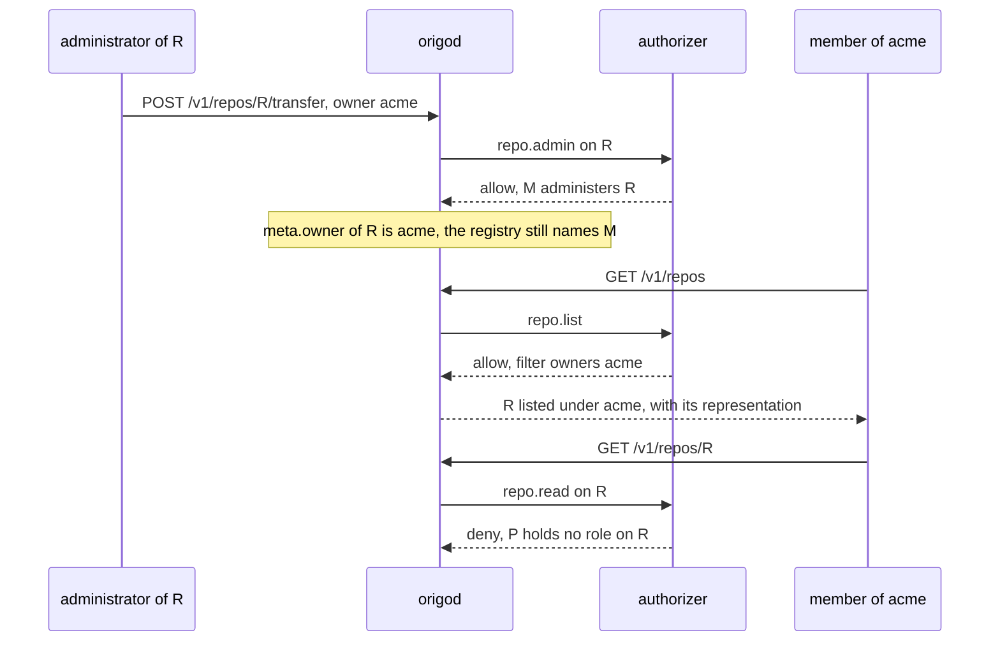
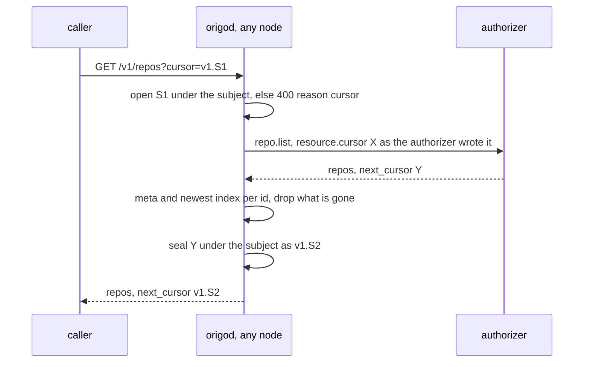
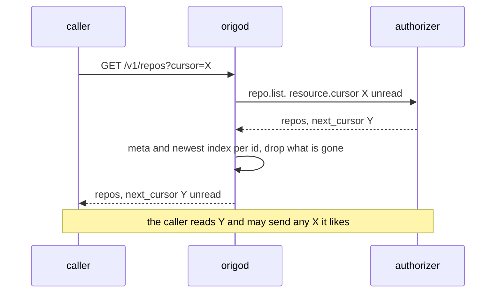
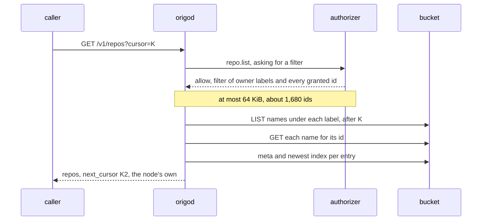
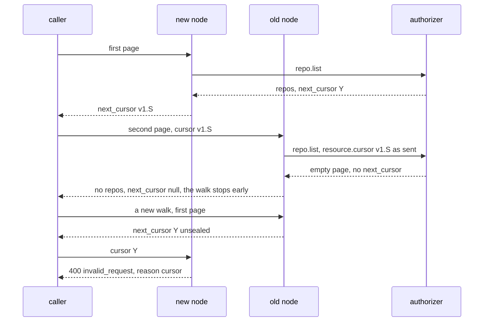

# Directory cursor

## Overview

`GET /v1/repos` in its directory mode hands the caller the authorizer's
`next_cursor` exactly as the authorizer wrote it, and sends the caller's
`cursor` back to the authorizer unread. The family's API grammar asks for
`limit` and `cursor` in, `next_cursor` out, and opaque cursors, and Origo
serves the directory at the platform's API origin (spec 029), so the
directory is held to that rule. Today it holds by one sentence in
`docs/authorizer.md`, which asks an endpoint to put nothing in the cursor
that the caller may not see. That is documentation, not construction
([origo#1](https://github.com/latere-ai/origo/issues/1)).

The family's way to answer a list is a decision with a `filter`: the
authorizer allows the list and narrows it to owners and labels, and the
core lists from its own index with its own cursor
(`latere.ai/x/pkg/authz`, `IsList` and `Filter`). Every other core answers
its lists that way. `repo.list` is the one action a core declares as a
page instead (`authorizer.PageActions()`). Issue #1 asks which of two ways
makes the directory's cursor Origo's: move the directory onto a `filter`,
or keep the page and make the cursor opaque by construction.

This spec weighs three options with their costs and recommends the
second: **the node seals the authorizer's cursor**. Every `next_cursor` a
caller sees is one the node wrote, an authenticated encryption of the
authorizer's cursor under a key every node of an installation already
holds, and the authorizer only ever receives back a cursor it wrote, on a
request from the subject it wrote it for. The authorizer contract,
`latere.ai/x/pkg/authz`, and every authorizer stay as they are.

The reason in one line: Origo records no owner, so a `filter` over its
own index either lists repositories the authorizer would refuse or cannot
carry the grants made one repository at a time, while a sealed cursor
keeps the directory exactly the authorizer's read set at any size.

## Current state

The directory is spec 026's, built and shipped in `v0.2.0`:

- `internal/api/collection.go`, `directory`: one call through
  `Guard.Directory`, the representation rendered per id that survives,
  and `next_cursor` the authorizer's, passed through unread and null on
  the last page.
- `internal/auth/guard.go`, `listEnvelope`: the caller's `cursor` and
  `limit` go into the `resource` of a `repo.list` request. `Client.List`
  sends it through the shared client's `Ask`, uncached, and parses spec
  026's three answers. With no authorizer configured, the owner policy's
  `List` answers the same question from the log, paging by the last id
  served (`cmd/origod/ownerpolicy.go`, `Owned`).
- `test/stubs/authorizer` pages by the id of the last entry served, and
  so does the hosted installation's authorizer.
- `docs/authorizer.md`, "The directory": the rule quoted above.

The family recorded when this would change. Spec 028's row for the
`repo.list` answer, and the family's note on the open cores behind it,
say the page stays until the repository registry moves to the platform
control plane, where a `filter` over the node's own name index replaces
it. The registry has moved: the hosted installation's authorizer is the
platform control plane, and it holds the registry, the grants, the owners
and the visibility. So the precondition is met, and the replacement still
does not hold, for two reasons the sentence did not have. Origo's name
index is an index of names, not of ownership, and the directory carries
grants made one repository at a time. The Design shows both.

### What the directory holds

The hosted installation's authorizer lists a repository when the
caller's role on it reaches read. The role has five sources:

| Source | Which repositories | Can `Filter{owners, labels}` say it |
|---|---|---|
| owner | a person's own, in the person's own context; a service's own | as owner labels, which the Design shows Origo cannot trust |
| organization | an organization's, on a token active in that organization, by the caller's role there | as the organization's label, with the same caveat |
| registrar | every repository a service client registered, under whichever owner's label it registered it | no: that label also holds the owner's other repositories |
| grant | one repository granted to the caller by one of its administrators | no |
| platform administrator | every repository, on a token minted for the console's administration routes | as no filter at all |

Visibility is not a source. A public repository is in a caller's
directory only when the caller holds a role on it, the hosted authorizer
refuses a list with no subject, and spec 027 keeps `GET /v1/repos` out of
the anonymous route set. Origo stores no visibility (spec 027). Nothing
about public repositories needs expressing in any option below, and a
listing of public repositories is a separate feature.

### Who reads the directory

Three consumers: the browsing interface of spec 023 in
`latere-ai/origo-web`, `origo repos` of spec 025, and spec 021's
conformance case `026/directory`. The interface and the command treat
`next_cursor` as opaque and send it back unchanged; the case reads one
page and never pages. A platform that keeps its own registry can list a
context's repositories from it rather than from this route, and the
hosted installation's console does.

### What the node can list

The bucket holds two enumerable prefixes. `names/<owner>/<slug>` is the
name index: one object per name whose body is the repository id, written
by `CreateRepo` and moved by a rename or transfer. Listing one owner
label is one `LIST` per 1,000 keys with `StartAfter`, then one `GET` per
key to learn its id. `repos/` holds one prefix per repository; `Log.Repos`
lists them all, and `Owned` reads `meta` for every one of them, which is
an enumeration of the installation per page that only the owner policy
pays. Neither is keyed by an owner identity: `meta.owner` is the label in
the clone URL and `meta.creator` is the subject that sent the create.

## Design

### Why an owner label is not an owner

Every other core of the family records who owns each object, and its
authorizer decides over that record. A `filter` of owners is then the
same question asked of a list: the core lists its objects whose recorded
owner is in the set, and the result is exactly what the authorizer would
allow one object at a time.

Origo records no owner. `meta.owner` is a label the consumer chose for
the clone URL, which spec 003 says Origo never interprets, and
`meta.creator` is the subject that sent the create, which on a platform
that creates through a service client is that client. Whom a repository
belongs to is the authorizer's registry, keyed by the id (spec 007, rule
3). A `filter` naming owner labels would make Origo's label an
access-control fact, and the label and the registry disagree in three
ordinary ways:

1. `PATCH` with `owner` and `POST /v1/repos/{id}/transfer` ask
   `repo.admin` on the repository alone, and the request never shows the
   authorizer the label the repository moves to (spec 019). An endpoint
   that decides from the repository, as rule 3 asks, lets a label at
   Origo name a repository its registry places under another owner.
2. Rule 4 lets an authorizer admit a create for an id it never
   registered, decided from the owner and slug the request carries. What
   it admitted sits under that label whether or not the registry ever
   records it.
3. A rename of the owner itself changes the label at the registry at
   once and at Origo one repository at a time, so for that window a
   filter of the new label lists part of the owner's repositories.

The first is the one a filter cannot survive. Drawn under a label
filter:

Spec 026's rule 6 makes the list answer the read decision for the
representation the route serves. A label filter keeps that rule only if
the node asks `repo.read` for every entry before rendering it: up to
`limit` calls per page on a cold cache, which is the cost spec 026
refused under rule 5.

### The three options

**(a) Extend `Filter` with ids.** `latere.ai/x/pkg/authz.Filter` gains a
list of resource ids, read as a union with `owners`, and `repo.list`
answers a decision whose filter names the caller's owner labels and every
repository granted or registered to the caller. The node lists the
labels from its name index, adds the ids, and pages with a cursor of its
own.

- **The family contract.** `Filter` is every core's. The shared
  conformance suite's `checkFilter` refuses any key but `owners` and
  `labels`, so it learns a third, and that key is a union where `labels`
  is a conjunction. A core that reads a filter naming no owner as
  narrowing nothing, as Arca does, would read a filter of ids alone as
  every object.
- **The size.** The shared client bounds a decision body at 64 KiB
  (`maxDecisionBytes` in `latere.ai/x/pkg/authz`), past which the body is
  no answer and the caller sees 503 `authorizer_unavailable`. An id is 39
  bytes of JSON with its quotes and comma, so the bound holds about 1,680
  ids, and a subject granted 2,000 repositories one at a time has no
  directory at all. Raising the bound is a second change to the shared
  contract, and the ids then travel whole on every page, because the
  shared client caches only a request that names an id: a walk of a
  subject with 10,000 grants is 50 pages of 200 and moves about 19 MiB
  from the authorizer.
- **The owners half.** It has the label problem above. Either the node
  asks `repo.read` per entry, or the owners go into the ids too, which
  makes the size problem every large organization's.
- **The owner policy.** It keys ownership on `meta.creator`, a subject,
  while the hosted authorizer would name labels. One `owners` field would
  mean two kinds of string, so the node keeps two indexes or the owner
  policy changes what it owns by.
- **The node.** Per page of 50: one `LIST` per label, 50 name reads for
  their ids, then the 100 reads of `meta` and the newest index it makes
  today, and a merge of the granted ids after the names. The order
  becomes the node's.
- **Every other authorizer.** Origo is open core and operators run their
  own endpoints (`docs/authorizer.md`, the stub). Each one that answers
  the directory rewrites its answer, or the node reads both shapes for
  as long as any endpoint sends a page.
- **The rollout.** A node that sends `repo.list` today and receives
  `{"allow": true, "filter": …}` reads it as none of spec 026's three
  answers and refuses with 503. So the request carries a marker in its
  `resource` asking for a filter, the authorizer answers the new shape
  only when asked, the authorizer rolls first and the nodes after it.

**(b) Seal the authorizer's cursor.** `repo.list` stays a page. The node
encrypts the authorizer's `next_cursor` before the caller sees it and
decrypts the caller's `cursor` before the authorizer does, under a key
derived from `ORIGO_TOKEN_KEY`, with the subject bound in.

- **The family contract and every authorizer.** Unchanged.
- **The size.** The authorizer pages as it does today: at most 200
  entries per answer, about 24 KiB at typical label lengths and under 64
  KiB at the longest labels spec 003 allows, against a 1 MiB bound. A
  subject with 10,000 grants walks 50 pages, each a page the authorizer
  already computes.
- **The key.** The cost the issue named, a key every node shares, is
  already paid. `ORIGO_TOKEN_KEY` is one Secret every node reads, because
  a repository-bound token minted on one node is verified on any other.
- **The node.** One seal and one open per page, microseconds, beside the
  100 reads it makes today.
- **What it leaves.** The page exception stays declared in `pkg`, and
  the order is still the authorizer's.

**(c) Owners as a filter, grants another way.** `repo.list` answers a
decision with the caller's owner labels as `filter.owners`. The one
component that can enumerate a subject's grants is the authorizer, so
"another way" is a second page action, with two calls per page and two
cursors merged into one, which keeps the exception and adds a merge; or
it is nothing, and a granted repository leaves the directory and is
opened by name or id. Either way the label problem above stays.

| | (a) ids in `Filter` | (b) sealed cursor | (c) owners filter, grants dropped |
|---|---|---|---|
| change to `latere.ai/x/pkg/authz` | `Filter` gains ids, conformance learns a key | none | none |
| change to every authorizer that lists | a new answer shape | none | a new answer shape |
| a person with one grant on someone else's repository | listed | listed, as today | not listed, opened by name or id |
| a subject with 2,000 grants | 503 on every page | 10 pages of 200 | grants not listed |
| a repository moved under another label | listed to that label's members unless re-checked | listed to whom the registry gives a role, as today | listed to that label's members unless re-checked |
| node reads per page of 50 | one `LIST` per label, 50 name reads, then 100 | 100, as today | as (a) |
| authorizer answer per page | every id, 39 bytes each | at most 200 entries | owner labels |
| who orders the page | the node | the authorizer | the node |
| the page exception in `pkg` | removed | kept | removed for owners only |
| new secret | none | none, derived from `ORIGO_TOKEN_KEY` | none |

### The recommendation

**(b).** It is the one option that keeps the directory exactly the
authorizer's read set at every size, and it asks nothing of any
authorizer. A person with one grant on someone else's repository sees it
at `GET /v1/repos` after this spec as before it, and a third-party
authorizer answers them exactly what it answers today. Spec 007's five
rules hold word for word, and spec 026's rule 6 still holds, because the
page is still the authorizer's.

It closes the cursor half of issue #1: every cursor a caller sees is the
node's, opaque by construction, which is what the family's pagination
rule asks. It does not remove `PageActions` from `pkg`. That exception is
the shape of Origo's model rather than an accident: where the authorizer
alone holds ownership, the authorizer alone can enumerate it. A later
move to a `filter` becomes sound when two things hold, and neither is
planned:

1. Origo records an owner key that only the authorizer can set, so that
   moving a label does not move membership: named by the authorizer's
   allow at creation, and asked about again by `PATCH` and `transfer`.
2. Grants per subject are bounded, or are modeled as owners, such as a
   team a repository belongs to.

Spec 028's row for the `repo.list` answer is corrected when this spec is
built: the page stays, and the cursor the caller sees is the node's.

**Option (a) changes the family's shared contract**, `latere.ai/x/pkg/authz.Filter`
and its conformance suite, for every core. It is the owner's decision,
and this spec recommends against it.

### The sealed cursor

| Part | Value |
|---|---|
| key | HKDF-SHA256 over the 32-byte private scalar of `ORIGO_TOKEN_KEY`, empty salt, info `origo directory cursor v1`, 32 bytes, derived once at start |
| cipher | AES-256-GCM, a fresh random 12-byte nonce per seal |
| associated data | `repo.list`, one zero byte, and the request's rendered subject |
| plaintext | the authorizer's `next_cursor`, byte for byte |
| wire form | `v1.` followed by the unpadded base64url of the nonce, the ciphertext, and the tag |
| bounds | an authorizer `next_cursor` of at most 512 bytes, so a sealed cursor is at most 723 characters |

**Writing.** An empty `next_cursor` from the authorizer is null on the
wire, as today. One over 512 bytes is no answer: 503
`authorizer_unavailable`, the authorizer's fault, logged with its
length. Anything else is sealed for the request's subject.

**Reading.** An empty `cursor` asks for the first page. A `cursor` longer
than 723 characters, not starting with `v1.`, not base64url, shorter than
a nonce and a tag, or failing to open under the request's subject is 400
`invalid_request` with `details.reason: "cursor"`, before the authorizer
is called. Anything that opens goes into the `resource` as `cursor`,
exactly as spec 026 sends it today.

**Where.** `internal/auth`, beside `Guard.Directory`, which holds the
principal and serves both listers, so the owner policy's page is sealed
by the same path and there is no second one. `cmd/origod` already parses
`ORIGO_TOKEN_KEY` for the signer and hands the guard the derived key.

Today the same walk carries the authorizer's bytes both ways:

Option (a), for comparison, moves the work to the node and the bucket,
and the grants into one bounded answer:

**Why each part is what it is.**

- **A key, not an encoding.** Lux and Arca write a cursor over their own
  keyset, and base64url is enough for them because they wrote what is
  inside. The plaintext here is a third party's: only encryption keeps
  its content from the caller, and only authentication keeps a cursor
  the caller made up from reaching the authorizer.
- **This key.** A cursor sealed on one node is opened on whichever node
  the next request reaches, so every node needs the same key, and
  `ORIGO_TOKEN_KEY` already is that. A variable of its own would be a
  second Secret every installation provisions and rotates, protecting
  less than the first: whoever holds `ORIGO_TOKEN_KEY` mints
  repository-bound tokens, which is more than reading a cursor. HKDF's
  info string keeps the two uses apart; the derived key signs nothing
  and the signing key encrypts nothing.
- **The subject in the associated data.** A cursor opens only on a
  request from the subject it was issued to, so an authorizer may keep
  per-subject state in it, and a cursor seen by one person cannot be
  replayed under another. The active organization is not bound: a token
  refreshed in the middle of a walk keeps walking, and the authorizer
  decides each page from the claims of the request in front of it, as it
  does today.
- **No expiry.** A cursor is a position, not a permission; the token of
  each request decides each page. It lives until `ORIGO_TOKEN_KEY`
  rotates. Spec 007 says a rotation invalidates outstanding
  repository-bound tokens, and it invalidates outstanding cursors the
  same way: a walk in progress gets the 400 and starts again from the
  first page.
- **512 bytes.** The cursor travels in a query string, through ingresses
  and proxies that cap a request line at a few KiB. The stub, the owner
  policy and the hosted authorizer all page by a 36-byte id.
- **The `v1.` prefix.** It names the construction, so a later one can be
  told apart, and it sorts after every hexadecimal id, which the rollout
  below relies on.

### What changes for an authorizer

Nothing it must do. The paragraph of `docs/authorizer.md` that asks an
endpoint to keep the cursor free of what the caller may not see is
replaced: Origo encrypts `next_cursor` before any caller sees it and
sends it back as `cursor` only on a request from the subject it was
issued to, exactly as the endpoint wrote it; it may carry whatever the
endpoint needs to resume, up to 512 bytes; and it is not an
authorization, so the endpoint decides each page from the request, as it
decides every other answer. The 512-byte bound is the one new limit, and
every endpoint that pages by id is far inside it.

### Rollout

The node changes alone. No authorizer question gains or loses a field,
so the order "a core that adds fields to its questions rolls after its
authorizer" has nothing to order, and the release is one step. While the
Deployment rolls, old and new nodes serve the same walk:

- A sealed cursor reaching an old node goes to the authorizer as it is.
  An authorizer that pages by id finds no entry at or after it, because
  `v` sorts after every hexadecimal digit, and answers an empty last
  page: the walk ends early, with nothing repeated and nothing of
  another subject. The stub starts a page only at the id the cursor
  names and answers the same. Any other authorizer answers it as it
  answers a cursor it never wrote; a non-200 is 503 for that request.
- A raw cursor an old node passed through, reaching a new node, is 400
  with `details.reason: "cursor"`, and the caller starts the walk again.

Both end when the last old node stops. The node writes no state and
reads none, so a rollback is the same window in reverse.

## Not in this spec

Moving `repo.list` to a decision with a `filter`, and any change to
`latere.ai/x/pkg/authz`: `Filter`, `PageActions`, the `Lister`, or the
conformance suite. An owner key Origo records, and `PATCH` or `transfer`
asking about the label they move to, which are the first precondition of
a later move to a filter. Public repositories in a directory, and
anonymous listing (spec 027). An order the node imposes on a page, which
stays the authorizer's (spec 026). The read API's cursors, which the node
already writes from its own index. A cursor key of its own, and an
overlap window when `ORIGO_TOKEN_KEY` rotates. Caching a directory
answer.

## Acceptance criteria

| Criterion | Test that proves it | State |
|---|---|---|
| A directory page's `next_cursor` starts with `v1.`, neither it nor its base64url decoding contains the authorizer's cursor, and the next request carrying it reaches the authorizer with the authorizer's cursor byte for byte in `resource.cursor` | `internal/auth`, `TestTheDirectoryCursorIsSealed`, against the stub with a recognizable cursor | proposed |
| A cursor sealed for one subject and presented by another is 400 `invalid_request` with `details.reason: "cursor"`, and the authorizer is not called | `internal/auth`, `TestTheDirectoryCursorOpensForItsSubjectAlone`, the stub's `Requests()` unchanged | proposed |
| A cursor without the `v1.` prefix, one that is not base64url, one shorter than a nonce and a tag, one with a byte flipped, one longer than 723 characters, and a bare repository id are each that 400, with no authorizer call | `internal/api`, `TestCollectionQueryIsValidated`, gaining the cursor rows | proposed |
| An authorizer `next_cursor` of 512 bytes is sealed and served, and one of 513 bytes is 503 `authorizer_unavailable` | `internal/auth`, `TestTheAuthorizerCursorIsBounded` | proposed |
| Two nodes holding one `ORIGO_TOKEN_KEY` open each other's cursors, and a node holding another key refuses them with the 400 | `cmd/origod`, `TestNodesSharingTheTokenKeyShareCursors` | proposed |
| With no authorizer configured, the owner policy's directory is sealed by the same path, and a walk of three repositories at `limit=1` returns each once and ends with a null cursor | `cmd/origod`, `TestTheOwnerPolicyDirectoryWalks` | proposed |
| `GET /v1/repos` serves the representation of each id that survives, with a sealed `next_cursor`, one authorizer call, and null on the last page | `internal/api`, `TestDirectoryServesWhatSurvives`, updated | proposed |
| The stub answers a cursor it never wrote with an empty page and no `next_cursor`, which is what a walk straddling a rollout relies on | `test/stubs/authorizer`, `TestStubEndsAWalkOnACursorItNeverWrote` | proposed |
| Against the stack, `026/directory` walks the seeded directory at `limit=1` through sealed cursors and finds each repository once | `test/conformance`, `026/directory` | proposed |
| `docs/authorizer.md` states the sealed cursor, the subject binding and the 512-byte bound, and no longer asks an endpoint to keep the cursor free of what the caller may not see | `tools/docs`, `TestTheAuthorizerPageStatesTheCursorRule` | proposed |

## Open

- **Which option.** This spec recommends (b), the sealed cursor, which
  needs no change outside this repository. Option (a) changes the
  family's shared contract, `latere.ai/x/pkg/authz.Filter` and its
  conformance suite, and is the owner's to decide. Choosing it also
  needs the two preconditions of the recommendation, or the per-entry
  read it implies, before it is sound.
