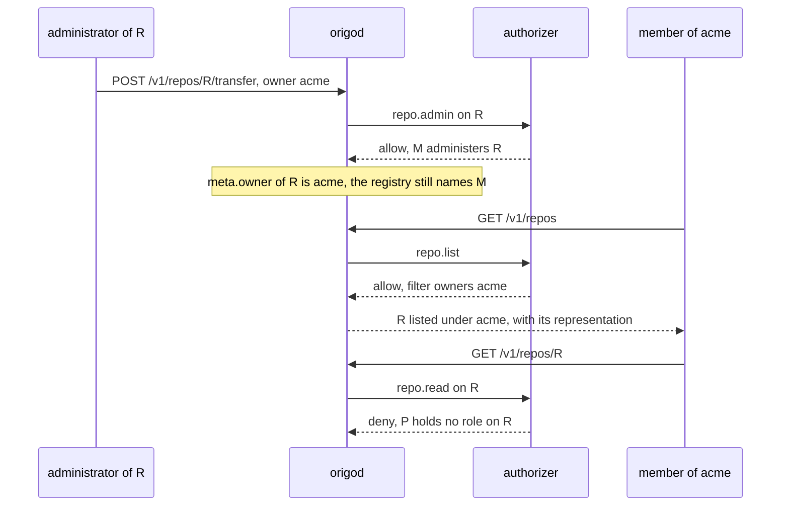
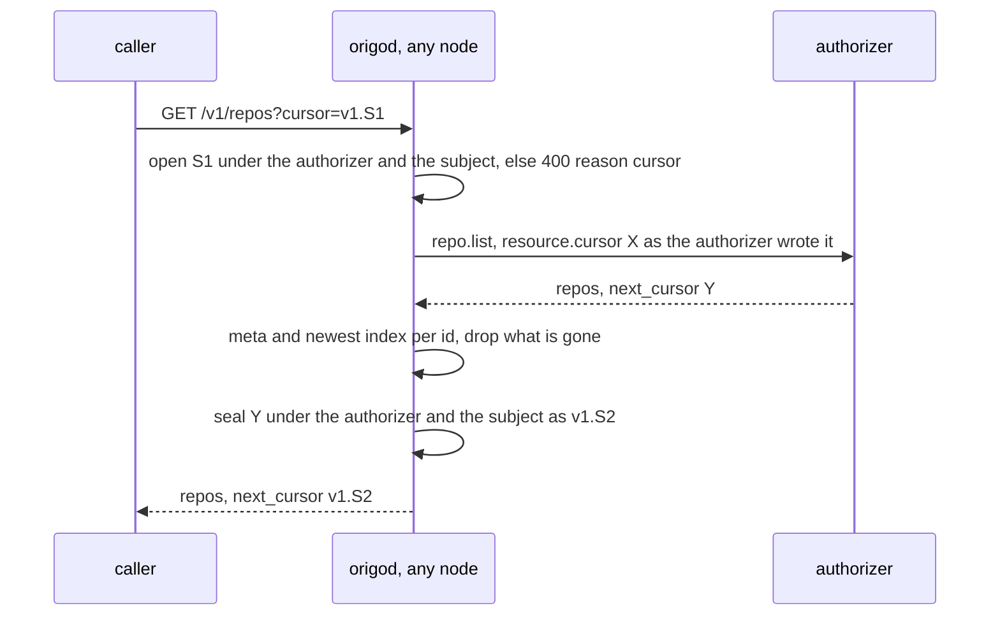
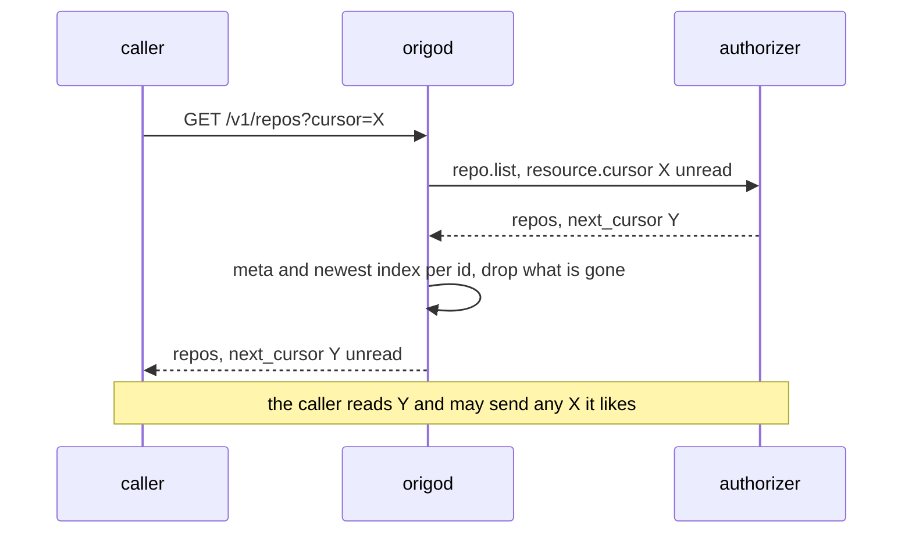
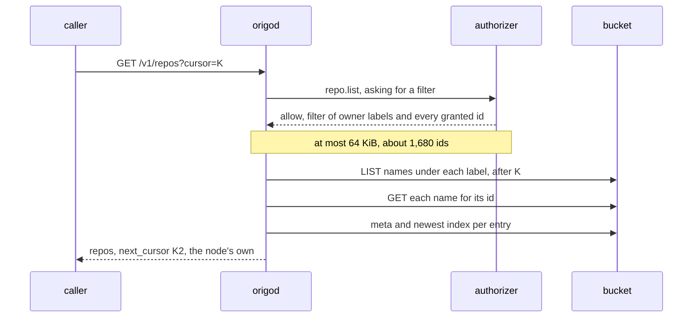
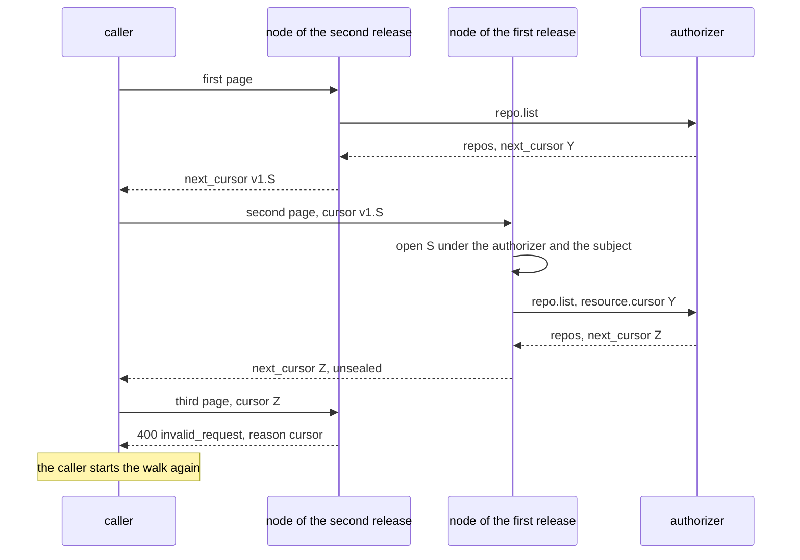

# Directory cursor

## Overview

`GET /v1/repos` in its directory mode hands the caller the authorizer's
`next_cursor` exactly as the authorizer wrote it, and sends the caller's
`cursor` back to the authorizer unread. The family's API grammar asks for
`limit` and `cursor` in, `next_cursor` out, and opaque cursors, and Origo
serves the directory at the platform's API origin (spec 029), so the
directory is held to that rule. Today it holds by one sentence in
`docs/authorizer.md`, which asks an endpoint to put nothing in the cursor
that the caller may not see. That is documentation, not construction
([origo#1](https://github.com/latere-ai/origo/issues/1)).

The family's way to answer a list is a decision with a `filter`: the
authorizer allows the list and narrows it to owners and labels, and the
core lists from its own index with its own cursor
(`latere.ai/x/pkg/authz`, `IsList` and `Filter`). Every other core answers
its lists that way. `repo.list` is the one action a core declares as a
page instead (`authorizer.PageActions()`). Issue #1 asks which of two ways
makes the directory's cursor Origo's: move the directory onto a `filter`,
or keep the page and make the cursor opaque by construction.

This spec weighs three options with their costs, and the owner chose
the second on 2026-10-07: **the node seals the authorizer's cursor**. Every `next_cursor` a
caller sees is one the node wrote, an authenticated encryption of the
authorizer's cursor under a key every node of an installation already
holds, and the authorizer only ever receives back a cursor it wrote, on a
request from the subject it wrote it for. `latere.ai/x/pkg/authz` does
not change, and the authorizer contract changes in one place: a
`next_cursor` longer than 512 bytes is no answer, a bound every endpoint
that pages by id is far inside.

The reason in one line: Origo records no owner, so a `filter` over its
own index either lists repositories the authorizer would refuse or cannot
carry the grants made one repository at a time, while a sealed cursor
keeps the directory exactly the authorizer's read set at any size.

## Current state

Built on 2026-10-07 in the two steps the Rollout names, two commits not
yet released: `api: the directory opens a sealed cursor` and `api: the
directory seals every cursor`. The Outcome records what each carries.
The rest of this section is the tree before them, which the Design
starts from.

The directory is spec 026's, built and shipped in `v0.2.0`:

- `internal/api/collection.go`, `directory`: one call through
  `Guard.Directory`, the representation rendered per id that survives,
  and `next_cursor` the authorizer's, passed through unread and null on
  the last page. An error from `Guard.Directory` goes to `WriteRefusal`,
  which renders a `*Denied` as 403 and every other error as 503
  `authorizer_unavailable`.
- `internal/auth/guard.go`, `listEnvelope`: the caller's `cursor` and
  `limit` go into the `resource` of a `repo.list` request. `Client.List`
  sends it through the shared client's `Ask`, uncached, and parses spec
  026's three answers. With no authorizer configured, the owner policy's
  `List` answers the same question from the log, paging by the last id
  served (`cmd/origod/ownerpolicy.go`, `Owned`).
- `test/stubs/authorizer` pages by the id of the last entry served, and
  so does the hosted installation's authorizer.
- `docs/authorizer.md`, "The directory": the rule quoted above. Spec
  026's route row says `next_cursor` is "the authorizer's, or null", and
  `make docs` carries that row into `api/openapi.yaml` and
  `docs/internals/contract.md`.

Spec 028's row for the `repo.list` answer says the page stays until a
`filter` over the node's own name index replaces it, a move it dates to
the registry's move to the platform control plane. That move has
happened: the hosted installation's authorizer is the platform control
plane, and it holds the registry and the grants. So the date has come,
and the replacement still does not hold, for two reasons the row did not
have. Origo's name index is an index of names, not of ownership, and the
directory carries grants made one repository at a time. The Design shows
both.

### Two facts the directory rests on

1. **Ownership lives in the authorizer.** Origo stores no user and no
   permission (spec 026). The authorizer decides which repositories a
   subject may read, keyed by the id (spec 007, rule 3), and the
   directory is its answer.
2. **Grants are made one repository at a time, with no bound.** An
   authorizer may let a subject read a repository it neither owns nor
   reaches through an organization, one grant per repository, and
   nothing in the contract bounds how many a subject holds.

Visibility does not enter the node's side. Origo stores none (spec 027),
and spec 027 keeps `GET /v1/repos` out of the anonymous route set.
Whether a public repository appears in a signed-in subject's directory
is the authorizer's answer, as today, so nothing about public
repositories needs expressing in any option below.

### Who reads the directory

Three consumers: the browsing interface of spec 023 in
`latere-ai/origo-web`, `origo repos` of spec 025, and spec 021's
conformance case `026/directory`. The interface and the command treat
`next_cursor` as opaque and send it back unchanged; `origo repos` also
changes `limit` from page to page, asking for what it still wants
(`internal/origocli/read.go`), and stops at the first null cursor. The
case reads one page and never pages.

### What the node can list

The bucket holds two enumerable prefixes. `names/<owner>/<slug>` is the
name index: one object per name whose body is the repository id, written
by `CreateRepo` and moved by a rename or transfer. Listing one owner
label is one `LIST` per 1,000 keys with `StartAfter`, then one `GET` per
key to learn its id. `repos/` holds one prefix per repository; `Log.Repos`
lists them all, and `Owned` reads `meta` for every one of them, which is
an enumeration of the installation per page that only the owner policy
pays. Neither is keyed by an owner identity: `meta.owner` is the label in
the clone URL and `meta.creator` is the subject that sent the create.

## Design

### Why an owner label is not an owner

Every other core of the family records who owns each object, and its
authorizer decides over that record. A `filter` of owners is then the
same question asked of a list: the core lists its objects whose recorded
owner is in the set, and the result is exactly what the authorizer would
allow one object at a time.

Origo records no owner. `meta.owner` is a label the consumer chose for
the clone URL, which spec 003 says Origo never interprets, and
`meta.creator` is the subject that sent the create, which on a platform
that creates through a service client is that client. Whom a repository
belongs to is the authorizer's registry, keyed by the id (spec 007, rule
3). A `filter` naming owner labels would make Origo's label an
access-control fact, and the label and the registry disagree in three
ordinary ways:

1. `PATCH` with `owner` and `POST /v1/repos/{id}/transfer` ask
   `repo.admin` on the repository alone, and the request never shows the
   authorizer the label the repository moves to (spec 019). An endpoint
   that decides from the repository, as rule 3 asks, lets a label at
   Origo name a repository its registry places under another owner.
2. Rule 4 lets an authorizer admit a create for an id it never
   registered, decided from the owner and slug the request carries. What
   it admitted sits under that label whether or not the registry ever
   records it.
3. A rename of the owner itself changes the label at the registry at
   once and at Origo one repository at a time, so for that window a
   filter of the new label lists part of the owner's repositories.

The first is the one a filter cannot survive. Drawn under a label
filter:

Spec 026's rule 6 makes the list answer the read decision for the
representation the route serves. A label filter keeps that rule only if
the node asks `repo.read` for every entry before rendering it: up to
`limit` calls per page on a cold cache, which is the cost spec 026
refused under rule 5.

### The three options

**(a) Extend `Filter` with ids.** `latere.ai/x/pkg/authz.Filter` gains a
list of resource ids, read as a union with `owners`, and `repo.list`
answers a decision whose filter names the caller's owner labels and every
repository granted to the caller. The node lists the labels from its name
index, adds the ids, and pages with a cursor of its own.

- **The family contract, changed twice.** First, the ids: the shared
  conformance suite's `checkFilter` refuses any key but `owners` and
  `labels`, so it learns a third, and that key is a union where `labels`
  is a conjunction. A core that reads a filter naming no owner as
  narrowing nothing, as Arca does, would read a filter of ids alone as
  every object. Second, the owners: the contract defines `filter.owners`
  as rendered subjects (`checkFilter` in
  `latere.ai/x/pkg/authz/conformance`), and an owner label is a name, not
  a subject, so `owners` would carry a second kind of string for one
  core. `labels` cannot carry the owner labels instead: it is a
  conjunction holding one value per key, and a set of owner labels is a
  disjunction over one key.
- **The size.** The shared client bounds a decision body at 64 KiB
  (`maxDecisionBytes` in `latere.ai/x/pkg/authz`), past which the body is
  no answer and the caller sees 503 `authorizer_unavailable`. An id is 39
  bytes of JSON with its quotes and comma, so the bound holds about 1,680
  ids, and a subject granted 2,000 repositories one at a time has no
  directory at all. Raising the bound is a third change to the shared
  contract, and the ids then travel whole on every page, because the
  shared client caches only a request that names an id: a walk of a
  subject with 10,000 grants is 50 pages of 200 and moves about 19 MiB
  from the authorizer.
- **The owners half.** It has the label problem above. Either the node
  asks `repo.read` per entry, or the owners go into the ids too, which
  makes the size problem every large organization's.
- **The owner policy.** It keys ownership on `meta.creator`, a rendered
  subject, which fits the contract's `owners`; the hosted authorizer
  would name labels. One field would mean two kinds of string on one
  node, so the node keeps two indexes or the owner policy changes what
  it owns by.
- **The node.** Per page of 50: one `LIST` per label, 50 name reads for
  their ids, then the 100 reads of `meta` and the newest index it makes
  today, and a merge of the granted ids after the names. The order
  becomes the node's.
- **Every other authorizer.** Origo is open core and operators run their
  own endpoints (`docs/authorizer.md`, the stub). Each one that answers
  the directory rewrites its answer, or the node reads both shapes for
  as long as any endpoint sends a page.
- **The rollout.** A node that sends `repo.list` today and receives
  `{"allow": true, "filter": …}` reads it as none of spec 026's three
  answers and refuses with 503. So the request carries a marker in its
  `resource` asking for a filter, the authorizer answers the new shape
  only when asked, the authorizer rolls first and the nodes after it.

**(b) Seal the authorizer's cursor.** `repo.list` stays a page. The node
encrypts the authorizer's `next_cursor` before the caller sees it and
decrypts the caller's `cursor` before the authorizer does, under a key
derived from `ORIGO_TOKEN_KEY`, with the subject and the authorizer bound
in.

- **The family contract.** `latere.ai/x/pkg/authz` is unchanged. Origo's
  authorizer contract gains one bound: a `next_cursor` longer than 512
  bytes is no answer.
- **The size.** The authorizer pages as it does today: at most 200
  entries per answer, about 24 KiB at typical label lengths and under 64
  KiB at the longest labels spec 003 allows, against a 1 MiB bound. A
  subject with 10,000 grants walks 50 pages, each a page the authorizer
  already computes.
- **The key.** The cost the issue named, a key every node shares, is
  already paid. `ORIGO_TOKEN_KEY` is one Secret every node reads, because
  a repository-bound token minted on one node is verified on any other.
- **The node.** One seal and one open per page, microseconds, beside the
  100 reads it makes today.
- **What it leaves.** The page exception stays declared in `pkg`, and
  the order is still the authorizer's.

**(c) Owners as a filter, grants another way.** `repo.list` answers a
decision with the caller's owner labels as `filter.owners`, which is the
second of (a)'s contract changes: labels where the contract has rendered
subjects. The one component that can enumerate a subject's grants is the
authorizer, so "another way" is a second page action, with two calls per
page and two cursors merged into one, which keeps the exception and adds
a merge; or it is nothing, and a granted repository leaves the directory
and is opened by name or id. Either way the label problem above stays.

| | (a) ids in `Filter` | (b) sealed cursor | (c) owners filter, grants dropped |
|---|---|---|---|
| change to `latere.ai/x/pkg/authz` | `Filter` gains ids, and `owners` carries labels | none | `owners` carries labels |
| change to every authorizer that lists | a new answer shape | a `next_cursor` of at most 512 bytes | a new answer shape |
| a person with one grant on someone else's repository | listed | listed, as today | not listed, opened by name or id |
| a subject with 2,000 grants | 503 on every page | 10 pages of 200 | grants not listed |
| a repository moved under another label | listed to that label's members unless re-checked | listed to whom the registry gives access, as today | listed to that label's members unless re-checked |
| node reads per page of 50 | one `LIST` per label, 50 name reads, then 100 | 100, as today | as (a) |
| authorizer answer per page | every id, 39 bytes each | at most 200 entries | owner labels |
| who orders the page | the node | the authorizer | the node |
| the page exception in `pkg` | removed | kept | removed for owners only |
| new secret | none | none, derived from `ORIGO_TOKEN_KEY` | none |

### The recommendation

**(b).** It is the one option that keeps the directory exactly the
authorizer's read set at every size, and it asks of an authorizer one
bound its cursor already meets. A person with one grant on someone
else's repository sees it at `GET /v1/repos` after this spec as before
it, and a third-party authorizer answers them exactly what it answers
today. Spec 007's five rules hold word for word, and spec 026's rule 6
still holds, because the page is still the authorizer's.

It closes the cursor half of issue #1: every cursor a caller sees is the
node's, opaque by construction, which is what the family's pagination
rule asks. It does not remove `PageActions` from `pkg`. That exception is
the shape of Origo's model rather than an accident: where the authorizer
alone holds ownership, the authorizer alone can enumerate it. A later
move to a `filter` becomes sound when two things hold, and neither is
planned:

1. Origo records an owner key that only the authorizer can set, so that
   moving a label does not move membership: named by the authorizer's
   allow at creation, and asked about again by `PATCH` and `transfer`.
2. Grants per subject are bounded, or are modeled as owners, such as a
   team a repository belongs to.

When this spec is built, spec 028 gains a dated section recording the
512-byte bound as a change to authorizer contract 2 and the page staying
the answer to `repo.list`, and the changelog names the bound for
operators who run their own endpoint.

**Options (a) and (c) change the family's shared contract**: (a) adds
ids to `latere.ai/x/pkg/authz.Filter` and puts labels in `owners`, (c)
puts labels in `owners`, and the conformance suite follows each. That is
the owner's decision, and this spec recommends against both.

### The sealed cursor

| Part | Value |
|---|---|
| key | HKDF-SHA256 over the private scalar of `ORIGO_TOKEN_KEY` in its fixed-width encoding, the 32 bytes `(*ecdsa.PrivateKey).Bytes()` returns, with an empty salt and the info `origo directory cursor v1`; 32 bytes, derived once at start |
| cipher | AES-256-GCM, a fresh random 12-byte nonce per seal |
| associated data | `repo.list`, a zero byte, the authorizer URL (`ORIGO_AUTHORIZER_URL`, empty for the owner policy), a zero byte, and the request's rendered subject |
| plaintext | the authorizer's `next_cursor`, byte for byte |
| wire form | `v1.` followed by the unpadded base64url of the nonce, the ciphertext, and the tag |
| bounds | an authorizer `next_cursor` of at most 512 bytes, so a sealed cursor is at most 723 characters |

The fixed width matters: the scalar's big-integer bytes drop leading
zeros, so one key in roughly 256 would derive from 31 bytes on one path
and 32 on another.

**Writing.** An empty `next_cursor` from the authorizer is null on the
wire, as today. One over 512 bytes is no answer: an `*Unavailable`,
which `WriteRefusal` renders as 503 `authorizer_unavailable`, logged
with its length. Anything else is sealed.

**Reading.** An empty `cursor` asks for the first page. A `cursor` longer
than 723 characters, not starting with `v1.`, not base64url, shorter than
a nonce and a tag, or failing to open under this node's authorizer and
the request's subject, is refused before the authorizer is called, with
a typed error, `auth.ErrCursor`. `WriteRefusal` would render it as a 503
like any error it does not know, so `directory` in `collection.go` tests
for it first and answers `invalid(w, "cursor", "cursor")`. Anything that
opens goes into the `resource` as `cursor`, exactly as spec 026 sends it
today.

| Status | Code | `details` | When |
|---|---|---|---|
| 400 | `invalid_request` | `reason: "cursor"`, `field: "cursor"` | a `cursor` this installation did not write, or wrote for another subject or another authorizer |

**Where.** `internal/auth`, beside `Guard.Directory`, which holds the
principal and serves both listers, so the owner policy's page is sealed
by the same path and there is no second one. `cmd/origod` already parses
`ORIGO_TOKEN_KEY` for the signer and hands the guard the derived key.
Spec 026's route row gains the refusal and says `next_cursor` is the
node's, and `make docs` carries both into `api/openapi.yaml`, whose
generation spec 030 owns, and `docs/internals/contract.md`. The
`ORIGO_TOKEN_KEY` row of `internal/config/document.go`, the source of
`docs/configuration.md`, says that replacing the key also ends every
directory walk in flight.

Today the same walk carries the authorizer's bytes both ways:

Option (a), for comparison, moves the work to the node and the bucket,
and the grants into one bounded answer:

**Why each part is what it is.**

- **A key, not an encoding.** Lux and Arca write a cursor over their own
  keyset, and base64url is enough for them because they wrote what is
  inside. The plaintext here is a third party's: only encryption keeps
  its content from the caller, and only authentication keeps a cursor
  the caller made up from reaching the authorizer.
- **This key.** A cursor sealed on one node is opened on whichever node
  the next request reaches, so every node needs the same key, and
  `ORIGO_TOKEN_KEY` already is that. A variable of its own would be a
  second Secret every installation provisions and rotates, protecting
  less than the first: whoever holds `ORIGO_TOKEN_KEY` mints
  repository-bound tokens, which is more than reading a cursor. HKDF's
  info string keeps the two uses apart; the derived key signs nothing
  and the signing key encrypts nothing. The reuse holds while the node
  can read its signing key's bytes. A node whose signing key moves into
  a key service that never exports it needs a cursor secret of its own,
  and that move is the point to add one.
- **The authorizer and the subject in the associated data.** A cursor
  opens only on a request from the subject it was issued to, and only
  while the node asks the authorizer that wrote it. So an authorizer may
  keep per-subject state in it, a cursor seen by one person cannot be
  replayed under another, and an operator who points
  `ORIGO_AUTHORIZER_URL` elsewhere, or unsets it for the owner policy,
  never hands the new answerer a cursor the old one wrote.
- **No organization.** Origo reads no claim (spec 028), so it has no
  organization to bind. The authorizer reads the claims of each request
  and scopes each page by them, so a cursor carried into a token of
  another organization resumes a position in that context's list and
  reveals nothing of the first.
- **No `limit`.** A caller may change `limit` between pages, as `origo
  repos` does, so the cursor carries none.
- **No expiry.** A cursor is a position, not a permission; the token of
  each request decides each page. It lives until `ORIGO_TOKEN_KEY`
  rotates. Spec 007 says a rotation invalidates outstanding
  repository-bound tokens, and it invalidates outstanding cursors the
  same way: a walk in progress gets the 400 and starts again from the
  first page.
- **512 bytes.** The cursor travels in a query string, through ingresses
  and proxies that cap a request line at a few KiB. The stub, the owner
  policy and the hosted authorizer all page by a 36-byte id.
- **The `v1.` prefix.** It names the construction, so a later one can be
  told apart.

### What changes for an authorizer

One bound, and nothing else to do. A `next_cursor` longer than 512 bytes
is no answer, which is a change to authorizer contract 2, recorded in
spec 028 and the changelog as the recommendation says; every endpoint
that pages by id is far inside it. The paragraph of `docs/authorizer.md`
that asks an endpoint to keep the cursor free of what the caller may not
see is replaced: Origo encrypts `next_cursor` before any caller sees it
and sends it back as `cursor` only to the endpoint that wrote it, on a
request from the subject it was issued to, exactly as written; it may
carry whatever the endpoint needs to resume, up to 512 bytes; and it is
not an authorization, so the endpoint decides each page from the
request, as it decides every other answer.

### Rollout

The node changes alone, and no authorizer question gains a field, so the
order "a core that adds fields to its questions rolls after its
authorizer" has nothing to order. The order that matters is between
nodes. The base Deployment runs two replicas and replaces them one at a
time, so for a while old and new nodes serve one walk. Shipped in one
step, a sealed cursor reaching an old node would go to the authorizer as
it is; an authorizer that pages by id finds no entry after it and
answers an empty last page, and `origo repos` stops at that null cursor
and reads a shorter directory as the whole of it. A directory that is
silently short is the failure to avoid, so the change ships in two
releases:

| Release | A `v1.` cursor | Any other cursor | `next_cursor` it writes |
|---|---|---|---|
| first | opened, as above | passed to the authorizer, as today | the authorizer's, as today |
| second | opened | 400, `details.reason: "cursor"` | sealed, with the 512-byte bound |

While the second rolls, a sealed cursor reaching a node of the first is
opened, so no walk is shortened. A raw cursor a node of the first wrote,
reaching a node of the second, is the 400: the caller sees it and starts
the walk again, and it stops happening when the last old node stops. A
third release that passed raw cursors through for one more roll would
remove that too; it is not worth a release, because the failure it
removes is loud. Rolling the second back to the first is clean, because
the first opens what the second wrote, and rolling the first back is
clean, because it writes nothing new.

## Not in this spec

Moving `repo.list` to a decision with a `filter`, and any change to
`latere.ai/x/pkg/authz`: `Filter`, its `owners`, `PageActions`, the
`Lister`, or the conformance suite. An owner key Origo records, and
`PATCH` or `transfer` asking about the label they move to, which are the
first precondition of a later move to a filter. Public repositories in a
directory, and anonymous listing (spec 027). An order the node imposes
on a page, which stays the authorizer's (spec 026). The read API's
cursors, which the node already writes from its own index. A cursor key
of its own, and an overlap window when `ORIGO_TOKEN_KEY` rotates. A third
release passing raw cursors through. Caching a directory answer.

## Acceptance criteria

| Criterion | Test that proves it | State |
|---|---|---|
| A directory page's `next_cursor` starts with `v1.`, neither it nor its base64url decoding contains the authorizer's cursor, and the next request carrying it reaches the authorizer with the authorizer's cursor byte for byte in `resource.cursor` | `internal/auth`, `TestTheDirectoryCursorIsSealed`, against the stub with a recognizable cursor | built |
| A cursor sealed for one subject and presented by another, and one sealed under one authorizer URL and presented to a node holding another or none, are each 400 `invalid_request` with `details.reason` and `details.field` both `cursor`, never 503, and the authorizer is not called | `internal/api`, `TestADirectoryCursorOpensForItsSubjectAndAuthorizerAlone`, the stub's `Requests()` unchanged | built |
| A cursor without the `v1.` prefix, one that is not base64url, one shorter than a nonce and a tag, one with a byte flipped, one longer than 723 characters, and a bare repository id are each that 400, with no authorizer call | `internal/api`, `TestCollectionQueryIsValidated`, gaining the cursor rows | built |
| A walk that changes `limit` between pages, 1 then 2 then 1, returns each repository once and ends with a null cursor | `internal/api`, `TestTheDirectoryCursorCarriesNoLimit` | built |
| An authorizer `next_cursor` of 512 bytes is sealed and served, and one of 513 bytes is 503 `authorizer_unavailable` | `internal/auth`, `TestTheAuthorizerCursorIsBounded` | built |
| The key derives from the fixed-width scalar: a key whose scalar has a leading zero byte derives the same cursor key on every node | `internal/auth`, `TestTheCursorKeyReadsTheFixedWidthScalar` | built |
| Two nodes holding one `ORIGO_TOKEN_KEY` open each other's cursors, and a node holding another key refuses them with the 400 | `cmd/origod`, `TestNodesSharingTheTokenKeyShareCursors` | built |
| With no authorizer configured, the owner policy's directory is sealed by the same path, and a walk of three repositories at `limit=1` returns each once and ends with a null cursor | `cmd/origod`, `TestTheOwnerPolicyDirectoryWalks` | built |
| `GET /v1/repos` serves the representation of each id that survives, with a sealed `next_cursor`, one authorizer call, and null on the last page | `internal/api`, `TestDirectoryServesWhatSurvives`, updated | built |
| In the first release a `v1.` cursor is opened, any other passes through, and `next_cursor` is the authorizer's; the second release rewrites this test into the rows above | `internal/api`, `TestTheDirectoryOpensASealedCursorBeforeItSeals` | built in the first commit, and rewritten into the rows above by the second |
| Against the stack, `026/directory` walks the seeded directory at `limit=1` through sealed cursors and finds each repository once | `test/conformance`, `026/directory` | built; green against the contract stub, the stack run waits for a dispatched run |
| Spec 026's route row names the `cursor` refusal and says `next_cursor` is the node's, and the generated `api/openapi.yaml` and `docs/internals/contract.md` carry both | `tools/apidoc`, `TestOpenAPIDocumentIsCurrent` and `TestAPIDocIsCurrent` | built |
| The `ORIGO_TOKEN_KEY` row says that replacing the key ends every directory walk in flight, and `docs/configuration.md` carries it | `internal/config`, `TestConfigurationDocIsCurrent` | built |
| `docs/authorizer.md` states the sealed cursor, the binding to the endpoint and the subject, and the 512-byte bound, and no longer asks an endpoint to keep the cursor free of what the caller may not see | `tools/docs`, `TestTheAuthorizerPageStatesTheCursorRule` | built |

## Open

- **Which option.** Decided by the owner on 2026-10-07: (b), the sealed
  cursor. Options (a) and (c) would have changed the family's shared
  contract, `latere.ai/x/pkg/authz.Filter` and its conformance suite, and
  are not taken.

## Outcome

Built on 2026-10-07 in two commits, each a gated tree and each meant to
ship as its own release, the first rolled out before the second, as the
Rollout says.

- **The first, `api: the directory opens a sealed cursor`.**
  `internal/auth/cursor.go` holds `Cursors`, `NewCursors`, `Seal`,
  `Open` and `ErrCursor`; the guard opens a `v1.` cursor before the
  lister sees it and passes any other through, and `next_cursor` stays
  the authorizer's. `directory` in `collection.go` answers
  `ErrCursor` as 400 `invalid_request` with `reason` and `field`
  `cursor` before `WriteRefusal`. `cmd/origod` and the contract stub
  derive the key and hand it to the guard.
- **The second, `api: the directory seals every cursor`.** The guard
  opens every cursor and seals every `next_cursor`, and a `next_cursor`
  over 512 bytes is an `*Unavailable`. The stage-one test
  `TestTheDirectoryOpensASealedCursorBeforeItSeals` is gone, rewritten
  into the rows above, as its criterion says.

Every criterion but the first release's has its named test in the
tree; that one lived in the first commit and the second rewrote it, as
its row says. Each failed on the tree before the commit that made it
pass, by assertion and not by compilation, except
`TestTheCursorKeyReadsTheFixedWidthScalar`, whose function did not
exist before the first commit. `026/directory` is green
against the contract stub in `TestStubConforms`; its stack half needs a
dispatched `verify` run or a tag run, which is why this spec is at
`testing`.

Divergences, none of them of the construction:

- **How the guard holds the key.** `NewGuard` keeps its signature and
  `Guard.SetCursors` gives it the key, which `cmd/origod` sets right
  after building the guard. A guard with no key answers no directory
  page, an error rendered 503, rather than a page whose `next_cursor`
  is the authorizer's. `TestNodesSharingTheTokenKeyShareCursors` proves
  the node sets it.
- **Where the bound is checked.** In `Cursors.Seal`, which the guard
  calls for both listers, not in the client's parser of the answer, so
  the owner policy's page is held to it by the same path.
- **The encoding is strict.** Unpadded base64url with
  `base64.RawURLEncoding.Strict()`, so one sealed cursor has one
  spelling and a changed final character is never read as the same
  bytes.
- **The nonce.** `cipher.NewGCMWithRandomNonce` draws the 12-byte nonce
  and prepends it, which is the Design's wire form. Its documentation
  bounds one key at 2^32 seals; the key lives until `ORIGO_TOKEN_KEY` is
  replaced, which at ten directory pages a second is past ten years.
- **"A node holding none."** In `internal/api` it is a harness whose
  cursor key is bound to no authorizer; the same refusal on a whole node
  in owner-policy mode holding the shared key is in
  `TestNodesSharingTheTokenKeyShareCursors`.
- **The first release's prefix.** It reads every `cursor` that begins
  `v1.` as its own, so an endpoint whose cursors began that way would
  have lost its second page under it. The authorizer guide and the
  changelog of the first commit said so; the second opens every cursor
  and the note is gone.
- **Tests beyond the table.** `TestACursorOpensUnderItsBindingAlone` in
  `internal/auth` drives `Open` through every refusal, and
  `TestAuthorizerEnvelope` now sends a sealed cursor and checks the
  authorizer receives the one it wrote.

Spec 028 carries the dated section the Recommendation asks for, spec
026's route row and its Open item say what was built, and the
changelog names the bound for operators who run their own endpoint.
