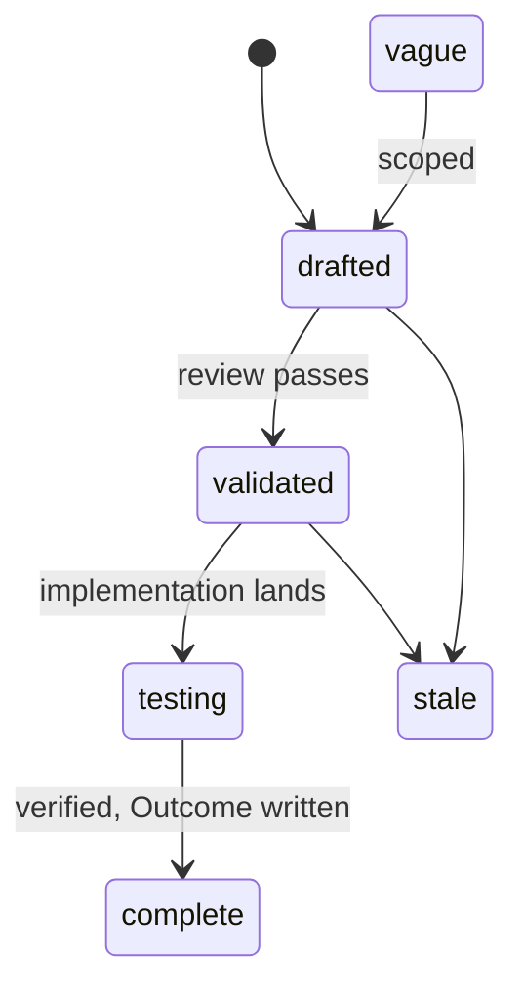
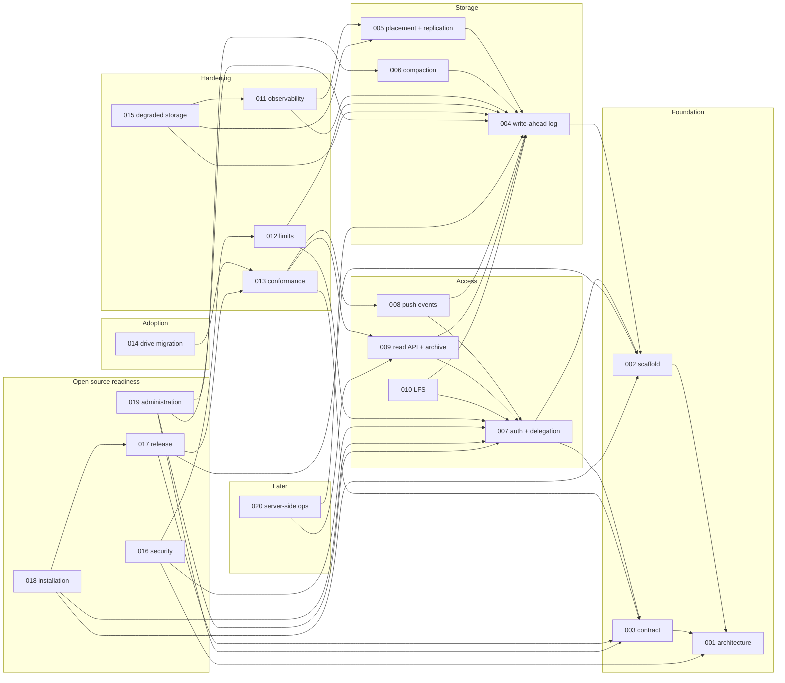

# Specs

Design specs for Origo, git hosting as an infrastructure component. One
spec covers one module. Each spec states the problem, the design with
enough precision to build from, and acceptance criteria that are testable
statements. Spec 001 fixes the architecture every other spec assumes; read
it first. Spec 003 is the contract a consumer codes against; it is the one
document a platform integrating Origo needs.

## Layout

Flat files `specs/NNN-name.md` in one number space with `track: infra` in
the frontmatter. Numbers are stable identifiers and are never reused. Open
specs sit here and are the work queue. A terminal spec moves to
`specs/.archive/` keeping its number so `depends_on` paths keep resolving.

## Lifecycle

## Index

| # | Spec | Effort | Status |
|---|---|---|---|
| [001](001-architecture.md) | Architecture: components, storage model, flows, invariants | medium | drafted |
| [002](002-repository-scaffold.md) | Repository scaffold: module, binary, configuration, gate, release | small | testing |
| [003](003-protocol-contract.md) | Protocol contract: what a consumer relies on | medium | in-progress |
| [004](004-write-ahead-log.md) | Write-ahead log: entries, immutable index, create-if-absent commit, materialization | large | testing |
| [005](005-placement-and-replication.md) | Placement and replication: rendezvous hashing, gossip, consistent reads, cache eviction | medium | drafted |
| [006](006-compaction.md) | Compaction: primary-only repacks, log truncation | medium | drafted |
| [007](007-authentication-and-delegation.md) | Authentication and delegation: issuers, authorizer, acting on behalf | medium | drafted |
| [008](008-push-events.md) | Push events: signed webhooks per reference update | small | drafted |
| [009](009-read-api-and-archive.md) | Read API and archive: refs, log, diff, tree, blob, tarball | medium | drafted |
| [010](010-lfs.md) | Git LFS: batch API and presigned object transfer | small | drafted |
| [011](011-observability.md) | Observability: metrics, traces, logs, alerts | small | drafted |
| [012](012-limits-and-abuse.md) | Limits and abuse controls | small | drafted |
| [013](013-conformance-suite.md) | Conformance suite: the contract as executable tests | medium | drafted |
| [014](014-drive-migration.md) | Migration of Drive's hosted repositories (cross-repo) | medium | vague |
| [015](015-degraded-storage.md) | Degraded storage: what a node does when the bucket is slow, partial, or gone | medium | drafted |
| [016](016-security-and-threat-model.md) | Security and threat model: what Origo protects, against whom, and how | medium | drafted |
| [017](017-release-and-versioning.md) | Release and versioning: images, binaries, compatibility, and what a version promises | small | drafted |
| [018](018-installation.md) | Installation: running Origo on any Kubernetes with any S3 compatible bucket | medium | drafted |
| [019](019-repository-administration.md) | Repository administration: rename, transfer, freeze, delete, undelete, import, export, garbage collection | medium | drafted |
| [020](020-server-side-git-operations.md) | Server-side git operations: commits without a clone | large | vague |

## Dependency graph

Edges point from a spec to the specs it builds on.

## Build order

| Phase | Specs | Outcome |
|---|---|---|
| 1 | 002, 003, 004 | A single node serves clone, fetch, and push with the log as the source of truth |
| 2 | 007, 005 | Authenticated, delegated access; many nodes, consistent reads |
| 3 | 008, 009, 006 | Push events, the read API and archive, compaction under load |
| 4 | 010, 011, 012, 013, 015 | LFS, telemetry, limits, degraded-storage behaviour, and the conformance suite gating releases |
| 5 | 016, 019 | Threat model written and enforced; the administration operations a long-lived repository needs |
| 6 | 017, 018 | Releases an outside operator can install and upgrade from the documentation alone; the point at which the repository can go public |
| 7 | 014 | Existing repositories migrate from Drive |
| later | 020 | Server-side git operations when a consumer needs them |

## Open source readiness

The repository goes public when phase 6 is complete: every spec through
018 at `complete`, the conformance suite green against the release
artifacts in the `kind` example overlay, `docs/install.md` walked once by
a maintainer on a fresh cluster, `SECURITY.md` in place, and no Latere
hostname or value anywhere but as a default or an example. Until then the
repository is private and the deck is written as if it were already
public.

## Conventions

- Every spec has the frontmatter fields `title`, `status`, `track`,
  `depends_on`, `affects`, `effort`, `created`, `updated`, `author`.
- Diagrams are Mermaid. Tables carry exact values so an implementer never
  has to guess a number.
- Error codes, metric names, environment variables, and paths named in a
  spec are the names the code uses.
- Acceptance criteria are the test list. A spec is `complete` when every
  criterion has a passing test and the Outcome section records any
  divergence.
- Wording is for a reader outside Latere. A Latere hostname or value is an
  example or a default, never the only option.
