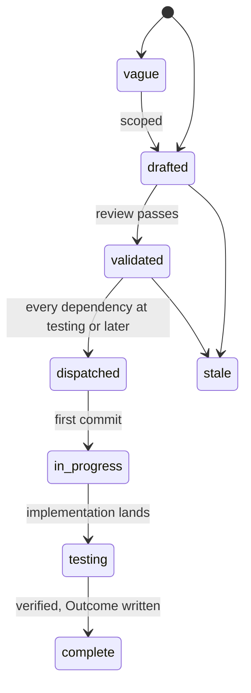
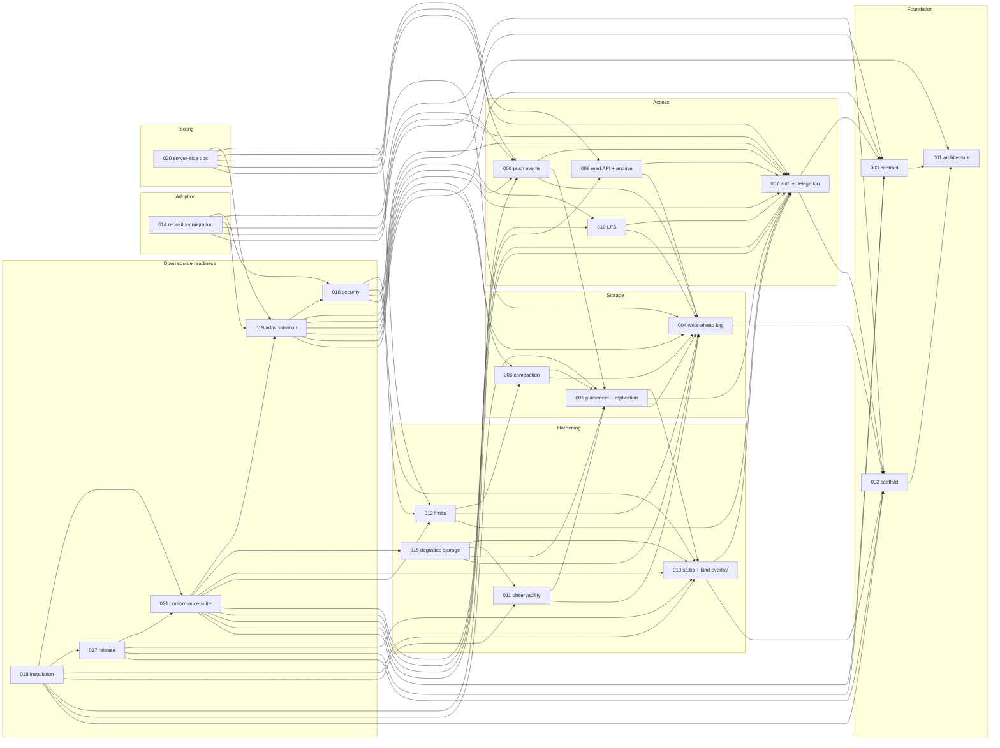

# Specs

Design specs for Origo, git hosting as an infrastructure component. One
spec covers one module. Each spec states the problem, the design with
enough precision to build from, and acceptance criteria that are testable
statements. Spec 001 fixes the architecture every other spec assumes; read
it first. Spec 003 is the contract a consumer codes against; it is the one
document a platform integrating Origo needs, and spec 021 is the suite
that proves an implementation serves it. Spec 002 is the configuration
reference: every variable is in its table, owned by it or listed with
its owner, and it owns the binary's subcommand table (`serve`, `check`,
`migrate`). Spec 011 owns every metric.

## Layout

Flat files `specs/NNN-name.md` in one number space with `track: infra` in
the frontmatter. Numbers are stable identifiers and are never reused. Open
specs sit here and are the work queue. A terminal spec moves to
`specs/.archive/` keeping its number so `depends_on` paths keep resolving.

## Lifecycle

`in_progress` is written `in-progress` in the frontmatter. A spec at
`testing` moves to `complete` when every acceptance criterion has a
passing test in the tree and the Outcome records every divergence.

The dispatch gate is on the dependencies' state, not on `complete`: a
validated spec is dispatched when every spec in its `depends_on` is at
`testing` or later. `testing` means the design is built and what
remains is a criterion another spec owns the test for, which is the
case for a spec whose criteria name a later spec (003 and 004 do, and
each says which spec owns each deferred criterion), so waiting for
`complete` would wait for the dependents themselves.

## Index

| # | Spec | Effort | Status |
|---|---|---|---|
| [001](001-architecture.md) | Architecture: components, storage model, flows, invariants | medium | complete |
| [002](002-repository-scaffold.md) | Repository scaffold: module, binary, configuration, gate, release | small | complete |
| [003](003-protocol-contract.md) | Protocol contract: what a consumer relies on | medium | testing |
| [004](004-write-ahead-log.md) | Write-ahead log: entries, immutable index, create-if-absent commit, materialization | large | testing |
| [005](005-placement-and-replication.md) | Placement and replication: rendezvous hashing, gossip, consistent reads, cache eviction | medium | validated |
| [006](006-compaction.md) | Compaction: primary-only repacks, log truncation | medium | validated |
| [007](007-authentication-and-delegation.md) | Authentication and delegation: issuers, authorizer, acting on behalf | medium | complete |
| [008](008-push-events.md) | Push events: signed webhooks per reference update | small | validated |
| [009](009-read-api-and-archive.md) | Read API and archive: refs, log, diff, tree, blob, tarball | medium | testing |
| [010](010-lfs.md) | Git LFS: batch API and presigned object transfer | small | validated |
| [011](011-observability.md) | Observability: metrics, traces, logs, alerts | small | validated |
| [012](012-limits-and-abuse.md) | Limits and abuse controls | small | validated |
| [013](013-test-stubs-and-kind-overlay.md) | Test stubs and the kind overlay: the issuer, authorizer, sink, and contract stubs, the tiers, and the CI jobs | medium | testing |
| [014](014-repository-migration.md) | Migration of existing repositories from a prior host: import, verify, cut over, in batches | medium | validated |
| [015](015-degraded-storage.md) | Degraded storage: what a node does when the bucket is slow, partial, or gone | medium | validated |
| [016](016-security-and-threat-model.md) | Security and threat model: what Origo protects, against whom, and how | medium | validated |
| [017](017-release-and-versioning.md) | Release and versioning: images, binaries, compatibility, and what a version promises | small | validated |
| [018](018-installation.md) | Installation: running Origo on any Kubernetes with any S3 compatible bucket | medium | validated |
| [019](019-repository-administration.md) | Repository administration: rename, transfer, freeze, delete, undelete, import, export, garbage collection | medium | validated |
| [020](020-server-side-git-operations.md) | Server-side git operations: commits, merges, cherry-picks, and reverts without a clone | large | validated |
| [021](021-conformance-suite.md) | Conformance suite: the contract as executable tests | large | validated |

## Dependency graph

Edges point from a spec to the specs it builds on.

## Build order

| Phase | Specs | Outcome | State |
|---|---|---|---|
| 1 | 002, 003, 004 | A single node serves clone, fetch, and push with the log as the source of truth | built; 002 complete, 003 and 004 wait on later specs for their remaining criteria |
| 2 | 007, 013 | Authenticated, delegated access with the stub issuer and authorizer (built by 007) in place of `ORIGO_DEV_TOKEN`, `ORIGO_TOKEN_KEY` required in every mode; the kind overlay with every row its table names (MinIO with fixed values on a host port, three pods each on host ports of their own, the stubs with the TLS source, metrics-server, Cilium, the restricted namespace, the HPA patch), `up.sh` and `down.sh`, the `test/e2e/cluster` helper, the tiers, and the CI jobs selecting tests by name prefix, which every later spec's criteria run on | built; 007 complete, 013 at testing until the cluster jobs are green on main |
| 3 | 005, 006, 008, 009 | Many nodes with consistent reads, compaction under load, push events, the read API and archive | 009 built, at testing until 013's jobs run `TestE2EArchiveStreams` and the 40 second fuzz; 005, 006, 008 next |
| 4 | 010, 011, 012, 015 | LFS, telemetry, limits, and degraded-storage behaviour | |
| 5 | 016, 019 | Threat model written and enforced; the administration operations a long-lived repository needs | |
| 6 | 021, 017, 018 | The conformance suite gating releases and run against the live installation `ORIGO_LIVE_URL` names after each one; releases an outside operator can install and upgrade from the documentation alone, on the trixie-slim image; the point at which the repository can go public | |
| 7 | 014 | Existing repositories migrate from a prior host with verification and a cut-over | |
| 8 | 020 | Commits, merges, cherry-picks, and reverts from a request, for tooling that changes many repositories | |

Phase 2 is specs 007 and 013 and nothing else: the stubs are what
replaces the phase 1 bearer, and the overlay and the CI jobs are what
every later criterion runs on, so both exist before spec 005's cluster
tests need them. The conformance suite is spec 021 and depends on
every surface it asserts, spec 019 included, and on spec 012, whose
enforcement produces its `over_quota` and `rate_limited` rows, which
is why it sits in phase 6 beside the release and installation specs
that depend on it; none of the specs it depends on depends on 017 or
018, so there is no cycle.

## Decisions across specs

Facts one spec owns and several rely on, fixed by the review of the
deck and stated here so a reader sees them without the owning spec.

| Decision | Owner | Relied on by |
|---|---|---|
| the runtime image is `debian:trixie-slim` pinned by digest, git 2.47, above the 2.40 floor `origod check` enforces; both Dockerfiles move to it under 017 | 017 | 002, 018, 020 |
| `origod` has the subcommands `serve` (default), `check`, and `migrate`, one configuration table for all; the dispatcher is not built, 018 builds it with `check` first and 014's `migrate` joins it | 002 | 014, 018 |
| `ORIGO_TOKEN_KEY` is required in every mode; `make dev` and the kind overlay generate one at start | 002, 007 | 013, 016, 018 |
| `ORIGO_GOSSIP_SECRET` is required only when `ORIGO_GOSSIP_PEERS` is set; a single node runs with neither | 002, 005 | 013, 016, 018 |
| the index object carries `pushed_at`; the read API and `stats` serve it from there | 004 | 003, 009, 019 |
| `size_bytes` on the index object is what the log holds: the bytes of the listed packs plus the pack bytes of the entries since the last compaction; a `compact` commit sets it to `Entry.PacksBytes`, a push adds its `pack_bytes`; the quota counts it and `stats` serves it (the code accumulates monotonically today, a builder item of 004) | 004 | 003, 006, 012, 019 |
| `ghcr.io/latere-ai/origo-stubs:<version>` is a release artifact beside `origod`, built from `Dockerfile.stubs`, signed and attested the same way, pinned in the deploy archive's `kind` overlay; the `install-release` job and a first installation run the stub authorizer from it | 017 | 013, 018 |
| `TestMutation` in `test/e2e` is the mutation job's test: it starts one node with `ORIGO_TEST_DROP_CAPABILITY` from the `ORIGO_TEST_S3_ENDPOINT` family, runs `conformance.Run` against it, and passes only when the run fails on that capability alone; `TestContract` carries the `e2e` tag, skips when nothing answers at `ORIGO_TEST_URL`, and targets `ORIGO_LIVE_URL` when it is set | 021 | 013 |
| `operation_timeout` is defined by the read API and named by the limits and the server-side operations | 009 | 012, 020 |
| the kind overlay is a table of rows, each with the spec that needs it; the CI jobs select tests by name prefix (`TestE2E`, `TestCluster`, `TestSlow`) and reach the stack through `ORIGO_TEST_URL`; `up.sh` creates the cluster and applies the overlay, `down.sh` deletes it, `make dev-up` and `make dev-down` call them | 013 | 004, 005, 008, 015, 016, 021 |
| the kind stack has no ingress controller; its ports table fixes every host port (origod balanced 30080, nodes 1 to 3 public 30180 to 30182 and internal 30190 to 30192 on the StatefulSet `origod-0` to `origod-2`, the stub issuer 30081, authorizer 30082, sink 30083, the TLS source 30084, the slow proxy 30085, MinIO 30900), the defaults of `ORIGO_TEST_URL` and `ORIGO_S3_PUBLIC_ENDPOINT` on the stack; a criterion names a node by its row, "node 1 of the ports table" | 013 | 005, 006, 010, 015, 017, 021 |
| the stack's MinIO has fixed values (bucket `origo-test`, key and secret `minioadmin`, region `us-east-1`, path style, host port 30900) that the cluster jobs export as the `ORIGO_TEST_S3_ENDPOINT` family, read by a test that starts a node of its own, the fixture harness, and the `Fault` | 013 | 008, 017, 021 |
| a cluster test changes the cluster only through `test/e2e/cluster` (`DeletePod`, `ApplyManifest`, `ApplyManifestExpectRefusal`, `HPAStatus`, `Apply`, `Get`), which shells out to `kubectl` on `PATH` under the job's kubeconfig; fault manifests live under `test/e2e/testdata/`, `hpa-2.yaml` written by 013 and `hpa-4.yaml` and `hpa-8.yaml` by 005; every cluster criterion names the function it uses | 013 | 005, 015, 016, 021 |
| 007 builds `test/stubs/issuer` and `test/stubs/authorizer`; 013 builds the sink, the contract stub, the TLS source stub, the binary, the overlay, and the jobs | 007, 013 | 014, 018, 019, 021 |
| `tools/docs/run-blocks.sh` runs a document's `sh` blocks as its test | 013 | 014, 018 |
| every event kind goes through `internal/events`: `Enqueue` for a `push` entry, `Emit` for a kind without a sequence, keyed `a-<uuid v5 of repo:kind:at>` so a repeated emit is one event; one delivery loop, retry schedule, dead-letter, cursor, and repair for all | 008 | 014, 018, 019 |
| the autoscaler scales on CPU only, in the base and in every example overlay; `origo_requests_in_flight` is a dashboard signal | 005 | 011, 018, `docs/operations.md` |
| the `integration` job is 25 minutes, the two cluster jobs 30, the mutation job 20; the 500 and 1 000 push tests and the 5 000-commit import run in the `e2e` job, the 500 MiB LFS round trip in `e2e-slow`, which installs `git-lfs`; the `specindex` job installs and runs `promtool` | 013 | 006, 010, 011, 019, 021 |
| a write under an open read breaker is refused at once with `storage_unavailable`; stale serving is for reads only | 015 | 003, 019, 020 |
| the egress proxy of 016 is the one place that dials an `import` or `verify` source: it terminates the source's TLS, trusting the system roots plus `ORIGO_EGRESS_CA_BUNDLE`, unset in production and set by the kind overlay to the source stub's CA, while git talks plain HTTP to the proxy; `transfer.fsckObjects` is a `-c` argument, not a `GIT_CONFIG_*` key | 016 | 002, 013, 014, 019 |
| the egress dialer's `AllowLoopback` is a constructor option with no variable, false in every deployment and set only by the in-process tests of `import` and `verify`; a host named in `ORIGO_EGRESS_ALLOW` as `host=address` may resolve to exactly that address inside `ORIGO_CLUSTER_CIDRS` and to no other, which is how the stack's nodes reach the in-cluster source stub at its fixed `clusterIP` | 016 | 013, 014, 019 |
| the three LFS sentences are the codes `lfs_object_mismatch`, `lfs_object_not_stored`, and `lfs_locks_unsupported`, rendered through `contract.Sentence` in the LFS body shape; 021's code table holds them | 010 | 003, 021 |
| the tag-time install run is the `install-release` job of `release.yml` after `publish`, with `ORIGO_INSTALL_IMAGE` and `ORIGO_INSTALL_MANIFESTS`; the push-time `install` job of `verify.yml` uses the candidate build | 018 | 002, 017 |
| an undelete emits `undeleted` and nothing else; the `push` entry it commits produces no `push` event | 019 | 004, 008 |
| the code table is the one source of every sentence and status: `contract.Status(code)` beside `contract.Sentence`, every envelope through `contract.Write` with a `contract.Code*` constant and the table's status; `TestEveryCodeHasOneSentence` walks the module with `go/ast`, fails on an `httpjson.Error` literal or `httpjson.WriteError` call outside `internal/contract`, on a string code, on a status the table does not give the code, and on a code of a spec at `testing` or later with no call site, and proves itself on a negative fixture | 021 | 003 and every spec with a Code table |
| `ORIGO_PUBLIC_URL=http://localhost:30080` is set on all three pods of the kind overlay, one value because a repository-bound token carries it as `iss`; once 018 moves the Latere values out of the base, the overlay is the only place it is set | 013 | 007, 018 |
| `origo-stubs` takes `-issuer-listen`, `-authorizer-listen`, `-sink-listen`, `-source-listen`, `-slowproxy-listen`, `-slowproxy-target`, `-slowproxy-data`, `-issuer-url`, `-authorizer-token`, and `-source-token`; the source starts only when `-source-token` is set; `make dev` runs it at `DEV_PORT_BASE + 4` to `+ 6` on the loopback interface | 013 | 002, 007, 015, 018 |
| the slow proxy of 015 runs from `origo-stubs` and starts only when `-slowproxy-target <host:port>` (MinIO's Service) is set; `-slowproxy-data` (default `0.0.0.0:8086`) is the in-cluster data listener `ORIGO_S3_ENDPOINT` names, `-slowproxy-listen` the control endpoint on host port 30085 of the ports table | 013, 015 | 021 |
| `deploy/examples/kind/versions.env` pins the Cilium chart (`cilium/cilium` 1.18.0, `ipam.mode=kubernetes`, images by digest) and `metrics-server` (v0.7.2, its manifest by sha256 and its image by digest); `up.sh` and 018's `install` job source it | 013 | 005, 015, 016, 018 |
| the checked-in `kind.yaml` is the offset-0 configuration; `up.sh` renders a copy under `out/kind/<name>/` by adding `PORT_OFFSET` to every `hostPort` with one `awk` expression, and 018's `install` job uses the checked-in file as it is | 013 | 018 |
| the `build` job of `verify.yml` builds both images once and uploads `candidate-images`; `e2e`, `e2e-slow`, `up-script`, and 018's `install` download it and build nothing | 013 | 017, 018 |
| the gossip NetworkPolicy `origod-gossip` in `deploy/base` is 016's: not yet built, admits UDP 7946 from the `origod` pods only, asserted by `TestClusterPodSecurityContext` through `cluster.Get` | 016 | 005, 013, 018 |
| `TestPreviousReleaseFixture` carries the `e2e` tag, reads the fixture path from `ORIGO_PREVIOUS_RELEASE_FIXTURE`, which the `e2e` job and the release pipeline set from `gh release download`, skips when it is unset, and uploads the fixture under a fresh prefix through the S3 client before it starts | 017 | 002, 013, 021 |
| the Namespace stays in `deploy/bootstrap`, never in `deploy/base`, because the rollout identity creates no namespace | 018 | 002, 017 |
| `gone` and `operation_timeout` are proved by the code table alone; `over_quota` needs `Authorizer` to lower `quota_bytes`; `import`, `verify`, `repo_importing`, `repo_not_empty`, and `imported` need `Source` and `SourceToken` on `Target`; the live skip list has six entries; the source group is skipped on the stub run because `AllowLoopback` is a `_test.go` seam | 021 | 009, 014, 016, 017, 019 |
| 020 adds its two codes to the code table and their call sites when it lands; a row no call site sends fails only for the codes of a spec at `testing` or later | 021 | 020 |
| the LFS round trip is measured through a counting reverse proxy in front of `ORIGO_TEST_URL`; no forward proxy | 010 | 013 |
| `docs/api.md` is 018's, the second output of `make docs`, rendered by `tools/apidoc` (its own module) from the endpoint, header, and code tables of the specs | 018 | 003, 021, `docs/README.md` |
| `tools/specindex` exports its parser and cross-reference model as the package `tools/specindex/specs`; `tools/apidoc` requires the `tools/specindex` module with a `replace ../specindex` directive; the export is a builder item of 018 and moves no status | 018 | `tools/specindex` |
| a cloud provider named as a deployment target, a tested bucket, or an overlay name (`digitalocean`, `aws`, DigitalOcean Spaces, AWS S3) is allowed; the naming rule bars other companies as sources or references | README | 001, 004, 016, 017, 018 |
| the stub authorizer's outage is set over HTTP as well as by flag: `PUT /fail {"status"}` (0 clears), `POST /hang`, `POST /resume`, added by 013 to the package 007 built, so 021's stack run produces `authorizer_unavailable` through the host port; no Secret lives in `deploy/base`, the templates `origod-s3` and `origod-auth` stay in `deploy/bootstrap` | 013, 018 | 007, 021 |
| 012 depends on 006, which builds `internal/compact` where `TestCompactionSkipsWhenNoSlot` lives; the build order is unchanged, 006 is in phase 3 and 012 in phase 4 | 012 | 006 |
| a code-table row holds every status its spec's Code table lists (`repo_frozen`: 403 on a write, 409 on a second freeze); `contract.Status(code)` answers the first, and the call-site check accepts any status of the row | 021 | 003, 019, 020 |
| the call-site rule of `TestEveryCodeHasOneSentence` is keyed on the spec that produces a code: `producers map[string]string` in the test, `over_quota` and `rate_limited` to 012, `ref_not_found` to 009, every other code to its owner; the test reads `status:` from `specs/<nnn>-*.md` or `specs/.archive/`; 021 depends on 012 | 021 | 003, 009, 012 |
| the negative fixture is `test/conformance/testdata/negative/bad.go.txt`, outside `internal/contract`, fed to the walk by path; the status rule runs only on a `contract.Code*` identifier, so the fixture yields two findings, lines 16 and 17 | 021 | 003 |
| a sideband line, `ERR` pkt-line, or hook verdict that carries a code is `<code>: <sentence>` exactly; the reference and the hashes of a refused push go to the handler's `info` log line, never the sideband; `TestRejectLinesAreTheTableSentences` in `internal/httpgit` holds it and 021 owns it | 021 | 003, 012, 015, 019 |

## Applied fix lists

Each review round of the deck ends in a list of fixes, applied in
full before a spec moves to `validated`; the first seven rounds are
in the git history of this directory, one commit per spec.

The eighth round: 013 sets `ORIGO_PUBLIC_URL` on every pod, defines
the `origo-stubs` flags against the Makefile's `DEV_PORT_BASE`
scheme, pins Cilium and `metrics-server` in `versions.env`, renders
`kind.yaml` with `PORT_OFFSET`, splits the `hpa-<n>.yaml` fixtures
with 005, and gains a `build` job so the cluster jobs share one image
build; 013 moves to `validated`. 012 depends on 006. 016 owns the
gossip NetworkPolicy and asserts it through the new `cluster.Get`.
017 defines `ORIGO_PREVIOUS_RELEASE_FIXTURE` and the fixture upload.
018 keeps the Namespace in `deploy/bootstrap` and owns `docs/api.md`
through `tools/apidoc`. 021 states which codes the table alone
proves, adds `Source` and `SourceToken` to `Target`, grows the skip
list to six groups, and defers 020's rows. 010 keeps the reverse
proxy only.

The ninth round, after spec 007 landed: 002, 013, 016, 018, and 021
state what 007 built (`internal/auth`, the two stub packages, the
bootstrap Secret `origod-auth`, the code table in `internal/contract`
and every envelope rendered through `contract.Write`); 013's
authorizer stub gains the three outage control paths and both stubs
`Resume`; 017's `git --version` check moves to the `build` job and
step 1 of `release.yml` uploads `candidate-images`; 018 keeps every
Secret out of `deploy/base`, fixes the `events` line when no sink is
configured and the job that compares the generated pages, and moves
to `validated`; 010 records that `s3test` reports a signature failure
through `t.Errorf`; 021 fixes its stub `Fault` on `Fail(n, status)`
and stays `drafted` for the code-table test, whose mechanism must
match the tree (call sites of `contract.Write`, not `httpjson.Error`
literals).

The ninth round's second list, with 009 and 013 in progress: 021's
`TestEveryCodeHasOneSentence` walks the module with `go/ast` for
`httpjson.Error` literals and `httpjson.WriteError` calls outside
`internal/contract`, string codes, and a status other than
`contract.Status(code)`, requires a call site for every code of a
spec at `testing` or later, and proves itself on a negative fixture
in place of "fails on the tree as it stands today"; 021 moves to
`validated`. 013's flag table gains `-slowproxy-target` and
`-slowproxy-data`, `-slowproxy-listen` is the control endpoint, and
015 runs its proxy from the `origo-stubs` component in place of "a
small Go program". 007's Outcome names `-authorizer-token`. 018
states that `tools/specindex` exports the package `specs` and
`tools/apidoc` requires it through `replace ../specindex`. The
naming rule below admits a cloud provider as a deployment target.

The tenth round, on 021 alone: a code-table row holds every status
its spec lists and `contract.Status` answers the first; the call-site
rule is keyed on the producing spec through `producers` in the test,
which reads the `status:` frontmatter, and 012 joins 021's
dependencies for the `over_quota` row; the negative fixture is the
file `test/conformance/testdata/negative/bad.go.txt`, given in full,
and the status rule runs only on a `contract.Code*` identifier; a
sideband line is `<code>: <sentence>` exactly, the reference and the
hashes go to the `info` log line, and `TestRejectLinesAreTheTableSentences`
in `internal/httpgit` holds the verdicts, with 003's Outcome aligned;
021 stays `validated`.

## Later

Work the deck names and no spec owns yet. Each becomes a spec when a
consumer needs it.

- Batching concurrent pushes to one repository into one commit, for a
  repository busier than the ten pushes per second one commit per push
  allows (spec 005 scopes it out).
- Creating tags and other references from a request (spec 020 scopes
  it out).
- A shallow first import with a later deepen, for a repository larger
  than one import budget (spec 014 scopes it out).

## Open source readiness

The repository goes public when phase 6 is complete: every spec through
019 except 014, and spec 021, at `complete`, the conformance suite
green against the release artifacts in the `kind` example overlay and
against the installation `ORIGO_LIVE_URL` names with only its stated
skip list skipped, spec 017's release checklist done once (the fork
tag, the object-store probe of `tools/spike/condwrite`, and
`docs/install.md` walked by a maintainer on a fresh cluster),
`SECURITY.md` in place, and no Latere hostname or value anywhere but
as a default or an example. Until then the repository is private and
the deck is written as if it were already public. A cloud provider
named as a deployment target, a tested bucket, or an overlay name
(DigitalOcean Spaces and AWS S3 in specs 001, 004, and 018, the
`digitalocean` and `aws` overlays of 018, the release checklist of
017) is not what the naming rule bars: the rule bars naming another
company as a source or a reference. Specs 003 and 004
stay short of `complete` until then on purpose: their remaining
criteria are the conformance suite, the code table, and the stub
(spec 021, spec 013), the cluster-job tests and the packs (specs 013,
006), and the Spaces probe of the release checklist (spec 017), each
named on the criterion it owns, so the two specs close with phase 6
and the dispatch gate above is what lets every phase between build on
them.

## Conventions

- Every spec has the frontmatter fields `title`, `status`, `track`,
  `depends_on`, `affects`, `effort`, `created`, `updated`, `author`.
- Diagrams are Mermaid and render with `mmdc`. Tables carry exact values
  so an implementer never has to guess a number.
- Error codes, metric names, environment variables, event kinds,
  failpoint names, endpoints, and headers named in a spec are the names
  the code uses, and each is defined by exactly one spec: a table whose
  first header is `Code`, `Variable`, `Metric`, `Event`, `Failpoint`,
  or `Header`, or `Method` and `Path`. Every other spec mentions the
  name in backticks; a header with its value or a variable with its
  value inside one pair of backticks (`Origo-Event: push`,
  `ORIGO_FAILPOINT=commit.before-index`) mentions both names. The table
  below is generated from those definitions.
- Every error code is defined with its status, its one user sentence in
  `message`, and the developer fields of `details`.
- Acceptance criteria are the test list: one sentence each, naming the
  behaviour, the fixture or load, the threshold, and the test that
  checks it (a name in the tree, or a proposed one).
- A spec is `complete` when every criterion has a passing test and the
  Outcome section records any divergence.
- Wording is for a reader outside Latere. A Latere hostname or value is
  an example or a default, never the only option; no other company is
  named as a source or a reference except the public citation in the
  README, while a cloud provider named as a deployment target is
  allowed (the readiness statement above).

## Cross-reference

Every name the deck defines, its owner, and the other specs that name
it. Generated by `tools/specindex` (its own module):
`cd tools/specindex && go run . -write` rewrites it and `go test ./...`
there fails when it drifts from the specs, when two specs define one
name, or when a spec names something no spec defines.

<!-- specindex:begin -->
| Kind | Name | Owner | Also named in |
|---|---|---|---|
| error code | `authorizer_unavailable` | [007](007-authentication-and-delegation.md) | 003, 021 |
| error code | `blob_too_large` | [009](009-read-api-and-archive.md) | 003, 021 |
| error code | `forbidden` | [003](003-protocol-contract.md) | 007, 010, 020, 021 |
| error code | `gone` | [019](019-repository-administration.md) | 003, 021 |
| error code | `import_not_found` | [019](019-repository-administration.md) | 003, 021 |
| error code | `invalid_change` | [020](020-server-side-git-operations.md) | 003, 021 |
| error code | `invalid_request` | [003](003-protocol-contract.md) | 007, 009, 010, 012, 014, 016, 019, 020, 021 |
| error code | `lfs_locks_unsupported` | [010](010-lfs.md) | 021 |
| error code | `lfs_object_mismatch` | [010](010-lfs.md) | 021 |
| error code | `lfs_object_not_stored` | [010](010-lfs.md) | 021 |
| error code | `merge_conflict` | [020](020-server-side-git-operations.md) | 003, 021 |
| error code | `non_fast_forward` | [003](003-protocol-contract.md) | 020, 021 |
| error code | `operation_timeout` | [009](009-read-api-and-archive.md) | 003, 012, 020, 021 |
| error code | `over_quota` | [003](003-protocol-contract.md) | 010, 012, 020, 021 |
| error code | `rate_limited` | [003](003-protocol-contract.md) | 009, 010, 012, 019, 020, 021 |
| error code | `ref_not_found` | [003](003-protocol-contract.md) | 009, 020, 021 |
| error code | `repo_exists` | [003](003-protocol-contract.md) | 019, 021 |
| error code | `repo_frozen` | [019](019-repository-administration.md) | 003, 012, 020, 021 |
| error code | `repo_importing` | [019](019-repository-administration.md) | 003, 014, 021 |
| error code | `repo_not_empty` | [019](019-repository-administration.md) | 003, 014, 021 |
| error code | `repo_not_found` | [003](003-protocol-contract.md) | 007, 010, 021 |
| error code | `repository_unavailable` | [015](015-degraded-storage.md) | 003, 017, 021 |
| error code | `storage_unavailable` | [003](003-protocol-contract.md) | 005, 010, 013, 015, 017, 021 |
| error code | `unauthenticated` | [003](003-protocol-contract.md) | 002, 007, 010, 021 |
| variable | `ORIGO_AUTHORIZER_TOKEN` | [002](002-repository-scaffold.md) | 007, 013, 016 |
| variable | `ORIGO_AUTHORIZER_URL` | [002](002-repository-scaffold.md) | 007, 013 |
| variable | `ORIGO_CACHE_BYTES` | [002](002-repository-scaffold.md) | 005, 018 |
| variable | `ORIGO_CHECK_SELFTEST` | [002](002-repository-scaffold.md) | 018 |
| variable | `ORIGO_CLUSTER_CIDRS` | [002](002-repository-scaffold.md) | 013, 016 |
| variable | `ORIGO_DATA_DIR` | [002](002-repository-scaffold.md) | 004, 005, 016, 018 |
| variable | `ORIGO_DEV_TOKEN` | [002](002-repository-scaffold.md) | 003, 007, 013 |
| variable | `ORIGO_E2E_MEASURE` | [002](002-repository-scaffold.md) | 004, 005, 006, 009, 013 |
| variable | `ORIGO_EGRESS_ALLOW` | [002](002-repository-scaffold.md) | 013, 014, 016, 019, 021 |
| variable | `ORIGO_EGRESS_CA_BUNDLE` | [002](002-repository-scaffold.md) | 013, 014, 016, 019 |
| variable | `ORIGO_EVENTS_SECRET` | [002](002-repository-scaffold.md) | 008, 013, 016 |
| variable | `ORIGO_EVENTS_URL` | [002](002-repository-scaffold.md) | 003, 008, 013, 018 |
| variable | `ORIGO_FAILPOINT` | [002](002-repository-scaffold.md) | 008 |
| variable | `ORIGO_GOSSIP_ADDR` | [002](002-repository-scaffold.md) | 005 |
| variable | `ORIGO_GOSSIP_PEERS` | [002](002-repository-scaffold.md) | 005, 008, 013 |
| variable | `ORIGO_GOSSIP_SECRET` | [002](002-repository-scaffold.md) | 005, 008, 013, 016, 018 |
| variable | `ORIGO_HOOK_DIR` | [004](004-write-ahead-log.md) | 002, 016 |
| variable | `ORIGO_INSTALL_IMAGE` | [018](018-installation.md) | 002, 017 |
| variable | `ORIGO_INSTALL_MANIFESTS` | [018](018-installation.md) | 002, 017 |
| variable | `ORIGO_INTERNAL_ADDR` | [002](002-repository-scaffold.md) | - |
| variable | `ORIGO_KUBECONFIG` | [002](002-repository-scaffold.md) | 017 |
| variable | `ORIGO_LIVE_TOKEN` | [002](002-repository-scaffold.md) | 017, 021 |
| variable | `ORIGO_LIVE_URL` | [002](002-repository-scaffold.md) | 017, 021 |
| variable | `ORIGO_MAX_GIT_PROCS` | [002](002-repository-scaffold.md) | 009, 012 |
| variable | `ORIGO_MIGRATE_PARALLEL` | [014](014-repository-migration.md) | 002 |
| variable | `ORIGO_MIGRATE_TOKEN_ENV` | [014](014-repository-migration.md) | 002 |
| variable | `ORIGO_MIGRATE_URL` | [014](014-repository-migration.md) | 002 |
| variable | `ORIGO_NODE_NAME` | [002](002-repository-scaffold.md) | 005, 013, 019 |
| variable | `ORIGO_OIDC_INSECURE_ISSUERS` | [002](002-repository-scaffold.md) | 007, 013 |
| variable | `ORIGO_OIDC_ISSUERS` | [002](002-repository-scaffold.md) | 007, 013 |
| variable | `ORIGO_PREVIOUS_RELEASE_FIXTURE` | [017](017-release-and-versioning.md) | 002, 013 |
| variable | `ORIGO_PUBLIC_ADDR` | [002](002-repository-scaffold.md) | - |
| variable | `ORIGO_PUBLIC_URL` | [002](002-repository-scaffold.md) | 007, 013, 018 |
| variable | `ORIGO_RELEASE_DEPLOY` | [002](002-repository-scaffold.md) | 017 |
| variable | `ORIGO_REPAIR_INTERVAL` | [002](002-repository-scaffold.md) | 008 |
| variable | `ORIGO_REPAIR_UNHEARD` | [002](002-repository-scaffold.md) | 008 |
| variable | `ORIGO_S3_BUCKET` | [002](002-repository-scaffold.md) | - |
| variable | `ORIGO_S3_ENDPOINT` | [002](002-repository-scaffold.md) | 010, 013, 015 |
| variable | `ORIGO_S3_KEY` | [002](002-repository-scaffold.md) | - |
| variable | `ORIGO_S3_PATH_STYLE` | [002](002-repository-scaffold.md) | - |
| variable | `ORIGO_S3_PUBLIC_ENDPOINT` | [002](002-repository-scaffold.md) | 010, 013, 018 |
| variable | `ORIGO_S3_REGION` | [002](002-repository-scaffold.md) | - |
| variable | `ORIGO_S3_SECRET` | [002](002-repository-scaffold.md) | - |
| variable | `ORIGO_STALE_MAX` | [002](002-repository-scaffold.md) | 013, 015 |
| variable | `ORIGO_STORAGE_TIMEOUT` | [002](002-repository-scaffold.md) | 012, 013, 015 |
| variable | `ORIGO_SWEEP_INTERVAL` | [002](002-repository-scaffold.md) | 004 |
| variable | `ORIGO_SWEEP_MIN_AGE` | [002](002-repository-scaffold.md) | 004, 006 |
| variable | `ORIGO_TEST_ADMIN_TOKEN` | [002](002-repository-scaffold.md) | 013, 014, 021 |
| variable | `ORIGO_TEST_DROP_CAPABILITY` | [002](002-repository-scaffold.md) | 013, 021 |
| variable | `ORIGO_TEST_S3_BUCKET` | [002](002-repository-scaffold.md) | 013 |
| variable | `ORIGO_TEST_S3_ENDPOINT` | [002](002-repository-scaffold.md) | 008, 013, 015, 017, 021 |
| variable | `ORIGO_TEST_S3_KEY` | [002](002-repository-scaffold.md) | 013 |
| variable | `ORIGO_TEST_S3_PATH_STYLE` | [002](002-repository-scaffold.md) | 013 |
| variable | `ORIGO_TEST_S3_REGION` | [002](002-repository-scaffold.md) | 013 |
| variable | `ORIGO_TEST_S3_SECRET` | [002](002-repository-scaffold.md) | 013 |
| variable | `ORIGO_TEST_URL` | [002](002-repository-scaffold.md) | 010, 013, 014, 019, 021 |
| variable | `ORIGO_TOKEN_KEY` | [002](002-repository-scaffold.md) | 007, 013, 016, 018 |
| variable | `OTEL_*` | [002](002-repository-scaffold.md) | - |
| variable | `OTEL_EXPORTER_OTLP_ENDPOINT` | [002](002-repository-scaffold.md) | 011 |
| metric | `origo_authorizer_seconds` | [011](011-observability.md) | 007 |
| metric | `origo_cache_bytes` | [011](011-observability.md) | 005 |
| metric | `origo_cache_repos` | [011](011-observability.md) | 005 |
| metric | `origo_compaction_seconds` | [011](011-observability.md) | 006 |
| metric | `origo_compactions_total` | [011](011-observability.md) | 006, 012 |
| metric | `origo_events_dead_total` | [011](011-observability.md) | 008 |
| metric | `origo_events_delivered_total` | [011](011-observability.md) | 008 |
| metric | `origo_evictions_total` | [011](011-observability.md) | 005 |
| metric | `origo_fetches_total` | [011](011-observability.md) | - |
| metric | `origo_gossip_packets_total` | [011](011-observability.md) | 005, 016 |
| metric | `origo_log_integrity_errors_total` | [011](011-observability.md) | 015 |
| metric | `origo_orphan_objects` | [011](011-observability.md) | 006, 019 |
| metric | `origo_push_duration_seconds` | [011](011-observability.md) | 004, 008 |
| metric | `origo_pushes_rejected_total` | [011](011-observability.md) | - |
| metric | `origo_pushes_total` | [011](011-observability.md) | - |
| metric | `origo_rate_limited_total` | [011](011-observability.md) | 012, 019, 020 |
| metric | `origo_repo_entries_applied_total` | [011](011-observability.md) | 005 |
| metric | `origo_repo_materialize_seconds` | [011](011-observability.md) | 005 |
| metric | `origo_repo_materialized_total` | [011](011-observability.md) | 005 |
| metric | `origo_repo_rebuilt_total` | [011](011-observability.md) | 004 |
| metric | `origo_request_duration_seconds` | [011](011-observability.md) | - |
| metric | `origo_requests_in_flight` | [011](011-observability.md) | 005, 018 |
| metric | `origo_requests_total` | [011](011-observability.md) | - |
| metric | `origo_stale_responses_total` | [011](011-observability.md) | 015 |
| metric | `origo_storage_breaker_state` | [011](011-observability.md) | 015 |
| metric | `origo_storage_bytes` | [011](011-observability.md) | 019 |
| metric | `origo_storage_ops_total` | [011](011-observability.md) | 015 |
| metric | `origo_storage_seconds` | [011](011-observability.md) | 015 |
| metric | `origo_wal_commit_conflicts_total` | [011](011-observability.md) | 004 |
| metric | `origo_wal_commit_retries_total` | [011](011-observability.md) | 004 |
| metric | `origo_wal_commits_total` | [011](011-observability.md) | 004 |
| metric | `origo_wal_entry_bytes_total` | [011](011-observability.md) | - |
| metric | `origo_wal_head_check_seconds` | [011](011-observability.md) | 004, 005 |
| event | `compacted` | [019](019-repository-administration.md) | - |
| event | `deleted` | [019](019-repository-administration.md) | - |
| event | `frozen` | [019](019-repository-administration.md) | - |
| event | `imported` | [019](019-repository-administration.md) | 014, 021 |
| event | `ping` | [018](018-installation.md) | 008 |
| event | `push` | [008](008-push-events.md) | 003, 004, 009, 019, 020 |
| event | `renamed` | [019](019-repository-administration.md) | - |
| event | `transferred` | [019](019-repository-administration.md) | - |
| event | `undeleted` | [019](019-repository-administration.md) | 008 |
| event | `unfrozen` | [019](019-repository-administration.md) | - |
| event | `verified` | [014](014-repository-migration.md) | 008 |
| endpoint | `DELETE /v1/repos/{id}` | [003](003-protocol-contract.md) | 004, 019 |
| endpoint | `GET /.well-known/jwks.json` | [007](007-authentication-and-delegation.md) | 005, 016 |
| endpoint | `GET /livez` | [002](002-repository-scaffold.md) | - |
| endpoint | `GET /metrics` | [002](002-repository-scaffold.md) | 011, 013 |
| endpoint | `GET /readyz` | [002](002-repository-scaffold.md) | 003, 007, 016, 017 |
| endpoint | `GET /v1/repos/{id}` | [003](003-protocol-contract.md) | 004, 007, 009, 014, 019, 021 |
| endpoint | `GET /v1/repos/{id}/archive/{sha}.tar.gz` | [009](009-read-api-and-archive.md) | - |
| endpoint | `GET /v1/repos/{id}/blob/{sha}` | [009](009-read-api-and-archive.md) | - |
| endpoint | `GET /v1/repos/{id}/commits` | [009](009-read-api-and-archive.md) | - |
| endpoint | `GET /v1/repos/{id}/commits/{sha}` | [009](009-read-api-and-archive.md) | - |
| endpoint | `GET /v1/repos/{id}/compare/{base}...{head}` | [009](009-read-api-and-archive.md) | - |
| endpoint | `GET /v1/repos/{id}/export.bundle` | [019](019-repository-administration.md) | - |
| endpoint | `GET /v1/repos/{id}/import` | [019](019-repository-administration.md) | 014 |
| endpoint | `GET /v1/repos/{id}/refs` | [009](009-read-api-and-archive.md) | - |
| endpoint | `GET /v1/repos/{id}/stats` | [019](019-repository-administration.md) | - |
| endpoint | `GET /v1/repos/{id}/tree/{sha}` | [009](009-read-api-and-archive.md) | - |
| endpoint | `GET /version` | [002](002-repository-scaffold.md) | 003, 007, 016, 017 |
| endpoint | `GET /{repo}/info/refs` | [003](003-protocol-contract.md) | - |
| endpoint | `PATCH /v1/repos/{id}` | [003](003-protocol-contract.md) | 004, 019 |
| endpoint | `POST /v1/repos` | [003](003-protocol-contract.md) | 005, 007, 014, 019 |
| endpoint | `POST /v1/repos/{id}/cherry-pick` | [020](020-server-side-git-operations.md) | - |
| endpoint | `POST /v1/repos/{id}/commits` | [020](020-server-side-git-operations.md) | - |
| endpoint | `POST /v1/repos/{id}/freeze` | [019](019-repository-administration.md) | - |
| endpoint | `POST /v1/repos/{id}/gc` | [019](019-repository-administration.md) | 006 |
| endpoint | `POST /v1/repos/{id}/import` | [019](019-repository-administration.md) | 014 |
| endpoint | `POST /v1/repos/{id}/merge` | [020](020-server-side-git-operations.md) | - |
| endpoint | `POST /v1/repos/{id}/revert` | [020](020-server-side-git-operations.md) | - |
| endpoint | `POST /v1/repos/{id}/tokens` | [007](007-authentication-and-delegation.md) | 002, 003 |
| endpoint | `POST /v1/repos/{id}/transfer` | [019](019-repository-administration.md) | - |
| endpoint | `POST /v1/repos/{id}/undelete` | [003](003-protocol-contract.md) | 019 |
| endpoint | `POST /v1/repos/{id}/unfreeze` | [019](019-repository-administration.md) | - |
| endpoint | `POST /v1/repos/{id}/verify` | [014](014-repository-migration.md) | - |
| endpoint | `POST /{repo}/git-receive-pack` | [003](003-protocol-contract.md) | - |
| endpoint | `POST /{repo}/git-upload-pack` | [003](003-protocol-contract.md) | - |
| endpoint | `POST /{repo}/info/lfs/locks` | [010](010-lfs.md) | - |
| endpoint | `POST /{repo}/info/lfs/objects/batch` | [010](010-lfs.md) | 012 |
| endpoint | `POST /{repo}/info/lfs/verify` | [010](010-lfs.md) | - |
| header | `Origo-Commit` | [009](009-read-api-and-archive.md) | 003 |
| header | `Origo-Contract` | [003](003-protocol-contract.md) | 007, 017 |
| header | `Origo-Delivery` | [008](008-push-events.md) | 018 |
| header | `Origo-Event` | [008](008-push-events.md) | 018 |
| header | `Origo-Prefer` | [005](005-placement-and-replication.md) | 003, 006 |
| header | `Origo-Signature` | [008](008-push-events.md) | 013, 018 |
| header | `Origo-Stale` | [015](015-degraded-storage.md) | 003, 011 |
| header | `Origo-Truncated` | [009](009-read-api-and-archive.md) | 003 |
| failpoint | `commit.before-index` | [002](002-repository-scaffold.md) | 004 |
| failpoint | `events.before-enqueue` | [002](002-repository-scaffold.md) | 008 |
<!-- specindex:end -->
