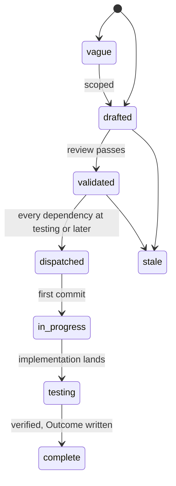
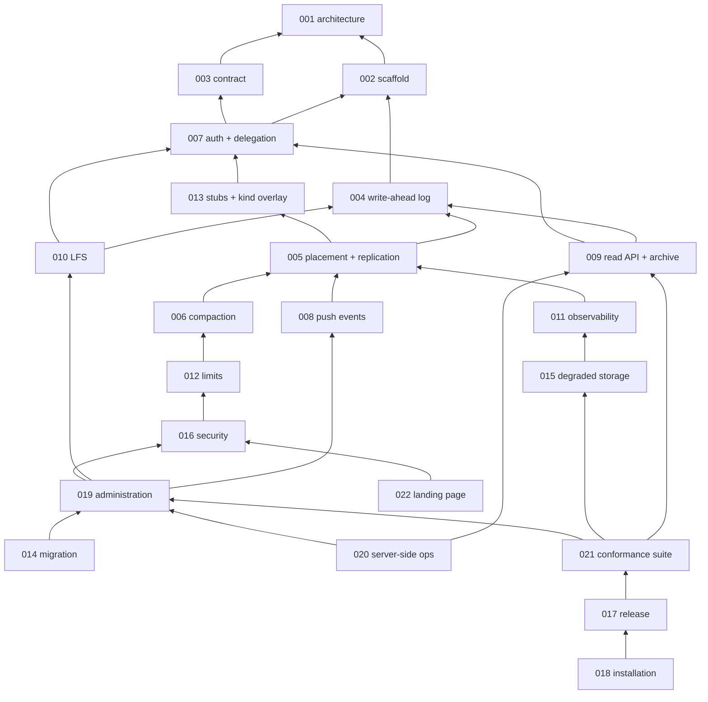

# Specs

Design specs for Origo, git hosting as an infrastructure component. One
spec covers one module. Each spec states the problem, the design with
enough precision to build from, and acceptance criteria that are testable
statements. Spec 001 fixes the architecture every other spec assumes; read
it first. Spec 003 is the contract a consumer codes against; it is the one
document a platform integrating Origo needs, and spec 021 is the suite
that proves an implementation serves it. Spec 002 is the configuration
reference: every variable is in its table, owned by it or listed with
its owner, and it owns the binary's subcommand table (`serve`, `check`,
`migrate`). Spec 011 owns every metric.

## Layout

Flat files `specs/NNN-name.md` in one number space with `track: infra` in
the frontmatter. Numbers are stable identifiers and are never reused. Open
specs sit here and are the work queue. A terminal spec moves to
`specs/.archive/` keeping its number so `depends_on` paths keep resolving.

## Lifecycle

`in_progress` is written `in-progress` in the frontmatter. A spec at
`testing` moves to `complete` when every acceptance criterion has a
passing test in the tree and the Outcome records every divergence.

An Outcome's stack-proof sentence cites the dispatched or tag run id
that proved the spec's cluster criterion, and is not refreshed
afterwards: the run is the evidence for that criterion on that commit,
not a claim about the newest run, so a later verifier reads it as
history and does not ask for a fresh one.

The dispatch gate is on the dependencies' state, not on `complete`: a
validated spec is dispatched when every spec in its `depends_on` is at
`testing` or later. `testing` means the design is built and what
remains is a criterion another spec owns the test for, which is the
case for a spec whose criteria name a later spec (003 and 004 do, and
each says which spec owns each deferred criterion), so waiting for
`complete` would wait for the dependents themselves.

## Index

| # | Spec | Effort | Status | Builds on |
|---|---|---|---|---|
| [001](001-architecture.md) | Architecture: components, storage model, flows, invariants | medium | complete | - |
| [002](002-repository-scaffold.md) | Repository scaffold: module, binary, configuration, gate, release | small | complete | 001 |
| [003](003-protocol-contract.md) | Protocol contract: what a consumer relies on | medium | testing | 001 |
| [004](004-write-ahead-log.md) | Write-ahead log: entries, immutable index, create-if-absent commit, materialization | large | testing | 002 |
| [005](005-placement-and-replication.md) | Placement and replication: rendezvous hashing, gossip, consistent reads, cache eviction | medium | complete | 004, 007, 013 |
| [006](006-compaction.md) | Compaction: primary-only repacks, log truncation | medium | complete | 004, 005 |
| [007](007-authentication-and-delegation.md) | Authentication and delegation: issuers, authorizer, acting on behalf | medium | complete | 002, 003 |
| [008](008-push-events.md) | Push events: signed webhooks per reference update | small | complete | 004, 005, 007 |
| [009](009-read-api-and-archive.md) | Read API and archive: refs, log, diff, tree, blob, tarball | medium | testing | 004, 007 |
| [010](010-lfs.md) | Git LFS: batch API and presigned object transfer | small | complete | 004, 007 |
| [011](011-observability.md) | Observability: metrics, traces, logs, alerts | small | complete | 004, 005 |
| [012](012-limits-and-abuse.md) | Limits and abuse controls | small | complete | 004, 006, 007 |
| [013](013-test-stubs-and-kind-overlay.md) | Test stubs and the kind overlay: the issuer, authorizer, sink, and contract stubs, the tiers, and the CI jobs | medium | complete | 002, 007 |
| [014](014-repository-migration.md) | Migration of existing repositories from a prior host: import, verify, cut over, in batches | medium | complete | 002, 003, 007, 008, 016, 019 |
| [015](015-degraded-storage.md) | Degraded storage: what a node does when the bucket is slow, partial, or gone | medium | complete | 004, 005, 011, 013 |
| [016](016-security-and-threat-model.md) | Security and threat model: what Origo protects, against whom, and how | medium | testing | 001, 007, 012, 013 |
| [017](017-release-and-versioning.md) | Release and versioning: images, binaries, compatibility, and what a version promises | small | testing | 002, 003, 013, 021 |
| [018](018-installation.md) | Installation: running Origo on any Kubernetes with any S3 compatible bucket | medium | testing | 002, 005, 007, 011, 013, 017, 021 |
| [019](019-repository-administration.md) | Repository administration: rename, transfer, freeze, delete, undelete, import, export, garbage collection | medium | testing | 003, 004, 006, 007, 008, 010, 016 |
| [020](020-server-side-git-operations.md) | Server-side git operations: commits, merges, cherry-picks, and reverts without a clone | large | testing | 004, 007, 008, 009, 012, 019 |
| [021](021-conformance-suite.md) | Conformance suite: the contract as executable tests | large | testing | 003, 007, 008, 009, 010, 012, 013, 015, 019 |
| [022](022-landing-page.md) | Landing page: what a person sees at the root | small | drafted | 002, 003, 007, 016 |

## Dependency graph

Arrows point from a spec to the specs it builds on, so spec 001 sits at
the top and the leaves at the bottom. The picture is the transitive
reduction of the deck's 75 `depends_on` edges: an arrow is drawn only
where no other path already carries it, which leaves 30. Reachability is
unchanged, so every dependency the deck states is still a path here, but
an arrow that is not drawn is not an absent dependency. Spec 018 lists
seven and only its arrow to 017 is drawn; 002 is one of the other six,
reached along 018 → 017 → 021 → 009 → 004 → 002. The Builds on column of
the index above carries each spec's literal `depends_on`.

## Build order

| Phase | Specs | Outcome | State |
|---|---|---|---|
| 1 | 002, 003, 004 | A single node serves clone, fetch, and push with the log as the source of truth | built; 002 complete, 003 and 004 wait on later specs for their remaining criteria |
| 2 | 007, 013 | Authenticated, delegated access with the stub issuer and authorizer (built by 007) in place of `ORIGO_DEV_TOKEN`, `ORIGO_TOKEN_KEY` required in every mode; the kind overlay with every row its table names (MinIO with fixed values on a host port, three pods each on host ports of their own, the stubs with the TLS source, metrics-server, Cilium, the restricted namespace, the HPA patch), `up.sh` and `down.sh`, the `test/e2e/cluster` helper, the tiers, and the CI jobs selecting tests by name prefix, which every later spec's criteria run on | built; 007 and 013 complete, the cluster jobs green on main |
| 3 | 005, 006, 008, 009 | Many nodes with consistent reads, compaction under load, push events, the read API and archive | 005 and 008 complete, 005's cluster criteria green in the `e2e` and `e2e-slow` jobs; 009 built, at testing on `TestReadTrace`, which is in no file, and on the 40 second fuzz search, whose job first fires on 2026-09-13; `TestE2EArchiveStreams` is done, green in the tier of run 34460223906; 006 complete, its two cluster criteria green in the `e2e` job |
| 4 | 010, 011, 012, 015 | LFS, telemetry, limits, and degraded-storage behaviour | 010 and 011 complete, the 500 MiB round trip green in the `e2e-slow` job and every metric, the traces, the request log line, and the alert rules in the tree; 012 complete, its last criterion, the frozen repository, owned by 021's `TestContract` and green against the stack in the dispatched run 34358421294; 015 complete, the breakers, stale reads, the refused push, `repository_unavailable`, and the slow proxy in the tree, `TestClusterDegradedStorage` green in a dispatched `e2e` run |
| 5 | 016, 019 | Threat model written and enforced; the administration operations a long-lived repository needs | 016 built and at testing: the egress dialer and proxy, the three variables, `transfer.fsckObjects` and `core.protectHFS`, the validator fuzz tests, the subprocess environment test, the gossip NetworkPolicy with `origod-http` beside it, and `SECURITY.md` in the tree, `TestClusterPodSecurityContext` green in the dispatched run 34296753008; at testing on the attachment half of its supply-chain row alone: 019 asserted the `import` half and 014 the `verify` half on 2026-09-09, and the tag run 34461460766 shipped the three SPDX documents as release assets with both images and `checksums.txt` signed, so what is left is the bill of materials and the provenance attached to the image, which needs the repository to be public. 019 built and at testing: transfer, freeze, import, export, `stats`, `gc`, the purge tombstone, and the weekly orphan sweep in the tree, `TestClusterImportFixture` and `TestClusterGcBoundsStorage` green in the dispatched run 34335095125; at testing until 021's live run covers the conformance cases of its first criterion, less `019/repo_not_empty` and `019/import`, which sit in the source group and no live run can carry; every case is written and green against the stack, named case by case in the `cluster e2e tier` job of the tag run 34461461220, and green against the published image in run 34461460766, 014's `TestSourceTokenIsNeverLogged` having closed the source-bearer half; the first release did not produce the live run |
| 6 | 021, 017, 018 | The conformance suite gating releases and run against the live installation `ORIGO_LIVE_URL` names after each one; releases an outside operator can install and upgrade from the documentation alone, on the trixie-slim image; the point at which the repository can go public | the first release ran on 2026-09-10: tag `v0.1.0` at commit `2b2468d`, Release run 34461460766 with every job green or deliberately skipped, and the tag's `verify` run 34461461220 green over the cluster tiers, the up-script check, and the mutation job. All three specs stay at `testing`. 021: the suite is green whole against the stack and against the image the release published, named case by case in both runs; what remains is the live run of the 51 cases a live target can carry, which the release did not produce, and 014's `verify` case of the source group, which is in no file. 017: the tag closed every row a tag can close, the artifacts and signatures and body through `release-verify`, the three SPDX assets, the conformance run against the published image, the deploy-less tag, and `install-release`; what remains is the attestations, which need a public repository, the `live` job, which needs the two secrets and an installation, the N-1 fixture, which needs a second tag, and the fork tag in both halves, which needs a maintainer and is the only path by which `deploy and smoke` has ever been asked to run. 018: `install-release` ran against the published artifacts on a bare cluster; what remains is a maintainer walking the prose |
| 7 | 014 | Existing repositories migrate from a prior host with verification and a cut-over | 014 complete: `POST /v1/repos/{id}/verify` with `verified_at` and `verified_equal` on the representation, the `verified` event, the subcommand dispatcher of 002 with `origod migrate` on it, and `docs/migration.md` whose blocks are its own test, in the tree; the `cluster e2e tier` job of the tag run 34461461220 names `--- PASS: TestClusterMigrationCatchesALateWrite` and `--- PASS: TestClusterMigrationDocCommandsRun`, which was the last item |
| 8 | 020 | Commits, merges, cherry-picks, and reverts from a request, for tooling that changes many repositories | 020 built and at testing: the four routes, the two codes with their call sites, the per-repository bucket, and the per-subject rate from the authorizer that closes 012's builder item, all in the tree; 021's suite carries the four `TestContract/020` cases, green against the stub and against the stack in the `e2e` job of the dispatched run 34353736553, whose two remaining failures are 019's and 012's cases; both closed, and the suite passed whole in the dispatched run 34358421294, so what holds 020 at testing is 021's live run |
| 9 | 022 | A person who opens the installation in a browser reads a page instead of a credential dialog they cannot satisfy | drafted; the root and the favicon are the only unauthenticated paths added since 007, and the page depends on nothing outside the process |

Phase 2 is specs 007 and 013 and nothing else: the stubs are what
replaces the phase 1 bearer, and the overlay and the CI jobs are what
every later criterion runs on, so both exist before spec 005's cluster
tests need them. The conformance suite is spec 021 and depends on
every surface it asserts, spec 019 included, and on spec 012, whose
enforcement produces its `over_quota` and `rate_limited` rows, which
is why it sits in phase 6 beside the release and installation specs
that depend on it; none of the specs it depends on depends on 017 or
018, so there is no cycle.

## Decisions across specs

Facts one spec owns and several rely on, fixed by the review of the
deck and stated here so a reader sees them without the owning spec.

| Decision | Owner | Relied on by |
|---|---|---|
| the runtime image is `debian:trixie-slim` pinned by digest, git 2.47, above the 2.40 floor `origod check` enforces; both Dockerfiles move to it under 017 | 017 | 002, 018, 020 |
| `origod` has the subcommands `serve` (default), `check`, and `migrate`, one configuration table for all; 014 built the dispatcher with `serve` and `migrate`, `serve` being where the node's configuration is loaded, and 018 adds `check` | 002 | 014, 018 |
| `ORIGO_TOKEN_KEY` is required in every mode and comes from the Secret `origod-token-key`, never from `origod-auth` or any template: it is generated once by `up.sh` on the test stack, by `make dev` locally, and by step 4 of `docs/install.md` on an installation, and every workload reads it by name | 002, 007, 018 | 013, 016, 018 |
| `ORIGO_GOSSIP_SECRET` is required only when `ORIGO_GOSSIP_PEERS` is set; a single node runs with neither | 002, 005 | 013, 016, 018 |
| the index object carries `pushed_at`; the read API and `stats` serve it from there | 004 | 003, 009, 019 |
| `size_bytes` on the index object is what the log holds: the bytes of the listed packs plus the pack bytes of the entries since the last compaction; a `compact` commit sets it to `Entry.PacksBytes`, a push adds its `pack_bytes`; the quota counts it and `stats` serves it | 004 | 003, 006, 012, 019 |
| `ghcr.io/latere-ai/origo-stubs:<version>` is a release artifact beside `origod`, built from `Dockerfile.stubs`, signed and attested the same way, pinned in the deploy archive's `kind` overlay; the `install-release` job and a first installation run the stub authorizer from it | 017 | 013, 018 |
| `TestMutation` in `test/e2e` is the mutation job's test: it starts one node with `ORIGO_TEST_DROP_CAPABILITY` from the `ORIGO_TEST_S3_ENDPOINT` family, runs `conformance.Run` against it, and passes only when the run fails on that capability alone; `TestContract` carries the `e2e` tag, skips when nothing answers at `ORIGO_TEST_URL`, and targets `ORIGO_LIVE_URL` when it is set | 021 | 013 |
| `operation_timeout` is defined by the read API and named by the limits and the server-side operations | 009 | 012, 020 |
| the kind overlay is a table of rows, each with the spec that needs it; the CI jobs select tests by name prefix (`TestE2E`, `TestCluster`, `TestSlow`) and reach the stack through `ORIGO_TEST_URL`; `up.sh` creates the cluster and applies the overlay, `down.sh` deletes it, `make dev-up` and `make dev-down` call them | 013 | 004, 005, 008, 015, 016, 021 |
| the kind stack has no ingress controller; its ports table fixes every host port (origod balanced 30080, nodes 1 to 3 public 30180 to 30182 and internal 30190 to 30192 on the StatefulSet `origod-0` to `origod-2`, the stub issuer 30081, authorizer 30082, sink 30083, the TLS source 30084, the slow proxy 30085, MinIO 30900), the defaults of `ORIGO_TEST_URL` and `ORIGO_S3_PUBLIC_ENDPOINT` on the stack; a criterion names a node by its row, "node 1 of the ports table" | 013 | 005, 006, 010, 015, 017, 021 |
| the stack's MinIO has fixed values (bucket `origo-test`, key and secret `minioadmin`, region `us-east-1`, path style, host port 30900) that the cluster jobs export as the `ORIGO_TEST_S3_ENDPOINT` family, read by a test that starts a node of its own, the fixture harness, and the `Fault` | 013 | 008, 017, 021 |
| a cluster test changes the cluster only through `test/e2e/cluster` (`DeletePod`, `ApplyManifest`, `ApplyManifestExpectRefusal`, `HPAStatus`, `Apply`, `Get`), which shells out to `kubectl` on `PATH` under the job's kubeconfig; fault manifests live under `test/e2e/testdata/`, `hpa-2.yaml` written by 013 and `hpa-4.yaml`, `hpa-8.yaml`, and `hpa-scale.yaml` (3 to 8 replicas, for the autoscaler test, because 013 holds the overlay's own autoscaler at 3) by 005; every cluster criterion names the function it uses | 013 | 005, 015, 016, 021 |
| 007 builds `test/stubs/issuer` and `test/stubs/authorizer`; 013 builds the sink, the contract stub, the TLS source stub, the binary, the overlay, and the jobs | 007, 013 | 014, 018, 019, 021 |
| `tools/docs/run-blocks.sh` runs a document's `sh` blocks as its test | 013 | 014, 018 |
| every event kind goes through `internal/events`: `Enqueue` for a `push` entry, `Emit` for a kind without a sequence, keyed `a-<uuid v5 of repo:kind:at>` so a repeated emit is one event; one delivery loop, retry schedule, dead-letter, cursor, and repair for all | 008 | 014, 018, 019 |
| the autoscaler scales on CPU only, in the base and in every example overlay; `origo_requests_in_flight` is a dashboard signal | 005 | 011, 018, `docs/operations.md` |
| the `integration` job is 25 minutes, the two cluster jobs 30, the mutation job 20; the 500 and 1 000 push tests and the 5 000-commit import run in the `e2e` job, the 500 MiB LFS round trip in `e2e-slow`, which installs `git-lfs`; the `specindex` job installs and runs `promtool` | 013 | 006, 010, 011, 019, 021 |
| a write under an open read breaker is refused at once with `storage_unavailable`; stale serving is for reads only | 015 | 003, 019, 020 |
| `/readyz` stays ready while a storage breaker is open, once the bucket has answered that replica at least once since it started: the node serves warm repositories stale and refuses writes with a code, and a not-ready node would leave the Service's rotation and lose those reads. A replica the bucket never answered stays unready. 002 owns `/readyz` and its probe row names 015 as the reason | 015 | 002, 005, 018 |
| `Retry-After` is on every refusal that names a wait, in whole seconds and at least 1: a 429 `rate_limited` from 012's limits and a 503 `storage_unavailable` a storage breaker refused, on the git routes and the JSON API alike, valued at the refusing breaker's remaining open interval; 003's header table defines it | 003 | 012, 015, 019, 020 |
| the egress proxy of 016 is the one place that dials an `import` or `verify` source: it terminates the source's TLS, trusting the system roots plus `ORIGO_EGRESS_CA_BUNDLE`, unset in production and set by the kind overlay to the source stub's CA, while git talks plain HTTP to the proxy; `transfer.fsckObjects` is a `-c` argument, not a `GIT_CONFIG_*` key | 016 | 002, 013, 014, 019 |
| the egress dialer's `AllowLoopback` is a constructor option with no variable, false in every deployment and set only by the in-process tests of `import` and `verify` | 016 | 013, 014, 019 |
| a `host=address` entry of `ORIGO_EGRESS_ALLOW` fixes the address the dialer uses for that host: the host is admitted at that address and at no other, inside `ORIGO_CLUSTER_CIDRS` or outside it, which is how the stack's nodes reach the in-cluster source stub at its fixed `clusterIP`; a pin no listed range contains is a valid entry and no start-up refusal, while loopback, link-local, and unspecified stay refused ahead of it | 016 | 002, 013, 014, 019 |
| the three LFS sentences are the codes `lfs_object_mismatch`, `lfs_object_not_stored`, and `lfs_locks_unsupported`, rendered through `contract.Sentence` in the LFS body shape; 021's code table holds them | 010 | 003, 021 |
| the tag-time install run is the `install-release` job of `release.yml` after `publish`, with `ORIGO_INSTALL_IMAGE` and `ORIGO_INSTALL_MANIFESTS`; the push-time `install` job of `verify.yml` uses the candidate build | 018 | 002, 017 |
| an undelete emits `undeleted` and nothing else; the `push` entry it commits produces no `push` event | 019 | 004, 008 |
| the code table is the one source of every sentence and status: `contract.Status(code)` beside `contract.Sentence`, every envelope through `contract.Write` with a `contract.Code*` constant and the table's status; `TestEveryCodeHasOneSentence` walks the module with `go/ast`, fails on an `httpjson.Error` literal or `httpjson.WriteError` call outside `internal/contract`, on a string code, on a status the table does not give the code, and on a code of a spec at `testing` or later with no call site, and proves itself on a negative fixture | 021 | 003 and every spec with a Code table |
| `ORIGO_PUBLIC_URL=http://localhost:30080` is set on all three pods of the kind overlay, one value because a repository-bound token carries it as `iss`; once 018 moves the Latere values out of the base, the overlay is the only place it is set | 013 | 007, 018 |
| `origo-stubs` takes `-issuer-listen`, `-authorizer-listen`, `-sink-listen`, `-source-listen`, `-slowproxy-listen`, `-slowproxy-target`, `-slowproxy-data`, `-issuer-url`, `-authorizer-token`, and `-source-token`; the source starts only when `-source-token` is set; `make dev` runs it at `DEV_PORT_BASE + 4` to `+ 6` on the loopback interface | 013 | 002, 007, 015, 018 |
| the slow proxy of 015 runs from `origo-stubs` and starts only when `-slowproxy-target <host:port>` (MinIO's Service) is set; `-slowproxy-data` (default `0.0.0.0:8086`) is the in-cluster data listener `ORIGO_S3_ENDPOINT` names, `-slowproxy-listen` the control endpoint on host port 30085 of the ports table | 013, 015 | 021 |
| `deploy/examples/kind/versions.env` pins the Cilium chart (`cilium/cilium` 1.18.0, `ipam.mode=kubernetes`, images by digest) and `metrics-server` (v0.7.2, its manifest by sha256 and its image by digest); `up.sh` and 018's `install` job source it | 013 | 005, 015, 016, 018 |
| the checked-in `kind.yaml` is the offset-0 configuration; `up.sh` renders a copy under `out/kind/<name>/` by adding `PORT_OFFSET` to every `hostPort` with one `awk` expression, and 018's `install` job uses the checked-in file as it is | 013 | 018 |
| the `build` job of `verify.yml` builds both images once and uploads `candidate-images`; `e2e`, `e2e-slow`, `up-script`, and 018's `install` download it and build nothing | 013 | 017, 018 |
| the gossip NetworkPolicy `origod-gossip` in `deploy/base` is 016's: one ingress rule admitting UDP 7946 from the `origod` pods only, asserted by `TestClusterPodSecurityContext` through `cluster.Get`; `origod-http` in the same file admits TCP 8080 and 8081 from every peer, because a policy closes every ingress it does not admit for the pods it selects | 016 | 005, 013, 018 |
| `TestPreviousReleaseFixture` carries the `e2e` tag, reads the fixture path from `ORIGO_PREVIOUS_RELEASE_FIXTURE`, which the `e2e` job and the release pipeline set from `gh release download`, skips when it is unset, and uploads the fixture under a fresh prefix through the S3 client before it starts | 017 | 002, 013, 021 |
| the Namespace stays in `deploy/bootstrap`, never in `deploy/base`, because the rollout identity creates no namespace | 018 | 002, 017 |
| `deploy/base/prometheusrule.yaml` is in the directory and is not a resource of `deploy/base/kustomization.yaml`: a `PrometheusRule` needs the Prometheus operator's CustomResourceDefinition, which Origo does not require, so an installation that runs the operator applies it beside the base | 011, 018 | 005, 013 |
| the `build` job of `verify.yml` runs on every event but the weekly schedule, because 018's `install` job runs on every push and downloads `candidate-images` rather than building; the cluster tiers, the up-script check, and the mutation job stay on a tag | 018 | 013, 021 |
| `gone` and `operation_timeout` are proved by the code table alone; `over_quota` needs `Authorizer` to lower `quota_bytes`; `import`, `verify`, `repo_importing`, `repo_not_empty`, and `imported` need `Source` and `SourceToken` on `Target`; the live skip list has six entries; the source group is skipped on the stub run because `AllowLoopback` is a `_test.go` seam | 021 | 009, 014, 016, 017, 019 |
| 020 adds its two codes to the code table and their call sites when it lands; a row no call site sends fails only for the codes of a spec at `testing` or later | 021 | 020 |
| the LFS round trip is measured through a counting reverse proxy in front of `ORIGO_TEST_URL`; no forward proxy | 010 | 013 |
| `docs/api.md` is 018's, the second output of `make docs`, rendered by `tools/apidoc` (its own module) from the endpoint, header, and code tables of the specs | 018 | 003, 021, `docs/README.md` |
| `tools/specindex` exports its parser and cross-reference model as the package `tools/specindex/specs`; `tools/apidoc` requires the `tools/specindex` module with a `replace ../specindex` directive; the export is a builder item of 018 and moves no status | 018 | `tools/specindex` |
| a cloud provider named as a deployment target, a tested bucket, or an overlay name (`digitalocean`, `aws`, DigitalOcean Spaces, AWS S3) is allowed; the naming rule bars other companies as sources or references | README | 001, 004, 016, 017, 018 |
| the stub authorizer's outage is set over HTTP as well as by flag: `PUT /fail {"status"}` (0 clears), `POST /hang`, `POST /resume`, added by 013 to the package 007 built, so 021's stack run produces `authorizer_unavailable` through the host port; no Secret lives in `deploy/base`, the templates `origod-s3` and `origod-auth` stay in `deploy/bootstrap` | 013, 018 | 007, 021 |
| 012 depends on 006, which builds `internal/compact` where `TestCompactionSkipsWhenNoSlot` lives; the build order is unchanged, 006 is in phase 3 and 012 in phase 4 | 012 | 006 |
| a code-table row holds every status its spec's Code table lists (`repo_frozen`: 403 on a write, 409 on a second freeze); `contract.Status(code)` answers the first, and the call-site check accepts any status of the row | 021 | 003, 019, 020 |
| a server-side operation's entry carries the objects the log does not already hold: `pack-objects --revs` over the new tip with a `^` per commit the operation started from (`expected_head` or `from`, and the source as well for a merge commit), and a fast-forward merge commits the transaction with no pack, because the source is already in the log | 020 | 004, 006 |
| the per-subject request rate is `ORIGO_REQUESTS_PER_MINUTE`, 600 by default, and every response of the surface carries it as `RateLimit-Limit` (the IETF draft field); the `kind` overlay runs at 6000 and each cluster scenario mints a subject of its own, because the scenarios drive one node far harder than any caller of a live installation, and 021's `rate_limited` case reads the header rather than assuming the default | 012 | 002, 013, 003, 021 |
| the 600 a minute default stays: it bounds one subject to 300 back-to-back pushes a minute, an operator raises `ORIGO_REQUESTS_PER_MINUTE` for a fleet of tooling under one token, and a subject that drives many repositories takes a figure of its own from the authorizer's optional `requests_per_minute`, absent meaning the variable's value | 007 | 012, 020 |
| the call-site rule of `TestEveryCodeHasOneSentence` is keyed on the spec that produces a code: `producers map[string]string` in the test, `over_quota` and `rate_limited` to 012, `ref_not_found` to 009, every other code to its owner; the test reads `status:` from `specs/<nnn>-*.md` or `specs/.archive/`; 021 depends on 012 | 021 | 003, 009, 012 |
| the negative fixture is `test/conformance/testdata/negative/bad.go.txt`, outside `internal/contract`, fed to the walk by path; the status rule runs only on a `contract.Code*` identifier, so the fixture yields two findings, lines 16 and 17 | 021 | 003 |
| a sideband line, `ERR` pkt-line, or hook verdict that carries a code is `<code>: <sentence>` exactly, `contract.Line` of the code; the reference and the hashes of a refused push go to the handler's `info` log line, never the sideband; `TestRejectLinesAreTheTableSentences` in `internal/httpgit` holds it and 021 owns it | 021 | 003, 012, 015, 019 |
| the code-table walk checks five functions: `contract.Write`, `Error`, `Sentence`, and the two the build added, `Refuse` (an envelope prepared where the code is chosen, rendered elsewhere) and `Line` (the sideband form); the `invalid_request` row carries 416 beside 400 for spec 009's `Range` refusal | 021 | 003, 009, 010, 019, 020 |
| `Fault.DeleteObject(t, prefix)` deletes the one object under a key prefix and answers its key, because an entry key carries a nonce the suite cannot know; the `repository_unavailable` case deletes and undeletes the repository around it so every node materializes again | 021 | 013, 015 |
| the push event rows of 008 and the event assertions of 007 and 019 assert the delivery only where `EventsSink` is set and record it in `Report.Unverified` otherwise; the live run has no sink and the skip list stays at six | 021 | 008, 017 |
| `TestMutation` runs `conformance.Run` in a second process of its test binary (`TestMutationRun`), because a failed subtest fails the test that ran it; the `e2e` job runs `TestContract` and `TestSameAnswersOnStubAndStack` in a `go test` line of its own beside the `TestCluster` prefix | 021 | 013 |
| a failpoint of `ORIGO_FAILPOINT` has no count: the node exits the first time the point is reached; a test that needs it on a later operation restarts the node under its name and data directory with it | 002 | 008, 021 |
| an upload batch omits `actions` for an object the store holds, `lfs/verified/<oid>` present and naming the declared size, the batch API's rule; the quota counts a held object's bytes once | 010 | 021 |
| `quota_bytes` for a repository-bound token is `auth.DefaultQuotaBytes` until 012 asks the authorizer for the minter's figure; 007's claim set carries no quota | 010, 012 | 007 |
| truncation removes folded entries and superseded packs and never an index object, so `HEAD index/<n+1>` stays the currency check and its 404 stays proof of currency: a warm node holding index n below a truncation point would read the 404 left by a deleted `index/<n+1>` as current. One small object per push is the cheaper side of the trade; 006 removes the index rule `internal/wal/sweep.go` carries today | 006 | 004, 005, 015, 019 |
| a thin pack whose base object is in no entry the log holds is served `storage_unavailable`, not `repository_unavailable`: a missing base is a storage-side inconsistency, not a state of the repository; `TestThinPackWithoutBaseIsStorageUnavailable` in `internal/repo` holds it | 015 | 003, 005, 021 |
| the route sweep `TestEveryRouteRequiresAToken` in `cmd/origod` is a maintained list of the public listener's routes, not a walk of the mux, because `http.ServeMux` exposes no patterns; every route a later spec adds needs a line in the list | 016 | 007, 010, 014, 019, 020 |
| the proxy URL git is given is `http://<credential>:egress@127.0.0.1:<port>`, the password fixed because git prompts for one when the URL carries a user alone; `Proxy.GitConfig` with an empty token sets `GIT_CONFIG_COUNT=1` and the proxy key alone, never an empty bearer; a hop the proxy refuses is 403 to git and `Proxy.Refusal` to the operation, which answers the 400 | 016 | 014, 019 |
| `ORIGO_EGRESS_ALLOW` entries pass `hostmatch.ValidPattern`, an FQDN, an IP literal, or a `*.` wildcard, so a single-label name such as `localhost` cannot be listed; a test names its source under `.localhost` (RFC 6761) | 016 | 002, 013, 014, 019 |
| the pinned dialer resolves inside `DialContext`, once per connection, dials the first admitted address by IP, and skips a refused address among admitted ones | 016 | 014, 019 |
| a label `a..b` is admitted: spec 003's grammar admits it and a label is never a path component a subprocess sees; `.` and `..` whole are refused, and `FuzzValidLabel` holds `ValidLabel` to git's path rules under `core.protectNTFS` and `core.protectHFS` | 003, 016 | 004, 019 |
| `TestClusterPodSecurityContext` asserts the CPU request at the base's 250m or the kind overlay's 50m, the memory request and limit at the base's figures | 016 | 005, 013 |
| `internal/tracing` is the one package that imports `go.opentelemetry.io/otel` and `otel/trace`; every other package takes its span helpers from there and `cmd/origod` reaches the SDK through `latere.ai/x/pkg/otel`. The SDK is the one direct dependency beside the standard library and `latere.ai/x/pkg`, which amends spec 001's seventh invariant, and `depcheck` holds the node's whole build list | 011 | 001, 002 |
| the cluster and conformance steps of `verify.yml` run `go test -v` since `1f4bbb9`, so a stack proof cited from a run at or after it names its test in the log; a citation from an earlier run reads the package's `ok` together with the assertions inside the test it names, and neither kind is refreshed afterwards | 013, 021 | 003, 012, 014, 016, 019, 020 |
| the four `actions/attest-*` steps of `release.yml` and `release-verify`'s `gh attestation verify` run only when `!github.event.repository.private`: GitHub's attestation API refuses a private repository on Latere's organization plan, which failed the v0.1.0 tag of 2026-09-10 in the `build` job after both images were pushed. The three SPDX documents are still built and still shipped as release assets and cosign keyless signing is untouched, so a private release is complete and signed with its bill of materials; only the attachment of the bill of materials and the provenance to the image, and their verification, are deferred. The condition reads `private`, not the plan, so the steps return by themselves when the repository is made public and need an edit if the plan is upgraded instead | 017 | 016, 018 |
| the `live` job of `release.yml` runs `TestContract` against `ORIGO_LIVE_URL` with `ORIGO_LIVE_TOKEN`, and `TestContract` skips when the URL is unset, so on a repository with neither secret the job passes without running a case and `publish`'s `needs.live.result == 'success'` is satisfied by a skip. Latere has no installation: no `ORIGO_LIVE_URL`, no `ORIGO_LIVE_TOKEN`, no `ORIGO_RELEASE_DEPLOY`, no `production` environment, and `git.latere.ai` does not resolve, so the v0.1.0 tag of 2026-09-10 published without a live run and `deploy and smoke` was skipped with it. No spec reads that green as the run; 003, 019, 020, and 021 stay at `testing` on it, each for the cases a live target can carry | 017 | 003, 019, 020, 021 |
| a job of `release.yml` that leans on the implicit `success()` gate is skipped whenever any job above it in the graph is, however far up and through however many `always()` jobs, because GitHub evaluates that gate over the whole ancestor closure. `deploy` is skipped on every repository with no `ORIGO_RELEASE_DEPLOY`, so every job below it carries `if: ${{ always() && needs.<job>.result == 'success' }}`, held by `TestReleaseSurvivesASkippedDeploy` in `tools/release` | 017 | 018 |
| a live target of `test/conformance` carries no `Issuer`, no `Authorizer`, no `Source` and `SourceToken`, and no `Fault`, so all six groups skip in every live run and `TestContract` asserts exactly that. The eight cases in them, `003/storage_unavailable`, `007/forbidden`, `007/authorizer_unavailable`, `007/delegation`, `012/over_quota`, `015/repository_unavailable`, `019/repo_not_empty`, and `019/import`, can never be closed by a `live` job whatever secrets are set; they close on the stack, where the run fails on a non-empty skip list while a `Fault` is wired. A spec waiting on the live run waits for its other cases alone | 021 | 003, 007, 012, 015, 019 |
| the `fuzz` job of `verify.yml` carries `if: github.event_name == 'schedule'`, so `workflow_dispatch` cannot reach it and the cron `0 3 * * 0` is the only path to the 40 second search. The seed corpora of every fuzz function still run in the `test` gate on each push, so a fuzz row is proved on its seeds and unproved on its search until the first Sunday fires | 013 | 009, 016 |

## Applied fix lists

Each review round of the deck ends in a list of fixes, applied in
full before a spec moves to `validated`; the first seven rounds are
in the git history of this directory, one commit per spec.

The eighth round: 013 sets `ORIGO_PUBLIC_URL` on every pod, defines
the `origo-stubs` flags against the Makefile's `DEV_PORT_BASE`
scheme, pins Cilium and `metrics-server` in `versions.env`, renders
`kind.yaml` with `PORT_OFFSET`, splits the `hpa-<n>.yaml` fixtures
with 005, and gains a `build` job so the cluster jobs share one image
build; 013 moves to `validated`. 012 depends on 006. 016 owns the
gossip NetworkPolicy and asserts it through the new `cluster.Get`.
017 defines `ORIGO_PREVIOUS_RELEASE_FIXTURE` and the fixture upload.
018 keeps the Namespace in `deploy/bootstrap` and owns `docs/api.md`
through `tools/apidoc`. 021 states which codes the table alone
proves, adds `Source` and `SourceToken` to `Target`, grows the skip
list to six groups, and defers 020's rows. 010 keeps the reverse
proxy only.

The ninth round, after spec 007 landed: 002, 013, 016, 018, and 021
state what 007 built (`internal/auth`, the two stub packages, the
bootstrap Secret `origod-auth`, the code table in `internal/contract`
and every envelope rendered through `contract.Write`); 013's
authorizer stub gains the three outage control paths and both stubs
`Resume`; 017's `git --version` check moves to the `build` job and
step 1 of `release.yml` uploads `candidate-images`; 018 keeps every
Secret out of `deploy/base`, fixes the `events` line when no sink is
configured and the job that compares the generated pages, and moves
to `validated`; 010 records that `s3test` reports a signature failure
through `t.Errorf`; 021 fixes its stub `Fault` on `Fail(n, status)`
and stays `drafted` for the code-table test, whose mechanism must
match the tree (call sites of `contract.Write`, not `httpjson.Error`
literals).

The ninth round's second list, with 009 and 013 in progress: 021's
`TestEveryCodeHasOneSentence` walks the module with `go/ast` for
`httpjson.Error` literals and `httpjson.WriteError` calls outside
`internal/contract`, string codes, and a status other than
`contract.Status(code)`, requires a call site for every code of a
spec at `testing` or later, and proves itself on a negative fixture
in place of "fails on the tree as it stands today"; 021 moves to
`validated`. 013's flag table gains `-slowproxy-target` and
`-slowproxy-data`, `-slowproxy-listen` is the control endpoint, and
015 runs its proxy from the `origo-stubs` component in place of "a
small Go program". 007's Outcome names `-authorizer-token`. 018
states that `tools/specindex` exports the package `specs` and
`tools/apidoc` requires it through `replace ../specindex`. The
naming rule below admits a cloud provider as a deployment target.

The tenth round, on 021 alone: a code-table row holds every status
its spec lists and `contract.Status` answers the first; the call-site
rule is keyed on the producing spec through `producers` in the test,
which reads the `status:` frontmatter, and 012 joins 021's
dependencies for the `over_quota` row; the negative fixture is the
file `test/conformance/testdata/negative/bad.go.txt`, given in full,
and the status rule runs only on a `contract.Code*` identifier; a
sideband line is `<code>: <sentence>` exactly, the reference and the
hashes go to the `info` log line, and `TestRejectLinesAreTheTableSentences`
in `internal/httpgit` holds the verdicts, with 003's Outcome aligned;
021 stays `validated`.

The twelfth round, on 008 and 010 at `complete`: 010 makes the batch
API's deduplication rule the design, with the code fixed and
`TestUploadSkipsAnObjectTheStoreHolds` holding it, names
`authorizer_unavailable` in its Errors, states the `verify` origin
rule, the `request_id` rule, and the repository-bound token's quota;
008 states the built signatures, the membership interface, the
journal load at start-up, the create-if-absent repair, the sequential
delivery rule and the bound on a suppressed entry's re-read; 002
states that a failpoint has no count; 011 and 012 carry one builder
item each from 010.

The thirteenth round, on 005 at `complete`: 005's Design states what
was built as its rule, so the Outcome's divergences no longer answer a
question the Design answers differently, the batched `index-pack` with
its figures and the duplicate-base fallback, the header on a refused
request in each form, the evictor's `TryLock`, the gossip `Bind` and
`Run`, the kind overlay's 50m CPU request, and `deploy/prod`'s
autoscaler; its criteria name `hpa-scale.yaml`, the protocol version 1
`ls-remote`, and the batches in place of the retry the batching
removed. The two open items are settled: truncation never removes an
index object, so the currency check stays `HEAD index/<n+1>` (006, with
004's Sweeper table and a criterion of its own), and a thin pack whose
base is in no entry is `storage_unavailable` (015, with a criterion of
its own). 011 names the six packages that registered metrics and makes
`internal/tracing` the one importer of the OpenTelemetry SDK; 001's
seventh invariant is amended to name the SDK and its Outcome records
why. Three decision rows and the `latere.ai/x/pkg` items below are new.

The fourteenth round, on 006 and 011 at `complete`: each spec's Design
now states as the rule what its Outcome recorded as a divergence, so a
reader finds one answer. 006 carries the `pack_bytes` source of the byte
threshold, the multi-pack index as the run's pack set with the
carry-forward, the eviction after the read lock, the request a purge
leaves, the step 6 warning, the `compact.Slots` seam, and
`compact.Manager.GC` beside 019's endpoint; its stack criterion states
the wait that pushes every 15 seconds, its truncation criterion the
folded count the tree uses, and its latency criterion 20 MiB and 200
pushes with `TestMeasure` at 1 GiB and 1 000. 004's index row carries
`pack_bytes`, which 004 owns and 006 mentions. One defect: the
truncation criterion's second half, the currency check on a folded
sequence, was named and asserted nowhere;
`TestHolderOfAFoldedSequenceSeesTheNewerIndex` in `internal/compact`
holds it and fails against the sweep rule 006 removed. 011 carries the
seeding rule with its two exceptions, the bucket sets of
`origo_compaction_seconds` and `origo_storage_seconds`, the details
struct in place of `WithRouteTemplate`, the log line's writer, the
storage span named by its HTTP method beside the `op` span 015 opens,
and the rules document `specindex -rules` prints out of a file the base
does not name. A read's three spans are decided: they are 009's to build
now that `internal/tracing` exists, and 009 carries the builder item and
the criterion `TestReadTrace`, staying at `testing`.

The fifteenth round, on 015 at `complete`: 015's Design states as the
rule what its Outcome recorded as a divergence, so a reader finds one
answer: the deadline bounds the whole `Store` call and not each
attempt, a `Get` is bounded to the arrival of the object's headers and
its body read under the caller's context, the breaker is local in
`internal/wal/breaker.go` with the package's semantics and its `State`,
a call the caller's own context ended counts toward neither side, a
refusal is counted on `origo_storage_ops_total` and not timed on
`origo_storage_seconds`, a 304 counts `result="ok"`, the spooled
push's wait polls `Admits` and not `Allow`, the integrity list carries
all six keys the tests cover, the missing thin-pack base is
`storage_unavailable` with `op: "index-pack"`, and the stack row sets
`ORIGO_STORAGE_TIMEOUT=5s` beside `ORIGO_STALE_MAX=30s`. Its two open
items are settled and are the Design's rules: readiness stays ready
under an open breaker once the bucket has answered the replica, with a
`### Readiness` section of its own and a sentence in 002's probe row,
and `Retry-After` is on every breaker-refused 503, which 003's header
table now defines with 012 and 015 as its senders. Two decision rows
and the two `latere.ai/x/pkg` items above are new, the lifecycle
section states the stack-proof convention, and 015's Outcome records
that the next green dispatched run is 012's to cite. One fix is left
to 012's builder, which owns `internal/httpgit` and `internal/api`
this round: `api.storageError` and `httpgit.Handler.retryAfter` ask
`RetryAfter(wal.ClassRead)` whatever class refused, so a write the
open write breaker refused outside the receive-pack advertisement
carries no header while the read breaker is closed; the class belongs
to the refusing call.

The sixteenth round, on 012 at `testing`: 012's Design states as the
rule what its Outcome recorded as a divergence, so a reader finds one
answer: a refused push answers 200 on the receive-pack POST and carries
`over_quota: <sentence>` alone in git's output with `limit`, `bytes`,
and `max` on the `info` line, the 413 forms carry the same figures in
`details`, a slot is admission control for the request's own subprocess
and one slot covers a whole read, the handlers build the table when
given none, the `lfs/` sum is `limits.LFSBytes` behind the 60 second
cache with `internal/lfs` calling through it, a push whose sum cannot
be read is refused, a rate-limited LFS request answers 003's envelope,
and the `kind` overlay runs at 6000 with a subject per scenario. Its
three open items are settled and are the Design's rules: the reference
count after a push is refused the way the size rule is, which 003's
line form already covered; the 600 a minute default stays, with the
figure it buys stated and `ORIGO_REQUESTS_PER_MINUTE` as the operator's
knob; and a bound token's write during an authorizer outage fails
closed with `authorizer_unavailable`, matching 007's rule that an
outage denies. That last one is the round's defect: `Guard.quota` in
`internal/auth` falls back to the default quota when the authorizer is
unreachable, and 016's builder, who owns the package, closes it under
`TestBoundTokenWriteFailsClosedDuringAuthorizerOutage`. 007's
authorizer response gains the optional `requests_per_minute` and 020
the builder item that reads it. 021's Current state no longer says
`over_quota` and `rate_limited` have no call site. One decision row is
new.

The seventeenth round, on 016 at `testing`: 016's Design states as
the rule what its Outcome recorded as a divergence, so a reader finds
one answer: the route sweep is a maintained list and every new route
needs a line, `ORIGO_EGRESS_ALLOW` entries pass `hostmatch.ValidPattern`
and the tests name a source under `.localhost`, the dialer resolves
inside `DialContext` and dials the first admitted address, a refused
hop is 403 to git and the operation's 400, the CPU request is 250m in
the base and 50m in the overlay, and an owner or slug is refused when
it is `.` or `..` whole while `a..b` stays a label. Its stack proof
cites the dispatched run 34296753008, the SSRF row names 016 beside
019 and 014, and the Disclosure section and `SECURITY.md` state which
releases receive a fix, the rule 017 fills. 004's Outcome records the
two `ValidRefName` defects 016's fuzz found with their seeds. 016 goes
back from `complete` to `testing` by the lifecycle rule above: the bill
of materials is 017's criterion and the dialer under `import` and
`verify` is 019's and 014's, the way 003 and 004 wait. One fix is left
to 019's builder, who owns `test/e2e` this round:
`TestClusterPodSecurityContext` asserts only that a CPU request is
set, where the criterion reads 250m or 50m. Six decision rows are new.
The round's second pass: the objects and injection rows of 016's
threats table name 016 beside 004, 009, and 003, because 016's Outcome
holds `TestBareRepositoryConfiguration`, `TestValidRefName`,
`TestValidLabel`, and the two fuzz tests; 016's Current state names
017's `release-verify` job as what holds the bill of materials and
019 and 014 as the dialer's callers; 016's Outcome carries the
coverage of its seven packages and a second item for 019's builder,
`a..b` in `TestValidLabel`'s accepted list; and the pinned-address
question was left standing as two candidate rules, the rule that a pin
inside a cluster range is the error set aside because the ranges are
what a fetch must never reach and the pin is the exception to them;
the eighteenth round below decides it. The
paragraph `SECURITY.md` and 004's Outcome carried twice is carried
once.

The eighteenth round, on 019 at `testing`: the three items the
seventeenth round left to 019's builder are done.
`TestClusterPodSecurityContext` reads the CPU request at the base's
250m or the overlay's 50m, `TestValidLabel` admits `a..b`, and the
pinned-address question is decided the third way, neither candidate:
a `host=address` entry fixes the address the dialer uses for that
host, inside `ORIGO_CLUSTER_CIDRS` or outside it, and no pin is a
start-up refusal, because the pin says where the host is rather than
opening a hole in a range. The dialer applied a pin only inside the
cluster ranges; `TestEgressPinAppliesOutsideClusterRanges` holds the
rule, 016's Design and 002's variable row state it, and the decision
row above is new. The round's own defects: three of 019's tests failed
the `race` gate on timing rather than on an assertion and one moved a
clock a goroutine reads, each fixed at its root in `internal/api`; and
the dispatched run found that the `meta` read 019 put in the push
advertisement answered a storage failure with the JSON envelope where
spec 015's criterion reads the `ERR` pkt-line, which
`Handler.advertisementError` in `internal/httpgit` now answers for
every read of that path. 019's Outcome records all of them and cites
the dispatched run 34335095125 as its stack proof.

The eighteenth round's second list, on 019 and 014 at `testing`: each
spec's Design states as the rule what its Outcome recorded as a
divergence. 019 carries the `meta` cache the hook's verdict reads with
`MetaTTL` as its window in place of a second read under the write
lock, `stats.refs` counting `HEAD` and `compacted_at` read from the
newest `compact` entry's head, the export's empty-repository 404
`ref_not_found` and which of `git bundle verify` and a clone refuses
which cut, the null `started_at` and `finished_at` the import endpoint
serves, the import entry's empty subject, `api.Sweeper` over a
`*wal.Log`, and the two event criteria naming `internal/api`, where the
handlers are. 014 carries the manifest as a field table, `seconds`
rounded to the millisecond, the `newHandler` seam and the stub's
`WithSANs` on the batch criterion, and the security consequence of the
cut-over 308: the Origo token is in the redirect URL and in every log
of one, so it is a short-lived repository-bound token for the one
repository being cut over, which 016's threats table now carries as a
row of its own and `docs/migration.md` states beside the redirect.
014's open item is decided: the manifest gains an optional
`default_branch` column, absent meaning the source's `HEAD` target at
import, stated in the field table and left as a small builder item.
The round's defects: `stubClient` in `test/e2e` skipped when
`stub-ca.pem` was missing, after `requireNodes` had found the stack
answering, so two cluster criteria could pass unproven in a job that
runs without `-v`, and it now fails; and the batch test's second run
counted no report lines, so a run that wrote none would have passed as
twenty skips. `TestMembershipByHeartbeat` failed the race gate a third
time, at the wait and not at an assertion, because its convergence
budget was `HeartbeatEvery` itself; it now delivers its heartbeats
through a synchronous in-memory `net.PacketConn` and passes no real
time, which 005's Outcome records. Left to their owners: 021's builder
runs `go test -v` for `test/e2e` in the `e2e` and `e2e-slow` jobs so
every `TestCluster*` name is in the log, and carries 019's 403 cases
and its unconditional `repo_importing` push in `test/conformance`;
020's builder, who owns `internal/api`, asserts the `compacted` event
and `pusher` on every kind in `TestAdministrationEvents`.

The nineteenth round, on the ten specs at `testing`: the dispatched run
34358421294 of `verify.yml` on main, at commit `e9e516e`, was green in
every job it ran, the `fuzz` job being weekly and skipped, and it is
the first run in which spec 021's suite passed whole against the kind
stack. 021 cites it as its stack proof, and 003's first three criteria,
012's frozen repository, and 019's conformance cases cite it for what
each of them waited on. 012 is `complete`; the index row and the phase
4 cell record it. 021, 003, 019, and 020 stay at `testing` on the live
run of `TestContract` against `ORIGO_LIVE_URL`, which needs a release,
and 021 on spec 014's `verify` case of the source group besides; 016
and 017 stay on the first tag; 004 stays on two tests nobody has
written and the Spaces probe; 009 stays on `TestReadTrace`, which is
not in the tree, and the 40 second `FuzzValidPath`, which is the weekly
`fuzz` job this run did not carry; 014 keeps the run it already cites.
The round's own finding is what a citation of that run may claim: its
cluster and conformance steps ran without `-v`, so the log names no
test and a citation reads the package's `ok` together with the
assertions inside the test it names. `TestContract` carries three of
its own, no failed case, nothing skipped while a `Fault` is wired, and
no unverified delivery, which is what makes the conformance citations
statements about every case; a `TestCluster` citation rests instead on
`requireCluster` being the one silent way out and on the step's wall
clock. The `-v` item spec 014 left to 021's builder landed in spec
017's `1f4bbb9`, so the next dispatched or tag run names its tests
outright; the decision row above states the rule. Two items of that
list are still open and stay with their owners: 021's builder carries
019's 403 cases and its unconditional `repo_importing` push in
`test/conformance`, where the push refusal is still asserted only when
the import is still running, and 020's builder asserts the `compacted`
event and `pusher` on every kind in `TestAdministrationEvents`.

The twentieth round, cutting the first tag: `release.yml` makes its
four `attest-*` steps and `release-verify`'s `gh attestation verify`
conditional on the repository being public, after the v0.1.0 tag of
2026-09-10 failed in the `build` job on GitHub's attestation API,
which refuses a private repository on this plan; each half logs a
`::notice::` naming the reason, so the run carries it. 017 states the
attestation rule in its Design, splits its first acceptance criterion
so the `gh attestation verify` clause is named as the deferred part,
splits the pending row of its Outcome into the shipping half that the
first tag closes and the attachment half that only a public repository
closes, and drops the stale divergence that said `install-release` was
not in `release.yml`, which spec 018 added. 016's supply-chain threat
row, its `SECURITY.md` criterion, and its Outcome say the same split:
the release carries a signed bill of materials as three SPDX assets,
and the attestations wait. `docs/upgrades/README.md` stops telling an
operator to run a command that finds nothing. The decision row above
states the condition.

The round did not cut the tag. Two limits outside the repository stop
it, both recorded in 017's Outcome and neither worked around: the
attestation API's refusal above, which blocks two rows and nothing
else, and an organization budget on the `actions` product SKU, 80 with
`prevent_further_usage` set, reached in September 2026, which blocks
every job of every workflow. Under the second one a tag would produce a
Release run whose first job never starts, so `v0.1.0` and its changelog
commit were undone instead, the commit by `git revert` so the published
history stands, and the version is free to cut once the budget is
lifted. Lifting it is the user's decision.

The twenty-first round, the first release. The budget was lifted and
`v0.1.0` was cut from `main` at `058eb6d`, tagged `2b2468d`. Three
defects were found and fixed before or during it, each with a test that
fails without the fix.

`release.yml` published a release nothing verified. `deploy` is skipped
on a repository with no `ORIGO_RELEASE_DEPLOY`, and GitHub evaluates a
job's implicit `success()` gate over its whole ancestor closure, so that
skip travelled through `publish`, which runs under `always()`, into
`install-release` and `release-verify`, which carried no condition of
their own; run 34450584556 shows both skipped after `publish` succeeded.
Both jobs now carry `always()` with an explicit `needs.publish.result`
check, and `TestReleaseSurvivesASkippedDeploy` in `tools/release` walks
the graph of `release.yml` and fails on any job below `deploy` that does
not, with `TestSilentSkipIsFound` proving the check on the shape the
workflow had. The tag was unwound to carry the fix: the release was
deleted first, so the re-cut's `conformance` job could not read
`v0.1.0`'s own fixture as a previous release's, then the tag and the
changelog commit, the commit by `git revert`. The decision row above
states the rule.

`docs/install.md` raced the datapath. A rollout reports ready a moment
before the Service routes to the new pods, so the document's first
request through `$ORIGO_URL` was reset; the `install` job failed twice
in a row on `curl` exit 56 in run 34452566717. The document now waits
for the address to answer before it asks for anything, bounded so a
wrong hostname fails the walk instead of hanging, and
`TestInstallWaitsForTheAddress` in `tools/docs` holds it. Spec 018 owns
the document and records the row.

`TestOperationBudgetIsAnswered` measured the wrong thing. Its harness
set the 2 second budget at construction, so the warm request that
materializes the repository ran under it too, and on a loaded runner
that request was cut instead of the one the test is about; it failed
that way in run 34452566717. The warm request now runs under the
default budget and the short one is set for the request under test,
which also lets the test assert `budget_seconds` is 2 rather than
merely present.

What the release closed and what it did not. 014 moves to `complete`:
the `cluster e2e tier` job of the tag's `verify` run 34461461220 ran
with `-v` and names `TestClusterMigrationCatchesALateWrite` and
`TestClusterMigrationDocCommandsRun` outright, which was its last item.
Nothing else moves. The `live` job ran and skipped, because the
repository carries neither `ORIGO_LIVE_URL` nor `ORIGO_LIVE_TOKEN` and
`git.latere.ai` does not resolve, so 003, 019, 020, and 021 stay at
`testing` on a run that has still not happened; the decision row above
states it and 017's Outcome records it as the third external limit.
016 stays on the attestation attachment, 017 on that and on the live
job and the second tag's N-1 fixture, 018 on a maintainer walking the
prose, 004 on two tests nobody has written and the Spaces probe, and
009 on `TestReadTrace` and the weekly `fuzz` job. Each of those is
stated in the spec's own Outcome with what closes it.

The twenty-second round, the close-out read back against the runs. No
spec's status changed; five statements did.

The `live` job's skip was attributed to a hostname. Four specs said the
job skipped because no secret is set "and nothing answers at
`https://git.latere.ai`". The log says otherwise: with `ORIGO_LIVE_URL`
empty, `TestContract` never takes its live branch at all, so it fell to
the stack branch and skipped on `nothing answers at ORIGO_TEST_URL
(http://localhost:30080)`. The job dialled no installation. The empty
secret is the whole cause; `git.latere.ai` not resolving is a separate
fact and stays in 017's limits table, where it says why setting the
secrets is not by itself enough.

The live run was read as able to close cases it can never close. A live
target supplies none of the four `Target` fields the groups need, so
all six groups skip in every live run by design and eight cases go with
them. Those eight close on the stack and have, named case by case in
the tag's `verify` run 34461461220. Specs 003, 019, and 021 now scope
their remaining item to the cases a live run can carry, and the
decision row above states the rule once.

The `install from the release artifacts` job was not being read at all,
and it is the one job of the release that ran `TestContract` in live
mode: `51 passed`, exactly the six groups skipped. Its target is a kind
cluster the job built from the published artifacts, so it closes spec
018's job row and nothing else. The four specs that wait on the live
run now say so, so a later reader does not mistake it for the run.

The fork-tag row was marked passing on an argument. The criterion has
two halves, the deploy skipped with `ORIGO_RELEASE_DEPLOY` unset and
the deploy run with it set, and only the first ran; it did not run on a
fork, and the `v0.1.0` notes carry no checklist entry. `deploy and
smoke` has therefore never executed on any run, so the release smoke is
proved against the stub of `TestReleaseSmoke` and against no rollout.
The row is pending in 017, which now lists four open rows rather than
three.

The weekly fuzz was cited as if it had run. It has not: no scheduled
run exists, and the job's `if: github.event_name == 'schedule'` puts it
out of reach of a dispatch, so the first fire is Sunday 2026-09-13 at
03:00 UTC. 009 and 016 now date it and say the seeds are proved and the
40 second search is not.

Three claims of the audit that prompted the round were checked against
the tree and hold. `TestReadTrace` is in no file; neither is
`TestE2EHundredConcurrentPushesFromEightClients` nor
`TestSlowMaterializeTenThousandEntries`; and there is no
`cases014.go`. The last one does not hold 014:
that case is spec 021's own deferred item and no criterion of 014, so
014's move to `complete` stands. One row of 014 is proved by the
tier's `ok` rather than by name, `TestE2EOldCloneURLRedirectsToOrigo`
in the job that runs without `-v`, and 014 now says which row that is.

## Later

Work the deck names and no spec owns yet. Each becomes a spec when a
consumer needs it.

- Batching concurrent pushes to one repository into one commit, for a
  repository busier than the ten pushes per second one commit per push
  allows (spec 005 scopes it out).
- Creating tags and other references from a request (spec 020 scopes
  it out).
- A shallow first import with a later deepen, for a repository larger
  than one import budget (spec 014 scopes it out).

## Items for `latere.ai/x/pkg`

Gaps a spec met in the shared library and worked around here. Each is
carried to that module's own queue; the workaround stays until it lands.

| Item | Found by | Workaround here |
|---|---|---|
| `pkg/metrics` cannot register a labelled histogram's series at zero: `Registry.Histogram` returns a family and `Histogram.Observe` is the only way to create a cell. An `Init(labels)`, or a `Histogram` variant taking the vocabulary, would close it | 011 | a labelled histogram carries its family and no series until its first observation; `TestMetricsVocabulary` asserts a 0 series for closed vocabularies only |
| Neither a token bucket nor a semaphore a caller can wait on with a deadline is in the library. A rate limiter keyed on a caller, refilling at a rate with a burst and evicting an idle key, and a counting semaphore whose `Acquire(ctx, d)` reports whether a slot came free, are both generic and both wanted by any service that admits work | 012 | `internal/limits` holds both, with the values of spec 012's table; the metrics label, the `Retry-After` rendering, and the `lfs/` sum beside them are Origo's own |
| `pkg/circuitbreaker` has no clock option: `New(threshold, openDuration)` reads `time.Now`, so its open window cannot be advanced in a test. `WithClock(func() time.Time)` as an `Option` on `New`, the way `BackoffConfig.Now` already works for the other breaker, would close it | 015 | `internal/wal/breaker.go` holds a breaker with the package's semantics and a clock function; `circuitbreaker.State` is still the package's type and the gauge's values |
| `pkg/retry` and `pkg/s3` have no per-attempt deadline: `retry.Do` passes one context to every attempt, so "10 seconds per attempt" cannot be expressed from outside the client. A `Timeout` on `retry.Policy`, applied to each attempt's context, would close it | 015 | `wal.BreakerStore` bounds the whole call with `ORIGO_STORAGE_TIMEOUT`, so a slow bucket fails a call after that deadline however many attempts fitted inside it |
| `pkg/otel` has no tracer: it bootstraps the exporters, wraps a handler and a transport, and reads the ids off a context, but exposes no `Start`, so a consumer that needs a child span imports the OpenTelemetry SDK itself. A `Start(ctx, name, attrs...)` would keep the SDK behind the library | 011 | `internal/tracing` is the one importer, the decision row above |
| `pkg/hostmatch.ValidPattern` takes an FQDN or an IP literal and refuses a single-label name, so an allow-list cannot carry `localhost` or a bare in-cluster Service name; an option admitting a single label would close it | 016 | the kind overlay lists the Service by its `svc` name, and the tests use a name under `.localhost`, which the resolver answers with loopback and no DNS query |

## Open source readiness

The repository goes public when every spec is at `complete`: the
conformance suite green against the release artifacts in the `kind`
example overlay and against the installation `ORIGO_LIVE_URL` names
with only the six groups skipped, spec 017's release checklist done
once (the fork tag, the object-store probe of `tools/spike/condwrite`,
and `docs/install.md` walked by a maintainer on a fresh cluster),
`SECURITY.md` in place, and no Latere hostname or value anywhere but
as a default or an example. One item of spec 016 is not on that list
and cannot be: the bill of materials and the provenance attached to a
published image are refused while the repository is private, so that
row closes on the transition rather than gating it, and the first tag
cut after the repository is public is what proves it. Until then the
repository is private and the deck is written as if it were already
public. A cloud provider named as a deployment target, a tested
bucket, or an overlay name
(DigitalOcean Spaces and AWS S3 in specs 001, 004, and 018, the
`digitalocean` and `aws` overlays of 018, the release checklist of
017) is not what the naming rule bars: the rule bars naming another
company as a source or a reference. Specs 003 and 004 stay short of
`complete` on purpose: their remaining criteria are owned elsewhere,
003's by the suite's live run (spec 021) and 004's by two unwritten
cluster tests and the Spaces probe of the release checklist (specs 013,
006, 017), each named on the criterion it owns, and the dispatch gate
above is what lets every phase between build on them meanwhile.

What is built: all 21 specs, twelve of them at `complete`. Every
criterion has a passing test but for the ten items the table at the
end of this section lists, and none of those is unbuilt behaviour: they
are runs that have not happened, tests nobody has written, and
decisions outside this repository. The documentation an outside
operator needs is in the tree and is tested rather than asserted: `docs/install.md` takes a cluster and a
bucket to a first clone and push and its commands are run against a
bare cluster on every push, `docs/configuration.md` and `docs/api.md`
are generated from the code and the specs and a drift in either fails
the same push, `docs/operations.md`, `docs/migration.md`, and
`docs/upgrades/` cover the rest of a running installation, and
`deploy/base` is provider-neutral with an example overlay for a
throwaway cluster and two for a cloud. `SECURITY.md` is in place.

What shipped. `v0.1.0` was cut on 2026-09-10 from `main` at `058eb6d`,
tagged `2b2468d`, Release run 34461460766, every job green or
deliberately skipped. It published eleven assets, four `origod`
archives for `linux` and `darwin` on `amd64` and `arm64`,
`checksums.txt` with its cosign bundle, `deploy-v0.1.0.tar.gz`,
`fixture-v0.1.0.tar.gz`, and the three SPDX documents, and both images
as OCI indexes for `linux/amd64` and `linux/arm64`. `release-verify`
checked both signatures against the release workflow's identity and the
GitHub OIDC issuer and refused a foreign one, checked the checksums,
read the deploy archive, and matched the body against the changelog
section. The suite ran against the image the tag published,
`--- PASS: TestContract (65.84s)`, and `install-release` walked
`docs/install.md` against the published artifacts on a bare cluster and
ended in a live-mode `TestContract` of 51 passing cases. The tag's
`verify` run 34461461220 was green over the cluster tiers, the
up-script check, and the mutation job. That closed spec 014 and every
row of 016, 017, and 018 that a tag on a private repository can close.

What remains, all of it, with what closes each. Nine specs are at
`testing`.

| Item | Specs | What closes it |
|---|---|---|
| the live run of `TestContract` against a deployed Origo | 003, 019, 020, 021 | `ORIGO_LIVE_URL` and `ORIGO_LIVE_TOKEN` set on the repository with an installation answering at the URL, then a tag or a re-run of the `live` job. The eight group cases are not in it and are closed on the stack already |
| spec 014's `verify` case of the source group, absent from `test/conformance` | 021 | a builder writing it; there is no `cases014.go` |
| `TestE2EHundredConcurrentPushesFromEightClients` and `TestSlowMaterializeTenThousandEntries` | 004 | a builder writing them and the `e2e` and `e2e-slow` jobs running them |
| the object-store probe on DigitalOcean Spaces | 004, 017 | a Spaces bucket and its credentials, then a maintainer running `tools/spike/condwrite` and recording it in the release notes |
| `TestReadTrace` in `cmd/origod` | 009 | a builder writing it |
| the 40 second fuzz search | 009, 016 | the weekly `fuzz` job's first fire, Sunday 2026-09-13 at 03:00 UTC; no dispatch can bring it forward |
| the attestations attached to a published image | 016, 017 | the repository going public, or the organization plan being upgraded and `release.yml`'s condition changed with it |
| `TestPreviousReleaseFixture` against a fixture an earlier release attached | 017 | the second tag, which reads `fixture-v0.1.0.tar.gz` |
| the fork tag in both halves, and with it the only run of `deploy and smoke` | 017 | a maintainer tagging a fork with `ORIGO_RELEASE_DEPLOY` unset and again with it set, recorded in the release notes |
| a maintainer walking `docs/install.md` to a push on a fresh cluster | 018 | the same maintainer, against the published `v0.1.0` artifacts; nothing blocks it |

Four of those need a decision from the user rather than work: an
installation to point the live secrets at, a Spaces bucket for the
probe, the repository going public or the plan being upgraded, and the
maintainer's time for the checklist and the prose walk. The rest is a
builder's, and one closes by itself on the next Sunday.

## Conventions

- Every spec has the frontmatter fields `title`, `status`, `track`,
  `depends_on`, `affects`, `effort`, `created`, `updated`, `author`.
- Diagrams are Mermaid and render with `mmdc`. Tables carry exact values
  so an implementer never has to guess a number.
- Error codes, metric names, environment variables, event kinds,
  failpoint names, endpoints, and headers named in a spec are the names
  the code uses, and each is defined by exactly one spec: a table whose
  first header is `Code`, `Variable`, `Metric`, `Event`, `Failpoint`,
  or `Header`, or `Method` and `Path`. Every other spec mentions the
  name in backticks; a header with its value or a variable with its
  value inside one pair of backticks (`Origo-Event: push`,
  `ORIGO_FAILPOINT=commit.before-index`) mentions both names. The table
  below is generated from those definitions.
- Every error code is defined with its status, its one user sentence in
  `message`, and the developer fields of `details`.
- Acceptance criteria are the test list: one sentence each, naming the
  behaviour, the fixture or load, the threshold, and the test that
  checks it (a name in the tree, or a proposed one).
- A spec is `complete` when every criterion has a passing test and the
  Outcome section records any divergence.
- Wording is for a reader outside Latere. A Latere hostname or value is
  an example or a default, never the only option; no other company is
  named as a source or a reference except the public citation in the
  README, while a cloud provider named as a deployment target is
  allowed (the readiness statement above).

## Cross-reference

Every name the deck defines, its owner, and the other specs that name
it. Generated by `tools/specindex` (its own module):
`cd tools/specindex && go run . -write` rewrites it and `go test ./...`
there fails when it drifts from the specs, when two specs define one
name, or when a spec names something no spec defines.

<!-- specindex:begin -->
| Kind | Name | Owner | Also named in |
|---|---|---|---|
| error code | `authorizer_unavailable` | [007](007-authentication-and-delegation.md) | 003, 010, 012, 016, 021 |
| error code | `blob_too_large` | [009](009-read-api-and-archive.md) | 003, 021 |
| error code | `forbidden` | [003](003-protocol-contract.md) | 007, 010, 020, 021 |
| error code | `gone` | [019](019-repository-administration.md) | 003, 004, 021 |
| error code | `import_not_found` | [019](019-repository-administration.md) | 003, 021 |
| error code | `invalid_change` | [020](020-server-side-git-operations.md) | 003, 021 |
| error code | `invalid_request` | [003](003-protocol-contract.md) | 007, 009, 010, 012, 014, 016, 019, 020, 021, 022 |
| error code | `lfs_locks_unsupported` | [010](010-lfs.md) | 021 |
| error code | `lfs_object_mismatch` | [010](010-lfs.md) | 021 |
| error code | `lfs_object_not_stored` | [010](010-lfs.md) | 021 |
| error code | `merge_conflict` | [020](020-server-side-git-operations.md) | 003, 021 |
| error code | `non_fast_forward` | [003](003-protocol-contract.md) | 012, 020, 021 |
| error code | `operation_timeout` | [009](009-read-api-and-archive.md) | 003, 012, 020, 021 |
| error code | `over_quota` | [003](003-protocol-contract.md) | 010, 012, 020, 021 |
| error code | `rate_limited` | [003](003-protocol-contract.md) | 009, 010, 012, 015, 019, 020, 021 |
| error code | `ref_not_found` | [003](003-protocol-contract.md) | 009, 019, 020, 021 |
| error code | `repo_exists` | [003](003-protocol-contract.md) | 019, 021 |
| error code | `repo_frozen` | [019](019-repository-administration.md) | 003, 012, 020, 021 |
| error code | `repo_importing` | [019](019-repository-administration.md) | 003, 014, 020, 021 |
| error code | `repo_not_empty` | [019](019-repository-administration.md) | 003, 014, 021 |
| error code | `repo_not_found` | [003](003-protocol-contract.md) | 007, 010, 011, 021 |
| error code | `repository_unavailable` | [015](015-degraded-storage.md) | 003, 005, 017, 021 |
| error code | `storage_unavailable` | [003](003-protocol-contract.md) | 004, 005, 009, 010, 012, 013, 015, 017, 021 |
| error code | `unauthenticated` | [003](003-protocol-contract.md) | 002, 007, 010, 021 |
| variable | `ORIGO_AUTHORIZER_TOKEN` | [002](002-repository-scaffold.md) | 007, 013, 016 |
| variable | `ORIGO_AUTHORIZER_URL` | [002](002-repository-scaffold.md) | 007, 013 |
| variable | `ORIGO_CACHE_BYTES` | [002](002-repository-scaffold.md) | 005, 018 |
| variable | `ORIGO_CHECK_SELFTEST` | [002](002-repository-scaffold.md) | 018 |
| variable | `ORIGO_CLUSTER_CIDRS` | [002](002-repository-scaffold.md) | 013, 016 |
| variable | `ORIGO_DATA_DIR` | [002](002-repository-scaffold.md) | 004, 005, 016, 018 |
| variable | `ORIGO_DEV_TOKEN` | [002](002-repository-scaffold.md) | 003, 007, 013 |
| variable | `ORIGO_E2E_MEASURE` | [002](002-repository-scaffold.md) | 004, 005, 006, 009, 013 |
| variable | `ORIGO_EGRESS_ALLOW` | [002](002-repository-scaffold.md) | 013, 014, 016, 019, 021 |
| variable | `ORIGO_EGRESS_CA_BUNDLE` | [002](002-repository-scaffold.md) | 013, 014, 016, 019 |
| variable | `ORIGO_EVENTS_SECRET` | [002](002-repository-scaffold.md) | 008, 013, 016 |
| variable | `ORIGO_EVENTS_URL` | [002](002-repository-scaffold.md) | 003, 008, 013, 018 |
| variable | `ORIGO_FAILPOINT` | [002](002-repository-scaffold.md) | 008 |
| variable | `ORIGO_GOSSIP_ADDR` | [002](002-repository-scaffold.md) | 005 |
| variable | `ORIGO_GOSSIP_PEERS` | [002](002-repository-scaffold.md) | 005, 008, 013 |
| variable | `ORIGO_GOSSIP_SECRET` | [002](002-repository-scaffold.md) | 005, 008, 013, 016, 018 |
| variable | `ORIGO_HOOK_DIR` | [004](004-write-ahead-log.md) | 002, 016 |
| variable | `ORIGO_INSTALL_IMAGE` | [018](018-installation.md) | 002, 017 |
| variable | `ORIGO_INSTALL_MANIFESTS` | [018](018-installation.md) | 002, 017 |
| variable | `ORIGO_INTERNAL_ADDR` | [002](002-repository-scaffold.md) | - |
| variable | `ORIGO_KUBECONFIG` | [002](002-repository-scaffold.md) | 017 |
| variable | `ORIGO_LIVE_TOKEN` | [002](002-repository-scaffold.md) | 003, 017, 019, 020, 021 |
| variable | `ORIGO_LIVE_URL` | [002](002-repository-scaffold.md) | 003, 017, 018, 019, 020, 021 |
| variable | `ORIGO_MAX_GIT_PROCS` | [002](002-repository-scaffold.md) | 006, 009, 012 |
| variable | `ORIGO_MIGRATE_PARALLEL` | [014](014-repository-migration.md) | 002 |
| variable | `ORIGO_MIGRATE_TOKEN_ENV` | [014](014-repository-migration.md) | 002 |
| variable | `ORIGO_MIGRATE_URL` | [014](014-repository-migration.md) | 002 |
| variable | `ORIGO_NODE_NAME` | [002](002-repository-scaffold.md) | 005, 013, 019 |
| variable | `ORIGO_OIDC_INSECURE_ISSUERS` | [002](002-repository-scaffold.md) | 007, 013 |
| variable | `ORIGO_OIDC_ISSUERS` | [002](002-repository-scaffold.md) | 007, 013 |
| variable | `ORIGO_PREVIOUS_RELEASE_FIXTURE` | [017](017-release-and-versioning.md) | 002, 013 |
| variable | `ORIGO_PUBLIC_ADDR` | [002](002-repository-scaffold.md) | - |
| variable | `ORIGO_PUBLIC_URL` | [002](002-repository-scaffold.md) | 007, 010, 013, 018 |
| variable | `ORIGO_RELEASE_DEPLOY` | [002](002-repository-scaffold.md) | 017 |
| variable | `ORIGO_REPAIR_INTERVAL` | [002](002-repository-scaffold.md) | 008 |
| variable | `ORIGO_REPAIR_UNHEARD` | [002](002-repository-scaffold.md) | 008 |
| variable | `ORIGO_REQUESTS_PER_MINUTE` | [002](002-repository-scaffold.md) | 007, 012, 020 |
| variable | `ORIGO_S3_BUCKET` | [002](002-repository-scaffold.md) | - |
| variable | `ORIGO_S3_ENDPOINT` | [002](002-repository-scaffold.md) | 010, 013, 015 |
| variable | `ORIGO_S3_KEY` | [002](002-repository-scaffold.md) | - |
| variable | `ORIGO_S3_PATH_STYLE` | [002](002-repository-scaffold.md) | - |
| variable | `ORIGO_S3_PUBLIC_ENDPOINT` | [002](002-repository-scaffold.md) | 010, 013, 018 |
| variable | `ORIGO_S3_REGION` | [002](002-repository-scaffold.md) | - |
| variable | `ORIGO_S3_SECRET` | [002](002-repository-scaffold.md) | - |
| variable | `ORIGO_STALE_MAX` | [002](002-repository-scaffold.md) | 013, 015 |
| variable | `ORIGO_STORAGE_TIMEOUT` | [002](002-repository-scaffold.md) | 012, 013, 015 |
| variable | `ORIGO_SWEEP_INTERVAL` | [002](002-repository-scaffold.md) | 004 |
| variable | `ORIGO_SWEEP_MIN_AGE` | [002](002-repository-scaffold.md) | 004, 006 |
| variable | `ORIGO_TEST_ADMIN_TOKEN` | [002](002-repository-scaffold.md) | 012, 013, 014, 021 |
| variable | `ORIGO_TEST_DROP_CAPABILITY` | [002](002-repository-scaffold.md) | 013, 021 |
| variable | `ORIGO_TEST_S3_BUCKET` | [002](002-repository-scaffold.md) | 013 |
| variable | `ORIGO_TEST_S3_ENDPOINT` | [002](002-repository-scaffold.md) | 008, 009, 013, 014, 015, 017, 021 |
| variable | `ORIGO_TEST_S3_KEY` | [002](002-repository-scaffold.md) | 013 |
| variable | `ORIGO_TEST_S3_PATH_STYLE` | [002](002-repository-scaffold.md) | 013 |
| variable | `ORIGO_TEST_S3_REGION` | [002](002-repository-scaffold.md) | 013 |
| variable | `ORIGO_TEST_S3_SECRET` | [002](002-repository-scaffold.md) | 013 |
| variable | `ORIGO_TEST_URL` | [002](002-repository-scaffold.md) | 003, 010, 013, 014, 019, 020, 021 |
| variable | `ORIGO_TOKEN_KEY` | [002](002-repository-scaffold.md) | 007, 013, 016, 018 |
| variable | `OTEL_*` | [002](002-repository-scaffold.md) | - |
| variable | `OTEL_EXPORTER_OTLP_ENDPOINT` | [002](002-repository-scaffold.md) | 011 |
| metric | `origo_authorizer_seconds` | [011](011-observability.md) | 007 |
| metric | `origo_cache_bytes` | [011](011-observability.md) | 005 |
| metric | `origo_cache_repos` | [011](011-observability.md) | 005 |
| metric | `origo_compaction_seconds` | [011](011-observability.md) | 006 |
| metric | `origo_compactions_total` | [011](011-observability.md) | 006, 012 |
| metric | `origo_events_dead_total` | [011](011-observability.md) | 008 |
| metric | `origo_events_delivered_total` | [011](011-observability.md) | 008 |
| metric | `origo_evictions_total` | [011](011-observability.md) | 005 |
| metric | `origo_fetches_total` | [011](011-observability.md) | - |
| metric | `origo_gossip_packets_total` | [011](011-observability.md) | 005, 016 |
| metric | `origo_log_integrity_errors_total` | [011](011-observability.md) | 015 |
| metric | `origo_orphan_objects` | [011](011-observability.md) | 006, 019 |
| metric | `origo_push_duration_seconds` | [011](011-observability.md) | 004, 008 |
| metric | `origo_pushes_rejected_total` | [011](011-observability.md) | - |
| metric | `origo_pushes_total` | [011](011-observability.md) | - |
| metric | `origo_rate_limited_total` | [011](011-observability.md) | 012, 019, 020 |
| metric | `origo_repo_entries_applied_total` | [011](011-observability.md) | 005 |
| metric | `origo_repo_materialize_seconds` | [011](011-observability.md) | 005 |
| metric | `origo_repo_materialized_total` | [011](011-observability.md) | 005 |
| metric | `origo_repo_rebuilt_total` | [011](011-observability.md) | 004 |
| metric | `origo_request_duration_seconds` | [011](011-observability.md) | - |
| metric | `origo_requests_in_flight` | [011](011-observability.md) | 005, 018 |
| metric | `origo_requests_total` | [011](011-observability.md) | - |
| metric | `origo_stale_responses_total` | [011](011-observability.md) | 015 |
| metric | `origo_storage_breaker_state` | [011](011-observability.md) | 015 |
| metric | `origo_storage_bytes` | [011](011-observability.md) | 019 |
| metric | `origo_storage_ops_total` | [011](011-observability.md) | 015 |
| metric | `origo_storage_seconds` | [011](011-observability.md) | 015 |
| metric | `origo_wal_commit_conflicts_total` | [011](011-observability.md) | 004 |
| metric | `origo_wal_commit_retries_total` | [011](011-observability.md) | 004 |
| metric | `origo_wal_commits_total` | [011](011-observability.md) | 004 |
| metric | `origo_wal_entry_bytes_total` | [011](011-observability.md) | - |
| metric | `origo_wal_head_check_seconds` | [011](011-observability.md) | 004, 005, 015 |
| event | `compacted` | [019](019-repository-administration.md) | 006 |
| event | `deleted` | [019](019-repository-administration.md) | - |
| event | `frozen` | [019](019-repository-administration.md) | - |
| event | `imported` | [019](019-repository-administration.md) | 014, 021 |
| event | `ping` | [018](018-installation.md) | 008 |
| event | `push` | [008](008-push-events.md) | 003, 004, 009, 019, 020 |
| event | `renamed` | [019](019-repository-administration.md) | - |
| event | `transferred` | [019](019-repository-administration.md) | - |
| event | `undeleted` | [019](019-repository-administration.md) | 008 |
| event | `unfrozen` | [019](019-repository-administration.md) | - |
| event | `verified` | [014](014-repository-migration.md) | 008 |
| endpoint | `DELETE /v1/repos/{id}` | [003](003-protocol-contract.md) | 004, 019 |
| endpoint | `GET /` | [022](022-landing-page.md) | 002 |
| endpoint | `GET /.well-known/jwks.json` | [007](007-authentication-and-delegation.md) | 005, 016, 022 |
| endpoint | `GET /favicon.ico` | [022](022-landing-page.md) | 002 |
| endpoint | `GET /livez` | [002](002-repository-scaffold.md) | - |
| endpoint | `GET /metrics` | [002](002-repository-scaffold.md) | 011, 013 |
| endpoint | `GET /readyz` | [002](002-repository-scaffold.md) | 003, 007, 016, 017, 022 |
| endpoint | `GET /v1/repos/{id}` | [003](003-protocol-contract.md) | 004, 007, 009, 014, 019, 021, 022 |
| endpoint | `GET /v1/repos/{id}/archive/{sha}.tar.gz` | [009](009-read-api-and-archive.md) | - |
| endpoint | `GET /v1/repos/{id}/blob/{sha}` | [009](009-read-api-and-archive.md) | - |
| endpoint | `GET /v1/repos/{id}/commits` | [009](009-read-api-and-archive.md) | - |
| endpoint | `GET /v1/repos/{id}/commits/{sha}` | [009](009-read-api-and-archive.md) | - |
| endpoint | `GET /v1/repos/{id}/compare/{base}...{head}` | [009](009-read-api-and-archive.md) | - |
| endpoint | `GET /v1/repos/{id}/export.bundle` | [019](019-repository-administration.md) | - |
| endpoint | `GET /v1/repos/{id}/import` | [019](019-repository-administration.md) | 014 |
| endpoint | `GET /v1/repos/{id}/refs` | [009](009-read-api-and-archive.md) | - |
| endpoint | `GET /v1/repos/{id}/stats` | [019](019-repository-administration.md) | 010 |
| endpoint | `GET /v1/repos/{id}/tree/{sha}` | [009](009-read-api-and-archive.md) | - |
| endpoint | `GET /version` | [002](002-repository-scaffold.md) | 003, 007, 016, 017, 022 |
| endpoint | `GET /{repo}/info/refs` | [003](003-protocol-contract.md) | 022 |
| endpoint | `PATCH /v1/repos/{id}` | [003](003-protocol-contract.md) | 004, 019 |
| endpoint | `POST /v1/repos` | [003](003-protocol-contract.md) | 005, 007, 014, 019 |
| endpoint | `POST /v1/repos/{id}/cherry-pick` | [020](020-server-side-git-operations.md) | - |
| endpoint | `POST /v1/repos/{id}/commits` | [020](020-server-side-git-operations.md) | - |
| endpoint | `POST /v1/repos/{id}/freeze` | [019](019-repository-administration.md) | - |
| endpoint | `POST /v1/repos/{id}/gc` | [019](019-repository-administration.md) | 006 |
| endpoint | `POST /v1/repos/{id}/import` | [019](019-repository-administration.md) | 014 |
| endpoint | `POST /v1/repos/{id}/merge` | [020](020-server-side-git-operations.md) | - |
| endpoint | `POST /v1/repos/{id}/revert` | [020](020-server-side-git-operations.md) | - |
| endpoint | `POST /v1/repos/{id}/tokens` | [007](007-authentication-and-delegation.md) | 002, 003 |
| endpoint | `POST /v1/repos/{id}/transfer` | [019](019-repository-administration.md) | - |
| endpoint | `POST /v1/repos/{id}/undelete` | [003](003-protocol-contract.md) | 019 |
| endpoint | `POST /v1/repos/{id}/unfreeze` | [019](019-repository-administration.md) | - |
| endpoint | `POST /v1/repos/{id}/verify` | [014](014-repository-migration.md) | - |
| endpoint | `POST /{repo}/git-receive-pack` | [003](003-protocol-contract.md) | - |
| endpoint | `POST /{repo}/git-upload-pack` | [003](003-protocol-contract.md) | - |
| endpoint | `POST /{repo}/info/lfs/locks` | [010](010-lfs.md) | - |
| endpoint | `POST /{repo}/info/lfs/objects/batch` | [010](010-lfs.md) | 012 |
| endpoint | `POST /{repo}/info/lfs/verify` | [010](010-lfs.md) | - |
| header | `Origo-Commit` | [009](009-read-api-and-archive.md) | 003 |
| header | `Origo-Contract` | [003](003-protocol-contract.md) | 007, 017, 022 |
| header | `Origo-Delivery` | [008](008-push-events.md) | 018 |
| header | `Origo-Event` | [008](008-push-events.md) | 018 |
| header | `Origo-Prefer` | [005](005-placement-and-replication.md) | 003, 006 |
| header | `Origo-Signature` | [008](008-push-events.md) | 013, 018 |
| header | `Origo-Stale` | [015](015-degraded-storage.md) | 003, 011 |
| header | `Origo-Truncated` | [009](009-read-api-and-archive.md) | 003 |
| header | `RateLimit-Limit` | [012](012-limits-and-abuse.md) | 002, 003, 021 |
| header | `Retry-After` | [003](003-protocol-contract.md) | 012, 015, 019, 020, 021 |
| failpoint | `commit.before-index` | [002](002-repository-scaffold.md) | 004 |
| failpoint | `events.before-enqueue` | [002](002-repository-scaffold.md) | 008 |
<!-- specindex:end -->
