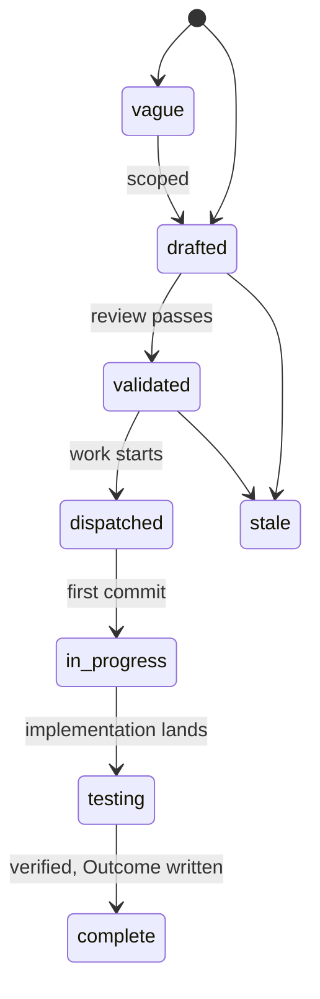
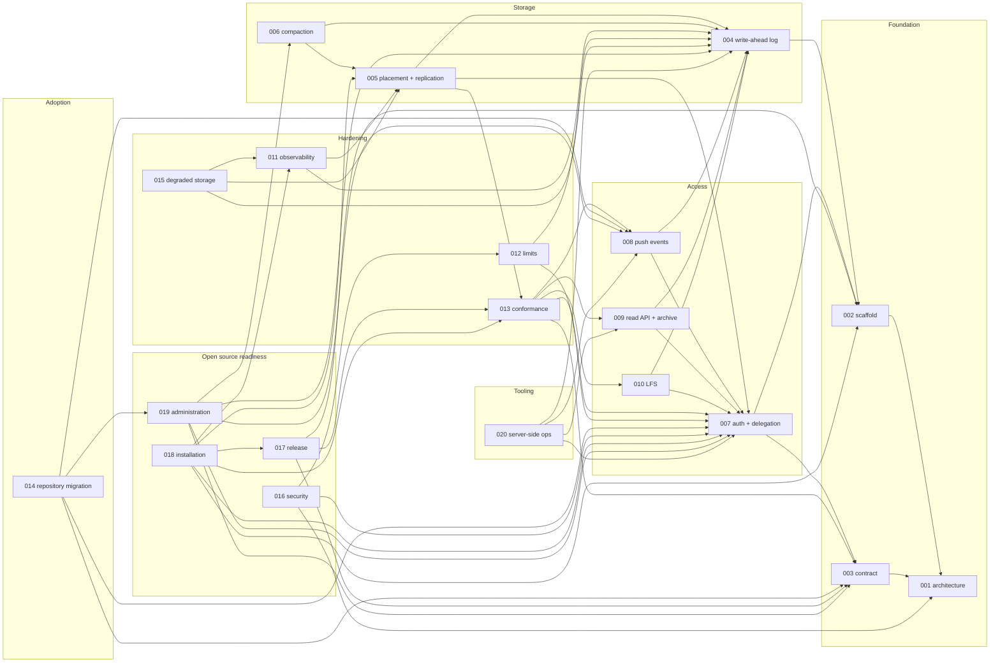

# Specs

Design specs for Origo, git hosting as an infrastructure component. One
spec covers one module. Each spec states the problem, the design with
enough precision to build from, and acceptance criteria that are testable
statements. Spec 001 fixes the architecture every other spec assumes; read
it first. Spec 003 is the contract a consumer codes against; it is the one
document a platform integrating Origo needs. Spec 002 is the
configuration reference: it owns every variable. Spec 011 owns every
metric.

## Layout

Flat files `specs/NNN-name.md` in one number space with `track: infra` in
the frontmatter. Numbers are stable identifiers and are never reused. Open
specs sit here and are the work queue. A terminal spec moves to
`specs/.archive/` keeping its number so `depends_on` paths keep resolving.

## Lifecycle

`in_progress` is written `in-progress` in the frontmatter. A spec at
`testing` moves to `complete` when every acceptance criterion has a
passing test in the tree and the Outcome records every divergence.

## Index

| # | Spec | Effort | Status |
|---|---|---|---|
| [001](001-architecture.md) | Architecture: components, storage model, flows, invariants | medium | validated |
| [002](002-repository-scaffold.md) | Repository scaffold: module, binary, configuration, gate, release | small | complete |
| [003](003-protocol-contract.md) | Protocol contract: what a consumer relies on | medium | in-progress |
| [004](004-write-ahead-log.md) | Write-ahead log: entries, immutable index, create-if-absent commit, materialization | large | testing |
| [005](005-placement-and-replication.md) | Placement and replication: rendezvous hashing, gossip, consistent reads, cache eviction | medium | drafted |
| [006](006-compaction.md) | Compaction: primary-only repacks, log truncation | medium | drafted |
| [007](007-authentication-and-delegation.md) | Authentication and delegation: issuers, authorizer, acting on behalf | medium | drafted |
| [008](008-push-events.md) | Push events: signed webhooks per reference update | small | drafted |
| [009](009-read-api-and-archive.md) | Read API and archive: refs, log, diff, tree, blob, tarball | medium | drafted |
| [010](010-lfs.md) | Git LFS: batch API and presigned object transfer | small | drafted |
| [011](011-observability.md) | Observability: metrics, traces, logs, alerts | small | validated |
| [012](012-limits-and-abuse.md) | Limits and abuse controls | small | drafted |
| [013](013-conformance-suite.md) | Conformance suite: the contract as executable tests, the stubs, and the kind overlay | large | drafted |
| [014](014-repository-migration.md) | Migration of existing repositories from a prior host: import, verify, cut over, in batches | medium | drafted |
| [015](015-degraded-storage.md) | Degraded storage: what a node does when the bucket is slow, partial, or gone | medium | drafted |
| [016](016-security-and-threat-model.md) | Security and threat model: what Origo protects, against whom, and how | medium | drafted |
| [017](017-release-and-versioning.md) | Release and versioning: images, binaries, compatibility, and what a version promises | small | drafted |
| [018](018-installation.md) | Installation: running Origo on any Kubernetes with any S3 compatible bucket | medium | drafted |
| [019](019-repository-administration.md) | Repository administration: rename, transfer, freeze, delete, undelete, import, export, garbage collection | medium | drafted |
| [020](020-server-side-git-operations.md) | Server-side git operations: commits, merges, cherry-picks, and reverts without a clone | large | drafted |

## Dependency graph

Edges point from a spec to the specs it builds on.

## Build order

| Phase | Specs | Outcome | State |
|---|---|---|---|
| 1 | 002, 003, 004 | A single node serves clone, fetch, and push with the log as the source of truth | built; 002 complete, 003 and 004 wait on later specs for their remaining criteria |
| 2 | 007, 013 (stubs and overlay), 005 | Authenticated, delegated access with the stub issuer and authorizer in place of `ORIGO_DEV_TOKEN`; the kind overlay every later spec's criteria run on; many nodes, consistent reads | next |
| 3 | 008, 009, 006 | Push events, the read API and archive, compaction under load | |
| 4 | 010, 011, 012, 013 (suite), 015 | LFS, telemetry, limits, degraded-storage behaviour, and the conformance suite gating releases | |
| 5 | 016, 019 | Threat model written and enforced; the administration operations a long-lived repository needs | |
| 6 | 017, 018 | Releases an outside operator can install and upgrade from the documentation alone; the point at which the repository can go public | |
| 7 | 014 | Existing repositories migrate from a prior host with verification and a cut-over | |
| 8 | 020 | Commits, merges, cherry-picks, and reverts from a request, for tooling that changes many repositories | |

Spec 013 is split across two phases on purpose: its stubs and overlay
depend only on specs 002 and 007 and are what replaces the phase 1
bearer, so they are built with 007; its suite asserts specs 008 to 010
and follows them. Spec 013 depends on nothing above spec 012, which is
what lets specs 017 and 018 depend on it without a cycle.

## Later

Work the deck names and no spec owns yet. Each becomes a spec when a
consumer needs it.

- Batching concurrent pushes to one repository into one commit, for a
  repository busier than the ten pushes per second one commit per push
  allows (spec 005 scopes it out).
- Creating tags and other references from a request (spec 020 scopes
  it out).
- A shallow first import with a later deepen, for a repository larger
  than one import budget (spec 014 scopes it out).

## Open source readiness

The repository goes public when phase 6 is complete: every spec through
019 except 014 at `complete`, the conformance suite green against the
release artifacts in the `kind` example overlay, `docs/install.md`
walked once by a maintainer on a fresh cluster, `SECURITY.md` in place,
and no Latere hostname or value anywhere but as a default or an example.
Until then the repository is private and the deck is written as if it
were already public.

## Conventions

- Every spec has the frontmatter fields `title`, `status`, `track`,
  `depends_on`, `affects`, `effort`, `created`, `updated`, `author`.
- Diagrams are Mermaid and render with `mmdc`. Tables carry exact values
  so an implementer never has to guess a number.
- Error codes, metric names, environment variables, event kinds,
  failpoint names, endpoints, and headers named in a spec are the names
  the code uses, and each is defined by exactly one spec: a table whose
  first header is `Code`, `Variable`, `Metric`, `Event`, `Failpoint`,
  or `Header`, or `Method` and `Path`. Every other spec mentions the
  name in backticks; a header with its value or a variable with its
  value inside one pair of backticks (`Origo-Event: push`,
  `ORIGO_FAILPOINT=commit.before-index`) mentions both names. The table
  below is generated from those definitions.
- Every error code is defined with its status, its one user sentence in
  `message`, and the developer fields of `details`.
- Acceptance criteria are the test list: one sentence each, naming the
  behaviour, the fixture or load, the threshold, and the test that
  checks it (a name in the tree, or a proposed one).
- A spec is `complete` when every criterion has a passing test and the
  Outcome section records any divergence.
- Wording is for a reader outside Latere. A Latere hostname or value is
  an example or a default, never the only option; no other company is
  named except the public citation in the README.

## Cross-reference

Every name the deck defines, its owner, and the other specs that name
it. Generated by `tools/specindex` (its own module):
`cd tools/specindex && go run . -write` rewrites it and `go test ./...`
there fails when it drifts from the specs, when two specs define one
name, or when a spec names something no spec defines.

<!-- specindex:begin -->
| Kind | Name | Owner | Also named in |
|---|---|---|---|
| error code | `authorizer_unavailable` | [007](007-authentication-and-delegation.md) | 003 |
| error code | `blob_too_large` | [009](009-read-api-and-archive.md) | 003 |
| error code | `forbidden` | [003](003-protocol-contract.md) | 007, 010, 020 |
| error code | `gone` | [019](019-repository-administration.md) | 003 |
| error code | `invalid_change` | [020](020-server-side-git-operations.md) | 003 |
| error code | `invalid_request` | [003](003-protocol-contract.md) | 007, 009, 012, 014, 016, 019, 020 |
| error code | `merge_conflict` | [020](020-server-side-git-operations.md) | 003 |
| error code | `non_fast_forward` | [003](003-protocol-contract.md) | 020 |
| error code | `operation_timeout` | [020](020-server-side-git-operations.md) | 003 |
| error code | `over_quota` | [003](003-protocol-contract.md) | 010, 012, 020 |
| error code | `rate_limited` | [003](003-protocol-contract.md) | 009, 010, 012, 019, 020 |
| error code | `ref_not_found` | [003](003-protocol-contract.md) | 009, 019, 020 |
| error code | `repo_exists` | [003](003-protocol-contract.md) | 019 |
| error code | `repo_frozen` | [019](019-repository-administration.md) | 003, 012, 020 |
| error code | `repo_importing` | [019](019-repository-administration.md) | 003, 014 |
| error code | `repo_not_empty` | [019](019-repository-administration.md) | 003, 014 |
| error code | `repo_not_found` | [003](003-protocol-contract.md) | 007, 010 |
| error code | `repository_unavailable` | [015](015-degraded-storage.md) | 003, 017 |
| error code | `storage_unavailable` | [003](003-protocol-contract.md) | 005, 010, 012, 015, 017 |
| error code | `unauthenticated` | [003](003-protocol-contract.md) | 002, 007, 010 |
| variable | `ORIGO_AUTHORIZER_TOKEN` | [002](002-repository-scaffold.md) | 007, 016 |
| variable | `ORIGO_AUTHORIZER_URL` | [002](002-repository-scaffold.md) | 007 |
| variable | `ORIGO_CACHE_BYTES` | [002](002-repository-scaffold.md) | 005, 018 |
| variable | `ORIGO_CHECK_SELFTEST` | [002](002-repository-scaffold.md) | 018 |
| variable | `ORIGO_DATA_DIR` | [002](002-repository-scaffold.md) | 004, 005, 016, 018 |
| variable | `ORIGO_DEV_TOKEN` | [002](002-repository-scaffold.md) | 003, 007, 013 |
| variable | `ORIGO_E2E_MEASURE` | [002](002-repository-scaffold.md) | 004, 006, 009, 013 |
| variable | `ORIGO_EGRESS_ALLOW` | [002](002-repository-scaffold.md) | 014, 016, 019 |
| variable | `ORIGO_EVENTS_SECRET` | [002](002-repository-scaffold.md) | 008, 016 |
| variable | `ORIGO_EVENTS_URL` | [002](002-repository-scaffold.md) | 003, 008, 018 |
| variable | `ORIGO_FAILPOINT` | [002](002-repository-scaffold.md) | 008 |
| variable | `ORIGO_GOSSIP_ADDR` | [002](002-repository-scaffold.md) | 005 |
| variable | `ORIGO_GOSSIP_PEERS` | [002](002-repository-scaffold.md) | 005 |
| variable | `ORIGO_HOOK_DIR` | [004](004-write-ahead-log.md) | 002, 016 |
| variable | `ORIGO_INTERNAL_ADDR` | [002](002-repository-scaffold.md) | - |
| variable | `ORIGO_MAX_GIT_PROCS` | [002](002-repository-scaffold.md) | 009, 012 |
| variable | `ORIGO_MIGRATE_PARALLEL` | [014](014-repository-migration.md) | 002 |
| variable | `ORIGO_NODE_NAME` | [002](002-repository-scaffold.md) | 005 |
| variable | `ORIGO_OIDC_ISSUERS` | [002](002-repository-scaffold.md) | 007 |
| variable | `ORIGO_PUBLIC_ADDR` | [002](002-repository-scaffold.md) | - |
| variable | `ORIGO_PUBLIC_URL` | [002](002-repository-scaffold.md) | 007, 018 |
| variable | `ORIGO_RELEASE_DEPLOY` | [002](002-repository-scaffold.md) | 017 |
| variable | `ORIGO_S3_BUCKET` | [002](002-repository-scaffold.md) | - |
| variable | `ORIGO_S3_ENDPOINT` | [002](002-repository-scaffold.md) | 010 |
| variable | `ORIGO_S3_KEY` | [002](002-repository-scaffold.md) | - |
| variable | `ORIGO_S3_PATH_STYLE` | [002](002-repository-scaffold.md) | - |
| variable | `ORIGO_S3_PUBLIC_ENDPOINT` | [002](002-repository-scaffold.md) | 010, 018 |
| variable | `ORIGO_S3_REGION` | [002](002-repository-scaffold.md) | - |
| variable | `ORIGO_S3_SECRET` | [002](002-repository-scaffold.md) | - |
| variable | `ORIGO_STALE_MAX` | [002](002-repository-scaffold.md) | 015 |
| variable | `ORIGO_STORAGE_TIMEOUT` | [002](002-repository-scaffold.md) | 012, 015 |
| variable | `ORIGO_SWEEP_INTERVAL` | [002](002-repository-scaffold.md) | 004 |
| variable | `ORIGO_SWEEP_MIN_AGE` | [002](002-repository-scaffold.md) | 004, 006 |
| variable | `ORIGO_TEST_DROP_CAPABILITY` | [002](002-repository-scaffold.md) | 013 |
| variable | `ORIGO_TEST_S3_BUCKET` | [002](002-repository-scaffold.md) | 013 |
| variable | `ORIGO_TEST_S3_ENDPOINT` | [002](002-repository-scaffold.md) | 013 |
| variable | `ORIGO_TEST_S3_KEY` | [002](002-repository-scaffold.md) | 013 |
| variable | `ORIGO_TEST_S3_PATH_STYLE` | [002](002-repository-scaffold.md) | 013 |
| variable | `ORIGO_TEST_S3_REGION` | [002](002-repository-scaffold.md) | 013 |
| variable | `ORIGO_TEST_S3_SECRET` | [002](002-repository-scaffold.md) | 013 |
| variable | `ORIGO_TOKEN_KEY` | [002](002-repository-scaffold.md) | 007, 016 |
| variable | `OTEL_*` | [002](002-repository-scaffold.md) | - |
| variable | `OTEL_EXPORTER_OTLP_ENDPOINT` | [002](002-repository-scaffold.md) | 011 |
| metric | `origo_authorizer_seconds` | [011](011-observability.md) | 007 |
| metric | `origo_cache_bytes` | [011](011-observability.md) | 005 |
| metric | `origo_cache_repos` | [011](011-observability.md) | 005 |
| metric | `origo_compaction_seconds` | [011](011-observability.md) | 006 |
| metric | `origo_compactions_total` | [011](011-observability.md) | 006 |
| metric | `origo_events_dead_total` | [011](011-observability.md) | 008 |
| metric | `origo_events_delivered_total` | [011](011-observability.md) | 008 |
| metric | `origo_evictions_total` | [011](011-observability.md) | 005 |
| metric | `origo_fetches_total` | [011](011-observability.md) | - |
| metric | `origo_gossip_packets_total` | [011](011-observability.md) | 005 |
| metric | `origo_log_integrity_errors_total` | [011](011-observability.md) | 015 |
| metric | `origo_orphan_objects` | [011](011-observability.md) | 006, 019 |
| metric | `origo_push_duration_seconds` | [011](011-observability.md) | - |
| metric | `origo_pushes_rejected_total` | [011](011-observability.md) | - |
| metric | `origo_pushes_total` | [011](011-observability.md) | - |
| metric | `origo_rate_limited_total` | [011](011-observability.md) | 012, 019, 020 |
| metric | `origo_repo_entries_applied_total` | [011](011-observability.md) | - |
| metric | `origo_repo_materialize_seconds` | [011](011-observability.md) | 005 |
| metric | `origo_repo_materialized_total` | [011](011-observability.md) | 005 |
| metric | `origo_repo_rebuilt_total` | [011](011-observability.md) | 004 |
| metric | `origo_request_duration_seconds` | [011](011-observability.md) | - |
| metric | `origo_requests_in_flight` | [011](011-observability.md) | 005 |
| metric | `origo_requests_total` | [011](011-observability.md) | - |
| metric | `origo_stale_responses_total` | [011](011-observability.md) | 015 |
| metric | `origo_storage_breaker_state` | [011](011-observability.md) | 015 |
| metric | `origo_storage_bytes` | [011](011-observability.md) | 019 |
| metric | `origo_storage_ops_total` | [011](011-observability.md) | 015 |
| metric | `origo_storage_seconds` | [011](011-observability.md) | 015 |
| metric | `origo_wal_commit_conflicts_total` | [011](011-observability.md) | 004 |
| metric | `origo_wal_commit_retries_total` | [011](011-observability.md) | 004 |
| metric | `origo_wal_commits_total` | [011](011-observability.md) | 004 |
| metric | `origo_wal_entry_bytes_total` | [011](011-observability.md) | - |
| metric | `origo_wal_head_check_seconds` | [011](011-observability.md) | 004, 005 |
| event | `compacted` | [019](019-repository-administration.md) | - |
| event | `deleted` | [019](019-repository-administration.md) | - |
| event | `frozen` | [019](019-repository-administration.md) | - |
| event | `imported` | [019](019-repository-administration.md) | 014 |
| event | `ping` | [018](018-installation.md) | 008 |
| event | `push` | [008](008-push-events.md) | 003, 004, 019, 020 |
| event | `renamed` | [019](019-repository-administration.md) | - |
| event | `transferred` | [019](019-repository-administration.md) | - |
| event | `undeleted` | [019](019-repository-administration.md) | - |
| event | `unfrozen` | [019](019-repository-administration.md) | - |
| event | `verified` | [014](014-repository-migration.md) | - |
| endpoint | `DELETE /v1/repos/{id}` | [003](003-protocol-contract.md) | 004, 019 |
| endpoint | `GET /.well-known/jwks.json` | [007](007-authentication-and-delegation.md) | 016 |
| endpoint | `GET /livez` | [002](002-repository-scaffold.md) | - |
| endpoint | `GET /metrics` | [002](002-repository-scaffold.md) | 011 |
| endpoint | `GET /readyz` | [002](002-repository-scaffold.md) | 003, 007, 016, 017 |
| endpoint | `GET /v1/repos/{id}` | [003](003-protocol-contract.md) | 007, 009, 014, 016, 019 |
| endpoint | `GET /v1/repos/{id}/archive/{sha}.tar.gz` | [009](009-read-api-and-archive.md) | - |
| endpoint | `GET /v1/repos/{id}/blob/{sha}` | [009](009-read-api-and-archive.md) | - |
| endpoint | `GET /v1/repos/{id}/commits` | [009](009-read-api-and-archive.md) | - |
| endpoint | `GET /v1/repos/{id}/commits/{sha}` | [009](009-read-api-and-archive.md) | - |
| endpoint | `GET /v1/repos/{id}/compare/{base}...{head}` | [009](009-read-api-and-archive.md) | - |
| endpoint | `GET /v1/repos/{id}/export.bundle` | [019](019-repository-administration.md) | - |
| endpoint | `GET /v1/repos/{id}/import` | [019](019-repository-administration.md) | 014 |
| endpoint | `GET /v1/repos/{id}/refs` | [009](009-read-api-and-archive.md) | - |
| endpoint | `GET /v1/repos/{id}/stats` | [019](019-repository-administration.md) | - |
| endpoint | `GET /v1/repos/{id}/tree/{sha}` | [009](009-read-api-and-archive.md) | - |
| endpoint | `GET /v1/repos/{id}/verify` | [014](014-repository-migration.md) | - |
| endpoint | `GET /version` | [002](002-repository-scaffold.md) | 003, 007, 016, 017 |
| endpoint | `GET /{repo}/info/refs` | [003](003-protocol-contract.md) | - |
| endpoint | `PATCH /v1/repos/{id}` | [003](003-protocol-contract.md) | 004, 019 |
| endpoint | `POST /v1/repos` | [003](003-protocol-contract.md) | 007, 014, 019 |
| endpoint | `POST /v1/repos/{id}/freeze` | [019](019-repository-administration.md) | - |
| endpoint | `POST /v1/repos/{id}/gc` | [019](019-repository-administration.md) | - |
| endpoint | `POST /v1/repos/{id}/import` | [019](019-repository-administration.md) | 014 |
| endpoint | `POST /v1/repos/{id}/tokens` | [007](007-authentication-and-delegation.md) | 003 |
| endpoint | `POST /v1/repos/{id}/transfer` | [019](019-repository-administration.md) | - |
| endpoint | `POST /v1/repos/{id}/undelete` | [003](003-protocol-contract.md) | 019 |
| endpoint | `POST /v1/repos/{id}/unfreeze` | [019](019-repository-administration.md) | - |
| endpoint | `POST /{repo}/git-receive-pack` | [003](003-protocol-contract.md) | - |
| endpoint | `POST /{repo}/git-upload-pack` | [003](003-protocol-contract.md) | - |
| endpoint | `POST /{repo}/info/lfs/locks` | [010](010-lfs.md) | - |
| endpoint | `POST /{repo}/info/lfs/objects/batch` | [010](010-lfs.md) | - |
| endpoint | `POST /{repo}/info/lfs/verify` | [010](010-lfs.md) | - |
| header | `Origo-Commit` | [009](009-read-api-and-archive.md) | - |
| header | `Origo-Contract` | [003](003-protocol-contract.md) | 017 |
| header | `Origo-Delivery` | [008](008-push-events.md) | 018 |
| header | `Origo-Event` | [008](008-push-events.md) | 018 |
| header | `Origo-Prefer` | [005](005-placement-and-replication.md) | 006 |
| header | `Origo-Signature` | [008](008-push-events.md) | 013, 018 |
| header | `Origo-Source-Token` | [014](014-repository-migration.md) | - |
| header | `Origo-Stale` | [015](015-degraded-storage.md) | 011 |
| header | `Origo-Truncated` | [009](009-read-api-and-archive.md) | - |
| failpoint | `commit.before-index` | [002](002-repository-scaffold.md) | 004 |
| failpoint | `events.before-enqueue` | [002](002-repository-scaffold.md) | 008 |
<!-- specindex:end -->
